# Design Notes

For a current directory map, refer to `projectStructure.md` alongside this document.

## Tooling baseline

- Node.js 22.x across all workspaces.
- Shared configs: `tsconfig.base.json`, `eslint.config.js`, `.prettierrc`, `.editorconfig`.
- Linting: `npm run lint --workspaces` (ESLint flat config, TypeScript rules).
- Formatting: `npm run format:check --workspaces` / `npm run format --workspaces` (Prettier).
- Husky + lint-staged: pre-commit runs ESLint (no warnings) and Prettier check on staged TS/JS/TSX/JSX files.
- Environment policy: commit `.env` with safe defaults; keep `.env.local` for overrides and secrets (ignored from git and Docker contexts).

## Common package

- Purpose: shared DTOs/utilities consumed by client and server to prove workspace linking.
- Exports `VersionInfo` type and `getAppInfo(app, version)` helper; built with `tsc -b` to emit declarations in `dist/`.
- Uses root lint/format configs; build output stays out of git via root ignores.

## Server API (core)

- Express 5 app with CORS enabled and env-driven port (default 5010 via `server/.env`).
- Routes: `/health` returns `{ status: 'ok', uptime, timestamp }`; `/version` returns `VersionInfo` using `package.json` version; `/info` echoes a friendly message plus VersionInfo.
- Depends on `@codeinfo2/common` for DTO helper; built with `tsc -b`, started via `npm run start --workspace server`.

## Server testing & Docker

- Cucumber test under `server/src/test` validates `/health` (run with server running on 5010): `npm run test --workspace server`.
- Dockerfile (multi-stage, Node 22 slim) builds server from workspace; `.dockerignore` excludes tests and dev artifacts while keeping `.env` defaults. Build with `docker build -f server/Dockerfile -t codeinfo2-server .`, run with `docker run --rm -p 5010:5010 codeinfo2-server`.

## Conversation persistence (MongoDB)

- MongoDB (default URI `mongodb://host.docker.internal:27517/db?directConnection=true`) stores conversations and turns via Mongoose. `server/src/mongo/conversation.ts` tracks `_id` (conversationId/Codex thread id), `provider`, `model`, `title`, optional `agentName` (when a conversation belongs to an agent), `flags`, `lastMessageAt`, timestamps, and `archivedAt`; `server/src/mongo/turn.ts` stores `conversationId`, `role`, `content`, `provider`, `model`, optional `toolCalls`, `status`, and `createdAt`.
- Both collections include a `source` enum (`REST` | `MCP`, default `REST`) so the UI can surface where a conversation/turn originated; repo helpers normalise missing `source` values to `REST` for backwards compatibility.
- Repository helpers in `server/src/mongo/repo.ts` handle create/update/archive/restore, append turns, and cursor pagination (conversations newest-first by `lastMessageAt`, turns newest-first by `createdAt`).
- Conversations can be tagged with `agentName` so the normal Chat history stays clean (no `agentName`) while agent UIs filter to a specific `agentName` value.
- HTTP endpoints (`server/src/routes/conversations.ts`) expose list/create/archive/restore and turn append/list. `GET /conversations` supports a 3-state filter via `state=active|archived|all` (default `active`); legacy `archived=true` remains supported and maps to `state=all`. Chat POST now requires `{ conversationId, message, provider, model, flags? }`; the server loads stored turns, streams to LM Studio or Codex, then appends user/assistant/tool turns and updates `lastMessageAt`. Archived conversations return 410 on append.
- Bulk conversation endpoints (`POST /conversations/bulk/archive|restore|delete`) use validate-first semantics: if any ids are missing (or if delete includes non-archived conversations), the server returns `409 BATCH_CONFLICT` and performs no writes. Hard delete is archived-only and deletes turns first to avoid orphaned turn documents.
- MCP tool `codebase_question` mirrors the same persistence, storing MCP-sourced conversations/turns (including tool calls and reasoning summaries) unless the conversation is archived. Codex uses a persisted `threadId` flag for follow-ups; LM Studio uses stored turns for the `conversationId`.
- `/health` reports `mongoConnected` from the live Mongoose state; the client shows a banner and disables archive controls when `mongoConnected === false` while allowing stateless chat.

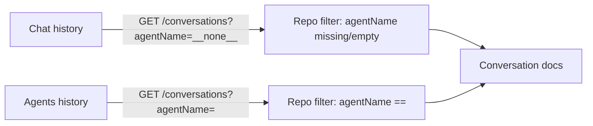

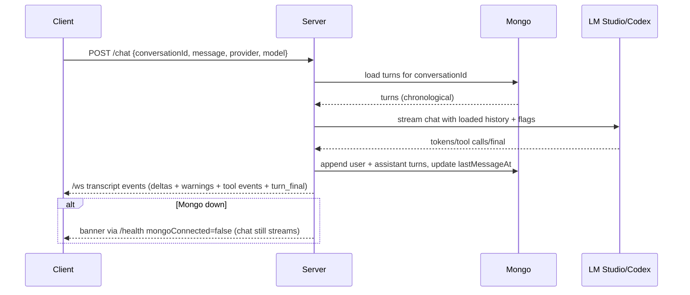

## WebSocket transport (v1 foundation)

- The server now exposes a WebSocket endpoint at `GET /ws` on the same HTTP port as Express.
- Chat streaming is now WebSocket-only: `POST /chat` starts a run (HTTP 202) and all transcript updates are published to subscribed viewers via `/ws` (chat SSE removed).
- All client → server WS messages must include `protocolVersion: "v1"`, `requestId`, and `type`. Malformed JSON or missing/invalid `protocolVersion` closes the socket.
- Subscription state is tracked per socket:
  - `subscribe_sidebar` / `unsubscribe_sidebar`
  - `subscribe_conversation` / `unsubscribe_conversation` (requires `conversationId`)

- Transcript events are broadcast only to sockets subscribed to the relevant `conversationId`:
  - `user_turn` (broadcast at run start so non-originating tabs render the user bubble immediately)
  - `inflight_snapshot` (sent immediately after `subscribe_conversation` when a run is in progress)
  - `assistant_delta`, `analysis_delta`
  - `tool_event`
  - `stream_warning` (non-terminal warning event; does not end the in-flight turn)
  - `turn_final` (terminal status for the in-flight turn)
- Sequence gating is scoped per in-flight run: client-side dedupe/out-of-order checks reset when the `inflightId` changes so a new run starting at `seq=1` is accepted.
- Stop/cancel is driven by `cancel_inflight` (mapped to an in-flight AbortController).

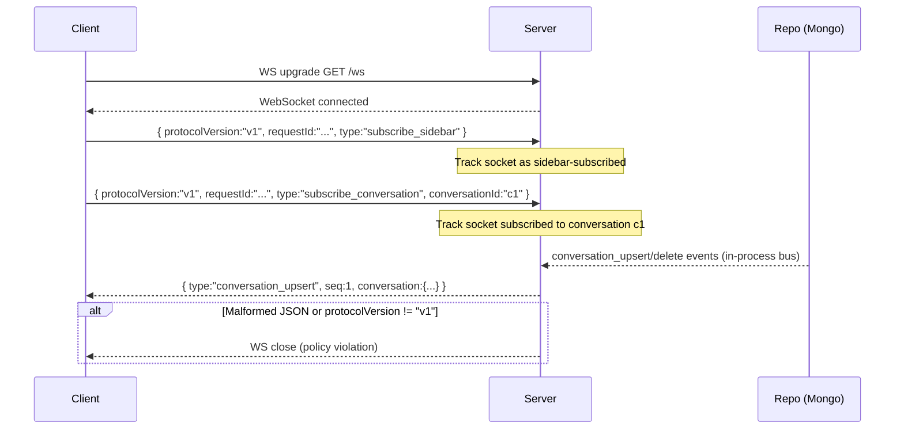

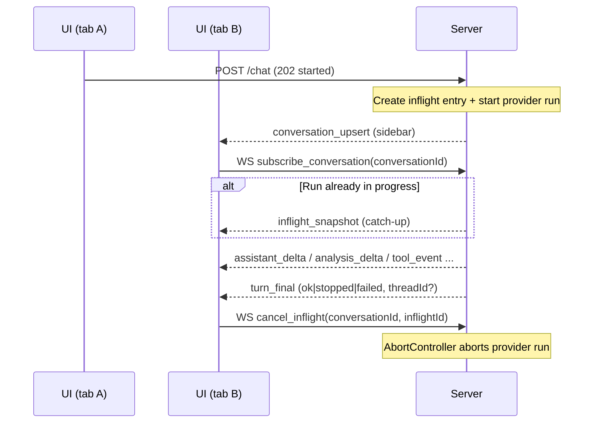

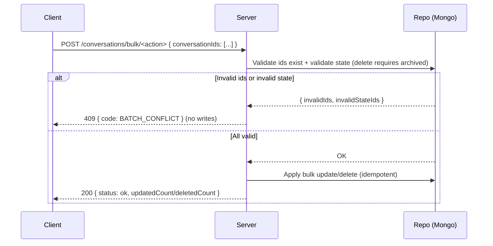

## Client skeleton

- Vite + React 19 + MUI; dev server on port 5001 (host enabled). Env `VITE_API_URL` from `client/.env`.
- Startup fetch calls `${VITE_API_URL}/version`, parses `VersionInfo` from `@codeinfo2/common`, and displays alongside client version (from package.json) in a MUI Card with loading/error states.
- Layout uses MUI `CssBaseline` for global resets; the `NavBar` AppBar spans the full width while content sits inside a single `Container maxWidth="lg"` with left-aligned spacing (no Vite starter centering/dark background).

### Chat page (models list)

- Route `/chat` surfaces the chat shell; controls sit at the top with a Provider `<Select>` (LM Studio default, OpenAI Codex when detected) to the left of the Model `<Select>`. The first available provider is auto-selected and the first model for that provider auto-selects when data loads; provider locks after the first message while model can still change.
- Codex-only controls live in a collapsible **Codex flags** panel rendered under the Provider/Model row whenever `provider === 'codex'`. The panel exposes `sandboxMode` (`workspace-write` default; also `read-only`, `danger-full-access`), `approvalPolicy` (`on-failure` default; also `on-request`, `never`, `untrusted`), `modelReasoningEffort` (`high` default; also `xhigh`, `medium`, `low`), plus **Enable network access** and **Enable web search** toggles (both default `true`); these flags are sent on Codex requests and ignored for LM Studio. The controls reset to their defaults on provider changes or when **New conversation** is clicked while preserving choices during an active Codex session.

#### Codex reasoning effort flow

- `xhigh` is intentionally treated as an app-level value: the installed `@openai/codex-sdk` TypeScript union may not include it yet, but the runtime adapter forwards the string through to the Codex CLI as `--config model_reasoning_effort="..."`.

```mermaid
flowchart LR
  UI[UI: /chat\nCodex flags panel] -->|select xhigh| Req[POST /chat\nmodelReasoningEffort: 'xhigh']
  Req --> V[server validateChatRequest\naccepts low/medium/high/xhigh]
  V --> C[ChatInterfaceCodex\nthreadOptions.modelReasoningEffort]
  C --> SDK[@openai/codex-sdk\nexec args: --config model_reasoning_effort="xhigh"]
  SDK --> CLI[Codex CLI]

  Note[TS note: SDK types may lag\n(ModelReasoningEffort excludes 'xhigh')] -.-> C
```
- `useChatModel` fetches `/chat/providers` then `/chat/models?provider=...`, aborts on unmount, and exposes provider/model selection, availability flags, and errors. Loading shows a small inline spinner; errors render an Alert with a Retry action; empty lists render "No chat-capable models available" and keep inputs disabled.
- Controls are disabled while loading, on errors, or when no models exist. Codex is available only when its CLI/auth/config are present; otherwise a banner warns and inputs disable. When Codex is available, chat is enabled (tools stay hidden) and the client will reuse the server-returned `threadId` for subsequent Codex turns instead of replaying history. The message input is multiline beneath the selectors with Send/Stop beside it.

### Chat sidebar (conversations)

- The Chat page sidebar lists conversations and supports a 3-state filter:
  - `active`: show only active (non-archived) conversations
  - `all`: show active + archived conversations
  - `archived`: show only archived conversations
- Each row includes a selection checkbox, and the header includes a select-all checkbox plus a selected-count indicator.
- Bulk actions are available when one or more conversations are selected:
  - **Archive** is enabled only when all selected conversations are active.
  - **Restore** is enabled only when all selected conversations are archived.
  - **Delete** is enabled for any selection and requires a confirmation dialog.
- When MongoDB persistence is unavailable (`mongoConnected === false`), selection and bulk actions are disabled and the sidebar shows a warning that bulk actions are unavailable.
- Bulk actions call `POST /conversations/bulk/archive|restore|delete` and surface success/failure via snackbars; selection is cleared after a successful bulk operation.

### Chat page (streaming UI)

- Sending a message triggers `POST /chat` (202 started). The visible transcript is driven by `/ws` events for the selected conversation (`subscribe_conversation` → `inflight_snapshot` catch-up → `assistant_delta`/`analysis_delta`/`tool_event` → `turn_final`). Stop uses `cancel_inflight`.
- Persisted turn hydration merges into the current transcript without clearing active in-flight content; an empty replace snapshot is ignored while streaming.
- `GET /conversations/:id/turns?includeInflight=true` returns persisted turns plus an optional `inflight` snapshot (when a run is active) containing `{ inflightId, assistantText, assistantThink, toolEvents, startedAt, seq }`.
- Hydration dedupes in-flight bubbles by role/content/time proximity so persisted turns do not create duplicate user/assistant bubbles for the active run.
- Bubbles render newest-first closest to the controls; user bubbles align right with the primary palette, assistant bubbles align left on the default surface, and error bubbles use the error palette with retry guidance.
- User and assistant bubbles share a 14px border radius while keeping status chips, tool blocks, and citations aligned inside the container.
- Send is disabled while `status === 'sending'`; a small "Responding..." helper appears under the controls; tool events are logged only (not shown in the transcript).
- Thought process buffering is append-only: multiple `<think>`/Harmony analysis bursts are preserved even after tool events, and the spinner only stops once `turn_final` arrives and pending tools finish.
- Inline errors append a red assistant bubble so failures are visible in the conversation; input is re-enabled after the stream ends or fails.
- Stream status chip: each assistant bubble shows a chip at the top—Processing (spinner), Complete (tick), or Failed (cross) driven by stream lifecycle events. Complete now triggers only after `turn_final` **and** when no tool calls remain pending (tool requests without a result keep the chip in Processing even if assistant text arrives).
- Thinking placeholder: when streaming is active and no tool results are pending, a “Thinking…” inline spinner appears only after 1s with no visible assistant text (including pre-token starts or mid-turn silent gaps); it hides immediately once visible text arrives or the stream completes/fails, and it stays off during tool-only waits if text is already visible.
- **New conversation control:** button lives beside Send, stays enabled while a run is active, clears all transcript state, keeps the current model selection, resets `status` to `idle`, and re-focuses the message field so the next prompt can be typed immediately.
- **Tool-call visibility:** WebSocket `tool_event` updates render an inline spinner + tool name inside the active assistant bubble; when a matching tool completion arrives the spinner swaps for a collapsible block. VectorSearch payloads list repo/relPath, hostPath, and chunk text; other tool payloads fall back to JSON. Tool results stay structured (not markdown-rendered) and can be toggled open/closed per call.
- Tool completion synthesis: when a provider delivers tool payloads without an explicit completion callback, the server synthesizes a matching completion `tool_event` (deduped if the real callback fires). The client also marks any lingering `requesting` tools as `done` after `turn_final`, and clears pending tool spinners as soon as assistant output resumes after a tool call so the UI never waits for a terminal event to stop spinners.

### Chat citations UI

- `tool_event` completions from LM Studio vector search tools are parsed client-side into citation objects containing repo, relPath, hostPath (when available), chunk text, and provenance ids.
- Citations attach to the in-flight assistant bubble inside a default-closed “Citations” accordion; expanding reveals the `repo/relPath` + host path (when available). The path line ellipsizes within the bubble width for small screens.
- Chunk text from the tool response is shown under the path inside the expanded panel to make grounding explicit without waiting for the model to quote it verbatim.
- Transcript overflow guardrails: the chat column sets `minWidth: 0` (flexbox shrink fix) and citation/tool/markdown content uses token-breaking (`overflowWrap: 'anywhere'`) or internal scrolling (`pre { overflowX: auto }`) so long unbroken strings do not expand the layout horizontally.

### Chat tool detail UI

- Tool calls render closed by default with name + status (Success/Failed/Running) and no lingering spinner after a result or error arrives.
- Each tool has a default-closed Parameters accordion that pretty-prints the arguments sent to the tool.
- ListIngestedRepositories: renders all repositories with expandable metadata (paths, counts, last ingest, model lock, warnings/errors).
- VectorSearch: renders an alphabetical, host-path-only file list. Each file shows highest match value, summed chunk count, and total line count of returned chunks; expand to see model/repo metadata and host path warnings.
- Errors show a trimmed code/message plus a toggle to reveal the full error payload (including stack/metadata) inside the expanded block.
- Tool-result delivery: if a provider omits explicit tool completion callbacks, the server synthesizes a completion `tool_event` from the tool resolver output (success or error) and dedupes when native events do arrive. This ensures parameters and payloads always reach the client without duplicate tool rows.

### Codex MCP flow

- On the first Codex turn the server prefixes the prompt string with the shared `SYSTEM_CONTEXT` (from `common/src/systemContext.ts`) and runs Codex with `workingDirectory=/data` plus `skipGitRepoCheck:true` so untrusted mounts do not block execution.
- Codex `mcp_tool_call` events are translated into WebSocket `tool_event` updates carrying parameters and vector/repo payloads from the MCP server, letting the client render tool blocks and citations when Codex tools are available.
- Host auth bootstrap: docker-compose mounts `${CODEX_HOME:-$HOME/.codex}` to `/host/codex` and `/app/codex` as the container Codex home. On startup, if `/app/codex/auth.json` is missing and `/host/codex/auth.json` exists, the server copies it once into `/app/codex` (no overwrite); `/app/codex` remains the primary home.
- Codex home selection:
  - The primary Codex home is `CODEINFO_CODEX_HOME` (default `./codex`).
  - Agent runs can override the Codex home by passing a per-agent home (future: `${CODEINFO_CODEX_AGENT_HOME}/${agentName}`) into the Codex factory/options.
  - The server injects `CODEX_HOME` into Codex SDK options (`buildCodexOptions({ codexHome })`) rather than mutating `process.env` at runtime, so concurrent requests cannot cross-contaminate config/auth.
  - Codex availability checks follow the same pattern: `detectCodex()` updates the process-wide cache for the primary home, while `detectCodexForHome(codexHome)` validates an arbitrary home without changing global cached state.

```mermaid
flowchart LR
  Req[Codex request] --> Choice{Has codexHome override?}
  Choice -->|No| Primary[resolveCodexHome()\\nCODEINFO_CODEX_HOME]
  Choice -->|Yes| Override[resolveCodexHome(codexHome)]
  Primary --> Opts1[buildCodexOptions()]
  Override --> Opts2[buildCodexOptions({codexHome})]
  Opts1 --> Codex[Codex SDK]
  Opts2 --> Codex
```

### Docker/Compose agent wiring

- In Compose, agent folders are bind-mounted into the server container at `/app/codex_agents` (rw) so auth seeding can write `auth.json` when needed.
- The server discovers agents via `CODEINFO_CODEX_AGENT_HOME=/app/codex_agents`.
- The Agents MCP server is exposed on port `5012` (configured via `AGENTS_MCP_PORT=5012`).

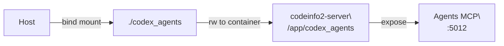

### Agents MCP (JSON-RPC)

- The server runs a dedicated MCP v2-style JSON-RPC listener for agents on `AGENTS_MCP_PORT` (default `5012`).
- It exposes four tools:
  - `list_agents` (always available; returns agent summaries including `disabled`/`warnings` when Codex is not usable for that agent).
  - `list_commands` (always available; lists enabled command macros for one agent or all agents).
  - `run_agent_instruction` (Codex-backed; returns `CODE_INFO_LLM_UNAVAILABLE` when the Codex CLI is missing or the selected agent home is not usable).
  - `run_command` (Codex-backed; runs an agent command macro and returns a minimal `{ agentName, commandName, conversationId, modelId }` response).
- Tool argument shapes (high level):
  - `list_commands`: `{ agentName?: string }`.
  - `run_agent_instruction`: `{ agentName: string, instruction: string, conversationId?: string, working_folder?: string }`.
  - `run_command`: `{ agentName: string, commandName: string, conversationId?: string, working_folder?: string }`.
- All tools delegate to the shared agents service (`server/src/agents/service.ts`) so REST and MCP behaviors stay aligned.

#### Transient reconnect handling

- Codex can emit transient reconnect errors like `Reconnecting... 1/5`.
- `McpResponder` treats messages matching `/^Reconnecting\.\.\.\s+\d+\/\d+$/` as non-fatal: it tracks/counts them for diagnostics but does not fail `toResult()`.
- Agent command macros retry per step when the *step call* fails with a transient reconnect error (fixed defaults): `MAX_ATTEMPTS = 3`, `BASE_DELAY_MS = 500`, exponential backoff (`* 2 ** (attempt - 1)`), AbortSignal-aware sleep.
- Retry logs include `conversationId`, `agentName`, `commandName`, `stepIndex`, `attempt`, and `maxAttempts` and avoid logging prompt content.

```mermaid
flowchart LR
  Client[MCP client] -->|initialize/tools\\nlist/tools\\ncall| MCP[Agents MCP\\n:5012]
  MCP --> Tools[Tool registry\\n(list_agents/list_commands/run_agent_instruction/run_command)]
  Tools --> Svc[Agents service\\nlistAgents()/listAgentCommands()/runAgentInstruction()/runAgentCommand()]
  Svc --> Disc[discoverAgents()\\n+ auth seeding]
  Svc --> Codex[Codex run\\n(per-agent CODEX_HOME)]
```

- `run_agent_instruction` accepts an optional `working_folder` (absolute path string). It is resolved by the shared agents service using the same rules as REST (host-path mapping when possible, literal fallback).
- If `working_folder` is invalid or does not exist, Agents MCP returns a JSON-RPC invalid-params style tool error (safe message only).

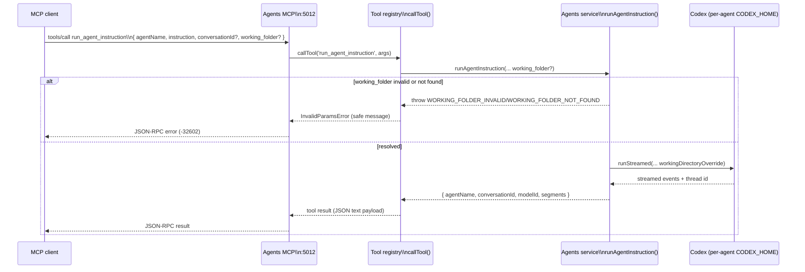

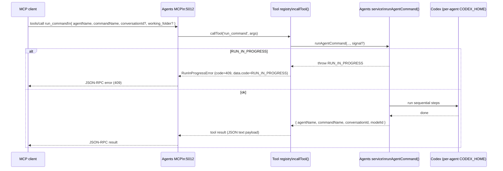

#### Per-conversation run lock

- Agent runs (REST and Agents MCP) acquire an in-memory, per-process lock keyed by `conversationId`.
- While a run holds the lock, any concurrent run targeting the same `conversationId` is rejected with `RUN_IN_PROGRESS` (REST HTTP 409 / Agents MCP JSON-RPC error 409).
- This lock is not cross-instance coordinated (multiple server processes do not share lock state).

```mermaid
sequenceDiagram
  participant CallerA as REST caller (Agents UI)
  participant CallerB as MCP caller
  participant Svc as Agents service
runAgentInstruction()
  participant Codex as Codex provider

  CallerA->>Svc: runAgentInstruction(conversationId=c1)
  Svc->>Svc: tryAcquireConversationLock(c1)
  Svc->>Codex: run(...)

  CallerB->>Svc: runAgentInstruction(conversationId=c1)
  Svc-->>CallerB: RUN_IN_PROGRESS (409)

  Codex-->>Svc: done
  Svc->>Svc: releaseConversationLock(c1)
  Svc-->>CallerA: success
```

#### Agent command execution (macros)

- Agent commands live in each agent home at `commands/<commandName>.json` and are loaded at execution time.
- REST endpoints:
  - `GET /agents/:agentName/commands` returns `{ commands: [{ name, description, disabled }] }`.
  - `POST /agents/:agentName/commands/run` accepts `{ commandName, conversationId?, working_folder? }` and returns `{ agentName, commandName, conversationId, modelId }`.
- REST error mapping (command run):
  - `COMMAND_NOT_FOUND` → 404 `{ error: 'not_found' }`
  - `COMMAND_INVALID` → 400 `{ error: 'invalid_request', code: 'COMMAND_INVALID', message }`
  - `RUN_IN_PROGRESS` → 409 `{ error: 'conflict', code: 'RUN_IN_PROGRESS', message }`
- The runner acquires the per-conversation lock once and holds it for the entire command run so steps cannot interleave with another run targeting the same `conversationId`.
- Steps execute sequentially; each step runs as a normal agent instruction with `turn.command` metadata `{ name, stepIndex, totalSteps }`.
- Cancellation is abort-based: the client aborts the in-flight HTTP request (AbortController), the server propagates that abort to the provider call via an `AbortSignal`, and the runner stops after the current step (never starts the next step once aborted).
- If abort triggers mid-step, the chat layer persists a `Stopped` assistant turn (status `stopped`) and still tags that step with `turn.command`. The caller may not receive a normal JSON response because the request was aborted.

```mermaid
sequenceDiagram
  participant UI as Agents UI
  participant API as Server (REST)
  participant Svc as AgentsService
  participant Runner as Command runner
  participant Codex as Codex

  UI->>API: POST /agents/:agentName/commands/run\n{ commandName, conversationId?, working_folder? }
  Note over API: Creates an AbortController\n(req 'aborted' / res 'close' => controller.abort())
  API->>Svc: runAgentCommand(..., signal)
  Svc->>Runner: runAgentCommandRunner(...)\n(load JSON + acquire lock)
  Runner->>Runner: tryAcquireConversationLock(conversationId)

  alt RUN_IN_PROGRESS
    Runner-->>Svc: throw RUN_IN_PROGRESS
    Svc-->>API: error
    API-->>UI: 409 conflict
  else ok
    loop for each step
      alt signal.aborted
        Runner-->>Runner: stop (do not start next step)
      else continue
        Runner->>Svc: runAgentInstructionUnlocked(step)\n+ turn.command metadata
        Svc->>Codex: runStreamed(step, signal)
        Codex-->>Svc: streamed events (or stopped on abort)
        Svc-->>Runner: { modelId }
      end
    end

    Runner->>Runner: releaseConversationLock(conversationId)
    Runner-->>Svc: { agentName, commandName, conversationId, modelId }
    Svc-->>API: result
    API-->>UI: 200 { ... }
  end

  opt User cancels
    UI--xAPI: AbortController.abort()\n(connection closes)
    Note over Runner: Once aborted, no further steps start;\nlock is still released in finally.
  end
```

### Agent discovery

- Agents are discovered from the directory set by `CODEINFO_CODEX_AGENT_HOME`.
- Only direct subfolders containing `config.toml` are treated as available agents; discovery does not recurse.
- Optional metadata sources:
  - `description.md` is read as UTF-8 and surfaced to UIs/clients as the agent description.
  - `system_prompt.txt` is detected by presence; its contents are only read at execution time when starting a new agent conversation.

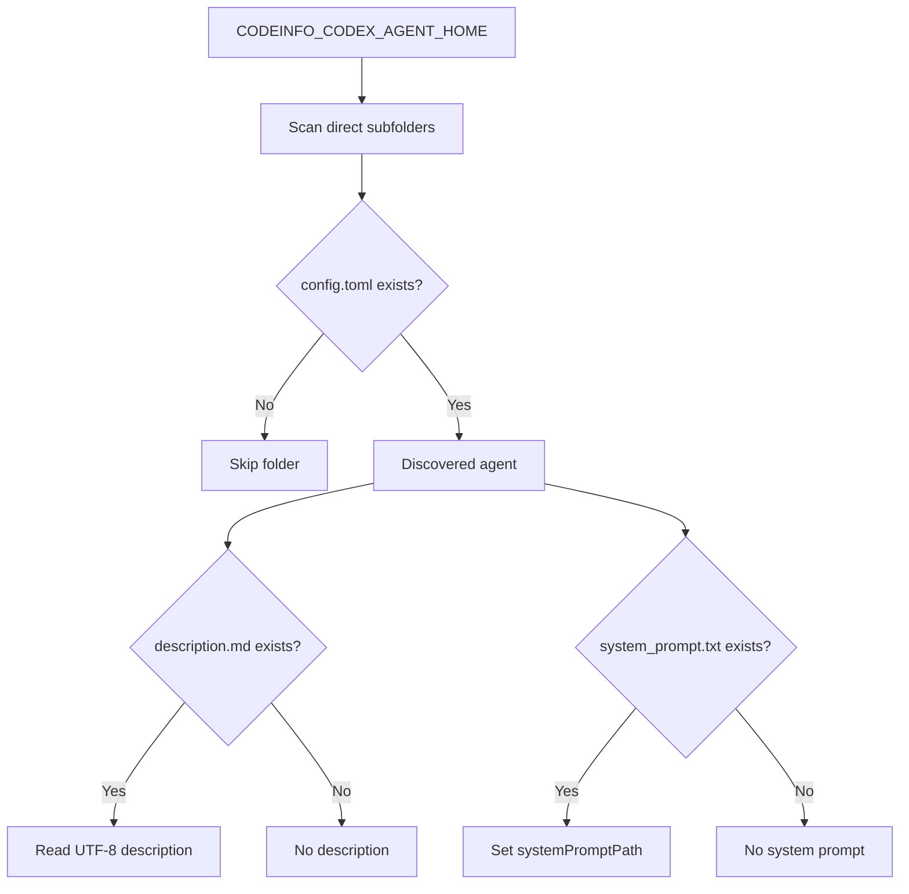

### Auth seeding on discovery read

- On every agent discovery read, the server best-effort ensures each agent home has a usable `auth.json`.
- If `${agentHome}/auth.json` is missing and the primary Codex home (`resolveCodexHome()` / `CODEINFO_CODEX_HOME`) has `auth.json`, it is copied into the agent home.
- It never overwrites an existing agent `auth.json`. Failures do not abort discovery; they surface as warnings on the agent summary.

```mermaid
flowchart TD
  Disc[Agent discovery read] --> ForEach[For each discovered agent]
  ForEach --> HasAgent{agent auth.json exists?}
  HasAgent -->|Yes| Done[No-op]
  HasAgent -->|No| HasPrimary{primary auth.json exists?}
  HasPrimary -->|No| SkipSeed[No-op]
  HasPrimary -->|Yes| Copy[Copy primary -> agent (never overwrite)]
  Copy --> Ok{Copy ok?}
  Ok -->|Yes| Continue[Continue listing]
  Ok -->|No| Warn[Append warning, continue listing]
```

### Agent listing (REST + MCP)

- Both the GUI and Agents MCP server reuse a single listing implementation (`listAgents()`), which delegates to discovery (and best-effort auth seeding) and returns REST/MCP-safe agent summaries.

```mermaid
flowchart LR
  GUI[GUI Agents page] -->|GET /agents| REST[Express route\\nGET /agents]
  MCP[Agents MCP\\nlist_agents] -->|listAgents()| Svc[Agents service\\nlistAgents()]
  REST --> Svc
  Svc --> Disc[discoverAgents()]
  Disc --> Seed[ensureAgentAuthSeeded()]
  Disc --> Resp[{ agents: [...] }]
```

### Agent execution (REST + MCP)

- Agent execution shares one implementation (`runAgentInstruction()`), invoked by:
  - REST: `POST /agents/:agentName/run`
  - MCP: `run_agent_instruction`
- The API returns the **server** `conversationId`; Codex continuation uses a separate thread id persisted as `Conversation.flags.threadId`.
- Per-agent system prompts (`system_prompt.txt`) apply only to the first turn of a new conversation and do not leak into persisted user turns.
- Agent execution defaults (model/approval/sandbox/reasoning/network/web-search) come from the agent’s Codex home `config.toml`; the server avoids passing overlapping `ThreadOptions` so config remains the source of truth. The server still enforces `workingDirectory` + `skipGitRepoCheck` for safety/portability.

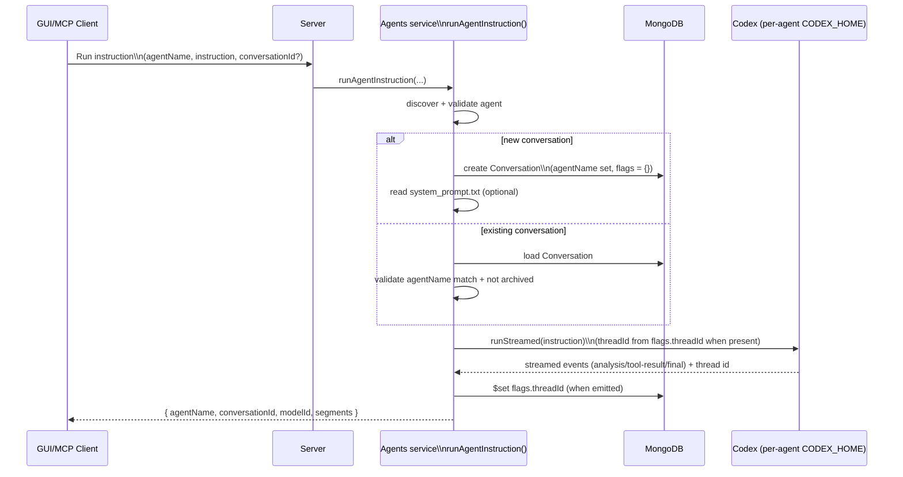

### POST /agents/:agentName/run (REST)

- Request body:
  - `instruction: string` (required)
  - `conversationId?: string`
  - `working_folder?: string` (optional; absolute path string)
- Working-folder resolution errors map to HTTP 400 with a stable error code:
  - `{ error: 'invalid_request', code: 'WORKING_FOLDER_INVALID', message: '...' }`
  - `{ error: 'invalid_request', code: 'WORKING_FOLDER_NOT_FOUND', message: '...' }`

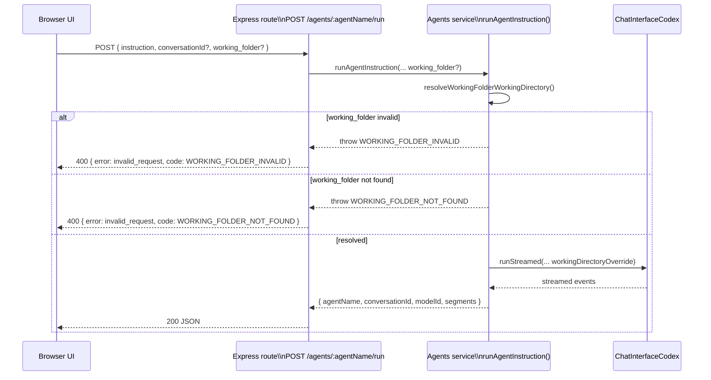

### Agent working_folder overrides

- Callers may optionally provide `working_folder` (absolute path). When present, the server resolves a per-call Codex `workingDirectory` override before starting/resuming the Codex thread.
- Agent `config.toml` remains the source of truth for defaults; `working_folder` only overrides Codex workingDirectory for that call.
- Resolution tries a host→container mapping first (when `HOST_INGEST_DIR` is set and both paths are POSIX-absolute after `\\`→`/` normalization), then falls back to using the literal path as provided.
- Stable error codes returned by the service when resolution fails:
  - `WORKING_FOLDER_INVALID` (non-absolute input)
  - `WORKING_FOLDER_NOT_FOUND` (no directory exists)

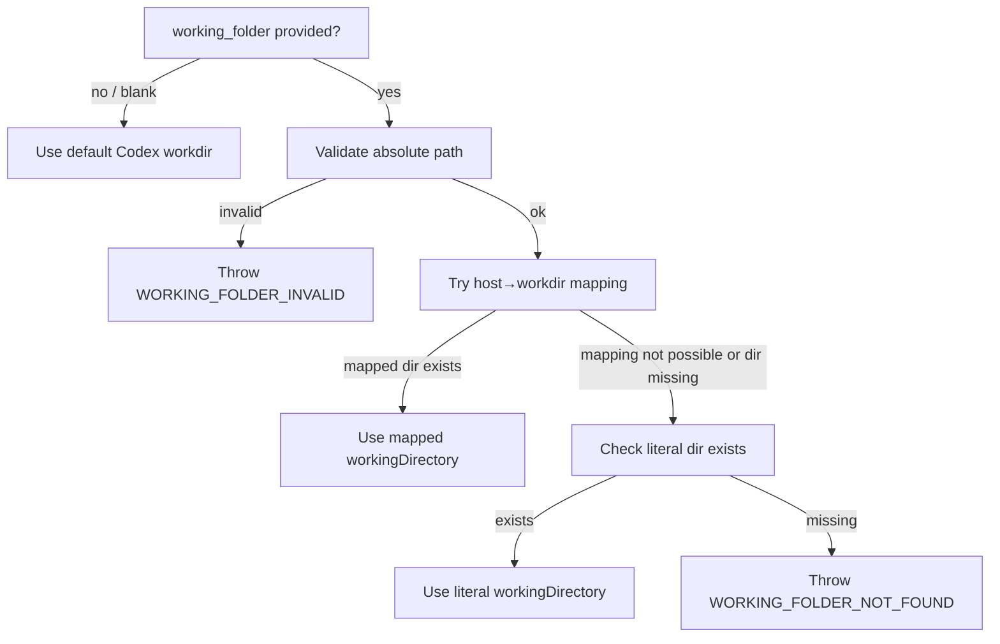

### Agents UI flow (browser)

- The Agents page (`/agents`) is a Codex-only surface with a constrained control bar:
  - agent selector dropdown
  - command selector dropdown (refreshed on agent change)
  - Execute command (runs selected command)
  - Stop (abort)
  - New conversation (reset)
- The run form includes an optional `working_folder` field (absolute path) above the instruction input.
  - Reset behavior: agent change and New conversation clear `working_folder`.
- Conversation continuation is done by selecting a prior conversation from the sidebar (no manual `conversationId` entry).
- Command runs do not use client-side locking; the server rejects concurrent runs for the same `conversationId` with `RUN_IN_PROGRESS` (HTTP 409), and the UI surfaces this as a friendly error.
- After a successful command run, the UI refreshes the conversation list and hydrates the transcript from persisted turns so multi-step results show in order.

```mermaid
flowchart TD
  WF[Enter working_folder (optional)] --> Instr[Enter instruction]
  Instr --> Send[POST /agents/<agentName>/run\n(instruction + working_folder? + conversationId?)]
  Send -->|200| RenderOk[Render segments\n(thinking / vector_summary / answer)]
  Send -->|error| RenderErr[Append error message]
  RenderOk --> Ready[Ready to send]
  RenderErr --> Ready
```

```mermaid
flowchart TD
  Load[Open /agents] --> ListAgents[GET /agents]
  ListAgents --> SelectAgent[Select agent]
  SelectAgent --> ListCommands[GET /agents/<agentName>/commands]
  ListCommands --> SelectCommand{Select command?}
  SelectAgent --> ListConvos[GET /conversations?agentName=<agentName>]
  ListConvos --> SelectConvo{Select conversation?}
  SelectConvo -->|Yes| HydrateTurns[GET /conversations/<id>/turns]
  SelectConvo -->|No| NewState[New conversation state]
  HydrateTurns --> Ready[Ready to send]
  NewState --> Ready
  Ready --> Send[POST /agents/<agentName>/run]
  Send --> Render[Render segments (thinking/vector_summary/answer)]
  Render --> ListConvos
  SelectCommand -->|Yes| Execute[POST /agents/<agentName>/commands/run]
  Execute -->|200| RefreshConvos[Refresh conversations]
  RefreshConvos --> HydrateTurns
  Execute -->|409 RUN_IN_PROGRESS| CmdErr[Render friendly conflict message]
  SelectAgent --> SwitchAgent[Change agent]
  SwitchAgent --> Abort[Abort in-flight run]
  Abort --> Reset[Reset conversation + clear transcript]
  Reset --> ListConvos
```

### Markdown rendering (assistant replies)

- Assistant-visible text renders through `react-markdown` with `remark-gfm` and `rehype-sanitize` (no `rehype-raw`) so lists, tables, inline code, and fenced blocks show safely while stripping unsafe HTML.
- Styled `<pre><code>` blocks and inline code backgrounds improve readability; links open in a new tab. Blockquotes use a divider-colored border to stay subtle inside bubbles.
- Tool payloads and citation blocks bypass markdown to preserve structured layout and avoid escaping JSON/path details; hidden think text uses the same renderer when expanded. Assistant-role messages that contain tool payloads are suppressed server-side so raw tool JSON never shows as a normal assistant reply; only the structured tool block renders the data.
- Streaming-safe: the Markdown wrapper simply re-renders on content changes, relying on the sanitized schema to drop scripts before the virtual DOM paint.

### Mermaid rendering

- Markdown fences labeled `mermaid` are intercepted in `client/src/components/Markdown.tsx` and rendered via `mermaid.render` into a dedicated `<div>`, keeping the renderer isolated from normal markdown output.
- Input is sanitized before rendering (script tags stripped) and the mermaid instance is initialized per theme (`default` for light, `dark` for dark mode); render errors fall back to a short inline error message.
- Diagram containers use the page background + border, clamp width to the chat bubble, and allow horizontal scroll so wide graphs do not overflow on mobile.

```mermaid
flowchart TD
  A[Markdown fences] -->|language=mermaid| B[MermaidBlock]
  B -->|sanitize| C[strip <script> tags]
  C -->|render| D[mermaid.render to div]
  D -->|theme| E[light/default or dark]
```

### Reasoning collapse (think + Harmony)

- The chat stream parser keeps two buffers per assistant turn: a hidden `analysis` buffer and a visible `final` buffer, plus a `mode` flag (`analysis` or `final`) and `analysisStreaming` to drive the spinner.
- Control tokens stripped from the output include `<think>...</think>`, `<|channel|>analysis<|message|>`, `<|channel|>final<|message|>`, `<|start|>assistant...`, and `<|end|>`. Text before/after a marker is routed to the active buffer.
- As soon as an analysis marker appears, the UI shows a collapsed “Thought process” row with a spinner; users can expand it mid-stream to watch reasoning accumulate. Switching to a final marker stops the spinner and streams visible text separately.
- Partial marker fragments are buffered (lookback equals the longest marker length) so split tokens do not leak control strings into the rendered output.

```mermaid
sequenceDiagram
  participant User
  participant ChatPage
  participant Hook as useChatWs
  participant Server

  User->>ChatPage: type prompt, click Send
  ChatPage->>Hook: send(message, model)
  Hook->>Server: POST /chat (202 started)
  Hook->>Server: WS subscribe_conversation(conversationId)
  Server-->>Hook: inflight_snapshot + assistant_delta/tool_event + turn_final
  Hook-->>ChatPage: update assistant bubble, status=sending
  alt error
    Hook-->>ChatPage: append error bubble, status=idle
  end
  Hook-->>Server: unsubscribe_conversation() on unmount/switch
  Hook-->>Server: cancel_inflight() on Stop
  ChatPage-->>User: shows newest-first bubbles near controls
```

## Client testing & Docker

- Jest + Testing Library under `client/src/test`; `npm run test --workspace client` (uses jsdom, ts-jest ESM preset).
- Client Dockerfile (Node 22 slim) builds Vite bundle and serves via `npm run preview -- --host --port 5001`; `.dockerignore` excludes tests/coverage and keeps `.env` defaults.

## Docker Compose wiring

- `docker-compose.yml` builds `codeinfo2-client` and `codeinfo2-server`, exposes ports 5001/5010, and sets `VITE_API_URL=http://server:5010` for the client container.
- Healthchecks: server uses `/health`; client uses root `/` to ensure availability before dependencies start, with client waiting on server health.
- Root scripts (`compose:build`, `compose:up`, `compose:down`, `compose:logs`) manage the stack for local demos and e2e setup.

## Observability (Chroma traces)

- Each compose stack (main, e2e, and Cucumber/Testcontainers debug) now includes `otel-collector` (OTLP gRPC/HTTP on 4317/4318) and `zipkin` (UI on 9411). The collector loads `observability/otel-collector-config.yaml`, which pipes traces to Zipkin and a debug logging exporter.
- Chroma containers point at the collector via `OTEL_EXPORTER_OTLP_ENDPOINT=http://otel-collector:4318`, `OTEL_EXPORTER_OTLP_TRACES_PROTOCOL=http`, and `OTEL_SERVICE_NAME=chroma`, so ingest traffic is traced without code changes.
- Use http://localhost:9411 to inspect spans; if empty, check `docker compose logs otel-collector` for configuration errors.
- Testcompose uses the same config through a relative bind mount so Cucumber runs capture Chroma traces consistently.

```mermaid
flowchart LR
  Chroma -->|OTLP http 4318| Collector
  Collector -->|Zipkin exporter| Zipkin[Zipkin UI 9411]
  Collector -->|logging exporter| Logs[Collector debug log]
```

## Architecture diagram

```mermaid
graph TD
  A[root package.json] --> B[client workspace]
  A --> C[server workspace]
  A --> D[common workspace]
  B -->|uses| D
  C -->|uses| D
  B --> E[client Docker image]
  C --> F[server Docker image]
  C --> H[LM Studio server]
  E --> G[docker-compose]
  F --> G
  G --> H
```

This diagram shows the three workspaces sharing the root tooling, each consuming the common package, and both producing Docker images that the compose stack orchestrates.

## Version flow

```mermaid
sequenceDiagram
  participant User
  participant Client
  participant Server
  participant Common
  User->>Client: open http://localhost:5001
  Client->>Server: GET /version
  Server->>Server: read package.json version
  Server->>Common: getAppInfo("server", version)
  Common-->>Server: VersionInfo
  Server-->>Client: 200 VersionInfo
  Client-->>User: renders client + server versions
```

This sequence captures the startup request path the UI uses to display client and server versions via the shared VersionInfo DTO.

## LM Studio flow

```mermaid
sequenceDiagram
  participant User
  participant Client
  participant Server
  participant LMStudio

  User->>Client: navigate to LM Studio page
  Client->>Server: GET /lmstudio/status?baseUrl=...
  alt valid + reachable
    Server->>LMStudio: system.listDownloadedModels()
    LMStudio-->>Server: models[]
    Server-->>Client: 200 {status:'ok', models}
    Client-->>User: shows model list / empty state
  else timeout or SDK error
    Server-->>Client: 502 {status:'error', error}
    Client-->>User: shows actionable error
  else invalid baseUrl
    Server-->>Client: 400 {status:'error', error:'Invalid baseUrl'}
    Client-->>User: surface validation error
  end
```

- LM Studio clients are pooled by base URL (`server/src/lmstudio/clientPool.ts`) so chat, ingest, and proxy routes reuse a single connection per origin. Pool entries close on SIGINT/SIGTERM via hooks in `server/src/index.ts` to avoid lingering sockets.

### LM Studio tools (chat wiring)

- Tools are defined in `server/src/lmstudio/tools.ts` and reuse shared helpers in `server/src/lmstudio/toolService.ts` so HTTP tooling endpoints and chat share the same provenance/path mapping. `ListIngestedRepositories` has no inputs; `VectorSearch` accepts `query`, optional `repository`, and `limit` (default 5, max 20).
- Chat registers the LM Studio tools (ListIngestedRepositories and VectorSearch); `VectorSearch` returns repo id, relPath, containerPath, hostPath, chunk text, score, chunkId, and modelId for inline citations. Validation/unknown-repo errors are surfaced as tool errors to the model. VectorSearch derives its embedding function from the vectors collection `lockedModelId`; if no lock exists the tool and HTTP endpoint return `INGEST_REQUIRED`, and if the locked model is unavailable in LM Studio they return `EMBED_MODEL_MISSING` rather than silently falling back.
- Logging: each tool execution emits a `chat tool usage` entry with requestId/baseUrl/model plus tool name, repository scope, limit, result count, and modelId; payload bodies are not logged.

### Ingest models fetch

- Endpoint: `GET /ingest/models` (server proxy to LM Studio). Returns embedding-only models plus optional `lockedModelId` when the shared collection is locked.
- Response example:

```json
{
  "models": [
    {
      "id": "embed-1",
      "displayName": "all-MiniLM",
      "contextLength": 2048,
      "format": "gguf",
      "size": 145000000,
      "filename": "all-mini.gguf"
    }
  ],
  "lockedModelId": null
}
```

- Flow: client calls server → server lists downloaded models → filters to embedding type/capability → adds lock status → returns JSON; errors bubble as 502 with `{status:"error", message}`.

### Ingest start/status flow

```mermaid
sequenceDiagram
  participant Client
  participant Server
  participant FS as File System
  participant LM as LM Studio
  participant Chroma

  Client->>Server: POST /ingest/start {path,name,model,dryRun?}
  Server->>Chroma: check collectionIsEmpty + lockedModelId
  alt locked mismatch
    Server-->>Client: 409 MODEL_LOCKED
  else busy
    Server-->>Client: 429 BUSY
  else
    Server-->>Client: 202 {runId}
    Server->>FS: discover files
    Server->>LM: embed chunks (skip when dryRun)
    Server->>Chroma: add vectors + metadata (runId, root, relPath, hashes, model)
    Server->>Chroma: set lockedModelId if empty before
    Server-->>Client: status queued→scanning→embedding→completed
  end
  Client->>Server: GET /ingest/status/{runId}
  Server-->>Client: {state, counts, message, lastError?}
```

#### Ingest progress telemetry

- `/ingest/status/:runId` now includes `currentFile`, `fileIndex`, `fileTotal`, `percent` (1dp from `fileIndex/fileTotal`), and `etaMs` (ms, estimated from completed-file timing). Final snapshots keep the last processed path and percent 100.
- The client renders these fields under the Active ingest header, formatting ETA as `hh:mm:ss` and falling back to “Pending file info” when progress data is absent.

```mermaid
sequenceDiagram
  participant UI as Ingest page
  participant API as /ingest/status
  participant Job as Ingest job

  UI->>API: poll status every ~2s
  API->>Job: read latest snapshot
  Job-->>API: state + counts + currentFile + fileIndex/fileTotal + percent + etaMs
  API-->>UI: JSON status
  UI-->>UI: render file path, index/total, percent, ETA
```

- Model lock: first successful ingest sets `lockedModelId`; subsequent ingests must match unless the vectors collection is emptied.

### Ingest roots listing

- Endpoint: `GET /ingest/roots` reads the `ingest_roots` collection metadata and returns stored roots sorted by `lastIngestAt` descending plus the current `lockedModelId` for the vectors collection.
- Response shape:
  ```json
  {
    "roots": [
      {
        "runId": "abc",
        "name": "docs",
        "description": "project docs",
        "path": "/repo/docs",
        "model": "embed-1",
        "status": "completed",
        "lastIngestAt": "2025-01-01T12:00:00.000Z",
        "counts": { "files": 3, "chunks": 12, "embedded": 12 },
        "lastError": null
      }
    ],
    "lockedModelId": "embed-1"
  }
  ```
- Sorting happens server-side so the client can render the newest ingest first; empty collections return `roots: []` with `lockedModelId` unchanged.

### Ingest cancel / re-embed / remove flows

- Cancel: `POST /ingest/cancel/:runId` sets a cancel flag, stops further work, deletes vectors tagged with the runId, updates the roots entry to `cancelled`, and frees the single-flight lock. Response `{status:'ok', cleanup:'complete'}`.
- Re-embed: `POST /ingest/reembed/:root` deletes existing vectors/metadata for the root, then starts a new ingest using the stored model/name/description. Returns `202 {runId}` or `404` if the root is unknown; respects the existing model lock and single-flight guard.
- Remove: `POST /ingest/remove/:root` purges vectors and root metadata; when the vectors collection is empty the locked model is cleared, returning `{status:'ok', unlocked:true|false}`.
- Single-flight lock: a TTL-backed lock (30m) prevents overlapping ingest/re-embed/remove; requests during an active run return `429 BUSY`. Cancel is permitted to release the lock.
- Dry run: skips Chroma writes/embeddings but still reports discovered file/chunk counts.

### Ingest dry-run + cleanup guarantees

- Dry runs still call LM Studio `embed` to size dimensions but never call `vectors.add`; counts reflect the would-be chunk embeds and status ends `completed`.
- When vectors are emptied (cancel/remove/re-embed pre-delete or a zero-embed flush), the server drops the `ingest_vectors` collection via a helper that also clears the lock metadata; the next real write recreates the collection/lock during `flushBatch`.
- Ingest routes now rely on a single Chroma/Testcontainers path (no in-memory/mock collections); Cucumber hooks bootstrap Chroma for all ingest scenarios.

The proxy does not cache results and times out after 60s. Invalid base URLs are rejected server-side; other errors bubble up as `status: "error"` responses while leaving CORS unchanged.

### Chat models endpoint

- `GET /chat/models` uses `LMSTUDIO_BASE_URL` (converted to ws/wss for the SDK) to call `system.listDownloadedModels()`.
- Success returns `200` with `[ { key, displayName, type } ]` and the chat UI defaults to the first entry when none is selected.
- Failure or invalid/unreachable base URL returns `503 { error: "lmstudio unavailable" }`.
- Logging: start, success, and failure entries record the sanitized base URL origin; success logs the model count for visibility.

```mermaid
sequenceDiagram
  participant Client as Chat page
  participant Server
  participant LMStudio

  Client->>Server: GET /chat/models
  alt LM Studio reachable
    Server->>LMStudio: system.listDownloadedModels()
    LMStudio-->>Server: models[]
    Server-->>Client: 200 [{key,displayName,type}]
  else LM Studio down/invalid
    Server-->>Client: 503 {error:"lmstudio unavailable"}
  end
```

### LM Studio UI behaviour

- Base URL field defaults to `http://host.docker.internal:1234` (or `VITE_LMSTUDIO_URL`) and persists to localStorage; reset restores the default.
- Actions: `Check status` runs the proxy call with the current URL, `Refresh models` reuses the saved URL, and errors focus the input for quick edits.
- States: loading text (“Checking…”), inline error text from the server, empty-state message “No models reported by LM Studio.”
- Responsive layout: table on md+ screens and stacked cards on small screens to avoid horizontal scrolling.

### Ingest page UI (client)

- Layout: top lock banner + refresh button, ingest form card, active run card, and embedded roots table.
- Form fields: folder path (required), display name (required), optional description, embedding model select (disabled when `lockedModelId` exists), dry-run toggle, submit button. Inline errors show “Path is required”, “Name is required”, “Select a model”.
- Locked model: info banner “Embedding model locked to <id>” appears when the shared collection already has a model; select stays disabled in that state.
- Submit button reads “Start ingest” and disables while submitting or when required fields are empty; a subtle helper text shows while submitting.
- Active run: when a run is started, the page polls `/ingest/status/{runId}` roughly every 2s until reaching `completed|cancelled|error`, showing a chip for the state, counts (files/chunks/embedded/skipped), lastError text, and a “Cancel ingest” button that calls `/ingest/cancel/{runId}` with a “Cancelling…” state. A “View logs for this run” link routes to `/logs?text=<runId>`.
- Embedded roots table: renders Name (tooltip with description), Path, Model, Status chip, Last ingest time, and counts. Row actions include Re-embed (POST `/ingest/reembed/:root`), Remove (POST `/ingest/remove/:root`), and Details (opens drawer). Bulk buttons perform re-embed/remove across selected rows. Inline text shows action success/errors; actions are disabled while an ingest is active. Empty state copy reminds users that the model locks after the first ingest.
- Details drawer: right-aligned drawer listing name, description, path, model, model lock note, counts, last error, and last ingest timestamp. Shows include/exclude defaults when detailed metadata is unavailable.

## Chat run + WebSocket streaming

- `POST /chat` validates the request, ensures a conversation exists (or creates one), acquires the per-conversation run lock, creates an in-flight registry entry, and returns immediately with `202 { status:"started", conversationId, inflightId, provider, model }`.
- The run continues in the background via `ChatInterface.run(...)` (LM Studio or Codex). Provider events are normalized and bridged into:
  - in-flight buffers (for late subscribers),
  - persisted turns (MongoDB when available), and
  - WebSocket transcript events to any subscribed viewers.
- Transcript streaming is WebSocket-only at `/ws`:
  - Client sends `subscribe_conversation` (and `subscribe_sidebar`).
  - Server broadcasts `user_turn` at run start (before persistence) so other tabs render immediately.
  - Server responds with `inflight_snapshot` when a run is in progress, then streams `assistant_delta`/`analysis_delta`/`tool_event` (and optional `stream_warning`), and ends with `turn_final`.
- Codex reasoning (`analysis_delta`) is append-only in the UI; when Codex emits multiple reasoning items or a non-prefix reset, the server treats it as a new reasoning block and prefixes the next `analysis_delta` with `\n\n` so the “Thought process” view shows all blocks without truncation.
- Logging: run lifecycle (`chat.run.started`) and WS publish milestones (`chat.stream.*`) are recorded server-side; client forwards `chat.ws.client_*` entries into `/logs` for deterministic manual verification.
- Fixtures: `common/src/fixtures/chatStream.ts` contains both legacy SSE fixtures (for older harnesses) and WS-shaped fixtures used by Jest/Playwright mocks.

```mermaid
sequenceDiagram
  participant UI as UI (tab A)
  participant Viewer as UI (tab B)
  participant Server
  participant Provider as LM Studio/Codex
  participant Logs as Log store

  UI->>Server: POST /chat (202 started)
  Note over Server: acquire run lock + create inflight
  Server->>Provider: ChatInterface.run(...)
  Provider-->>Server: deltas/tool events/final
  Server-->>Logs: append chat.run/chat.stream logs

  Viewer->>Server: WS subscribe_conversation(conversationId)
  alt Run already in progress
    Server-->>Viewer: inflight_snapshot (catch-up)
  end
  Server-->>Viewer: assistant_delta / analysis_delta / tool_event ...
  Server-->>Viewer: turn_final (ok|stopped|failed, threadId?)
```

### Stop control

- ChatPage shows a **Stop** button only while a run is in progress; it sends `cancel_inflight` over `/ws`.
- Cancellation aborts the run via the in-flight AbortController; switching conversations/unmounting only unsubscribes from streaming and does not cancel server-side.

```mermaid
sequenceDiagram
  participant User
  participant UI as ChatPage
  participant WS as useChatWs
  participant Server

  User->>UI: click Stop
  UI->>WS: send cancel_inflight
  WS-->>Server: { type:"cancel_inflight", conversationId, inflightId }
  Note over Server: AbortController.abort(); publish turn_final(status:"stopped")
```

### Agent tooling (Chroma list + search)

- `/tools/ingested-repos` reads the roots collection, maps stored `/data/<repo>/...` paths to host paths using `HOST_INGEST_DIR` (default `/data`), and returns repo ids, counts, descriptions, last ingest timestamps, last errors, and `lockedModelId`. A `hostPathWarning` surfaces when the env var is missing so agents know to fall back.
- `/tools/vector-search` validates `{ query, repository?, limit? }` (query required, limit default 5/max 20, repository must match a known repo id from roots), builds a repo->root map, and queries the vectors collection with an optional `root` filter. Results carry `repo`, `relPath`, `containerPath`, `hostPath`, `chunk`, `chunkId`, `score`, and `modelId`; the response also returns the current `lockedModelId`. Errors: 400 validation, 404 unknown repo, 502 Chroma unavailable.

### ChatInterface event buffering & persistence

- The server unifies chat execution behind `ChatInterface` (`server/src/chat/interfaces/ChatInterface.ts`) with provider-specific subclasses (`ChatInterfaceCodex`, `ChatInterfaceLMStudio`) selected via `getChatInterface(provider)` (`server/src/chat/factory.ts`).
- REST `/chat` and MCP v2 `codebase_question` both call `ChatInterface.run(message, flags, conversationId, model)` and subscribe to the same normalized event stream (`analysis`, `tool-result`, `final`, `complete`, `thread`, `error`).
- Persistence is base-managed: `ChatInterface.run` persists the user turn first, then buffers emitted events (tokens/final/tool results), derives a final status, and persists a single assistant turn (including `toolCalls`) via Mongo or the in-memory `memoryPersistence` fallback (Mongo-down/test). The `source` field is set from flags (`REST` vs `MCP`) for UI attribution.
- Provider history gotchas:
  - Codex maintains its own thread history; the server sends only the latest user message and relies on a stored `threadId` to continue the conversation. When Codex emits a new thread id, it is persisted into the conversation flags (`threadId`) for follow-ups.
  - LM Studio does not maintain remote thread state; the server loads stored turns for `conversationId` from persistence and sends them to the model in chronological order (oldest → newest).

```mermaid
flowchart TD
  REST[REST: POST /chat (202)] --> Factory[getChatInterface(provider)]
  MCP[MCP v2: tools/call codebase_question] --> Factory
  Factory --> Codex[ChatInterfaceCodex]
  Factory --> LM[ChatInterfaceLMStudio]
  Codex --> Events[normalized chat events]
  LM --> Events
  Events --> Base[ChatInterface.run buffers + persists]
  Base --> Persist[(MongoDB or memoryPersistence)]
  Base --> WS[/ws transcript publish]
  Base --> Mcp[McpResponder -> segments JSON]
```

### MCP server (Codex tools)

- Express `POST /mcp` implements MCP over JSON-RPC 2.0 with methods `initialize`, `tools/list`, and `tools/call` (protocol version `2024-11-05`).
- Tools exposed: `ListIngestedRepositories` (no params) and `VectorSearch` (`query` required, optional `repository`, `limit` <= 20). Results are returned as a single `text` content item containing JSON (`content: [{ type: "text", text: "<json>" }]`) for Codex compatibility.
- Errors follow JSON-RPC envelopes: validation maps to -32602, method-not-found to -32601, and domain errors map to 404/409/503 codes in the `error` object.
- `config.toml.example` seeds `[mcp_servers]` entries for host (`http://localhost:5010/mcp`) and docker (`http://server:5010/mcp`) so Codex can call the MCP server directly.
- Shared MCP infrastructure (guards, JSON-RPC helpers, dispatch skeleton) lives under `server/src/mcpCommon/` and is reused by both `/mcp` and MCP v2 while preserving their intentionally different wire formats, tool sets, and gating/error conventions.

### Codex-gated MCP v2 (port 5011)

- A second JSON-RPC server listens on `MCP_PORT` (default 5011) alongside Express, exposing `initialize`, `tools/list`, `tools/call`, `resources/list`, and `resources/listTemplates` with Codex availability gating. When Codex is unavailable it returns `CODE_INFO_LLM_UNAVAILABLE` (-32001) instead of tools. Resource listings return empty arrays for compatibility.
- `initialize` now mirrors MCP v1: it returns `protocolVersion: "2024-11-05"`, `capabilities: { tools: { listChanged: false } }`, and `serverInfo { name: "codeinfo2-mcp", version: <server package version> }` so Codex/mcp-remote clients accept the handshake.
- Startup/shutdown: `startMcp2Server()` is called from `server/src/index.ts`; `stopMcp2Server()` is invoked during SIGINT/SIGTERM alongside LM Studio client cleanup.

```mermaid
flowchart LR
  Browser/Agent -- HTTP 5010 --> Express
  Express -->|/mcp| MCP1
  Browser/Agent -- JSON-RPC 5011 --> MCP2[Codex-gated MCP]
  MCP2 -->|tools/list| Codex
  MCP2 -->|tools/call| Codex
  MCP1 -->|ListIngestedRepositories / VectorSearch| LMStudio
```

### MCP v2 `codebase_question` flow (Codex + optional LM Studio)

- Tool: `codebase_question(question, conversationId?, provider?, model?)` exposed on the MCP v2 server (port 5011). `provider` defaults to `codex` when omitted; `model` defaults per provider.
- Behaviour: runs the selected `ChatInterface` and buffers normalized events into ordered MCP `segments` via `McpResponder` (`thinking`, `vector_summary`, `answer`), returning a single `content` item of type `text` containing JSON `{ conversationId, modelId, segments }`. The MCP transport remains single-response (not streaming).
- Provider specifics:
  - `provider=codex`: uses Codex thread options (workingDirectory, sandbox, web search, reasoning effort) and relies on Codex thread history (only the latest message is submitted per turn).
  - `provider=lmstudio`: uses `LMSTUDIO_BASE_URL` and the requested/default LM Studio model; history comes from stored turns for `conversationId`.
- Error handling: the MCP v2 server is Codex-gated; when Codex is unavailable, `tools/list` and `tools/call` return `CODE_INFO_LLM_UNAVAILABLE` (-32001) even if the requested provider is `lmstudio`.

```mermaid
sequenceDiagram
  participant Agent
  participant MCP2 as MCP v2 (5011)
  participant Chat as ChatInterface
  participant Provider as Codex/LM Studio
  participant Tools as Vector tools

  Agent->>MCP2: tools/call codebase_question {question, conversationId?, provider?, model?}
  MCP2->>Chat: run(question, flags, conversationId, model)
  Chat->>Provider: execute + stream events
  Provider->>Tools: ListIngestedRepositories / VectorSearch (as needed)
  Tools-->>Provider: repo list + chunks
  Provider-->>Chat: analysis/tool/final/complete/thread events
  Chat-->>MCP2: normalized events
  MCP2-->>Agent: JSON-RPC result with text content {conversationId, modelId, segments[]}
  Note over MCP2: if Codex unavailable → error -32001 CODE_INFO_LLM_UNAVAILABLE
```

## End-to-end validation

- Playwright test `e2e/version.spec.ts` hits the client UI and asserts both client/server versions render.
- Playwright test `e2e/chat.spec.ts` walks the chat page end-to-end (model select + two streamed turns) and skips automatically when `/chat/models` is unreachable/empty.
- Playwright test `e2e/chat-tools.spec.ts` ingests the mounted fixture repo (`/fixtures/repo`), runs a vector search, mocks `POST /chat` (202) + `/ws` transcript events, and asserts citations render `repo/relPath` plus host path. The question is “What does main.txt say about the project?” with the expected answer text “This is the ingest test fixture for CodeInfo2.”
- Scripts: `e2e:up` (compose stack), `e2e:test`, `e2e:down`, and `e2e` for the full chain; install browsers once via `npx playwright install --with-deps`.
- Uses `E2E_BASE_URL` to override the client URL; defaults to http://localhost:5001.
- Dedicated e2e stack: `docker-compose.e2e.yml` runs client (6001), server (6010), and Chroma (8800) with an isolated `chroma-e2e-data` volume and a mounted fixture repo at `/fixtures`. Scripts `compose:e2e:*` wrap build/up/down. Ingest e2e specs (`e2e/ingest.spec.ts`) exercise happy path, cancel, re-embed, and remove; they auto-skip when LM Studio/models are unavailable.

### Ingest BDD (Testcontainers)

- Cucumber ingest suites run against a real Chroma started via Testcontainers (image `chromadb/chroma:1.3.5`) mapped to host port 18000; Docker must be available.
- LM Studio stays mocked; only Chroma is real. Hooks in `server/src/test/support/chromaContainer.ts` start Chroma before all tests and wipe the ingest collections before each scenario.
- For manual debugging, use `docker compose -f server/src/test/compose/docker-compose.chroma.yml up -d` and tear down with `docker compose -f server/src/test/compose/docker-compose.chroma.yml down -v` to avoid polluting test runs.

## Logging schema (shared)

- Shared DTO lives in `common/src/logging.ts` and exports `LogEntry` / `LogLevel` plus an `isLogEntry` guard. Fields: `level`, `message`, ISO `timestamp`, `source` (`server|client`), optional `requestId`, `correlationId`, `userAgent`, `url`, `route`, `tags`, `context`, `sequence` (assigned server-side).
- Server logger lives in `server/src/logger.ts` (pino + pino-http + pino-roll); request middleware is registered in `server/src/index.ts`. Env knobs: `LOG_LEVEL`, `LOG_BUFFER_MAX`, `LOG_MAX_CLIENT_BYTES`, `LOG_FILE_PATH` (default `./logs/server.log`), `LOG_FILE_ROTATE` (defaults `true`). Files write to `./logs` (gitignored/bind-mounted later).
- Client logging stubs reside in `client/src/logging/*` with a console tee, queue placeholder, and forwarding toggle. Env knobs: `VITE_LOG_LEVEL`, `VITE_LOG_FORWARD_ENABLED`, `VITE_LOG_MAX_BYTES`, `VITE_LOG_STREAM_ENABLED`.
- Privacy: redact obvious secrets (auth headers/passwords) before storage/streaming; keep payload size limits to avoid accidental PII capture.

```mermaid
flowchart TD
  A[Client logger] -->|POST /logs (later)| B[Server logger]
  B --> C[In-memory log buffer]
  B --> D[Rotating file ./logs/server.log]
  C --> E[SSE /logs/stream]
  C --> F[GET /logs]
  E --> G[Logs page]
  F --> G
```

### Logging storage & retention

- In-memory log buffer in `server/src/logStore.ts` caps entries using `LOG_BUFFER_MAX` (default 5000), assigns monotonic `sequence` numbers, and trims oldest-first to keep memory bounded.
- File output writes to `LOG_FILE_PATH` (default `./logs/server.log`) with rotation controlled by `LOG_FILE_ROTATE` (`true` = daily via pino-roll); the directory is created on startup so hosts can bind-mount it.
- Host persistence for compose runs uses `- ./logs:/app/logs` (to be added in compose) while keeping `logs/` gitignored and excluded from the server Docker build context.
- `LOG_MAX_CLIENT_BYTES` will guard incoming log payload sizes when the ingestion endpoint is added, preventing oversized client submissions.

### Server log APIs & streaming

- `POST /logs` validates `LogEntry`, whitelists levels (`error|warn|info|debug`) and sources (`client|server`), enforces the 32KB payload cap from `LOG_MAX_CLIENT_BYTES`, redacts obvious secrets (`authorization`, `password`, `token`) in contexts, attaches the middleware `requestId`, and appends to the in-memory store.
- `GET /logs` returns `{ items, lastSequence, hasMore }` sorted by sequence and filtered via `level`, `source`, `text`, `since`, `until` with a hard limit of 200 items per call.
- `GET /logs/stream` keeps an SSE connection alive with `text/event-stream`, heartbeats every 15s (`:\n\n`), and replays missed entries when `Last-Event-ID` or `?sinceSequence=` is provided. SSE payloads carry `id: <sequence>` so clients can resume accurately.
- Redaction + retention defaults: contexts strip obvious secrets; buffer defaults to 5000 entries; payload cap 32KB; file rotation daily unless `LOG_FILE_ROTATE=false`.

```mermaid
sequenceDiagram
  participant Client as Client app
  participant Server as Server /logs routes
  participant Store as In-memory logStore
  participant UI as Logs UI
  Client->>Server: POST /logs (validate + redact auth/password/token)
  Server->>Store: append(entry) -> sequence++
  UI->>Server: GET /logs?filters
  Server->>Store: query(filters, limit 200)
  Store-->>Server: filtered items
  Server-->>UI: items + lastSequence
  UI->>Server: EventSource /logs/stream (Last-Event-ID?)
  Server->>Store: replay since sequence
  Store-->>Server: missed entries
  Server-->>UI: SSE events + 15s heartbeats
```

### Client logging flow & hooks

- `createLogger(source, routeProvider)` captures level/message/context, enriches with timestamp, route, user agent, and a generated `correlationId`, tees to `console`, then forwards to the transport queue. `installGlobalErrorHooks` wires `window.onerror` and `unhandledrejection` with a 1s throttle to avoid noisy loops.
- `createLogger(source, routeProvider)` captures level/message/context, enriches with timestamp, route, user agent, and a generated `correlationId`, tees to `console`, then forwards to the transport queue. Chat tool events now use `source: client` with `context.channel = "client-chat"` so they satisfy the server schema while staying filterable for telemetry. `installGlobalErrorHooks` wires `window.onerror` and `unhandledrejection` with a 1s throttle to avoid noisy loops.
- The transport queues entries, enforces `VITE_LOG_MAX_BYTES` (default 32768), batches up to 10, and POSTs to `${VITE_API_URL}/logs` unless forwarding is disabled (`VITE_LOG_FORWARD_ENABLED=false`), the app is offline, or `MODE === 'test'`. Failures back off with delays `[500, 1000, 2000, 4000]` ms before retrying.
- Context should avoid PII; URLs with embedded credentials are redacted before logging. Forwarding can be opt-out via `.env.local` while keeping console output for local debugging.
- LM Studio: client logs status/refresh/reset actions with `baseUrl` reduced to `URL.origin` and errors included; server logs LM Studio proxy requests (requestId, base URL origin, model count or error) and forwards them into the log buffer/streams, keeping credentials/token/password fields redacted.

```mermaid
sequenceDiagram
  participant Client
  participant Server
  participant Store
  Client->>Server: GET /logs/stream (Last-Event-ID?)
  Server->>Store: query(filters, sinceSequence)
  Store-->>Server: recent entries
  Server-->>Client: SSE heartbeat + replay
  Client->>Server: POST /logs
  Server->>Store: append(entry + requestId, redact)
  Store-->>Server: new sequence
  Server-->>Client: SSE event id:<sequence>
```

### Logs page UI

- Controls: free-text filter, clickable chips for levels (`error|warn|info|debug`) and sources (`server|client`), live toggle (SSE on/off), manual refresh, and a “Send sample log” button that emits an example entry via `createLogger('client-logs')`.
- States: loading shows CircularProgress with text; errors surface in an Alert; empty state reads “No logs yet. Emit one with ‘Send sample log’.” SSE auto-reconnects with 15s heartbeats and replays missed entries using `Last-Event-ID` so the UI stays in sync when live mode is on.
- Layout: table on md+ screens with chips per level/source and monospace context column; stacked outlined cards on small screens to avoid horizontal scroll.
- Live behaviour: when Live is on, EventSource streams `/logs/stream` with auto-reconnect; turning it off keeps the last fetched snapshot. Refresh clears cached data and re-fetches `/logs` with current filters.

```mermaid
flowchart LR
  F[Filter controls] --> Q[useLogs fetch /logs?query]
  Q --> U[Table/Card render]
  U -->|Live on| S[EventSource /logs/stream]
  S --> U
  B[Send sample log] --> L[createLogger -> POST /logs]
  L --> S
```

### Client WebSocket lifecycle (Chat + Agents)

- Each browser tab mounts a single WebSocket connection while the page is active.
- When persistence is available (`mongoConnected !== false`):
  - Chat page subscribes to `subscribe_sidebar` plus `subscribe_conversation(activeConversationId)` for the visible transcript only.
  - Agents page subscribes only to `subscribe_conversation(activeConversationId)` for the selected agent conversation.
- Switching conversations sends `unsubscribe_conversation(old)` then `subscribe_conversation(new)`; **unsubscribing never cancels a run**.
- Unmounting the page closes the socket after unsubscribing; **navigation never cancels a run**.
- Reconnect behavior: if the socket drops, the client reconnects with a small backoff and refreshes **both** the sidebar snapshot and the active conversation turns snapshot via REST before resubscribing.
- Focus/visibility behavior: when a tab becomes active again (`document.visibilityState === 'visible'` and/or `window.focus`), the client refreshes the same snapshots so missed sidebar/transcript updates are recovered without any cross-tab broadcast.
- The server sends an `inflight_snapshot` after `subscribe_conversation` when a run is in progress so the client can catch up deterministically.

```mermaid
sequenceDiagram
  participant UI as UI (single tab)
  participant WS as WS (/ws)
  participant REST as REST API

  UI->>WS: connect GET /ws
  WS-->>UI: open

  UI->>WS: subscribe_sidebar
  UI->>WS: subscribe_conversation(c1)
  WS-->>UI: inflight_snapshot? (if run in flight)

  alt Switch conversation
    UI->>WS: unsubscribe_conversation(c1)
    UI->>WS: subscribe_conversation(c2)
    WS-->>UI: inflight_snapshot? (if run in flight)
  end

  alt Reconnect
    WS-->>UI: close (network hiccup)
    loop backoff (250ms → 2000ms max)
      UI->>WS: reconnect GET /ws
      WS-->>UI: open
    end
    UI->>REST: GET /conversations (snapshot refresh)
    UI->>WS: resubscribe_sidebar + resubscribe_conversation
    WS-->>UI: inflight_snapshot?
  end

  UI->>WS: close (unmount)
```

### Client streaming logs (WS observability)

- The Chat UI emits explicit `chat.ws.client_*` log entries from the WebSocket hook so end-to-end streaming can be verified via the `/logs` store.
- These logs follow the existing client log pipeline: `createLogger()` → batched `POST /logs` via the client transport.
- Tests and manual checks assert behavior by querying `/logs` (or streaming `/logs/stream`) rather than relying on browser console output.

Required log names and key fields:

- `chat.ws.client_connect`
- `chat.ws.client_disconnect`
- `chat.ws.client_subscribe_conversation` (`conversationId`)
- `chat.ws.client_snapshot_received` (`conversationId`, `inflightId`, `seq`)
- `chat.ws.client_delta_received` (`conversationId`, `inflightId`, `seq`, `deltaCount`; throttled: first + every 25)
- `chat.ws.client_tool_event_received` (`conversationId`, `inflightId`, `seq`, `toolEventCount`; emitted per tool event)
- `chat.ws.client_final_received` (`conversationId`, `inflightId`, `seq`)

```mermaid
sequenceDiagram
  participant Chat as ChatPage/useChatWs
  participant Client as Client logger/transport
  participant Logs as Server /logs
  participant Store as Server logStore
  participant UI as Logs UI / e2e

  Chat->>Client: emit chat.ws.client_* logs
  Client->>Logs: POST /logs (batched LogEntry[])
  Logs->>Store: append(redact + sequence)
  Store-->>Logs: sequence
  Logs-->>Client: 202 accepted

  alt Assert via snapshot
    UI->>Logs: GET /logs?text=chat.ws.client_
    Logs-->>UI: { items, lastSequence }
  else Assert via stream
    UI->>Logs: GET /logs/stream (SSE)
    Logs-->>UI: events (id = sequence)
  end
```
