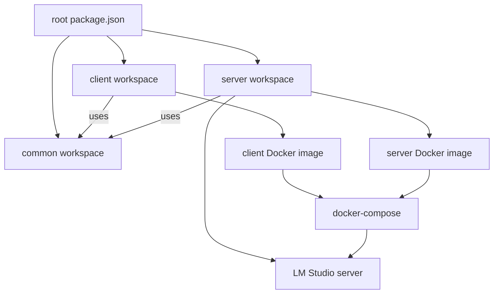
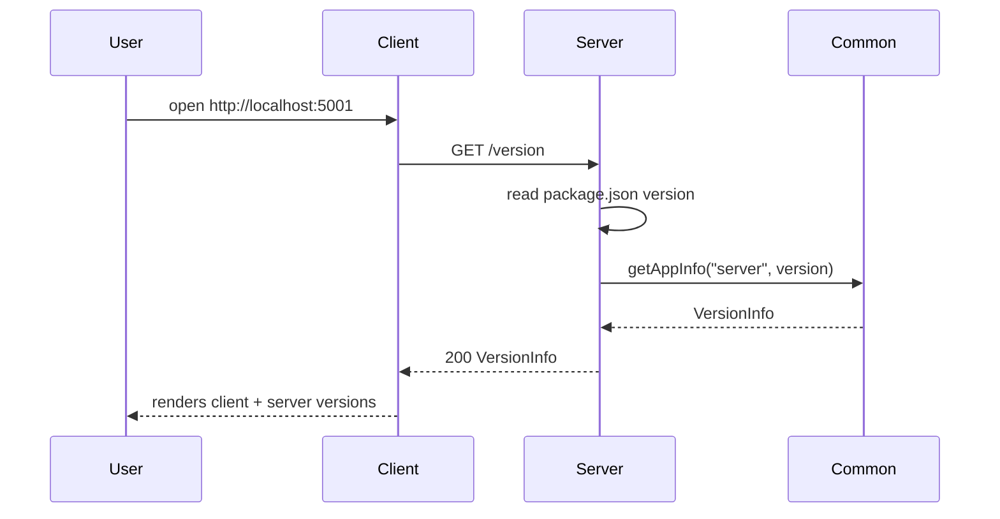
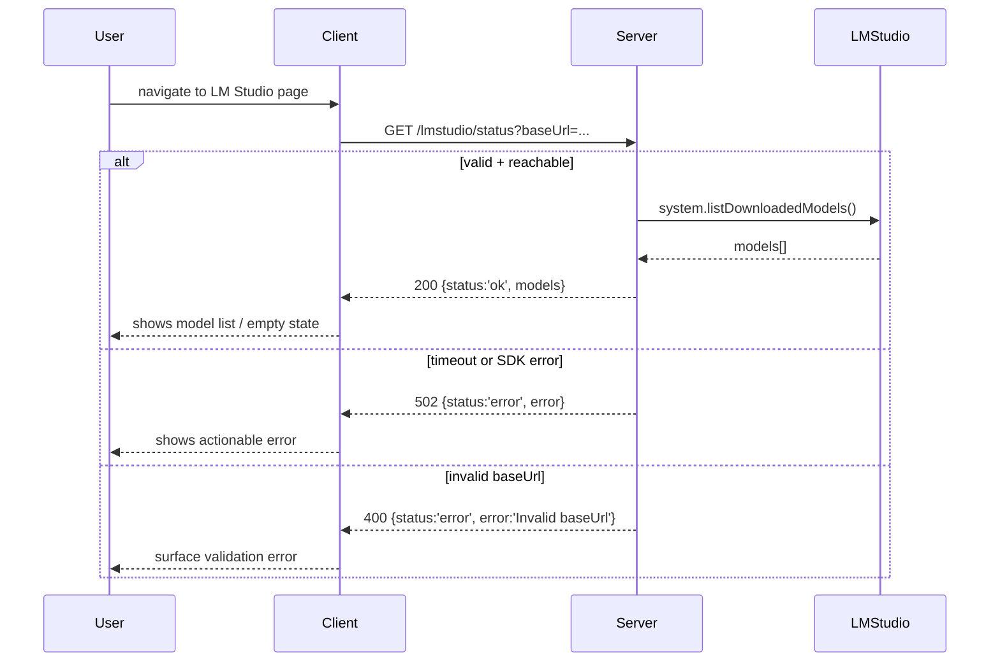

# Design Notes

For a current directory map, refer to `projectStructure.md` alongside this document.

## Tooling baseline

- Node.js 22.x across all workspaces.
- Shared configs: `tsconfig.base.json`, `eslint.config.js`, `.prettierrc`, `.editorconfig`.
- Linting: `npm run lint --workspaces` (ESLint flat config, TypeScript rules).
- Formatting: `npm run format:check --workspaces` / `npm run format --workspaces` (Prettier).
- Husky + lint-staged: pre-commit runs ESLint (no warnings) and Prettier check on staged TS/JS/TSX/JSX files.
- Environment policy: commit `.env` with safe defaults; keep `.env.local` for overrides and secrets (ignored from git and Docker contexts).

## Common package

- Purpose: shared DTOs/utilities consumed by client and server to prove workspace linking.
- Exports `VersionInfo` type and `getAppInfo(app, version)` helper; built with `tsc -b` to emit declarations in `dist/`.
- Uses root lint/format configs; build output stays out of git via root ignores.

## Server API (core)

- Express 5 app with CORS enabled and env-driven port (default 5010 via `server/.env`).
- Routes: `/health` returns `{ status: 'ok', uptime, timestamp }`; `/version` returns `VersionInfo` using `package.json` version; `/info` echoes a friendly message plus VersionInfo.
- Depends on `@codeinfo2/common` for DTO helper; built with `tsc -b`, started via `npm run start --workspace server`.

## Server testing & Docker

- Cucumber test under `server/src/test` validates `/health` (run with server running on 5010): `npm run test --workspace server`.
- Dockerfile (multi-stage, Node 22 slim) builds server from workspace; `.dockerignore` excludes tests and dev artifacts while keeping `.env` defaults. Build with `docker build -f server/Dockerfile -t codeinfo2-server .`, run with `docker run --rm -p 5010:5010 codeinfo2-server`.

## Client skeleton

- Vite + React 19 + MUI; dev server on port 5001 (host enabled). Env `VITE_API_URL` from `client/.env`.
- Startup fetch calls `${VITE_API_URL}/version`, parses `VersionInfo` from `@codeinfo2/common`, and displays alongside client version (from package.json) in a MUI Card with loading/error states.
- Layout uses MUI `CssBaseline` for global resets; the `NavBar` AppBar spans the full width while content sits inside a single `Container maxWidth="lg"` with left-aligned spacing (no Vite starter centering/dark background).

## Client testing & Docker

- Jest + Testing Library under `client/src/test`; `npm run test --workspace client` (uses jsdom, ts-jest ESM preset).
- Client Dockerfile (Node 22 slim) builds Vite bundle and serves via `npm run preview -- --host --port 5001`; `.dockerignore` excludes tests/coverage and keeps `.env` defaults.

## Docker Compose wiring

- `docker-compose.yml` builds `codeinfo2-client` and `codeinfo2-server`, exposes ports 5001/5010, and sets `VITE_API_URL=http://server:5010` for the client container.
- Healthchecks: server uses `/health`; client uses root `/` to ensure availability before dependencies start, with client waiting on server health.
- Root scripts (`compose:build`, `compose:up`, `compose:down`, `compose:logs`) manage the stack for local demos and e2e setup.

## Architecture diagram

This diagram shows the three workspaces sharing the root tooling, each consuming the common package, and both producing Docker images that the compose stack orchestrates.

## Version flow

This sequence captures the startup request path the UI uses to display client and server versions via the shared VersionInfo DTO.

## LM Studio flow

The proxy does not cache results and times out after 60s. Invalid base URLs are rejected server-side; other errors bubble up as `status: "error"` responses while leaving CORS unchanged.

### LM Studio UI behaviour

- Base URL field defaults to `http://host.docker.internal:1234` (or `VITE_LMSTUDIO_URL`) and persists to localStorage; reset restores the default.
- Actions: `Check status` runs the proxy call with the current URL, `Refresh models` reuses the saved URL, and errors focus the input for quick edits.
- States: loading text (“Checking…”), inline error text from the server, empty-state message “No models reported by LM Studio.”
- Responsive layout: table on md+ screens and stacked cards on small screens to avoid horizontal scrolling.

## End-to-end validation

- Playwright test `e2e/version.spec.ts` hits the client UI and asserts both client/server versions render.
- Scripts: `e2e:up` (compose stack), `e2e:test`, `e2e:down`, and `e2e` for the full chain; install browsers once via `npx playwright install --with-deps`.
- Uses `E2E_BASE_URL` to override the client URL; defaults to http://localhost:5001.
