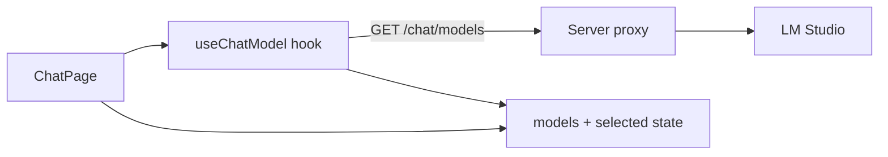
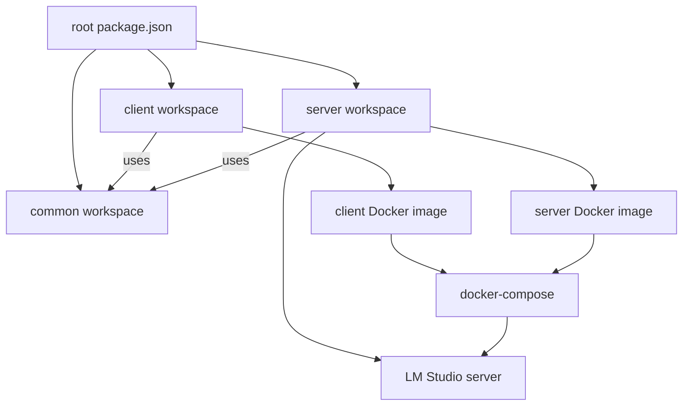
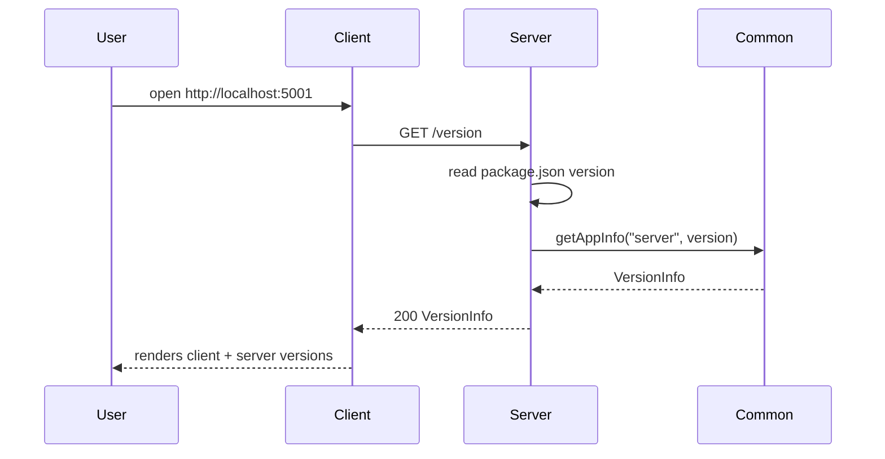
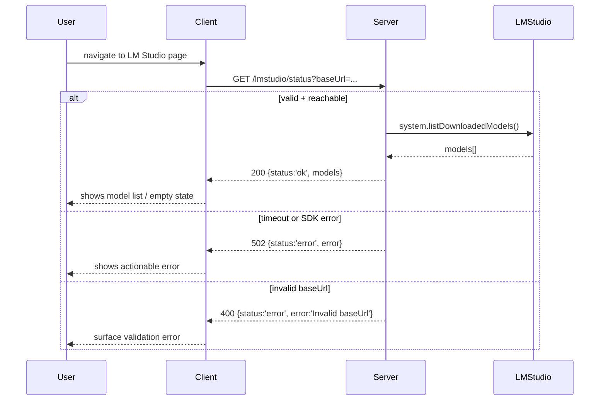
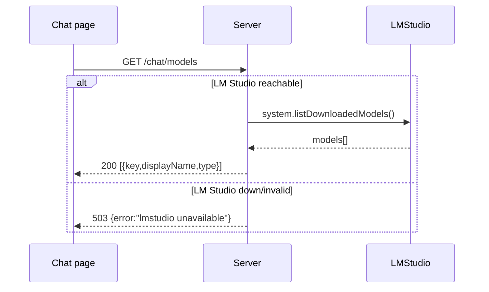
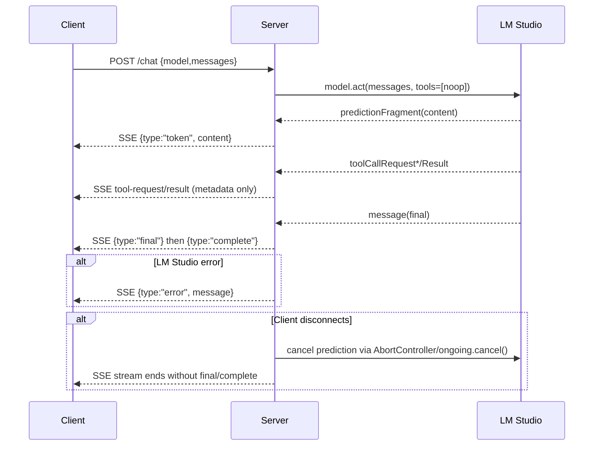
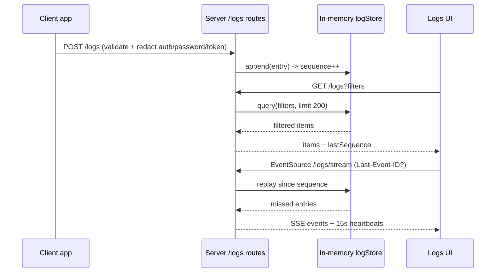
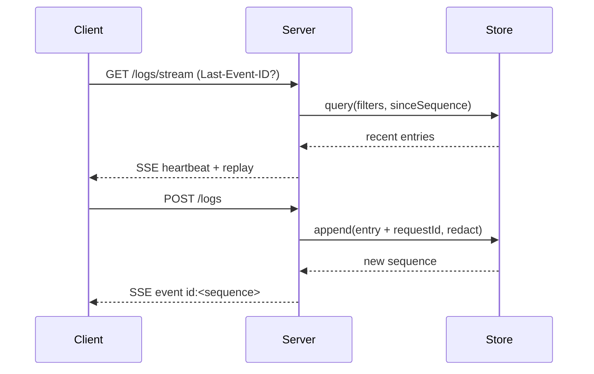
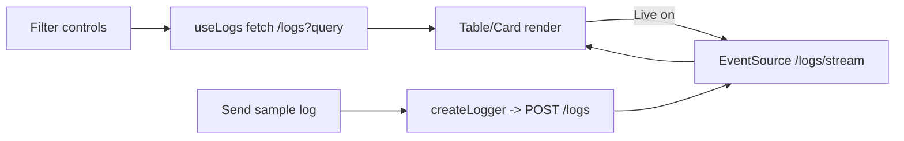

# Design Notes

For a current directory map, refer to `projectStructure.md` alongside this document.

## Tooling baseline

- Node.js 22.x across all workspaces.
- Shared configs: `tsconfig.base.json`, `eslint.config.js`, `.prettierrc`, `.editorconfig`.
- Linting: `npm run lint --workspaces` (ESLint flat config, TypeScript rules).
- Formatting: `npm run format:check --workspaces` / `npm run format --workspaces` (Prettier).
- Husky + lint-staged: pre-commit runs ESLint (no warnings) and Prettier check on staged TS/JS/TSX/JSX files.
- Environment policy: commit `.env` with safe defaults; keep `.env.local` for overrides and secrets (ignored from git and Docker contexts).

## Common package

- Purpose: shared DTOs/utilities consumed by client and server to prove workspace linking.
- Exports `VersionInfo` type and `getAppInfo(app, version)` helper; built with `tsc -b` to emit declarations in `dist/`.
- Uses root lint/format configs; build output stays out of git via root ignores.

## Server API (core)

- Express 5 app with CORS enabled and env-driven port (default 5010 via `server/.env`).
- Routes: `/health` returns `{ status: 'ok', uptime, timestamp }`; `/version` returns `VersionInfo` using `package.json` version; `/info` echoes a friendly message plus VersionInfo.
- Depends on `@codeinfo2/common` for DTO helper; built with `tsc -b`, started via `npm run start --workspace server`.

## Server testing & Docker

- Cucumber test under `server/src/test` validates `/health` (run with server running on 5010): `npm run test --workspace server`.
- Dockerfile (multi-stage, Node 22 slim) builds server from workspace; `.dockerignore` excludes tests and dev artifacts while keeping `.env` defaults. Build with `docker build -f server/Dockerfile -t codeinfo2-server .`, run with `docker run --rm -p 5010:5010 codeinfo2-server`.

## Client skeleton

- Vite + React 19 + MUI; dev server on port 5001 (host enabled). Env `VITE_API_URL` from `client/.env`.
- Startup fetch calls `${VITE_API_URL}/version`, parses `VersionInfo` from `@codeinfo2/common`, and displays alongside client version (from package.json) in a MUI Card with loading/error states.
- Layout uses MUI `CssBaseline` for global resets; the `NavBar` AppBar spans the full width while content sits inside a single `Container maxWidth="lg"` with left-aligned spacing (no Vite starter centering/dark background).

### Chat page (models list)

- Route `/chat` surfaces the chat shell; controls sit at the top (inverted layout) with a model `<Select>` and a message `<TextField>` that is disabled until streaming work lands. The first model auto-selects when data loads.
- `useChatModel` fetches `/chat/models`, aborts on unmount, and exposes `models`, `selected`, `status` flags, and errors. Loading shows a small inline spinner; errors render an Alert with a Retry action; empty lists render “No models available…” and keep inputs disabled.
- Controls are disabled while loading, on errors, or when no models exist so the chat form cannot submit without a model.



## Client testing & Docker

- Jest + Testing Library under `client/src/test`; `npm run test --workspace client` (uses jsdom, ts-jest ESM preset).
- Client Dockerfile (Node 22 slim) builds Vite bundle and serves via `npm run preview -- --host --port 5001`; `.dockerignore` excludes tests/coverage and keeps `.env` defaults.

## Docker Compose wiring

- `docker-compose.yml` builds `codeinfo2-client` and `codeinfo2-server`, exposes ports 5001/5010, and sets `VITE_API_URL=http://server:5010` for the client container.
- Healthchecks: server uses `/health`; client uses root `/` to ensure availability before dependencies start, with client waiting on server health.
- Root scripts (`compose:build`, `compose:up`, `compose:down`, `compose:logs`) manage the stack for local demos and e2e setup.

## Architecture diagram



This diagram shows the three workspaces sharing the root tooling, each consuming the common package, and both producing Docker images that the compose stack orchestrates.

## Version flow



This sequence captures the startup request path the UI uses to display client and server versions via the shared VersionInfo DTO.

## LM Studio flow



The proxy does not cache results and times out after 60s. Invalid base URLs are rejected server-side; other errors bubble up as `status: "error"` responses while leaving CORS unchanged.

### Chat models endpoint

- `GET /chat/models` uses `LMSTUDIO_BASE_URL` (converted to ws/wss for the SDK) to call `system.listDownloadedModels()`.
- Success returns `200` with `[ { key, displayName, type } ]` and the chat UI defaults to the first entry when none is selected.
- Failure or invalid/unreachable base URL returns `503 { error: "lmstudio unavailable" }`.
- Logging: start, success, and failure entries record the sanitized base URL origin; success logs the model count for visibility.



### LM Studio UI behaviour

- Base URL field defaults to `http://host.docker.internal:1234` (or `VITE_LMSTUDIO_URL`) and persists to localStorage; reset restores the default.
- Actions: `Check status` runs the proxy call with the current URL, `Refresh models` reuses the saved URL, and errors focus the input for quick edits.
- States: loading text (“Checking…”), inline error text from the server, empty-state message “No models reported by LM Studio.”
- Responsive layout: table on md+ screens and stacked cards on small screens to avoid horizontal scrolling.

## Chat streaming endpoint

- `POST /chat` uses `LMSTUDIO_BASE_URL` to call `client.getModel(model).act()` with a registered `noop` tool and `allowParallelToolExecution: false`. The server streams `text/event-stream` frames: `token`, `tool-request`, `tool-result`, `final`, `complete`, or `error`, starting with a heartbeat from `chatStream.ts`.
- Payloads reuse the canonical fixtures in `@codeinfo2/common` (`chatRequestFixture`, `chatSseEventsFixture`, `chatErrorEventFixture`) for server Cucumber and upcoming client RTL coverage; bodies are capped by `LOG_MAX_CLIENT_BYTES`.
- Logging: start/end/error and every tool lifecycle event are recorded to the log store + pino with only metadata (`type`, `callId`, `name`, model, base URL origin); tool arguments/results stay out of logs and transcript frames.
- Cancellation: the route attaches an `AbortController` to the LM Studio `.act()` call and listens for `req` `close/aborted` events to invoke `controller.abort()`, call `ongoing.cancel?.()`, log `{ reason: "client_disconnect" }`, and end the SSE safely when the client drops.



## End-to-end validation

- Playwright test `e2e/version.spec.ts` hits the client UI and asserts both client/server versions render.
- Scripts: `e2e:up` (compose stack), `e2e:test`, `e2e:down`, and `e2e` for the full chain; install browsers once via `npx playwright install --with-deps`.
- Uses `E2E_BASE_URL` to override the client URL; defaults to http://localhost:5001.

## Logging schema (shared)

- Shared DTO lives in `common/src/logging.ts` and exports `LogEntry` / `LogLevel` plus an `isLogEntry` guard. Fields: `level`, `message`, ISO `timestamp`, `source` (`server|client`), optional `requestId`, `correlationId`, `userAgent`, `url`, `route`, `tags`, `context`, `sequence` (assigned server-side).
- Server logger lives in `server/src/logger.ts` (pino + pino-http + pino-roll); request middleware is registered in `server/src/index.ts`. Env knobs: `LOG_LEVEL`, `LOG_BUFFER_MAX`, `LOG_MAX_CLIENT_BYTES`, `LOG_FILE_PATH` (default `./logs/server.log`), `LOG_FILE_ROTATE` (defaults `true`). Files write to `./logs` (gitignored/bind-mounted later).
- Client logging stubs reside in `client/src/logging/*` with a console tee, queue placeholder, and forwarding toggle. Env knobs: `VITE_LOG_LEVEL`, `VITE_LOG_FORWARD_ENABLED`, `VITE_LOG_MAX_BYTES`, `VITE_LOG_STREAM_ENABLED`.
- Privacy: redact obvious secrets (auth headers/passwords) before storage/streaming; keep payload size limits to avoid accidental PII capture.

```mermaid
flowchart TD
  A[Client logger] -->|POST /logs (later)| B[Server logger]
  B --> C[In-memory log buffer]
  B --> D[Rotating file ./logs/server.log]
  C --> E[SSE /logs/stream]
  C --> F[GET /logs]
  E --> G[Logs page]
  F --> G
```

### Logging storage & retention

- In-memory log buffer in `server/src/logStore.ts` caps entries using `LOG_BUFFER_MAX` (default 5000), assigns monotonic `sequence` numbers, and trims oldest-first to keep memory bounded.
- File output writes to `LOG_FILE_PATH` (default `./logs/server.log`) with rotation controlled by `LOG_FILE_ROTATE` (`true` = daily via pino-roll); the directory is created on startup so hosts can bind-mount it.
- Host persistence for compose runs uses `- ./logs:/app/logs` (to be added in compose) while keeping `logs/` gitignored and excluded from the server Docker build context.
- `LOG_MAX_CLIENT_BYTES` will guard incoming log payload sizes when the ingestion endpoint is added, preventing oversized client submissions.

### Server log APIs & streaming

- `POST /logs` validates `LogEntry`, whitelists levels (`error|warn|info|debug`) and sources (`client|server`), enforces the 32KB payload cap from `LOG_MAX_CLIENT_BYTES`, redacts obvious secrets (`authorization`, `password`, `token`) in contexts, attaches the middleware `requestId`, and appends to the in-memory store.
- `GET /logs` returns `{ items, lastSequence, hasMore }` sorted by sequence and filtered via `level`, `source`, `text`, `since`, `until` with a hard limit of 200 items per call.
- `GET /logs/stream` keeps an SSE connection alive with `text/event-stream`, heartbeats every 15s (`:\n\n`), and replays missed entries when `Last-Event-ID` or `?sinceSequence=` is provided. SSE payloads carry `id: <sequence>` so clients can resume accurately.
- Redaction + retention defaults: contexts strip obvious secrets; buffer defaults to 5000 entries; payload cap 32KB; file rotation daily unless `LOG_FILE_ROTATE=false`.



### Client logging flow & hooks

- `createLogger(source, routeProvider)` captures level/message/context, enriches with timestamp, route, user agent, and a generated `correlationId`, tees to `console`, then forwards to the transport queue. `installGlobalErrorHooks` wires `window.onerror` and `unhandledrejection` with a 1s throttle to avoid noisy loops.
- The transport queues entries, enforces `VITE_LOG_MAX_BYTES` (default 32768), batches up to 10, and POSTs to `${VITE_API_URL}/logs` unless forwarding is disabled (`VITE_LOG_FORWARD_ENABLED=false`), the app is offline, or `MODE === 'test'`. Failures back off with delays `[500, 1000, 2000, 4000]` ms before retrying.
- Context should avoid PII; URLs with embedded credentials are redacted before logging. Forwarding can be opt-out via `.env.local` while keeping console output for local debugging.
- LM Studio: client logs status/refresh/reset actions with `baseUrl` reduced to `URL.origin` and errors included; server logs LM Studio proxy requests (requestId, base URL origin, model count or error) and forwards them into the log buffer/streams, keeping credentials/token/password fields redacted.



### Logs page UI

- Controls: free-text filter, clickable chips for levels (`error|warn|info|debug`) and sources (`server|client`), live toggle (SSE on/off), manual refresh, and a “Send sample log” button that emits an example entry via `createLogger('client-logs')`.
- States: loading shows CircularProgress with text; errors surface in an Alert; empty state reads “No logs yet. Emit one with ‘Send sample log’.” SSE auto-reconnects with 15s heartbeats and replays missed entries using `Last-Event-ID` so the UI stays in sync when live mode is on.
- Layout: table on md+ screens with chips per level/source and monospace context column; stacked outlined cards on small screens to avoid horizontal scroll.
- Live behaviour: when Live is on, EventSource streams `/logs/stream` with auto-reconnect; turning it off keeps the last fetched snapshot. Refresh clears cached data and re-fetches `/logs` with current filters.


