# Design Notes

For a current directory map, refer to `projectStructure.md` alongside this document.

## Tooling baseline

- Node.js 22.x across all workspaces.
- Shared configs: `tsconfig.base.json`, `eslint.config.js`, `.prettierrc`, `.editorconfig`.
- Linting: `npm run lint --workspaces` (ESLint flat config, TypeScript rules).
- Formatting: `npm run format:check --workspaces` / `npm run format --workspaces` (Prettier).
- Husky + lint-staged: pre-commit runs ESLint (no warnings) and Prettier check on staged TS/JS/TSX/JSX files.
- Environment policy: commit `.env` with safe defaults; keep `.env.local` for overrides and secrets (ignored from git and Docker contexts).

## Common package

- Purpose: shared DTOs/utilities consumed by client and server to prove workspace linking.
- Exports `VersionInfo` type and `getAppInfo(app, version)` helper; built with `tsc -b` to emit declarations in `dist/`.
- Uses root lint/format configs; build output stays out of git via root ignores.

## Server API (core)

- Express 5 app with CORS enabled and env-driven port (default 5010 via `SERVER_PORT` in `server/.env`, with legacy `PORT` fallback).
- Routes: `/health` returns `{ status: 'ok', uptime, timestamp }`; `/version` returns `VersionInfo` using `package.json` version; `/info` echoes a friendly message plus VersionInfo.
- Depends on `@codeinfo2/common` for DTO helper; built with `tsc -b`, started via `npm run start --workspace server`.
- Shared chat provider/model defaults are resolved in `server/src/config/chatDefaults.ts` with strict precedence: explicit request value -> `CHAT_DEFAULT_PROVIDER` / `CHAT_DEFAULT_MODEL` env -> hardcoded fallback (`codex`, `gpt-5.3-codex`).
- `validateChatRequest` now accepts omitted `provider`/`model`, resolves both through the shared resolver, and keeps existing REST validation envelopes unchanged.
- Runtime provider selection is single-hop and shared: if the selected/default provider is unavailable, execution switches once to the alternate provider only when that alternate has at least one selectable runtime model. If the alternate has no selectable model, execution stays on the original provider and surfaces existing unavailable contracts (`REST: 503 PROVIDER_UNAVAILABLE`, `MCP codebase_question: -32001 CODE_INFO_LLM_UNAVAILABLE`).
- REST runtime fallback no longer treats explicit `provider=lmstudio` + non-empty model as availability; LM Studio is considered available only when runtime model listing returns at least one selectable chat model.
- The resolved execution provider/model are persisted on conversation metadata for both REST `/chat` and MCP `codebase_question`; when execution is not Codex, stale `flags.threadId` is removed so Codex resume state is not reused across providers.
- Raw-input contract enforcement is server-side: valid chat/agent payload text is forwarded unchanged (including surrounding whitespace/newlines), while whitespace-only/newline-only payloads are rejected before provider execution with fixed endpoint-specific `400` messages (`POST /chat`: `message must contain at least one non-whitespace character`; `POST /agents/:agentName/run`: `instruction must contain at least one non-whitespace character`).
- Chat client send-flow matches the raw-input contract: `ChatPage` forwards non-whitespace input to `useChatStream.send(...)` without trim mutation, while local submit guards block whitespace-only input before dispatching `POST /chat`.
- Agents client send-flow matches the same raw-input contract: `AgentsPage` forwards non-whitespace instruction text to `runAgentInstruction(...)` without trim mutation, while local submit guards keep whitespace-only input from dispatching `/agents/:agentName/run`.
- Agents user-bubble rendering now uses the same shared markdown pipeline as assistant bubbles (`client/src/components/Markdown.tsx`) to keep list/code/mermaid rendering and sanitization behavior identical across roles while preserving existing bubble chrome/layout.
- Agents user-markdown rendering path is render-pure: instrumentation side effects were removed from JSX render loops and kept in non-render paths only.
- Codex env defaults are resolved by `server/src/config/codexEnvDefaults.ts`, which parses `Codex_*` env vars into validated defaults plus warnings and logs `[codex-env-defaults] resolved`.
- `validateChatRequest` applies Codex env defaults when request flags are missing, surfaces env warnings on the response payload, and logs `[codex-validate] applied env defaults` with the defaulted flag list.
- `ChatInterfaceCodex` builds thread options from validated flags without extra fallback defaults, leaving missing values undefined so Codex config/env defaults apply, and logs `[codex-thread-options] prepared` with `undefinedFlags`.

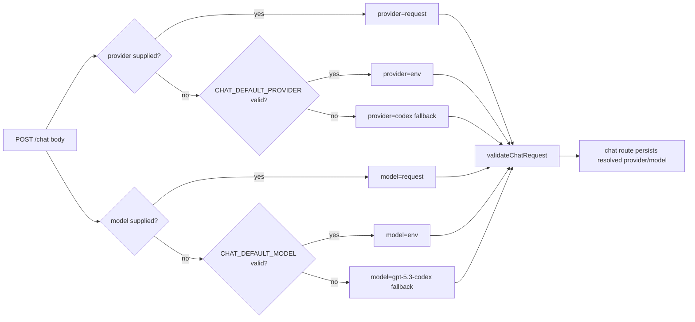
```mermaid
flowchart LR
  Req[POST /chat body] --> P{provider supplied?}
  Req --> M{model supplied?}
  P -- yes --> RP[provider=request]
  P -- no --> EP{CHAT_DEFAULT_PROVIDER valid?}
  EP -- yes --> RPE[provider=env]
  EP -- no --> RPF[provider=codex fallback]
  M -- yes --> RM[model=request]
  M -- no --> EM{CHAT_DEFAULT_MODEL valid?}
  EM -- yes --> RME[model=env]
  EM -- no --> RMF[model=gpt-5.3-codex fallback]
  RP --> V[validateChatRequest]
  RPE --> V
  RPF --> V
  RM --> V
  RME --> V
  RMF --> V
  V --> C[chat route persists resolved provider/model]
```

## Story 0000041 Task 3 server build override wiring

- `server/Dockerfile` now declares stage-local corporate override ARGs in every install stage (`deps`, `runtime`) so build-time inputs are available where install commands run.
- Install commands keep existing anchors unchanged while branching conditionally:
  - deps `npm ci` runs with `NPM_CONFIG_REGISTRY` only when `CODEINFO_NPM_REGISTRY` is non-empty.
  - runtime pip install appends `--index-url` and `--trusted-host` only when corresponding values are non-empty.
  - runtime global npm install reads `/tmp/npm-global.txt` unchanged and applies `NPM_CONFIG_REGISTRY` only when non-empty.
- Runtime metadata handoff is two-step: Docker build computes `CODEINFO_SERVER_BUILD_OVERRIDE_STATE` into a metadata file, and entrypoint resolves/parses that state to emit `[CODEINFO][T03_SERVER_BUILD_OVERRIDE_STATE]` with deterministic `off` fallbacks for missing/malformed input.

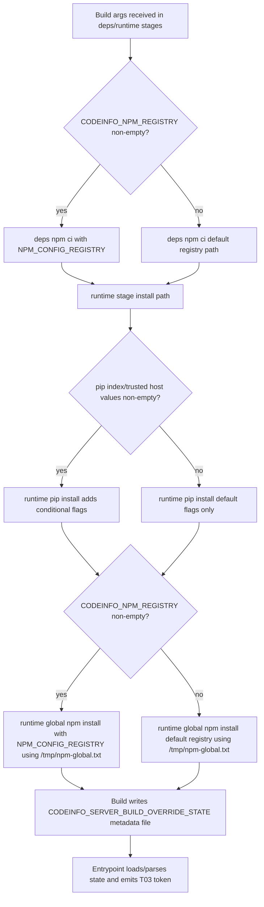
```mermaid
flowchart TD
  A[Build args received in deps/runtime stages] --> B{CODEINFO_NPM_REGISTRY non-empty?}
  B -- yes --> C[deps npm ci with NPM_CONFIG_REGISTRY]
  B -- no --> D[deps npm ci default registry path]
  C --> E[runtime stage install path]
  D --> E
  E --> F{pip index/trusted host values non-empty?}
  F -- yes --> G[runtime pip install adds conditional flags]
  F -- no --> H[runtime pip install default flags only]
  G --> I{CODEINFO_NPM_REGISTRY non-empty?}
  H --> I
  I -- yes --> J[runtime global npm install with NPM_CONFIG_REGISTRY using /tmp/npm-global.txt]
  I -- no --> K[runtime global npm install default registry using /tmp/npm-global.txt]
  J --> L[Build writes CODEINFO_SERVER_BUILD_OVERRIDE_STATE metadata file]
  K --> L
  L --> M[Entrypoint loads/parses state and emits T03 token]
```

## Story 0000041 Task 4 client build override wiring

- `client/Dockerfile` now declares `ARG CODEINFO_NPM_REGISTRY` in the build stage that runs `npm ci`.
- Client install keeps the original command anchor and applies `NPM_CONFIG_REGISTRY` only when `CODEINFO_NPM_REGISTRY` is non-empty.
- Empty and unset inputs follow the same default branch to preserve baseline npm behavior.
- Build metadata is persisted as `CODEINFO_CLIENT_BUILD_OVERRIDE_STATE` (`client_npm=<on|off>`), and `client/entrypoint.sh` emits `[CODEINFO][T04_CLIENT_BUILD_OVERRIDE_STATE]` with deterministic fallback `off` for missing/malformed state.

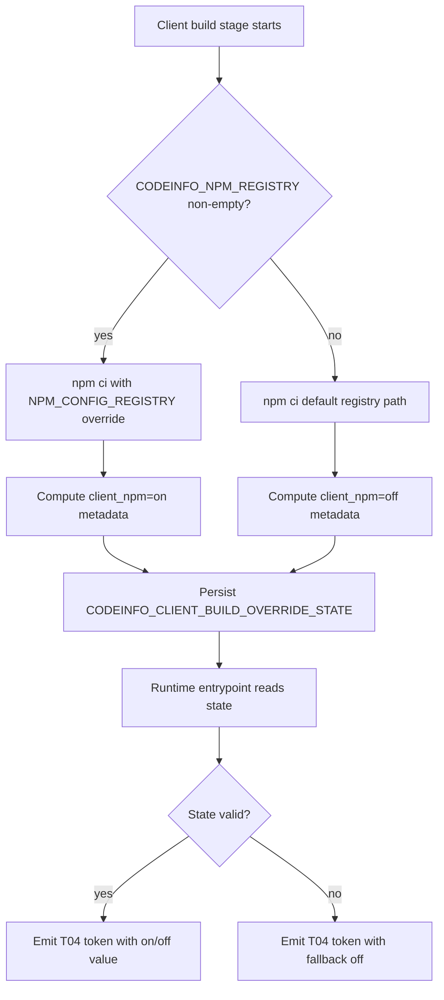
```mermaid
flowchart TD
  A[Client build stage starts] --> B{CODEINFO_NPM_REGISTRY non-empty?}
  B -- yes --> C[npm ci with NPM_CONFIG_REGISTRY override]
  B -- no --> D[npm ci default registry path]
  C --> E[Compute client_npm=on metadata]
  D --> F[Compute client_npm=off metadata]
  E --> G[Persist CODEINFO_CLIENT_BUILD_OVERRIDE_STATE]
  F --> G
  G --> H[Runtime entrypoint reads state]
  H --> I{State valid?}
  I -- yes --> J[Emit T04 token with on/off value]
  I -- no --> K[Emit T04 token with fallback off]
```

## Story 0000041 Task 5 server runtime CA setup defaults

- `server/entrypoint.sh` now normalizes `CODEINFO_REFRESH_CA_CERTS_ON_START` in POSIX shell by trimming surrounding whitespace and lowercasing before boolean evaluation.
- Refresh is requested only when the normalized value equals `true`; any other value maps to `false`.
- Runtime resolves `NODE_EXTRA_CA_CERTS` deterministically:
  - unset/empty `CODEINFO_NODE_EXTRA_CA_CERTS` -> `/etc/ssl/certs/ca-certificates.crt`,
  - non-empty `CODEINFO_NODE_EXTRA_CA_CERTS` -> provided override path.
- Entry point emits `[CODEINFO][T05_NODE_EXTRA_CA_CERTS_RESOLVED]` before Node startup so later refresh/fail-fast logic can consume a stable `refresh_requested` signal.

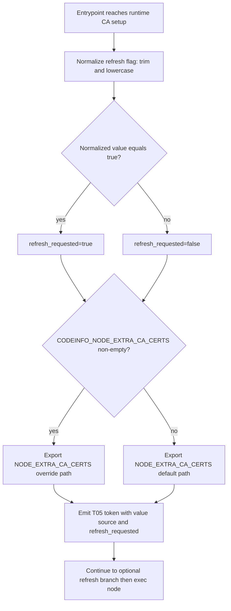
```mermaid
flowchart TD
  A[Entrypoint reaches runtime CA setup] --> B[Normalize refresh flag: trim and lowercase]
  B --> C{Normalized value equals true?}
  C -- yes --> D[refresh_requested=true]
  C -- no --> E[refresh_requested=false]
  D --> F{CODEINFO_NODE_EXTRA_CA_CERTS non-empty?}
  E --> F
  F -- yes --> G[Export NODE_EXTRA_CA_CERTS override path]
  F -- no --> H[Export NODE_EXTRA_CA_CERTS default path]
  G --> I[Emit T05 token with value source and refresh_requested]
  H --> I
  I --> J[Continue to optional refresh branch then exec node]
```

## Story 0000041 Task 6 server runtime CA refresh and fail-fast paths

- Refresh branch now enforces certificate readiness checks before startup when `refresh_requested=true`.
- Refresh-enabled startup requires `/usr/local/share/ca-certificates/codeinfo-corp` to exist and contain readable `*.crt` files; otherwise startup fails fast with non-zero exit and actionable stderr output.
- When prerequisites pass, `update-ca-certificates` executes; command failure is treated as fail-fast.
- Runtime emits `[CODEINFO][T06_CA_REFRESH_RESULT]` for all paths:
  - `result=skipped` when refresh is disabled,
  - `result=success` when refresh runs successfully,
  - `result=failed` on any fail-fast branch.

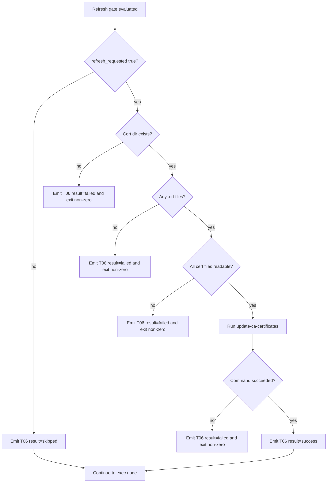
```mermaid
flowchart TD
  A[Refresh gate evaluated] --> B{refresh_requested true?}
  B -- no --> C[Emit T06 result=skipped]
  C --> D[Continue to exec node]
  B -- yes --> E{Cert dir exists?}
  E -- no --> F[Emit T06 result=failed and exit non-zero]
  E -- yes --> G{Any .crt files?}
  G -- no --> H[Emit T06 result=failed and exit non-zero]
  G -- yes --> I{All cert files readable?}
  I -- no --> J[Emit T06 result=failed and exit non-zero]
  I -- yes --> K[Run update-ca-certificates]
  K --> L{Command succeeded?}
  L -- no --> M[Emit T06 result=failed and exit non-zero]
  L -- yes --> N[Emit T06 result=success]
  N --> D
```

## Story 0000041 Task 7 host-helper npm registry override path

- `start-gcf-server.sh` keeps the install anchor command unchanged while adding a conditional registry override path for restricted networks.
- When `CODEINFO_NPM_REGISTRY` is unset/empty, helper startup uses default npm behavior for `git-credential-forwarder` global install.
- When `CODEINFO_NPM_REGISTRY` is set, only the `git-credential-forwarder` install command gets an override via `npm_config_registry`.
- The helper emits deterministic startup state token `[CODEINFO][T07_GCF_INSTALL_REGISTRY_STATE]` before install with `registry_override=off|on`.
- Invalid or unreachable registry values follow npm failure behavior (non-zero) and prevent helper startup from continuing.

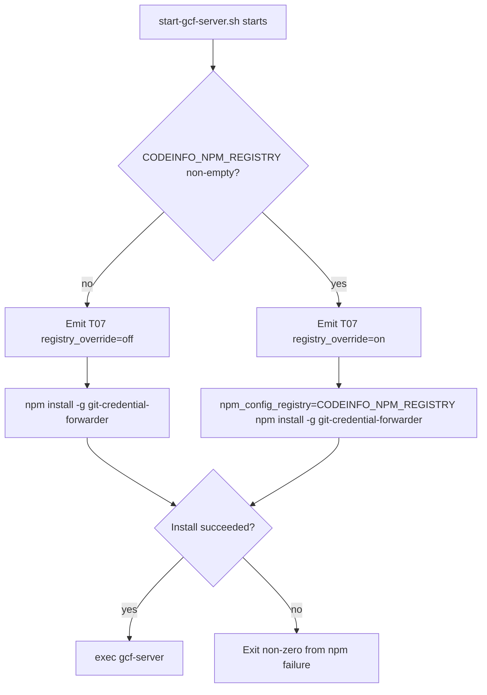
```mermaid
flowchart TD
  A[start-gcf-server.sh starts] --> B{CODEINFO_NPM_REGISTRY non-empty?}
  B -- no --> C[Emit T07 registry_override=off]
  C --> D[npm install -g git-credential-forwarder]
  B -- yes --> E[Emit T07 registry_override=on]
  E --> F[npm_config_registry=CODEINFO_NPM_REGISTRY npm install -g git-credential-forwarder]
  D --> G{Install succeeded?}
  F --> G
  G -- yes --> H[exec gcf-server]
  G -- no --> I[Exit non-zero from npm failure]
```

## Story 0000041 Task 8 documentation parity for corporate override flow

- README now documents the exact restricted-network section placement and six canonical `CODEINFO_*` variables with defaults and usage locations.
- Workflow guidance is explicit and split by interpolation source: `compose`/`compose:local` use `server/.env.local`, while e2e interpolation uses `.env.e2e`.
- Runtime behavior is documented to match implementation: `CODEINFO_REFRESH_CA_CERTS_ON_START` is disabled by default and refresh-enabled startup fails fast on missing/invalid corporate cert inputs.
- Architecture scope remains infra-only for this story: no REST contract, WebSocket shape, or Mongo persistence changes are introduced.

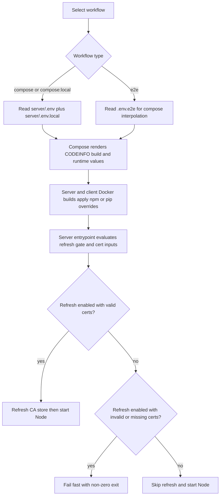
```mermaid
flowchart TD
  A[Select workflow] --> B{Workflow type}
  B -- compose or compose:local --> C[Read server/.env plus server/.env.local]
  B -- e2e --> D[Read .env.e2e for compose interpolation]
  C --> E[Compose renders CODEINFO build and runtime values]
  D --> E
  E --> F[Server and client Docker builds apply npm or pip overrides]
  F --> G[Server entrypoint evaluates refresh gate and cert inputs]
  G --> H{Refresh enabled with valid certs?}
  H -- yes --> I[Refresh CA store then start Node]
  H -- no --> J{Refresh enabled with invalid or missing certs?}
  J -- yes --> K[Fail fast with non-zero exit]
  J -- no --> L[Skip refresh and start Node]
```

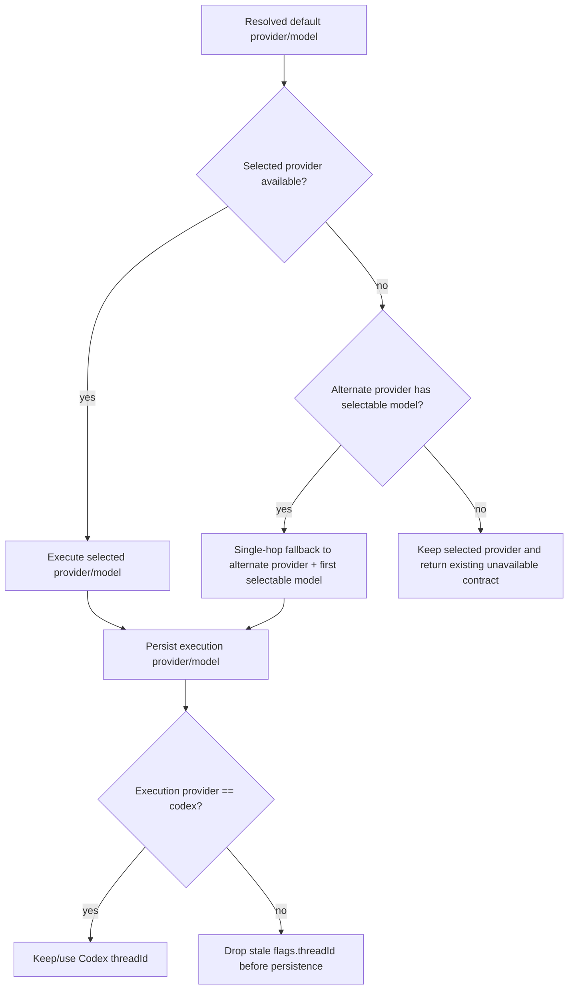
```mermaid
flowchart TD
  R[Resolved default provider/model] --> A{Selected provider available?}
  A -- yes --> S[Execute selected provider/model]
  A -- no --> B{Alternate provider has selectable model?}
  B -- yes --> F[Single-hop fallback to alternate provider + first selectable model]
  B -- no --> U[Keep selected provider and return existing unavailable contract]
  S --> P[Persist execution provider/model]
  F --> P
  P --> T{Execution provider == codex?}
  T -- yes --> K[Keep/use Codex threadId]
  T -- no --> X[Drop stale flags.threadId before persistence]
```

## Embedding flow refactor (Task 1)

## Agents prompts route contract (Story 0000039 Task 1)

- Added `GET /agents/{agentName}/prompts` at the agents commands router boundary.
- Router validates `agentName` and `working_folder` query shape before calling service.
- Error mapping is deterministic:
  - `AGENT_NOT_FOUND` -> `404 { error: 'not_found' }`
  - `WORKING_FOLDER_INVALID|WORKING_FOLDER_NOT_FOUND` -> `400 { error: 'invalid_request', code, message }`
  - unexpected -> `500 { error: 'agent_prompts_failed' }`
- Observability logs are emitted with exact prefixes for request/success/error verification:
  - `[agents.prompts.route.request]`
  - `[agents.prompts.route.success]`
  - `[agents.prompts.route.error]`

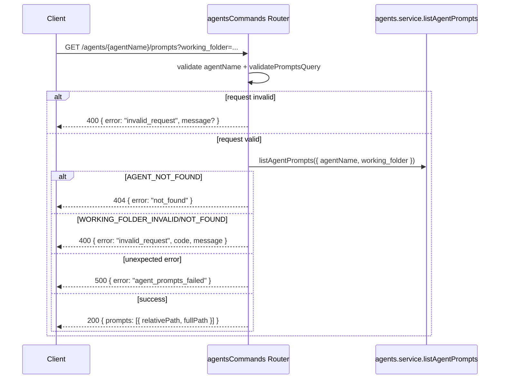
```mermaid
sequenceDiagram
  participant Client
  participant Router as agentsCommands Router
  participant Service as agents.service.listAgentPrompts

  Client->>Router: GET /agents/{agentName}/prompts?working_folder=...
  Router->>Router: validate agentName + validatePromptsQuery
  alt request invalid
    Router-->>Client: 400 { error: "invalid_request", message? }
  else request valid
    Router->>Service: listAgentPrompts({ agentName, working_folder })
    alt AGENT_NOT_FOUND
      Router-->>Client: 404 { error: "not_found" }
    else WORKING_FOLDER_INVALID/NOT_FOUND
      Router-->>Client: 400 { error: "invalid_request", code, message }
    else unexpected error
      Router-->>Client: 500 { error: "agent_prompts_failed" }
    else success
      Router-->>Client: 200 { prompts: [{ relativePath, fullPath }] }
    end
  end
```

## Agents prompts discovery service (Story 0000039 Task 2)

- `listAgentPrompts({ agentName, working_folder })` now performs service-side prompt discovery under the resolved runtime/container working folder.
- Discovery flow:
  - validate agent existence via `discoverAgents()`,
  - resolve/validate `working_folder` via `resolveWorkingFolderWorkingDirectory(...)`,
  - resolve `.github/prompts` with case-insensitive segment matching,
  - recursively walk prompt tree with explicit stack traversal,
  - ignore symlink files/directories, include markdown files only (`.md`, case-insensitive),
  - shape output as `{ relativePath, fullPath }` with `/`-normalized `relativePath` and deterministic sorted order.
- Empty results remain a non-error outcome when prompts directory is missing or contains no markdown files.
- Required discovery observability prefixes are emitted:
  - `[agents.prompts.discovery.start]`
  - `[agents.prompts.discovery.complete]`
  - `[agents.prompts.discovery.empty]`

```mermaid
flowchart TD
  A[listAgentPrompts request] --> B[discoverAgents + resolve agent]
  B --> C[resolveWorkingFolderWorkingDirectory]
  C --> D{resolve .github/prompts<br/>case-insensitive}
  D -- not found --> E[return prompts: [] + discovery.empty]
  D -- found --> F[walk prompts tree recursively]
  F --> G{entry type}
  G -- symlink --> H[ignore]
  G -- directory --> I[push to stack]
  G -- file .md --> J[compute safe relativePath + fullPath]
  G -- other --> K[ignore]
  I --> F
  J --> F
  F --> L{any markdown prompts?}
  L -- no --> E
  L -- yes --> M[sort by relativePath]
  M --> N[return prompts + discovery.complete]
```

## Agents prompts client API contract (Story 0000039 Task 3)

- Added `listAgentPrompts({ agentName, working_folder })` in `client/src/api/agents.ts`.
- Client request contract:
  - `GET /agents/{agentName}/prompts?working_folder=<value>` with `working_folder` encoded via `URLSearchParams`.
  - Uses the shared agents API error parser + `throwAgentApiError(...)` for non-2xx responses.
- Response contract:
  - success shape `{ prompts: Array<{ relativePath, fullPath }> }`.
  - malformed prompt records are ignored by the parser, preserving stable typed output.
- Required client observability prefixes:
  - `[agents.prompts.api.request]`
  - `[agents.prompts.api.success]`
  - `[agents.prompts.api.error]`

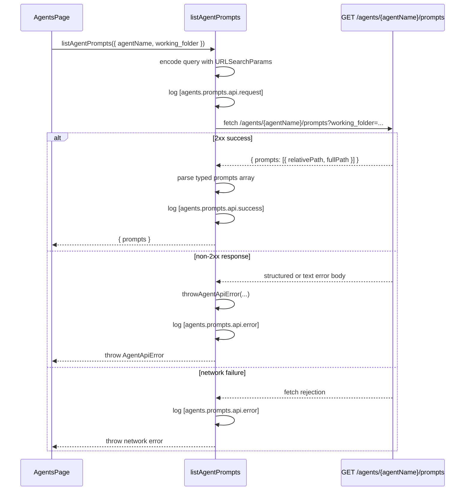
```mermaid
sequenceDiagram
  participant UI as AgentsPage
  participant API as listAgentPrompts
  participant REST as GET /agents/{agentName}/prompts

  UI->>API: listAgentPrompts({ agentName, working_folder })
  API->>API: encode query with URLSearchParams
  API->>API: log [agents.prompts.api.request]
  API->>REST: fetch /agents/{agentName}/prompts?working_folder=...
  alt 2xx success
    REST-->>API: { prompts: [{ relativePath, fullPath }] }
    API->>API: parse typed prompts array
    API->>API: log [agents.prompts.api.success]
    API-->>UI: { prompts }
  else non-2xx response
    REST-->>API: structured or text error body
    API->>API: throwAgentApiError(...)
    API->>API: log [agents.prompts.api.error]
    API-->>UI: throw AgentApiError
  else network failure
    REST-->>API: fetch rejection
    API->>API: log [agents.prompts.api.error]
    API-->>UI: throw network error
  end
```

## Agents command-info popover interaction (Story 0000039 Task 4)

- Added a command-info control in the command row (`AgentsPage`) separate from the existing agent-info popover.
- Interaction model:
  - command-info button is disabled when no command is selected,
  - clicking with no selected command logs `[agents.commandInfo.blocked] reason=no_command_selected`,
  - clicking with a selected command opens the popover and logs `[agents.commandInfo.open] commandName=<selectedCommandName>`.
- Popover content is derived from selected command metadata and reuses MUI `Popover` anchor/open/close lifecycle.
- Legacy inline command description remains in place for Task 4 and is removed later in Task 5.

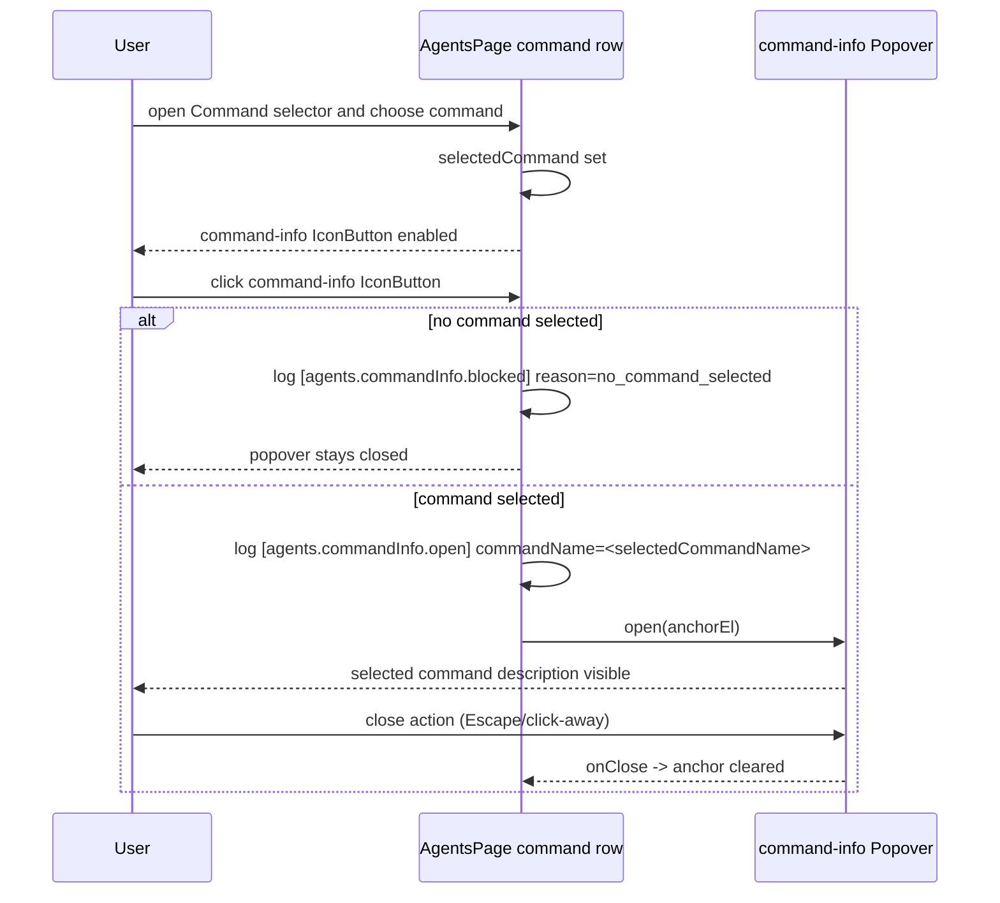
```mermaid
sequenceDiagram
  participant User
  participant UI as AgentsPage command row
  participant Popover as command-info Popover

  User->>UI: open Command selector and choose command
  UI->>UI: selectedCommand set
  UI-->>User: command-info IconButton enabled
  User->>UI: click command-info IconButton
  alt no command selected
    UI->>UI: log [agents.commandInfo.blocked] reason=no_command_selected
    UI-->>User: popover stays closed
  else command selected
    UI->>UI: log [agents.commandInfo.open] commandName=<selectedCommandName>
    UI->>Popover: open(anchorEl)
    Popover-->>User: selected command description visible
    User->>Popover: close action (Escape/click-away)
    Popover-->>UI: onClose -> anchor cleared
  end
```

## Agents command client API contract (Story 0000040 Task 4)

- `client/src/api/agents.ts` contract alignment:
  - `listAgentCommands(agentName)` now requires `stepCount` on every returned command item.
  - Client parsing fails fast with `Invalid agent commands response` when `stepCount` is missing, non-integer, or `< 1`.
  - `runAgentCommand(...)` accepts optional `startStep`; payload includes `startStep` only when supplied by caller.
- Request/response expectations:
  - `GET /agents/:agentName/commands` consumes `{ commands: [{ name, description, disabled, stepCount, sourceId?, sourceLabel? }] }`.
  - `POST /agents/:agentName/commands/run` sends `{ commandName, startStep?, sourceId?, conversationId?, working_folder? }`.
- Required client observability marker:
  - `DEV_0000040_T04_CLIENT_AGENTS_API` emitted on command-run dispatch with `includesStartStep` and selected `startStep` context.

## Agents Start step UI behavior (Story 0000040 Task 5)

- `client/src/pages/AgentsPage.tsx` now renders a labeled `Start step` select directly after the command select in the command row.
- UI state rules are deterministic:
  - before selecting a valid command, `Start step` is disabled and shows `Select command first`;
  - once selected, options are exactly `Step 1..Step N` where `N = stepCount`;
  - command changes reset selection to `Step 1`;
  - when `N = 1`, the control remains visible but disabled on `Step 1`;
  - disabled commands (`disabled: true`, sentinel `stepCount: 1`) keep `Start step` disabled and leave execute blocked.
- Execute wiring now always sends the currently selected numeric `startStep` in `runAgentCommand(...)` payloads.
- Backend `INVALID_START_STEP` errors surface in the existing `agents-run-error` banner without rewriting server range text.
- Required UI observability marker:
  - `DEV_0000040_T05_AGENTS_UI_EXECUTE` emitted once per successful execute click with selected command/source/start-step context.

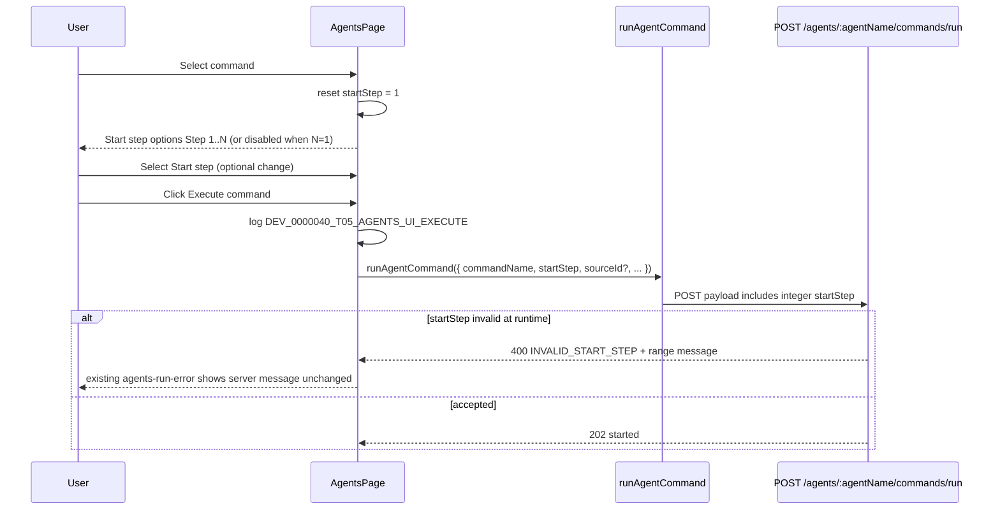
```mermaid
sequenceDiagram
  participant User
  participant UI as AgentsPage
  participant API as runAgentCommand
  participant Route as POST /agents/:agentName/commands/run

  User->>UI: Select command
  UI->>UI: reset startStep = 1
  UI-->>User: Start step options Step 1..N (or disabled when N=1)
  User->>UI: Select Start step (optional change)
  User->>UI: Click Execute command
  UI->>UI: log DEV_0000040_T05_AGENTS_UI_EXECUTE
  UI->>API: runAgentCommand({ commandName, startStep, sourceId?, ... })
  API->>Route: POST payload includes integer startStep
  alt startStep invalid at runtime
    Route-->>UI: 400 INVALID_START_STEP + range message
    UI-->>User: existing agents-run-error shows server message unchanged
  else accepted
    Route-->>UI: 202 started
  end
```

## Shared Codex chat defaults resolver (Story 0000040 Task 6)

- `server/src/config/chatDefaults.ts` now exposes `resolveCodexChatDefaults(...)` so REST and MCP surfaces can consume one deterministic Codex-default pipeline.
- Covered fields: `sandbox_mode`, `approval_policy`, `model_reasoning_effort`, `model`, and `web_search`.
- Precedence for each field is deterministic:
  - request override -> `codex/chat/config.toml` -> legacy env default -> hardcoded safe fallback.
- Legacy env usage emits field-specific warnings naming both field and env source.
- Canonical `web_search` always wins over alias keys; alias bool values normalize to canonical modes (`true -> live`, `false -> disabled`).
- Resolver emits `DEV_0000040_T06_CHAT_DEFAULT_RESOLVER` with per-field source/value and warning count.

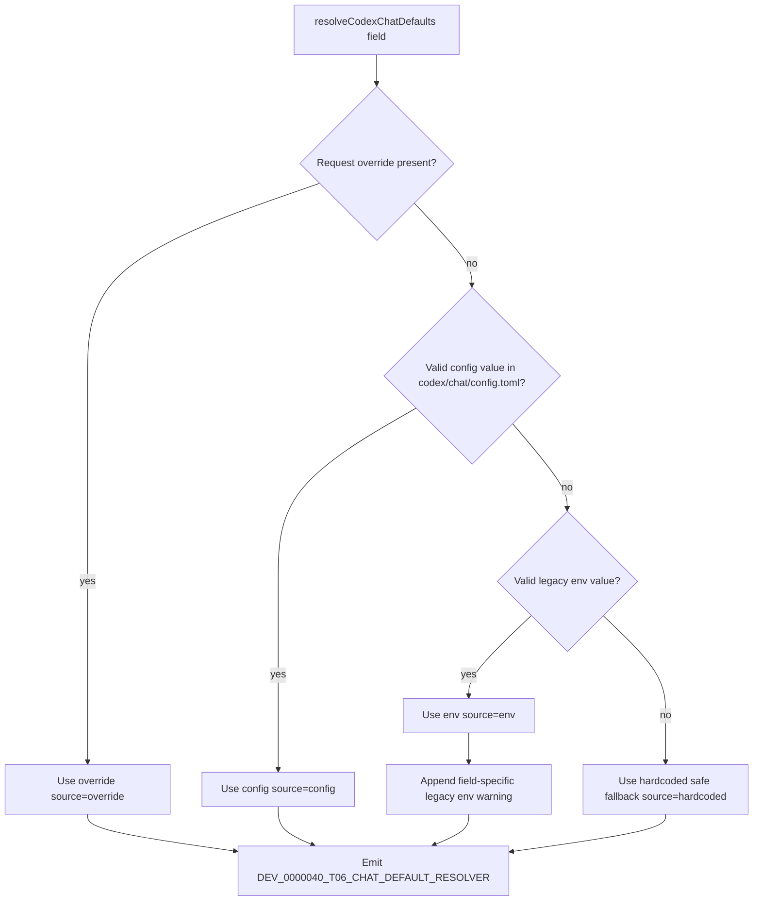
```mermaid
flowchart TD
  A[resolveCodexChatDefaults field] --> B{Request override present?}
  B -- yes --> O[Use override source=override]
  B -- no --> C{Valid config value in codex/chat/config.toml?}
  C -- yes --> G[Use config source=config]
  C -- no --> D{Valid legacy env value?}
  D -- yes --> E[Use env source=env]
  E --> W[Append field-specific legacy env warning]
  D -- no --> F[Use hardcoded safe fallback source=hardcoded]
  O --> Z[Emit DEV_0000040_T06_CHAT_DEFAULT_RESOLVER]
  G --> Z
  W --> Z
  F --> Z
```

## REST and capability surfaces consume shared defaults (Story 0000040 Task 7)

- `server/src/codex/capabilityResolver.ts` now resolves Codex defaults via `resolveCodexChatDefaults(...)` instead of env-only parsing for the covered fields.
- `/chat/models?provider=codex`, `/chat/providers`, and `/chat` validation all consume the same resolver-backed defaults/warnings path through `resolveCodexCapabilities(...)`.
- `/chat/providers` now returns `codexDefaults` and `codexWarnings` alongside ordered provider metadata so REST surfaces expose one consistent default/warning contract.
- Deterministic Task 7 marker is emitted when resolver-backed defaults are applied:
  - `DEV_0000040_T07_REST_DEFAULTS_APPLIED`.

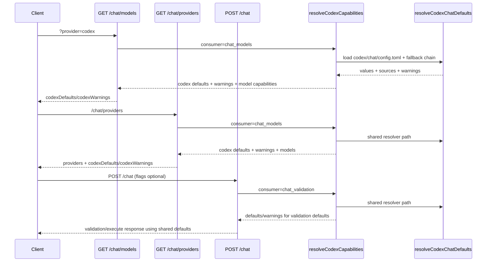
```mermaid
sequenceDiagram
  participant Client
  participant Models as GET /chat/models
  participant Providers as GET /chat/providers
  participant Chat as POST /chat
  participant Caps as resolveCodexCapabilities
  participant Defaults as resolveCodexChatDefaults

  Client->>Models: ?provider=codex
  Models->>Caps: consumer=chat_models
  Caps->>Defaults: load codex/chat/config.toml + fallback chain
  Defaults-->>Caps: values + sources + warnings
  Caps-->>Models: codex defaults + warnings + model capabilities
  Models-->>Client: codexDefaults/codexWarnings

  Client->>Providers: /chat/providers
  Providers->>Caps: consumer=chat_models
  Caps->>Defaults: shared resolver path
  Caps-->>Providers: codex defaults + warnings + models
  Providers-->>Client: providers + codexDefaults/codexWarnings

  Client->>Chat: POST /chat (flags optional)
  Chat->>Caps: consumer=chat_validation
  Caps->>Defaults: shared resolver path
  Caps-->>Chat: defaults/warnings for validation defaults
  Chat-->>Client: validation/execute response using shared defaults
```

## MCP `codebase_question` shared defaults parity (Story 0000040 Task 8)

- `server/src/mcp2/tools/codebaseQuestion.ts` now uses the same shared Codex defaults path used by REST capability/validation surfaces.
- MCP Codex thread-option defaults for `sandboxMode`, `approvalPolicy`, `modelReasoningEffort`, and `webSearchEnabled` are derived from resolver-backed capability defaults instead of env-only parsing.
- Deterministic Task 8 marker is emitted in MCP tool execution flow:
  - `DEV_0000040_T08_MCP_DEFAULTS_APPLIED`.
- Parity tests assert MCP defaults/warnings align with `/chat/models` and `/chat/providers` for identical fixture inputs (including env-fallback scenarios).

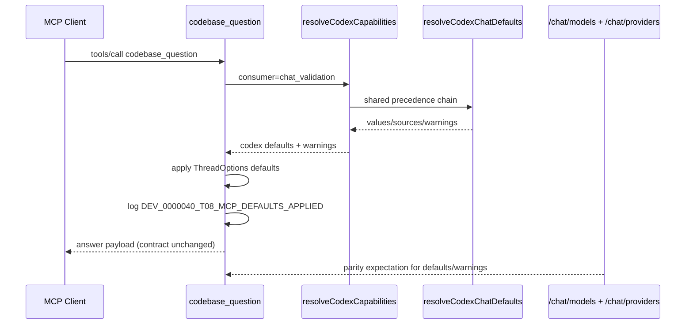
```mermaid
sequenceDiagram
  participant Client as MCP Client
  participant Tool as codebase_question
  participant Caps as resolveCodexCapabilities
  participant Defaults as resolveCodexChatDefaults
  participant Rest as /chat/models + /chat/providers

  Client->>Tool: tools/call codebase_question
  Tool->>Caps: consumer=chat_validation
  Caps->>Defaults: shared precedence chain
  Defaults-->>Caps: values/sources/warnings
  Caps-->>Tool: codex defaults + warnings
  Tool->>Tool: apply ThreadOptions defaults
  Tool->>Tool: log DEV_0000040_T08_MCP_DEFAULTS_APPLIED
  Tool-->>Client: answer payload (contract unchanged)
  Rest-->>Tool: parity expectation for defaults/warnings
```

## Chat runtime bootstrap for missing `codex/chat/config.toml` (Story 0000040 Task 9)

- `server/src/config/runtimeConfig.ts` bootstrap now follows deterministic branch selection:
  - `existing_noop`: chat config already exists, no overwrite.
  - `copied`: chat config missing and base config exists, copy base once.
  - `generated_template`: both chat and base configs missing, generate standard chat template.
- IO/permission failures are not silent. Bootstrap emits deterministic warning markers and rethrows:
  - `chat_stat_failed`, `base_stat_failed`, `chat_dir_create_failed`, `copy_failed`, `template_write_failed`.
- Deterministic Task 9 marker:
  - `DEV_0000040_T09_CHAT_BOOTSTRAP_BRANCH` with branch, paths, and warning metadata.
- Data-safety rule: failed copy/template writes clean up partial destination artifacts so `codex/chat/config.toml` is not left corrupted.

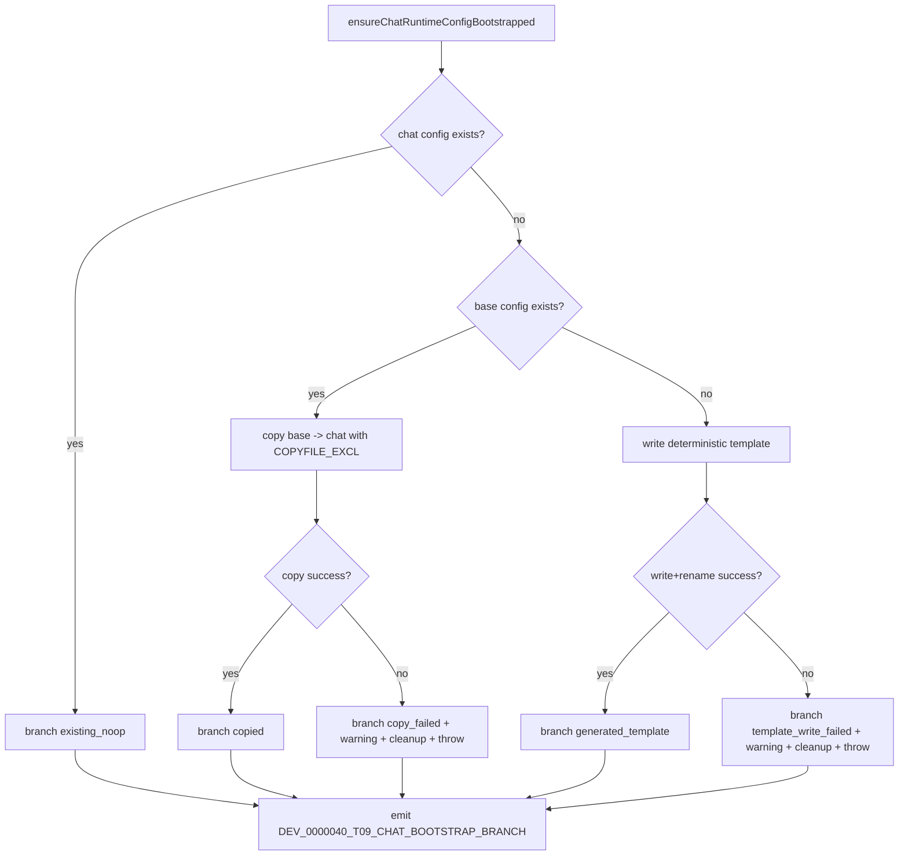
```mermaid
flowchart TD
  A[ensureChatRuntimeConfigBootstrapped] --> B{chat config exists?}
  B -- yes --> C[branch existing_noop]
  B -- no --> D{base config exists?}
  D -- yes --> E[copy base -> chat with COPYFILE_EXCL]
  D -- no --> F[write deterministic template]
  E --> G{copy success?}
  F --> H{write+rename success?}
  G -- yes --> I[branch copied]
  H -- yes --> J[branch generated_template]
  G -- no --> K[branch copy_failed + warning + cleanup + throw]
  H -- no --> L[branch template_write_failed + warning + cleanup + throw]
  C --> M[emit DEV_0000040_T09_CHAT_BOOTSTRAP_BRANCH]
  I --> M
  J --> M
  K --> M
  L --> M
```

## Codex SDK pin and startup guard alignment (Story 0000040 Task 10)

- `server/package.json` pins `@openai/codex-sdk` to `0.107.0`.
- `server/src/config/codexSdkUpgrade.ts` enforces exact stable-version matching:
  - accepted only when installed version is stable semver and exactly `0.107.0`.
  - rejected for missing version, pre-release versions, lower versions, and higher versions.
- Deterministic Task 10 marker:
  - `DEV_0000040_T10_CODEX_SDK_GUARD`
  - payload/log context includes installed version, required version, decision (`accepted`/`rejected`), and reason when rejected.
- `server/src/index.ts` still executes the guard during startup and emits a structured startup log event with the same marker for operational visibility.

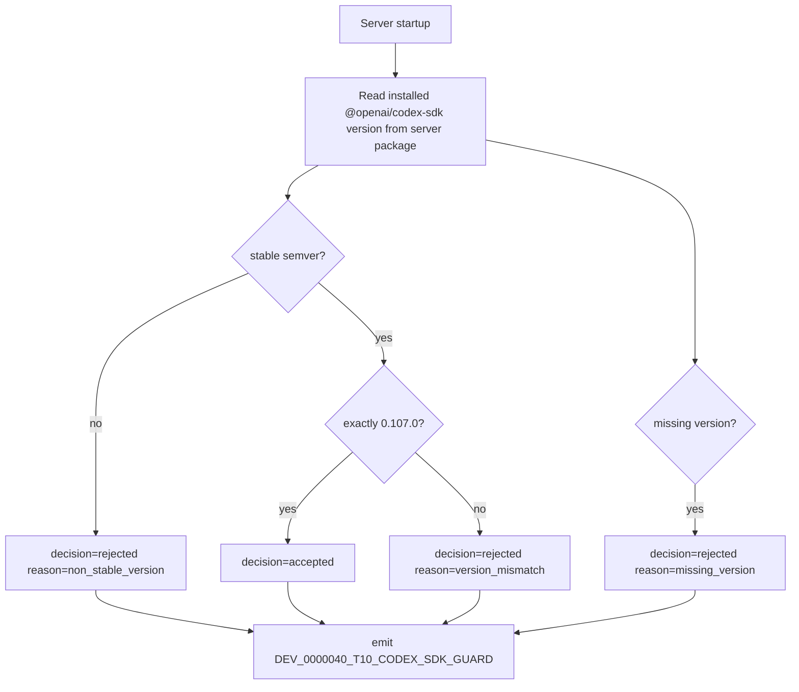
```mermaid
flowchart TD
  A[Server startup] --> B[Read installed @openai/codex-sdk version from server package]
  B --> C{stable semver?}
  C -- no --> D[decision=rejected reason=non_stable_version]
  C -- yes --> E{exactly 0.107.0?}
  E -- yes --> F[decision=accepted]
  E -- no --> G[decision=rejected reason=version_mismatch]
  B --> H{missing version?}
  H -- yes --> I[decision=rejected reason=missing_version]
  D --> J[emit DEV_0000040_T10_CODEX_SDK_GUARD]
  F --> J
  G --> J
  I --> J
```

## Flow command resolution ordering and fail-fast behavior (Story 0000040 Task 11)

- `server/src/flows/service.ts` now resolves flow `command` steps through one shared resolver path used by both:
  - pre-run flow validation (`validateCommandSteps`),
  - runtime command-step execution (`runCommandStep`).
- Candidate source order is deterministic:
  - same-source repository first (flow `sourceId`, or codeInfo2 root for local flows),
  - codeInfo2 repository second,
  - remaining repositories sorted by case-insensitive ASCII on normalized source label, then case-insensitive ASCII full source path.
- Normalized label rules:
  - `sourceLabel.trim()` when non-empty,
  - otherwise `basename(sourceId)` fallback.
- Fallback boundary:
  - continue to next candidate only for command-not-found,
  - stop immediately (no fallback) on same-source schema/read/parse failures and any other non-not-found command-load failure.
- Deterministic marker:
  - `DEV_0000040_T11_FLOW_RESOLUTION_ORDER` logs candidate order and outcome (`selected`, `fail_fast`, `not_found`) with selected source metadata or fail-fast reason.

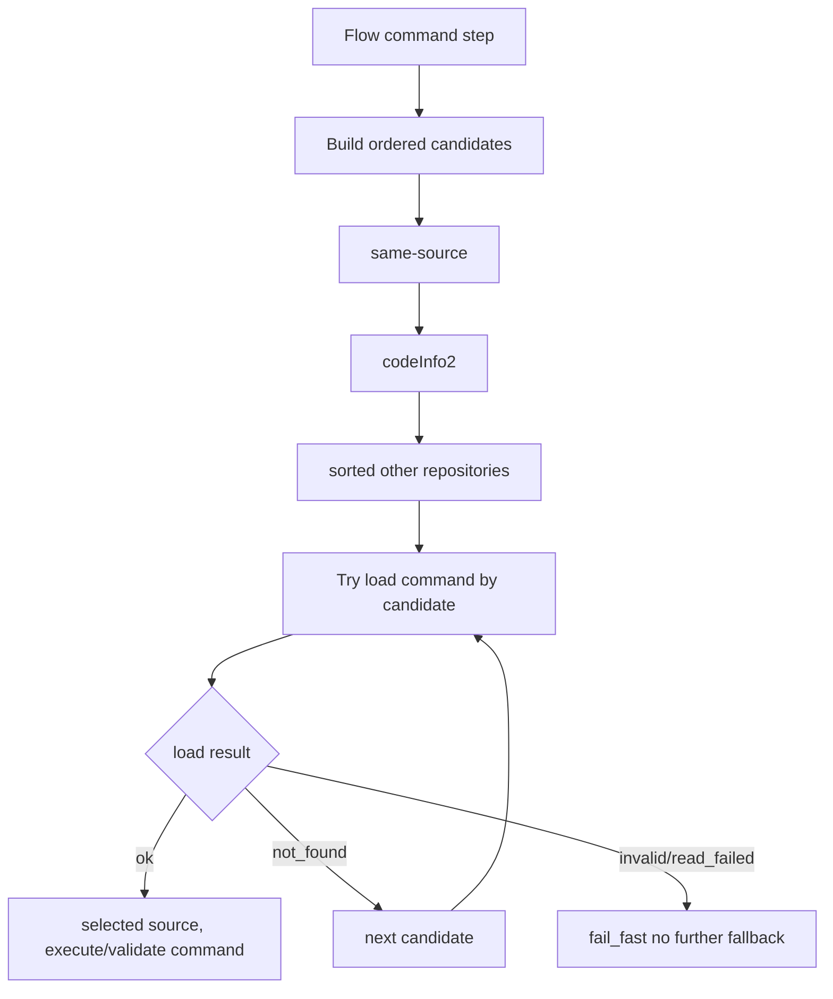
```mermaid
flowchart TD
  A[Flow command step] --> B[Build ordered candidates]
  B --> C[same-source]
  C --> D[codeInfo2]
  D --> E[sorted other repositories]
  E --> F[Try load command by candidate]
  F --> G{load result}
  G -- ok --> H[selected source, execute/validate command]
  G -- not_found --> I[next candidate]
  I --> F
  G -- invalid/read_failed --> J[fail_fast no further fallback]
```

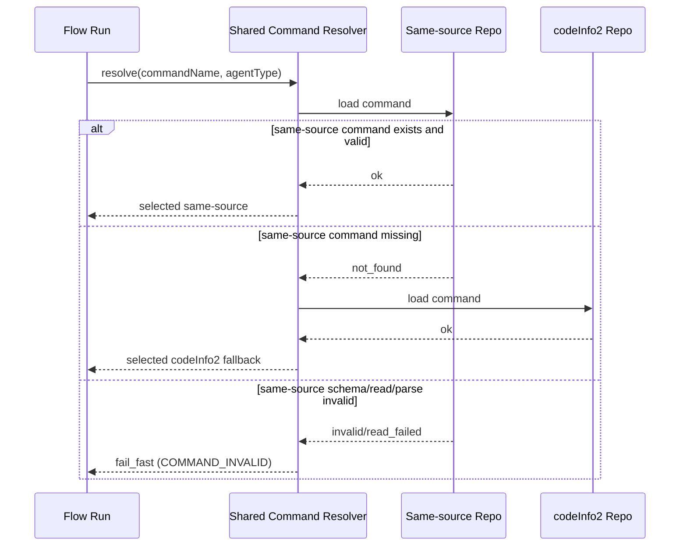
```mermaid
sequenceDiagram
  participant Flow as Flow Run
  participant Resolver as Shared Command Resolver
  participant Same as Same-source Repo
  participant Code as codeInfo2 Repo

  Flow->>Resolver: resolve(commandName, agentType)
  Resolver->>Same: load command
  alt same-source command exists and valid
    Same-->>Resolver: ok
    Resolver-->>Flow: selected same-source
  else same-source command missing
    Same-->>Resolver: not_found
    Resolver->>Code: load command
    Code-->>Resolver: ok
    Resolver-->>Flow: selected codeInfo2 fallback
  else same-source schema/read/parse invalid
    Same-->>Resolver: invalid/read_failed
    Resolver-->>Flow: fail_fast (COMMAND_INVALID)
  end
```

## Story 0000040 Task 12 documentation/contract synchronization checkpoint

- Task 12 is documentation/contract sync only; runtime behavior remains unchanged.
- Final aligned command-run contract references:
  - `GET /agents/:agentName/commands` response includes required `stepCount` (`integer >= 1`) on every item.
  - `POST /agents/:agentName/commands/run` accepts optional `startStep`; omitted values default to step `1` during execution.
  - invalid `startStep` remains deterministic: `400 invalid_request` with `code: INVALID_START_STEP` and range message format `startStep must be between 1 and N`.
- Final aligned flow resolver references:
  - candidate order is same-source -> codeInfo2 -> sorted others,
  - sorted others uses case-insensitive ASCII normalized label then case-insensitive ASCII full path,
  - fallback only on not-found, with fail-fast for same-source schema/read/parse failures.
- Task 12 synchronization marker:
  - `DEV_0000040_T12_DOC_SYNC_COMPLETE` records doc/contract parity completion and expected context includes touched docs (`README.md`, `design.md`, `projectStructure.md`, `openapi.json`) plus status fields for sync verification.

- `server/src/ingest/providers/lmstudioEmbeddingProvider.ts` now centralizes LM Studio-specific embedding/model-discovery operations behind a provider interface consumed by ingest and vector-search paths.
- Ingest path (`server/src/ingest/ingestJob.ts`) now asks the provider for `getModel()` and uses `embedText()` for chunk embeddings, replacing inline LM Studio client calls while preserving vector payload and lock behavior.
- Query path (`server/src/lmstudio/toolService.ts` + `server/src/ingest/chromaClient.ts`) now uses `createLmStudioEmbeddingProvider(...).createEmbeddingFunction()` and resolves the locked embedding function through `getVectorsCollection({ requireEmbedding: true })`, preserving the same `getVectorsCollection(...).query(...)` usage.
- Task 1 does not change REST/MCP response contracts; parity is enforced by parity-focused unit tests and logs.

```mermaid
flowchart LR
  A[Ingest chunk loop] --> B[resolveEmbeddingModel]
  B --> C[provider.getModel(modelKey)]
  C --> D[Provider embedText(text)]
  D --> E[vectors.add]
  F[tools/vector-search] --> G[resolveLockedEmbeddingFunction]
  G --> H[provider.createEmbeddingFunction(modelKey)]
  H --> I[embedding.generate(queryTexts)]
  I --> J[collection.query]
```

```mermaid
flowchart LR
  K[Legacy direct LM Studio calls] --> L[Task 1 adapter calls]
  L --> M[Single LM Studio adapter for ingest/query]
  M --> N[Contracts unchanged]
```

## OpenAI embedding adapter (Task 0000036-T6)

- Added OpenAI embedding execution behind the shared provider interface in `server/src/ingest/providers/`.
- Provider selection is deterministic from model id via `resolveEmbeddingModelSelection(...)`:
  - `openai/<model>` prefix -> OpenAI provider.
  - `lmstudio/<model>` prefix -> LM Studio provider.
  - Unprefixed allowlisted OpenAI ids (`text-embedding-3-small`, `text-embedding-3-large`) -> OpenAI provider.
  - Otherwise -> LM Studio provider.
- Ingest and query paths both use the same provider boundary:
  - Ingest: `ingestJob.ts` resolves provider model and executes `embedText(...)`.
  - Query: `chromaClient.ts` resolves locked model provider and supplies `EmbeddingFunction` for `getVectorsCollection({ requireEmbedding: true })`.
- OpenAI guardrails are enforced before each OpenAI upstream request:
  - max `2048` inputs/request
  - per-input model token limit (`resolveOpenAiModelTokenLimit`)
  - max `300000` total estimated tokens/request.
- Retry behavior uses existing shared retry utility (`runWithRetry`) with OpenAI-specific policy:
  - retries: runtime-configurable via `OPENAI_INGEST_MAX_RETRIES` (retry attempts after the initial call)
  - fallback/default retries: `3` (4 total attempts when fallback is used)
  - base delay `500ms`, max delay `8000ms`
  - jitter range `[0.75, 1.0]`
  - wait-hint precedence: `retry-after-ms` -> `retry-after` -> bounded exponential fallback.
- OpenAI SDK retry ownership is disabled (`maxRetries=0`) and per-call timeout is fixed to `30000ms`.
- OpenAI errors are normalized into deterministic `OPENAI_*` taxonomy with `retryable`, `upstreamStatus`, and optional `retryAfterMs` metadata, with secret-safe message sanitization.
- OpenAI adapter observability logs:
  - `DEV-0000036:T6:openai_embedding_attempt` (`attempt`, `model`, `inputCount`, `tokenEstimate`)
  - `DEV-0000036:T6:openai_embedding_result_mapped` (`status`, `code`, `retryable`, optional `waitMs`).

```mermaid
flowchart TD
  A[Model id selected or locked] --> B[resolveEmbeddingModelSelection]
  B -->|openai| C[createOpenAiEmbeddingProvider]
  B -->|lmstudio| D[createLmStudioEmbeddingProvider]
  C --> E[validateOpenAiEmbeddingGuardrails]
  E --> F[runOpenAiWithRetry]
  F --> G[openai.embeddings.create timeout=30000 maxRetries=0]
  G --> H[validateEmbeddingResponse shape]
  H --> I[return vectors to ingest/query caller]
  D --> J[LM Studio model embed path]
```

```mermaid
flowchart LR
  A1[Retryable OpenAI failure] --> B1{retry-after-ms header?}
  B1 -- yes --> C1[wait = retry-after-ms]
  B1 -- no --> D1{retry-after header?}
  D1 -- yes --> E1[wait = parsed retry-after]
  D1 -- no --> F1[wait = exponential backoff capped at 8000 with jitter 0.75-1.0]
  C1 --> G1[next attempt]
  E1 --> G1
  F1 --> G1
```

```mermaid
flowchart TD
  X[OpenAI error/input] --> Y{status/classification}
  Y -->|401| Z1[OPENAI_AUTH_FAILED retryable=false]
  Y -->|403| Z2[OPENAI_PERMISSION_DENIED retryable=false]
  Y -->|404| Z3[OPENAI_MODEL_UNAVAILABLE retryable=false]
  Y -->|400 + size/token| Z4[OPENAI_INPUT_TOO_LARGE retryable=false]
  Y -->|400 other| Z5[OPENAI_BAD_REQUEST retryable=false]
  Y -->|422| Z6[OPENAI_UNPROCESSABLE retryable=false]
  Y -->|429 quota| Z7[OPENAI_QUOTA_EXCEEDED retryable=false]
  Y -->|429 rate| Z8[OPENAI_RATE_LIMITED retryable=true]
  Y -->|timeout| Z9[OPENAI_TIMEOUT retryable=true]
  Y -->|connection| Z10[OPENAI_CONNECTION_FAILED retryable=true]
  Y -->|>=500 or unknown transient| Z11[OPENAI_UNAVAILABLE retryable=true]
```

## Provider-aware embedding lock lifecycle (Task 0000036-T7)

- Lock identity is now canonical in vector collection metadata as:
  - `embeddingProvider` (`lmstudio` | `openai`)
  - `embeddingModel` (provider model id, unqualified)
  - `embeddingDimensions` (resolved vector length)
  - compatibility alias `lockedModelId` mirrors `embeddingModel`.
- Lock read behavior is deterministic:
  - First try canonical fields (`embeddingProvider` + `embeddingModel` + `embeddingDimensions`).
  - If canonical fields are absent, fallback to legacy `lockedModelId` and infer `embeddingProvider=lmstudio` with unknown dimensions.
  - If canonical fields are partially populated, throw deterministic `INVALID_LOCK_METADATA` (no silent inference).
- Lock write behavior is canonical-only for runtime paths:
  - first successful embedding write persists provider/model/dimensions and alias.
- Re-embed provider/model resolution order:
  - active canonical lock first, then canonical root metadata, then legacy root `model`.
  - provider/model switching away from lock is rejected with `MODEL_LOCKED`.
  - invalid terminal root states (`cancelled`, `error`) are rejected with `INVALID_REEMBED_STATE`.
- Query-time enforcement:
  - REST `/tools/vector-search` and classic MCP `VectorSearch` share `vectorSearch(...)` and use the locked provider/model path.
  - query embedding is generated before Chroma query and validated against `embeddingDimensions`.
  - mismatches return normalized `EMBEDDING_DIMENSION_MISMATCH` before Chroma call.
- Task 7 lock lifecycle logs:
  - `DEV-0000036:T7:embedding_lock_written`
  - `DEV-0000036:T7:embedding_lock_cleared` (with `reason` and cleared id)

```mermaid
flowchart TD
  A[Read vectors metadata] --> B{canonical provider/model/dim present?}
  B -- yes --> C[Use canonical lock]
  B -- no --> D{legacy lockedModelId present?}
  D -- yes --> E[Infer provider=lmstudio, model=lockedModelId]
  D -- no --> F[No lock]
  B -->|partial canonical| G[INVALID_LOCK_METADATA]
```

```mermaid
flowchart LR
  A[vectorSearch request] --> B[resolve locked provider/model]
  B --> C[generate query embedding with locked provider/model]
  C --> D{embedding length == locked embeddingDimensions?}
  D -- no --> E[EMBEDDING_DIMENSION_MISMATCH]
  D -- yes --> F[Chroma queryEmbeddings]
  F --> G[map results]
```

## `/ingest/models` provider-aware warning envelopes (Task 0000036-T8)

- `GET /ingest/models` now returns deterministic `200` envelopes for partial provider failures.
- Response contract is canonical:
  - `models[]` entries include only `id`, `displayName`, and `provider`.
  - `lock` returns canonical lock identity (`embeddingProvider`, `embeddingModel`, `embeddingDimensions`) or `null`.
  - `lockedModelId` remains a compatibility alias and mirrors `lock.embeddingModel` when lock exists.
  - `openai` and `lmstudio` envelopes expose deterministic `status`/`statusCode` plus optional warning metadata.
- OpenAI status machine:
  - `OPENAI_DISABLED` when key is missing/blank/whitespace (no OpenAI list call attempted).
  - `OPENAI_OK` when allowlisted OpenAI models are available.
  - `OPENAI_ALLOWLIST_NO_MATCH` when list succeeds but `allowlist ∩ list` is empty (`retryable=false`).
  - `OPENAI_MODELS_LIST_TEMPORARY_FAILURE`, `OPENAI_MODELS_LIST_AUTH_FAILED`, and `OPENAI_MODELS_LIST_UNAVAILABLE` for mapped list failures.
- LM Studio status machine:
  - `LMSTUDIO_OK` when embedding model list succeeds.
  - `LMSTUDIO_MODELS_LIST_TEMPORARY_FAILURE` or `LMSTUDIO_MODELS_LIST_UNAVAILABLE` when listing fails or base URL is invalid/unreachable.
- Required Task 8 observability logs:
  - `DEV-0000036:T8:ingest_models_response_summary`
  - `DEV-0000036:T8:ingest_models_warning_status` (emitted for OpenAI warning states).

```mermaid
flowchart TD
  A[GET /ingest/models] --> B[Resolve canonical lock]
  B --> C{OPENAI_EMBEDDING_KEY usable?}
  C -- no --> D[openai: OPENAI_DISABLED]
  C -- yes --> E[List OpenAI models]
  E -->|mapped failure| F[openai warning statusCode]
  E -->|success| G[allowlist intersection + deterministic ordering]
  G -->|empty| H[OPENAI_ALLOWLIST_NO_MATCH]
  G -->|non-empty| I[OPENAI_OK]
  B --> J{LMSTUDIO_BASE_URL valid + list ok?}
  J -- yes --> K[LMSTUDIO_OK + lmstudio models]
  J -- no --> L[LMSTUDIO warning envelope]
  D --> M[merge models + lock + envelopes]
  F --> M
  H --> M
  I --> M
  K --> M
  L --> M
  M --> N[HTTP 200 deterministic response]
```

## Ingest Start/Reembed/Vector-Search Contracts (Task 0000036-T9)

- `POST /ingest/start` accepts canonical `embeddingProvider` + `embeddingModel` while still accepting legacy `model`.
- Canonical fields are authoritative when canonical + legacy are both sent; legacy-only input continues to map to LM Studio compatibility behavior.
- Ingest/re-embed OpenAI model validation is deterministic and allowlist-enforced. Non-allowlisted or unavailable models return `OPENAI_MODEL_UNAVAILABLE` with no silent fallback.
- Lock conflicts return canonical lock payloads plus compatibility alias:
  - `lock.embeddingProvider`
  - `lock.embeddingModel`
  - `lock.embeddingDimensions`
  - `lockedModelId` mirrors `lock.embeddingModel`
- Vector-search (REST + classic MCP) now shares one normalized OpenAI error contract:
  - required: `error`, `message`, `retryable`, `provider`
  - optional: `upstreamStatus`, `retryAfterMs`
  - secret-safe message sanitization is enforced before responses/logging.
- Ingest status and roots surfaces retain legacy `lastError` string compatibility while carrying normalized error object metadata.
- Task 9 observability logs:
  - `DEV-0000036:T9:ingest_request_contract_validated`
  - `DEV-0000036:T9:openai_error_contract_mapped`

```mermaid
flowchart TD
  A[POST /ingest/start request] --> B{canonical fields present?}
  B -- yes --> C[validate embeddingProvider + embeddingModel]
  B -- no --> D[map legacy model to lmstudio compatibility]
  C --> E{openai model allowlisted?}
  E -- no --> F[409 OPENAI_MODEL_UNAVAILABLE]
  E -- yes --> G[resolve requested provider/model]
  D --> G
  G --> H{collection locked to different provider/model?}
  H -- yes --> I[409 MODEL_LOCKED with canonical lock + lockedModelId alias]
  H -- no --> J[start ingest with resolved canonical selection]
```

```mermaid
flowchart LR
  A1[OpenAI failure in embedding/query path] --> B1[map via canonical error translator]
  B1 --> C1[secret-safe normalized payload]
  C1 --> D1[REST /tools/vector-search error envelope]
  C1 --> E1[classic MCP VectorSearch error envelope]
  C1 --> F1[ingest status/roots normalized lastError metadata]
```

## Startup env loading parity (Task 3)

- Startup now uses deterministic env precedence that matches compose env-file behavior for unset values: `server/.env` first, then `server/.env.local`.
- Runtime/container-preseeded env vars are preserved and are not clobbered by file loading (for example an externally injected `OPENAI_EMBEDDING_KEY`).
- Env bootstrap is centralized in `server/src/config/startupEnv.ts` and is loaded before logger config resolution so env-driven logger/runtime settings use the same startup precedence.
- Missing `server/.env.local` is a valid state and does not fail startup.
- Startup emits deterministic diagnostic events:
  - `DEV-0000036:T3:env_load_order_applied` with ordered files and whether local override was applied.
  - `DEV-0000036:T3:openai_embedding_capability_state` with `enabled=true|false` only.
- Capability logging is secret-safe: no `OPENAI_EMBEDDING_KEY` value is logged or appended.

```mermaid
flowchart LR
  A[Server boot] --> B[load server/.env]
  B --> C{server/.env.local exists?}
  C -- yes --> D[load server/.env.local with override]
  C -- no --> E[skip local override]
  D --> F[resolve logger/runtime config]
  E --> F
  F --> G[log DEV-0000036:T3:env_load_order_applied]
  G --> H[log DEV-0000036:T3:openai_embedding_capability_state]
```

## MCP keepalive lifecycle (shared helper)

## Shared runtime config loader/bootstrap normalization (Story 0000037 Task 3)

- Added `server/src/config/runtimeConfig.ts` as the canonical read path for Codex runtime TOML across:
  - shared base config: `./codex/config.toml`
  - chat runtime config: `./codex/chat/config.toml`
  - agent runtime config: `codex_agents/<agent>/config.toml` (resolved via `discoverAgents` metadata when `agentName` is provided)
- Read-time normalization is deterministic and canonical-output only:
  - `features.view_image_tool` is accepted as legacy input alias and normalized to `tools.view_image`
  - `features.web_search_request` (and top-level `web_search_request`) are accepted as input aliases and normalized to top-level `web_search` mode
  - canonical keys (`tools.view_image`, `web_search`) win if both canonical and alias keys are present
- Chat runtime bootstrap is copy-once and non-destructive:
  - if `./codex/chat/config.toml` is missing and `./codex/config.toml` exists, copy base to chat once
  - existing chat config is never overwritten
  - no copy occurs when base config is missing
- Deterministic Task 3 logging is emitted from resolver load:
  - success: `[DEV-0000037][T03] event=runtime_config_loaded_and_normalized result=success`
  - error: `[DEV-0000037][T03] event=runtime_config_loaded_and_normalized result=error ...`

```mermaid
flowchart TD
  A[loadRuntimeConfigSnapshot] --> B[Resolve CODEX_HOME via resolveCodexHome]
  B --> C{bootstrapChatConfig enabled?}
  C -- yes --> D[ensureChatRuntimeConfigBootstrapped]
  D --> E{chat missing and base exists?}
  E -- yes --> F[copy base config -> chat config once]
  E -- no --> G[skip copy/no-overwrite]
  C -- no --> H[skip bootstrap]
  F --> I[Read + parse base/chat/agent TOML]
  G --> I
  H --> I
  I --> J[normalize legacy aliases to canonical keys]
  J --> K[emit T03 success log and return snapshot]
  I --> L[emit T03 error log and throw on read/parse failure]
```

```mermaid
sequenceDiagram
  participant Caller as Server caller
  participant Resolver as runtimeConfig.ts
  participant FS as Filesystem
  participant Norm as Normalizer
  Caller->>Resolver: loadRuntimeConfigSnapshot({ agentName|agentConfigPath })
  Resolver->>FS: ensure chat config bootstrap (copy-once)
  FS-->>Resolver: copied | skipped
  Resolver->>FS: read base/chat/agent TOML
  FS-->>Resolver: file contents / ENOENT / parse data
  Resolver->>Norm: normalize aliases (view_image, web_search)
  Norm-->>Resolver: canonical config objects
  Resolver-->>Caller: RuntimeConfigSnapshot + T03 success log
  Note over Resolver,Caller: Any read/parse failure emits deterministic T03 error log and rethrows
```

## Runtime config merge precedence + validation policy (Story 0000037 Task 4)

- Runtime config resolution now performs a deterministic shared-project merge before validation:
  - `effectiveProjects = { ...baseProjects, ...runtimeProjects }`
  - only `[projects]` are inherited from shared base config; behavior keys (`model`, `approval_policy`, `sandbox_mode`, `tools`, etc.) remain runtime-owned.
- Validation is centralized in `server/src/config/runtimeConfig.ts`:
  - unknown keys: warning + ignored (non-fatal)
  - supported keys with invalid types: deterministic hard failure
  - misplaced `cli_auth_credentials_store` under `[projects."<path>"]`: warning + ignored (never promoted)
- Deterministic failure handling is normalized for both agent and chat resolver surfaces via `RuntimeConfigResolutionError`:
  - `RUNTIME_CONFIG_MISSING`
  - `RUNTIME_CONFIG_UNREADABLE`
  - `RUNTIME_CONFIG_INVALID`
  - `RUNTIME_CONFIG_VALIDATION_FAILED`
- Task 4 structured logs are emitted at merge+validate boundaries:
  - success: `[DEV-0000037][T04] event=runtime_config_merged_and_validated result=success`
  - error: `[DEV-0000037][T04] event=runtime_config_merged_and_validated result=error ...`

```mermaid
flowchart TD
  A[Resolve runtime config for agent/chat] --> B[Read shared base config (optional)]
  B --> C[Read runtime config (required)]
  C --> D[Merge projects only: effectiveProjects = base -> runtime precedence]
  D --> E[Validate merged config]
  E --> F{supported key invalid type?}
  F -- yes --> G[Throw deterministic validation failure]
  F -- no --> H{unknown/misplaced key?}
  H -- yes --> I[Warn and ignore key]
  H -- no --> J[Keep canonical key/value]
  I --> K[Emit T04 success log]
  J --> K
  G --> L[Emit T04 error log + throw RuntimeConfigResolutionError]
```

```mermaid
sequenceDiagram
  participant Caller as Agent/Chat config consumer
  participant Resolver as runtimeConfig.ts
  participant Merge as mergeProjectsFromBaseIntoRuntime
  participant Validate as validateRuntimeConfig
  Caller->>Resolver: resolveMergedAndValidatedRuntimeConfig(surface, runtimeConfigPath)
  Resolver->>Resolver: read base(optional) + runtime(required)
  Resolver->>Merge: apply base projects + runtime projects
  Merge-->>Resolver: merged config (behavior keys runtime-owned)
  Resolver->>Validate: validate merged config
  Validate-->>Resolver: sanitized config + warnings OR validation error
  Resolver-->>Caller: success -> config + warnings + T04 success log
  Resolver-->>Caller: failure -> RuntimeConfigResolutionError + T04 error log
```

## Shared runtime resolver entrypoints (Story 0000037 Task 5)

- Runtime entrypoints no longer use model-only parsing helpers for behavior decisions; they resolve execution defaults through one shared helper in `server/src/agents/config.ts`.
- `resolveAgentRuntimeExecutionConfig(...)` wraps `resolveAgentRuntimeConfig(...)` and returns normalized execution data (`runtimeConfig`, optional `modelId`) for both:
  - `agents/service.ts` entrypoints (`startAgentInstruction`, `startAgentCommand`, `runAgentInstructionUnlocked`)
  - `flows/service.ts` entrypoints (`getAgentModelId` path used by flow startup and per-step execution)
- Deterministic Task 5 logs are emitted whenever entrypoints request runtime options via shared resolver:
  - success: `[DEV-0000037][T05] event=shared_runtime_resolver_used_by_entrypoints result=success`
  - error: `[DEV-0000037][T05] event=shared_runtime_resolver_used_by_entrypoints result=error ...`
- Regression safety:
  - agent run path now fails deterministically on invalid supported-key types in agent TOML (instead of silently continuing with model-only parsing);
  - flow run path has the same deterministic failure behavior, ensuring parser-removal parity across surfaces.

```mermaid
flowchart TD
  A[Agent/Flow entrypoint] --> B[resolveAgentRuntimeExecutionConfig]
  B --> C[resolveAgentRuntimeConfig from runtimeConfig.ts]
  C --> D[merge+validate runtime config]
  D --> E{valid?}
  E -- yes --> F[return modelId/runtimeConfig + emit T05 success log]
  E -- no --> G[throw deterministic runtime config error + emit T05 error log]
```

```mermaid
sequenceDiagram
  participant AgentSvc as agents/service.ts
  participant FlowSvc as flows/service.ts
  participant EntryHelper as agents/config.ts helper
  participant Runtime as runtimeConfig.ts

  AgentSvc->>EntryHelper: resolveAgentRuntimeExecutionConfig(configPath)
  FlowSvc->>EntryHelper: resolveAgentRuntimeExecutionConfig(configPath)
  EntryHelper->>Runtime: resolveAgentRuntimeConfig(agentConfigPath)
  Runtime-->>EntryHelper: config OR RuntimeConfigResolutionError
  EntryHelper-->>AgentSvc: modelId/runtimeConfig + T05 success OR throw + T05 error
  EntryHelper-->>FlowSvc: modelId/runtimeConfig + T05 success OR throw + T05 error
```

## REST runtime overrides on chat/run/commands (Story 0000037 Task 6)

- REST execution surfaces now pass resolver-owned runtime config through `CodexOptions.config` while keeping shared-home semantics:
  - `/chat` resolves chat runtime config (`./codex/chat/config.toml`) and passes merged runtime payload into Codex construction.
  - `/agents/:agentName/run` resolves named-agent runtime config and passes it into run flags as `runtimeConfig` (no per-agent `codexHome` override).
  - `/agents/:agentName/commands/run` reuses the same unlocked run path and runtime-config source as `/run`.
- `ChatInterfaceCodex` and related option plumbing accept optional runtime config payloads without breaking previous call signatures.
- All updated run starts keep `useConfigDefaults: true`; runtime config now owns behavior keys while only project inheritance comes from shared base merge rules.
- Deterministic Task 6 logs are emitted when runtime overrides are applied to REST paths:
  - success: `[DEV-0000037][T06] event=runtime_overrides_applied_rest_paths result=success`
  - error: `[DEV-0000037][T06] event=runtime_overrides_applied_rest_paths result=error ...`

```mermaid
flowchart TD
  A[REST request] --> B{Surface}
  B -- /chat --> C[resolveChatRuntimeConfig]
  B -- /agents/:agentName/run --> D[resolveAgentRuntimeExecutionConfig]
  B -- /agents/:agentName/commands/run --> E[runAgentInstructionUnlocked -> resolveAgentRuntimeExecutionConfig]
  C --> F[buildCodexOptions CODEX_HOME + config]
  D --> G[chat.run flags: runtimeConfig + useConfigDefaults=true]
  E --> G
  F --> H[Emit T06 success log]
  G --> H
  C --> I[Resolver failure -> T06 error + deterministic response]
  D --> I
  E --> I
```

```mermaid
sequenceDiagram
  participant ChatRoute as routes/chat.ts
  participant AgentSvc as agents/service.ts
  participant ChatIface as ChatInterfaceCodex
  participant Resolver as runtimeConfig resolver
  participant CodexSDK as Codex SDK

  ChatRoute->>Resolver: resolveChatRuntimeConfig()
  Resolver-->>ChatRoute: runtimeConfig or deterministic error
  ChatRoute->>ChatIface: chat.run(..., runtimeConfig)
  ChatIface->>CodexSDK: new Codex(buildCodexOptions({config}))
  CodexSDK-->>ChatIface: run stream
  ChatIface-->>ChatRoute: events

  AgentSvc->>Resolver: resolveAgentRuntimeExecutionConfig(agentConfigPath)
  Resolver-->>AgentSvc: runtimeConfig/modelId or deterministic error
  AgentSvc->>ChatIface: chat.run(..., runtimeConfig, useConfigDefaults=true)
  ChatIface->>CodexSDK: thread start/resume with shared CODEX_HOME
  CodexSDK-->>AgentSvc: run stream
```

## Flow + MCP runtime overrides parity (Story 0000037 Task 7)

- Flow and MCP execution paths now consume the same runtime-config resolver semantics as REST run surfaces:
  - Flow step execution resolves the named agent runtime config and passes it to `chat.run(..., { runtimeConfig, useConfigDefaults: true })`.
  - Flow no longer passes per-agent `codexHome` overrides; shared `CODEX_HOME` semantics apply via shared Codex options.
  - Flow Codex availability checks now use shared-home detection (`detectCodexForHome(getCodexHome())`) instead of agent-home checks.
  - Agents MCP tool execution already delegates to `agents/service.ts`; MCP-triggered runs therefore share the same runtime resolver, `useConfigDefaults: true`, and shared-home behavior as REST run.
- Deterministic Task 7 logs are emitted when flow/MCP runtime overrides are applied:
  - success: `[DEV-0000037][T07] event=runtime_overrides_applied_flow_mcp result=success`
  - error: `[DEV-0000037][T07] event=runtime_overrides_applied_flow_mcp result=error ...`

```mermaid
flowchart TD
  A[Invocation surface] --> B{Surface}
  B -- REST /agents/run --> C[agents/service resolveAgentRuntimeExecutionConfig]
  B -- REST /agents/commands/run --> C
  B -- Agents MCP run_agent_instruction/run_command --> C
  B -- Flow step execution --> D[flows/service resolveAgentRuntimeExecutionConfig]
  C --> E[chat.run with runtimeConfig + useConfigDefaults=true]
  D --> E
  E --> F[shared CODEX_HOME execution semantics]
```

```mermaid
sequenceDiagram
  participant FlowSvc as flows/service.ts
  participant AgentSvc as agents/service.ts
  participant Resolver as resolveAgentRuntimeExecutionConfig
  participant ChatIface as ChatInterfaceCodex

  FlowSvc->>Resolver: resolve(agentConfigPath)
  Resolver-->>FlowSvc: runtimeConfig/modelId or deterministic error
  FlowSvc->>ChatIface: run(..., runtimeConfig, useConfigDefaults=true)

  AgentSvc->>Resolver: resolve(agentConfigPath)
  Resolver-->>AgentSvc: runtimeConfig/modelId or deterministic error
  AgentSvc->>ChatIface: run(..., runtimeConfig, useConfigDefaults=true, source='MCP'|'REST')
```

- MCP keepalive lifecycle is centralized in `server/src/mcpCommon/keepAlive.ts` and reused by classic `POST /mcp`, MCP v2 (`server/src/mcp2/router.ts`), and Agents MCP (`server/src/mcpAgents/router.ts`).
- Keepalive is scoped to long-running `tools/call` only. Non-tool requests (`initialize`, `tools/list`, parse/invalid request) return normal JSON-RPC payloads without keepalive preamble bytes.
- Helper behavior is deterministic: `start` writes initial whitespace and heartbeat whitespace bytes, then `stop` clears timers on `sendJson`, response `finish`/`close`, or write failure to avoid write-after-close errors.

```mermaid
flowchart LR
  Req[JSON-RPC request] --> Check{method == tools/call?}
  Check -- no --> Json[Return JSON response]
  Check -- yes --> Start[keepAlive.start]
  Start --> Flush[Write initial whitespace]
  Flush --> Beat[Heartbeat interval writes whitespace]
  Beat --> Dispatch[Dispatch tool handler]
  Dispatch --> Final[keepAlive.sendJson]
  Final --> Stop[keepAlive.stop + clear timer]
```

```mermaid
flowchart TD
  A[tools/call route] --> B[createKeepAliveController]
  B --> C[mcp2 router]
  B --> D[mcpAgents router]
  B --> E[classic /mcp router]
  C --> F[shared lifecycle + logs]
  D --> F
  E --> F
```

## Reingest repository service (canonical validation + mapping)

- Shared service `server/src/ingest/reingestService.ts` defines canonical validation and mapping for `reingest_repository` before MCP surface wiring.
- Validation is strict and field-level for `sourceId`: missing, non-string, empty, non-absolute, non-normalized, ambiguous path forms, and unknown roots are rejected.
- Reingest is existing-root-only: known roots are derived from `listIngestedRepositories()` container paths and must match exactly after POSIX normalization.
- Run-start behavior reuses existing ingest semantics (`isBusy()` + `reembed(...)`), then blocks on `waitForTerminalIngestStatus(...)` and maps outcomes to canonical contracts:
  - invalid params -> JSON-RPC error `-32602` / `INVALID_PARAMS`
  - unknown root -> JSON-RPC error `404` / `NOT_FOUND`
  - busy -> JSON-RPC error `429` / `BUSY`
- Once the run has started, results are terminal-only and summary-only:
  - `status`: `completed` | `cancelled` | `error`
  - `operation`: `reembed`
  - `runId`, `sourceId`, `durationMs`, `files`, `chunks`, `embedded`, `errorCode`
  - no top-level `message` field.
- Internal terminal mapping:
  - internal `completed` -> external `completed`
  - internal `skipped` -> external `completed`
  - internal `cancelled` -> external `cancelled` with last-known counters
  - internal `error` -> external `error` with non-null `errorCode`
  - missing status after start -> terminal `error` (`RUN_STATUS_MISSING`)
  - wait timeout -> terminal `error` (`WAIT_TIMEOUT`)
- Validation/result logs are emitted with stable tags for manual verification:
  - `DEV-0000035:T5:reingest_validation_evaluated`
  - `DEV-0000035:T5:reingest_validation_result`
  - `[DEV-0000038][T4] REINGEST_BLOCKING_WAIT_STARTED sourceId=<id> runId=<id>`
  - `[DEV-0000038][T4] REINGEST_TERMINAL_RESULT status=<completed|cancelled|error> runId=<id> errorCode=<code|null>`

```mermaid
flowchart TD
  A[reingest_repository args] --> B{sourceId valid?}
  B -- no --> E1[-32602 INVALID_PARAMS\\nerror.data INVALID_SOURCE_ID]
  B -- yes --> C{known ingested root exact match?}
  C -- no --> E2[404 NOT_FOUND\\nerror.data unknown_root + retry lists]
  C -- yes --> D{ingest lock held?}
  D -- yes --> E3[429 BUSY\\nerror.data BUSY + retry lists]
  D -- no --> F[reembed(sourceId)]
  F --> G[waitForTerminalIngestStatus(runId)]
  G --> H{terminal state observed?}
  H -- completed/skipped --> I[terminal payload\\nstatus completed + required fields]
  H -- cancelled --> J[terminal payload\\nstatus cancelled + last-known counters]
  H -- error --> K[terminal payload\\nstatus error + non-null errorCode]
  H -- timeout --> L[terminal payload\\nstatus error + errorCode WAIT_TIMEOUT]
  H -- missing --> M[terminal payload\\nstatus error + errorCode RUN_STATUS_MISSING]
```

## Classic MCP reingest wiring

- Classic MCP (`POST /mcp`) now exposes `reingest_repository` in `tools/list` and routes `tools/call` to the shared `runReingestRepository(...)` service.
- Success path stays in the classic wrapper (`result.content[0].text` JSON string), with one terminal payload returned after blocking wait.
- Protocol boundary remains explicit:
  - pre-run validation failures return JSON-RPC `error` envelopes.
  - post-start outcomes return terminal result payloads (`completed|cancelled|error`) in `result.content[0].text`.
- Classic-MCP-specific manual-verification logs use:
  - `DEV-0000035:T6:classic_reingest_tool_call_evaluated`
  - `DEV-0000035:T6:classic_reingest_tool_call_result`

```mermaid
sequenceDiagram
  participant Client as MCP client
  participant Classic as POST /mcp (classic)
  participant Service as runReingestRepository

  Client->>Classic: initialize
  Classic-->>Client: jsonrpc result (capabilities)
  Client->>Classic: tools/list
  Classic-->>Client: includes reingest_repository
  Client->>Classic: tools/call(reingest_repository, {sourceId})
  Classic->>Service: runReingestRepository(args)
  alt pre-run validation failure
    Service-->>Classic: {code,message,data}
    Classic-->>Client: jsonrpc error(code,message,data)
  else run started and wait reaches terminal
    Service-->>Classic: {status,operation,runId,sourceId,durationMs,files,chunks,embedded,errorCode}
    Classic-->>Client: jsonrpc result.content[0].text(JSON)
  end
```

## Story 0000038 Task 1: race-safe cancel_inflight and conversation-authoritative stop

- `cancel_inflight` accepts `conversationId` with optional `inflightId`.
- The WS handler always attempts command-run abort by `conversationId` when cancel is received.
- `INFLIGHT_NOT_FOUND` is preserved only when a non-empty `inflightId` is provided and does not match active inflight state.
- Conversation-only cancel does not emit chat mismatch `turn_final` failures.

```mermaid
sequenceDiagram
  participant UI as Client
  participant WS as WS /ws
  participant IR as Inflight Registry
  participant CR as Commands Runner
  participant Stream as Chat Stream

  UI->>WS: cancel_inflight(conversationId, inflightId?)
  WS->>WS: log [DEV-0000038][T1] CANCEL_INFLIGHT_RECEIVED
  WS->>CR: abortAgentCommandRun(conversationId)
  WS->>WS: log [DEV-0000038][T1] ABORT_AGENT_RUN_REQUESTED

  alt inflightId omitted
    WS-->>UI: no INFLIGHT_NOT_FOUND turn_final
  else inflightId provided
    WS->>IR: abortInflight(conversationId, inflightId)
    alt inflight matches
      IR-->>Stream: abort signal
      Stream-->>UI: terminal stopped or failed from stream lifecycle
    else inflight mismatch or missing
      WS-->>UI: turn_final failed (INFLIGHT_NOT_FOUND)
    end
  end
```

## Story 0000043 Task 1: websocket stop contract with explicit no-op acknowledgement

- `cancel_inflight` remains the client stop message and still requires `conversationId` while keeping `inflightId` optional.
- Explicit `{ conversationId, inflightId }` requests keep the existing invalid-target failure behavior when the inflight id does not match the active run.
- Conversation-only `{ conversationId }` requests first try the legacy command-run abort path, then abort the current inflight run when one exists, and only emit `cancel_ack { result: 'noop' }` when there is no active run for that conversation.
- `cancel_ack` is non-terminal and request-correlated; successful active cancellations still complete through the existing `turn_final.status === 'stopped'` path.

```mermaid
sequenceDiagram
  participant UI as Client
  participant WS as WebSocket /ws
  participant CR as Commands Runner
  participant IR as Inflight Registry
  participant Run as Active Run

  UI->>WS: cancel_inflight(conversationId, inflightId?)
  WS->>WS: validate request and log receipt

  alt inflightId provided
    WS->>IR: abortInflight(conversationId, inflightId)
    alt explicit target matches active run
      IR-->>Run: abort signal
      Run-->>UI: turn_final(status=stopped)
    else explicit target missing or stale
      WS-->>UI: turn_final(status=failed, error.code=INFLIGHT_NOT_FOUND)
    end
  else inflightId omitted
    WS->>CR: abortAgentCommandRun(conversationId)
    alt active command run found
      CR-->>Run: abort signal
      Run-->>UI: existing terminal stop path
    else no active command run
      WS->>IR: abortInflightByConversation(conversationId)
      alt active inflight run found
        IR-->>Run: abort signal
        Run-->>UI: turn_final(status=stopped)
      else no active run
        WS-->>UI: cancel_ack(requestId, conversationId, result=noop)
      end
    end
  end
```

## Story 0000043 Task 2: active-run ownership lives in the conversation lock

- The conversation lock now owns lightweight runtime metadata rather than bare set membership.
- Each successful lock acquisition creates a fresh `runToken` and `startedAt` timestamp for the one active run on that conversation.
- Ownership remains runtime-only and is not persisted or published over websocket.
- Lock release can optionally verify an expected `runToken` so a stale cleanup path does not clear a newer replacement run.

```mermaid
flowchart TD
  A[tryAcquireConversationLock conversationId] --> B{Lock already held?}
  B -- yes --> C[Return false and keep current ownership]
  B -- no --> D[Create runToken with crypto.randomUUID]
  D --> E[Store startedAt timestamp]
  E --> F[Return lock acquired]
  F --> G[Active run executes with ownership metadata]
  G --> H{releaseConversationLock called}
  H --> I{expectedRunToken provided?}
  I -- no --> J[Clear ownership and unlock conversation]
  I -- yes --> K{expectedRunToken matches active runToken?}
  K -- yes --> J
  K -- no --> L[Keep newer ownership intact and return false]
```

## Story 0000043 Task 3: pending-cancel state is runtime-only and token-bound

- Pending cancel now lives in the shared inflight registry as runtime-only conversation state, not in a second registry.
- Each pending-cancel entry binds to the active `runToken`, may later bind to that run's `inflightId`, and can only be consumed once by the matching run.
- No-active-run paths keep the registry empty, and cleanup paths clear matching pending-cancel state so stale startup-race stop requests cannot leak into a replacement run.
- Shared cleanup callers may clear pending state independently of lock release success so cleanup failures do not strand stop ownership.

```mermaid
flowchart TD
  A[Stop accepted for active conversation runToken] --> B[Register pending cancel with requestedAt]
  B --> C{InflightId known yet?}
  C -- no --> D[Wait for run to create or expose inflightId]
  C -- yes --> E[Bind pending cancel to inflightId]
  D --> E
  E --> F{Matching runToken consumes pending cancel?}
  F -- yes --> G[Return single pending cancel payload and delete entry]
  F -- no --> H[Keep entry until matching run or cleanup]
  G --> I[Run finalization and shared cleanup]
  H --> I
  I --> J[Clear matching pending cancel on cleanup or no-op]
  J --> K[Replacement run starts without inheriting stale cancel]
```

## Story 0000043 Task 4: chat stop reuses shared ownership and cleanup

- Chat start keeps the existing `202 started` route contract, but the runtime now captures the active `runToken` and re-checks pending cancel after inflight creation and again before provider execution starts.
- Chat execution passes the shared inflight `AbortSignal` into provider-capable paths and pre-checks that signal before `execute(...)` begins meaningful work, so a startup-race stop can still finish as `turn_final.status === 'stopped'`.
- Chat route finalization is now the single runtime cleanup path for chat: it falls back to one stopped or failed terminal outcome when the provider never emits a terminal event, then clears inflight state, pending-cancel state, and the conversation lock in a fixed order.
- Same-conversation reuse depends on that cleanup path completing, so duplicate stops and cleanup-failure fallback must never leak lock ownership or pending cancel into the next chat run.

```mermaid
sequenceDiagram
  participant UI as Client
  participant Route as POST /chat
  participant IR as Inflight Registry
  participant Chat as ChatInterface.run
  participant Bridge as Chat Stream Bridge
  participant Provider as Provider Runtime

  UI->>Route: start chat
  Route->>Route: acquire conversation lock and runToken
  Route->>IR: createInflight(conversationId, inflightId)
  Route->>IR: consume pending cancel for runToken if present
  Route-->>UI: 202 started with inflightId
  Route->>Bridge: attach stream bridge
  Route->>Chat: run(... signal, deferInflightCleanup=true)
  Chat->>Chat: signal.throwIfAborted()
  alt startup-race stop already won
    Chat-->>Route: abort before provider work
    Route->>Bridge: finalize fallback status=stopped
  else provider work proceeds
    Chat->>Provider: execute with AbortSignal
    alt stop arrives during provider work
      Provider-->>Bridge: error(aborted)
      Bridge-->>UI: turn_final(status=stopped)
    else normal completion
      Provider-->>Bridge: complete/final events
      Bridge-->>UI: turn_final(status=ok)
    end
  end
  Route->>IR: cleanupInflight(conversationId, inflightId)
  Route->>IR: cleanup pending cancel for runToken
  Route->>Route: releaseConversationLock(conversationId, runToken)
  Note over UI,Route: Same conversation is reusable after terminal stop cleanup finishes
```

## Story 0000043 Task 5: normal agent runs finalize stop through shared runtime cleanup

- Normal agent instruction runs now hold the conversation `runToken` until their own finalization path completes instead of releasing the conversation lock outside the runtime cleanup path.
- Conversation-only stop without a usable client `inflightId` can now bind to the active normal run by registering a token-bound pending cancel when the run owns the conversation but has not published an inflight target yet.
- `runAgentInstructionUnlocked(...)` now re-checks pending cancel immediately after inflight creation and again before `chat.run(...)` begins useful work, passes the inflight `AbortSignal` into the agent runtime, and falls back to one stopped or failed terminal outcome if the provider path never emits its own terminal event.
- The same finalization path clears inflight state, pending-cancel state, and active lock ownership in order, including a direct-cleanup fallback if the primary cleanup callback throws, so same-conversation reuse happens after confirmed stop instead of leaving a stale `RUN_IN_PROGRESS`.

```mermaid
sequenceDiagram
  participant UI as Client
  participant Route as startAgentInstruction
  participant WS as cancel_inflight
  participant Lock as runLock
  participant Runtime as runAgentInstructionUnlocked
  participant IR as inflightRegistry
  participant Agent as ChatInterface.run

  UI->>Route: POST /agents/:agentName/run
  Route->>Lock: tryAcquireConversationLock(conversationId)
  Lock-->>Route: runToken
  Route-->>UI: 202 started { conversationId, inflightId }
  par startup-race stop
    UI->>WS: cancel_inflight { conversationId }
    WS->>Lock: getActiveRunOwnership(conversationId)
    WS->>IR: registerPendingConversationCancel(runToken)
  and runtime start
    Route->>Runtime: runAgentInstructionUnlocked(..., runToken)
    Runtime->>IR: createInflight(conversationId, inflightId)
    Runtime->>IR: bind and consume pending cancel
    Runtime->>IR: abortInflight(conversationId, inflightId)
    Runtime->>Agent: chat.run(... signal)
  end
  alt stop won
    Agent-->>Runtime: abort/error path
    Runtime-->>UI: turn_final(status=stopped)
  else normal completion
    Agent-->>Runtime: final/complete events
    Runtime-->>UI: turn_final(status=ok)
  end
  Runtime->>IR: cleanupInflight(conversationId, inflightId)
  Runtime->>IR: cleanupPendingConversationCancel(runToken, inflightId)
  Runtime->>Lock: releaseConversationLock(conversationId, runToken)
  Note over UI,Route: Same conversation can start again after stop cleanup completes
```

## Story 0000043 Task 6: command runs stop at step and retry checkpoints

- Command-list execution now carries the active conversation `runToken` into `runAgentCommandRunner(...)` so startup-race conversation-only stop can register a token-bound pending cancel before the command-run abort-controller map exists.
- The command runner consumes pending cancel immediately after it creates the per-conversation abort controller, re-checks stop before the first step and before each later step, and re-checks again before retry or backoff waits can resume work.
- The existing conversation-based `abortAgentCommandRun(conversationId)` path remains the live stop mechanism once a command run is active, so command starts still work without a client-visible `inflightId`.
- Command-run cleanup now releases pending-cancel state and the conversation lock with the expected `runToken`, which prevents stale stop or stale cleanup from affecting a replacement run on the same conversation.

```mermaid
flowchart TD
  A[Command route owns conversation lock] --> B[Resolve runToken]
  B --> C[Create command abort controller and combined AbortSignal]
  C --> D{Pending cancel registered for runToken?}
  D -- yes --> E[Consume pending cancel and abort controller]
  D -- no --> F[Enter command step loop]
  E --> Z[Skip step execution and cleanup runtime state]
  F --> G{Signal aborted before step?}
  G -- yes --> Z
  G -- no --> H[Start next command step]
  H --> I{Retry needed?}
  I -- no --> J[Advance to next step]
  I -- yes --> K{Signal aborted before backoff wait?}
  K -- yes --> Z
  K -- no --> L[Sleep with abort-aware retry signal]
  L --> M{Signal aborted during wait?}
  M -- yes --> Z
  M -- no --> H
  J --> G
  Z --> N[Delete command abort controller]
  N --> O[cleanupPendingConversationCancel(conversationId, runToken)]
  O --> P[releaseConversationLock(conversationId, runToken)]
```

## Story 0000043 Task 7: flow runs stop at step, loop, and nested handoff boundaries

- `startFlowRun(...)` now captures the active conversation `runToken` immediately after the flow lock is acquired, keeps that ownership through the background flow execution, and clears pending-cancel plus lock ownership from the same final runtime cleanup path.
- `runFlowInstruction(...)` now binds and consumes token-bound pending cancel immediately after inflight creation, passes the shared inflight `AbortSignal` into `chat.run(...)` with deferred inflight cleanup, and falls back to direct cleanup if the primary flow cleanup callback throws.
- Flow command steps now have a pre-handoff stop checkpoint: if a pending cancel exists before nested command item execution begins, the flow emits one stopped terminal turn for the command step and never launches the nested agent work.
- Loop and multi-step continuation still stop cooperatively through the current inflight signal, but later iterations and follow-on command items do not continue after a stopped terminal outcome has been confirmed.

```mermaid
flowchart TD
  A[Flow route acquires conversation lock] --> B[Capture runToken]
  B --> C[Background flow execution starts]
  C --> D{Next flow step}
  D --> E[Create step inflight]
  E --> F[Bind and consume pending cancel for runToken]
  F --> G{Pending cancel consumed?}
  G -- yes --> H[Abort inflight and finalize step as stopped]
  G -- no --> I{Step is command handoff?}
  I -- yes --> J{Pending cancel before nested handoff?}
  J -- yes --> K[Emit stopped command step without launching nested agent]
  J -- no --> L[Launch nested command item agent run with inflight AbortSignal]
  I -- no --> M[Run LLM or break step with inflight AbortSignal]
  L --> N{Stopped or failed?}
  M --> N
  H --> N
  K --> N
  N -- yes --> O[Persist resume state for last completed step only]
  O --> P[Cleanup inflight with direct fallback if callback throws]
  P --> Q[Clear pending cancel for runToken]
  Q --> R[Release conversation lock with runToken]
  N -- no --> S[Persist completed step and advance to next step or loop iteration]
  S --> D
```

## Story 0000043 Task 8: shared websocket client stop acknowledgement handling

- Page code keeps using `cancelInflight(conversationId, inflightId?)`; omitting `inflightId` remains the supported startup-race stop path.
- `useChatWs` now surfaces `cancel_ack` through the existing shared websocket event union so downstream subscribers can correlate the no-op branch by `requestId`.
- The websocket hook emits stable browser `console.info` lines for the stop send path and the `cancel_ack` receive path without changing the shared stop-state machine yet.
- Successful active stops are still confirmed later by `turn_final.status === 'stopped'`; `cancel_ack.result === 'noop'` only represents the no-active-run recovery branch.

```mermaid
sequenceDiagram
  participant Page as Page code
  participant Hook as useChatWs
  participant WS as WebSocket /ws
  participant Stream as Shared stream consumers

  Page->>Hook: cancelInflight(conversationId, inflightId?)
  Hook->>WS: cancel_inflight(requestId, conversationId, inflightId?)
  Hook->>Page: console.info ws-send

  alt no active run for conversation
    WS-->>Hook: cancel_ack(requestId, conversationId, result=noop)
    Hook->>Page: console.info ws-event cancel_ack
    Hook-->>Stream: forward cancel_ack
  else active run stops later
    WS-->>Hook: turn_final(status=stopped)
    Hook-->>Stream: forward turn_final
  end
```

## Story 0000043 Task 9: shared stop-state reconciliation lives in useChatStream

- `useChatStream` is now the single shared stop-state manager: it distinguishes `sending`, `stopping`, and final `stopped` state without adding a second client stop coordinator.
- Calling the shared stop path no longer appends the immediate local `Generation stopped` bubble; the hook enters `stopping` and waits for either `turn_final.status === 'stopped'` or a request-correlated `cancel_ack.result === 'noop'`.
- `cancel_ack` remains limited to no-op recovery, where it clears `stopping` only when the `requestId` matches the active stop attempt.
- Late invalid-target failures, stale acks, duplicate finals, and reconnect-style inflight hydration must not invent a local terminal state or reopen a finalized run.

```mermaid
flowchart TD
  A[running or sending] --> B[stop called]
  B --> C[status = stopping]
  C --> D{Next matching server event}
  D -- turn_final status=stopped --> E[streamStatus = stopped]
  E --> F[status = idle]
  D -- cancel_ack result=noop and requestId matches --> G[clear optimistic stop state]
  G --> F
  D -- turn_final status=failed invalid target or stale event --> H[preserve active run or ignore stale transition]
  H --> C
  D -- duplicate final or stale cancel_ack --> I[ignore]
  I --> C
```

## Story 0000043 Task 10: Chat page stop UX now mirrors shared stop reconciliation

- `ChatPage` now sends `cancelInflight(conversationId, inflightId?)` using the current server-visible inflight id when one exists and omits `inflightId` during the startup race instead of blocking the stop request locally.
- The page renders `Stopping` while the shared hook is waiting for server reconciliation and renders persisted or live `Turn.status === 'stopped'` as a visible `Stopped` chip rather than falling back to `Processing`.
- Browser-visible markers are page-scoped and deterministic: Chat emits one `stop-clicked`, one `stopping-visible`, and one `stopped-visible` line for the exercised active-stop path.

```mermaid
flowchart TD
  A[User clicks Chat Stop] --> B[ChatPage sends cancelInflight conversationId inflightId?]
  B --> C[useChatStream enters stopping]
  C --> D[ChatPage renders Stopping state]
  D --> E{Next matching server event}
  E -- cancel_ack result=noop --> F[Clear stopping without stopped bubble]
  F --> G[Chat controls return to ready state]
  E -- turn_final status=stopped --> H[Assistant turn streamStatus becomes stopped]
  H --> I[ChatPage renders Stopped chip and stopped-visible log]
```

## Story 0000043 Task 11: Agents page uses the same stop contract for instruction and command runs

- `AgentsPage` now applies the same page-layer stop rules to both normal instruction runs and command-list runs: stop always sends `conversationId` and includes `inflightId` only when a server-visible inflight id is already known.
- Persisted stopped turns now stay visibly `Stopped` after reload, and non-user resets or conversation changes clear page-local stop markers without inventing phantom `stopping` state.
- Browser-visible markers include `runKind` so manual verification can distinguish the instruction and command paths while still using the same shared stop-state machine underneath.

```mermaid
flowchart TD
  A[User clicks Agents Stop] --> B[AgentsPage sends cancelInflight conversationId inflightId? runKind]
  B --> C[useChatStream enters stopping]
  C --> D[AgentsPage renders Stopping state]
  D --> E{Next matching server event}
  E -- cancel_ack result=noop --> F[Clear stopping and keep transcript non-terminal]
  E -- turn_final status=stopped --> G[Render Stopped transcript state]
  G --> H[Same conversation can run again]
```

## Story 0000043 Task 12: Flows page stop UX follows the shared stop contract

- `FlowsPage` now uses the same page-layer stop pattern as Chat and Agents: the stop button sends `cancelInflight(conversationId, inflightId?)` with the current server-visible inflight id when known and conversation-only cancel during the startup race.
- Non-user reset and navigation paths no longer call the shared `stop()` helper, so switching flow selection, clearing hidden conversations, or remounting the page does not create phantom `stopping` UI.
- Persisted `Turn.status === 'stopped'` now hydrates into a visible `Stopped` chip instead of collapsing into `Complete`, and live flow stop requests render `Stopping` until the shared hook reconciles either a no-op `cancel_ack.result === 'noop'` or a real `turn_final.status === 'stopped'`.
- The page emits stable browser debug markers for stop click, visible stopping, and visible stopped state so the dockerized manual verification can assert the page-level stop contract directly.

```mermaid
flowchart TD
  A[User clicks Flow Stop] --> B[FlowsPage sends cancelInflight conversationId inflightId?]
  B --> C[useChatStream enters stopping]
  C --> D[FlowsPage shows Stopping button state and warning chip]
  D --> E{Next matching server event}
  E -- cancel_ack result=noop --> F[Clear stopping state without stopped bubble]
  F --> G[Run and Stop controls return to ready]
  E -- turn_final status=stopped --> H[Assistant turn streamStatus becomes stopped]
  H --> I[FlowsPage renders Stopped chip and stopped-visible log]
  I --> J[Same conversation can run again]
```

## Story 0000043 Task 13: final stop lifecycle summary

- The shipped contract is now consistent across Chat, Agents, command runs, and Flows:
  - stop always targets the active conversation;
  - `inflightId` is optional and is only sent when the page knows the current server-visible inflight id;
  - conversation-only startup-race stop is valid;
  - `cancel_ack.result === 'noop'` is request-correlated and non-terminal;
  - a real stop is confirmed only by `turn_final.status === 'stopped'`.
- Runtime ownership is server-authoritative: the conversation lock owns the active `runToken`, the inflight registry owns token-bound pending-cancel state, and cleanup clears inflight state, pending cancel, and lock ownership in that order so same-conversation reuse works immediately after a confirmed stop.
- Client state is shared and page-specific only at the rendering layer: `useChatWs` handles websocket send or receive transport, `useChatStream` owns `stopping` plus no-op reconciliation, and Chat, Agents, and Flows render the visible `Stopping` or `Stopped` states plus page-scoped debug markers.

```mermaid
sequenceDiagram
  participant User as User
  participant Page as Chat | Agents | Flows page
  participant Stream as useChatStream
  participant WS as useChatWs / WebSocket
  participant Server as stop contract + runtime ownership

  User->>Page: click Stop
  Page->>WS: cancelInflight(conversationId, inflightId?)
  Page->>Page: console.info stop-clicked
  WS->>Server: cancel_inflight(requestId, conversationId, inflightId?)
  Stream->>Stream: streamStatus = stopping
  Page->>Page: console.info stopping-visible

  alt no active run
    Server-->>WS: cancel_ack(requestId, conversationId, result=noop)
    WS->>Page: console.info ws-event cancel_ack
    WS-->>Stream: cancel_ack
    Stream->>Stream: clear stopping when requestId matches
  else active run confirmed stopped
    Server-->>WS: turn_final(status=stopped)
    WS-->>Stream: turn_final
    Stream->>Stream: streamStatus = stopped
    Page->>Page: console.info stopped-visible
  end
```

## Story 0000038 Task 5: ingest listing status/phase normalization and active overlay precedence

- External listing status contract for `/ingest/roots` and classic MCP `ListIngestedRepositories` is now normalized from internal ingest states:
  - `queued|scanning|embedding -> status=ingesting` with matching `phase`.
  - `completed|cancelled|error -> status` with `phase` omitted.
  - `skipped -> status=completed`.
- Shared listing schema version is `0000038-status-phase-v1`.
- Active overlay precedence is explicit:
  - active runtime fields (`status`, optional `phase`, `counts`, active `runId`) override persisted listing state while the run is active;
  - persisted metadata (`lastIngestAt`, lock/model fields, last terminal error context) remains intact unless replaced by a newer terminal write.
- Synthesized active-entry fallback keeps repos visible when persisted metadata is temporarily missing; synthesized entries still include identity/path fields and mapped host path/warning fields from `mapIngestPath`.
- Listing instrumentation now emits:
  - `[DEV-0000038][T5] INGEST_LIST_STATUS_MAPPED sourceId=<id> internal=<state> status=<status> phase=<phase|none>`
  - `[DEV-0000038][T5] INGEST_ACTIVE_OVERLAY_APPLIED sourceId=<id> synthesized=<true|false>`

```mermaid
flowchart TD
  A[Persisted root metadata state] --> B{Internal state}
  B -- queued/scanning/embedding --> C[status=ingesting + phase]
  B -- completed/cancelled/error --> D[status matches terminal + no phase]
  B -- skipped --> E[status=completed + no phase]
  C --> F[Base listing entry]
  D --> F
  E --> F
  G[Active runtime context] --> H{Matching persisted entry exists?}
  H -- yes --> I[Overlay runtime fields only]
  H -- no --> J[Synthesize entry from active context + mapIngestPath]
  I --> K[Emit listing entry]
  J --> K
```

```mermaid
flowchart LR
  R[/ingest/roots] --> N[Shared state normalization]
  M[ListIngestedRepositories] --> N
  N --> V[schemaVersion=0000038-status-phase-v1]
  N --> L[Task 5 mapping/overlay logs]
```

## Story 0000038 Task 6: reembed no-change early return before AST and embedding

- Reembed delta control flow now makes the no-change decision before any AST parse/index writes and before embedding loops.
- No-change (`added=0`, `changed=0`, `deleted=0`) exits immediately with terminal `completed` status and a no-change message.
- Deletions-only (`deleted>0`, no added/changed work files) performs deletion cleanup and then exits immediately with terminal `completed` status.
- Changed delta paths emit deterministic delta-path logs and continue through normal AST/embedding work.
- Cancellation near the no-change boundary is race-safe: only one terminal state is retained.
- Task 6 logs:
  - `[DEV-0000038][T6] REEMBED_NO_CHANGE_EARLY_RETURN sourceId=<id> runId=<id>`
  - `[DEV-0000038][T6] REEMBED_DELTA_PATH deltaAdded=<n> deltaModified=<n> deltaDeleted=<n>`

```mermaid
flowchart TD
  A[reembed delta plan built] --> B{added+changed+deleted == 0?}
  B -- yes --> C[Log REEMBED_NO_CHANGE_EARLY_RETURN]
  C --> D[Write terminal completed metadata]
  D --> E[Return before AST parse and embedding]
  B -- no --> F[Log REEMBED_DELTA_PATH]
  F --> G{deletions-only?}
  G -- yes --> H[Delete vectors/index rows and complete]
  H --> I[Return before AST parse and embedding]
  G -- no --> J[Proceed with AST parse and embedding loop]
```

```mermaid
sequenceDiagram
  participant R as Reembed Run
  participant C as Cancel
  participant S as Status Store

  R->>S: non-terminal run status
  par no-change branch
    R->>R: evaluate early-return boundary
  and cancel branch
    C->>S: request cancel
  end
  alt cancel observed first
    S-->>R: terminal cancelled retained
  else no-change observed first
    R->>S: terminal completed retained
  end
```

## Story 0000038 Task 7: ingest UI external status/phase consumption and visibility

- Client ingest roots normalization now consumes the external listing contract directly:
  - `status`: `ingesting | completed | cancelled | error`
  - `phase`: optional and only retained when `status=ingesting`.
- Terminal rows (`completed|cancelled|error`) explicitly omit phase in the normalized client model and UI rendering.
- Ingest table rows remain visible for active entries and render `ingesting (<phase>)` when phase is present.
- Task 7 console markers for manual Playwright checks:
  - `[DEV-0000038][T7] INGEST_UI_ROW_RENDER sourceId=<id> status=<status> phase=<phase|none>`
  - `[DEV-0000038][T7] INGEST_UI_TERMINAL_PHASE_HIDDEN sourceId=<id> status=<completed|cancelled|error>`

```mermaid
flowchart TD
  A[/ingest/roots payload] --> B[useIngestRoots normalization]
  B --> C{status}
  C -- ingesting --> D[retain phase queued|scanning|embedding]
  C -- completed/cancelled/error --> E[phase undefined]
  D --> F[RootsTable status label ingesting (phase)]
  E --> G[RootsTable terminal status only]
```

```mermaid
sequenceDiagram
  participant API as /ingest/roots
  participant Hook as useIngestRoots
  participant Table as RootsTable
  API-->>Hook: roots[] + schemaVersion
  Hook-->>Table: normalized rows status/phase
  loop visible rows
    Table->>Table: render status chip text
    Table->>Console: [DEV-0000038][T7] INGEST_UI_ROW_RENDER
    alt terminal row
      Table->>Console: [DEV-0000038][T7] INGEST_UI_TERMINAL_PHASE_HIDDEN
    end
  end
```

## Story 0000038 Task 8: final documentation cross-check for stop, blocking reingest, and status mapping

- Final stop handling semantics (Tasks 1-3):
  - `cancel_inflight` is conversation-authoritative on the server side.
  - stop requests still trigger command-abort-by-conversation when inflight-id lookup misses.
  - Agents UI keeps input editable and sidebar navigation available while runs are active, while submit/execute actions remain disabled.
- Final reingest semantics (Task 4):
  - both MCP surfaces are blocking and return a single terminal summary payload (`completed|cancelled|error`).
  - pre-run validation failures remain JSON-RPC protocol error envelopes.
  - post-start terminal outcomes return result payloads, not protocol errors.
- Final ingest listing semantics (Tasks 5-7):
  - external status contract is `ingesting|completed|cancelled|error`.
  - `phase` is retained only for `status=ingesting`; terminal statuses omit phase.
  - `schemaVersion` for listing compatibility is `0000038-status-phase-v1`.

```mermaid
flowchart TD
  A[Stop clicked in Agents UI] --> B[WS cancel_inflight sent with conversationId]
  B --> C{Inflight id found?}
  C -- yes --> D[Abort inflight stream]
  C -- no --> E[Record inflight-not-found branch]
  D --> F[Always abort command run by conversationId]
  E --> F
  F --> G[No new command retries/steps]
```

```mermaid
flowchart LR
  A[reingest_repository request] --> B{Pre-run validation fails?}
  B -- yes --> C[JSON-RPC error envelope]
  B -- no --> D[Start run + block until terminal]
  D --> E{Terminal state}
  E -- completed --> F[Terminal summary result]
  E -- cancelled --> F
  E -- error --> F
```

## Manual QA Log Markers (DEV-0000038)

| Task | Exact marker text                                                                                        | Expected manual outcome                                                   |
| ---- | -------------------------------------------------------------------------------------------------------- | ------------------------------------------------------------------------- | --------------------------------------------------------------- | ------------------------------------------ | ------------------------------------------------- | --- | ---- | ------------------------------------------------------------ |
| T1   | `[DEV-0000038][T1] CANCEL_INFLIGHT_RECEIVED conversationId=<id> inflightId=<id                           | none>`                                                                    | Emitted when WS cancel handler receives stop request.           |
| T1   | `[DEV-0000038][T1] ABORT_AGENT_RUN_REQUESTED conversationId=<id>`                                        | Emitted when conversation-authoritative command abort is requested.       |
| T2   | `[DEV-0000038][T2] STOP_CLICK conversationId=<id> inflightId=<id                                         | none>`                                                                    | Emitted in Agents UI on Stop click.                             |
| T2   | `[DEV-0000038][T2] CANCEL_INFLIGHT_SENT conversationId=<id> inflightId=<id                               | none>`                                                                    | Emitted after UI dispatches cancel frame.                       |
| T3   | `[DEV-0000038][T3] AGENTS_INPUT_EDITABLE_WHILE_ACTIVE runActive=true`                                    | Confirms draft input remains editable while run is active.                |
| T3   | `[DEV-0000038][T3] AGENTS_CONVERSATION_SWITCH_ALLOWED from=<id> to=<id>`                                 | Confirms sidebar conversation switch remains enabled while run is active. |
| T4   | `[DEV-0000038][T4] REINGEST_BLOCKING_WAIT_STARTED sourceId=<id> runId=<id>`                              | Emitted when blocking wait begins for reingest run.                       |
| T4   | `[DEV-0000038][T4] REINGEST_TERMINAL_RESULT status=<completed                                            | cancelled                                                                 | error> runId=<id> errorCode=<code                               | null>`                                     | Emitted exactly once per terminal result payload. |
| T5   | `[DEV-0000038][T5] INGEST_LIST_STATUS_MAPPED sourceId=<id> internal=<state> status=<status> phase=<phase | none>`                                                                    | Confirms internal->external status/phase mapping for listings.  |
| T5   | `[DEV-0000038][T5] INGEST_ACTIVE_OVERLAY_APPLIED sourceId=<id> synthesized=<true                         | false>`                                                                   | Confirms active overlay application and synthesized-entry path. |
| T6   | `[DEV-0000038][T6] REEMBED_NO_CHANGE_EARLY_RETURN sourceId=<id> runId=<id>`                              | Confirms no-change path exits before AST/embedding work.                  |
| T6   | `[DEV-0000038][T6] REEMBED_DELTA_PATH deltaAdded=<n> deltaModified=<n> deltaDeleted=<n>`                 | Confirms changed-delta path execution.                                    |
| T7   | `[DEV-0000038][T7] INGEST_UI_ROW_RENDER sourceId=<id> status=<status> phase=<phase                       | none>`                                                                    | Confirms per-row ingest UI rendering contract.                  |
| T7   | `[DEV-0000038][T7] INGEST_UI_TERMINAL_PHASE_HIDDEN sourceId=<id> status=<completed                       | cancelled                                                                 | error>`                                                         | Confirms terminal rows hide phase details. |
| T8   | `[DEV-0000038][T8] DOC_LOG_REFERENCE_VALIDATED marker=<T1                                                | T2                                                                        | T3                                                              | T4                                         | T5                                                | T6  | T7>` | Evidence line recorded during documentation validation pass. |

### Marker Debug Gating (Task 11)

- High-volume Task 5/7 marker families are now gated and are disabled by default in normal runtime paths.
- Server marker gate for `[DEV-0000038][T5]`:
  - Set `DEV_0000038_MARKERS=true` to emit Task 5 marker logs from `/ingest/roots` and classic listing mapping paths.
- Client marker gate for `[DEV-0000038][T2]`, `[DEV-0000038][T3]`, `[DEV-0000038][T7]`:
  - Enable via any one of:
    - `VITE_DEV_0000038_MARKERS=true` at build/start time.
    - `window.__codeinfoDebug = { dev0000038Markers: true }` in browser console.
    - `localStorage.setItem('codeinfo.dev0000038.markers', 'true')` then reload.
- Functional behavior must remain unchanged regardless of gate state; markers are observability-only.

## Flows (schema)

- Flow definitions live under `flows/<flowName>.json` and are validated with a strict Zod schema before use.
- Top-level shape: `{ description?: string, steps: FlowStep[] }` with optional `label` fields for UI display.
- Supported step types:
  - `startLoop`: `{ type, label?, steps: FlowStep[] }` (steps must be non-empty).
  - `llm`: `{ type, label?, agentType, identifier, messages: { role: 'user', content: string[] }[] }` or `{ type, label?, agentType, identifier, markdownFile }`.
  - `break`: `{ type, label?, agentType, identifier, question, breakOn: 'yes' | 'no' }`.
  - `command`: `{ type, label?, agentType, identifier, commandName }`.
  - `reingest`: `{ type, label?, sourceId }`.
- All objects are `.strict()` and use trimmed non-empty strings; unknown keys or empty/whitespace-only values fail validation.
- Story 45 schema rules for new flow shapes:
  - `llm` must contain exactly one instruction source: `messages` or `markdownFile`.
  - `llm` with both sources, or with neither source, fails validation.
  - `markdownFile` must be a trimmed non-empty string at schema time.
  - `reingest` is schema-valid with `sourceId` plus optional `label`.
  - Reingest-only flow files are allowed by the schema so later runtime tasks can add execution support without changing the file contract again.
- Story 45 Task 5 wires runtime execution for `llm.markdownFile` steps only:
  - one `llm.markdownFile` step resolves one markdown file and executes it as one user instruction string;
  - `messages`-backed `llm` steps keep their existing retry and persistence behavior unchanged;
  - resolution order is flow source repo first, then local `codeInfo2`, then other ingested repos sorted by case-insensitive label and full path;
  - missing files are the only fall-through condition, while unreadable or invalid higher-priority files fail the step immediately;
  - dedicated `reingest` steps and flow command-item markdown execution remain runtime work for later Story 45 tasks.
- `/flows` listings (added later in the story) surface invalid JSON/schema as `disabled: true` entries with error text.

```mermaid
flowchart TD
  A[Flow llm step] --> B{Instruction source}
  B --> C[messages[]]
  B --> D[markdownFile]
  C --> E[Join content with newline]
  D --> F{Flow source repo has file?}
  F -- yes --> G[Load markdown bytes]
  F -- no --> H{codeInfo2 has file?}
  H -- yes --> G
  H -- no --> I[Try sorted fallback repos]
  I --> G
  G --> J{Strict UTF-8 decode ok?}
  J -- yes --> K[Execute one instruction]
  J -- no --> L[Persist failed flow step]
  F -. unreadable .-> L
  H -. unreadable .-> L
  I -. unreadable .-> L
  E --> K
  K --> M{More steps remain?}
  M -- yes --> N[Continue flow]
  M -- no --> O[Finish flow]
```

## Flows (discovery + list)

- `GET /flows` scans the `flows/` directory on every request (hot-reload) and returns `{ flows: FlowSummary[] }`.
- By default, `flows/` is resolved as a sibling to `CODEINFO_CODEX_AGENT_HOME` (so it sits alongside `codex_agents`); `FLOWS_DIR` can override this path.
- Non-JSON files are ignored; missing `flows/` returns an empty list.
- Invalid JSON or schema still appears as `disabled: true` with error text.
- Ingested repos add flows from `<ingestRoot>/flows`, setting `sourceId = RepoEntry.containerPath` and `sourceLabel = RepoEntry.id` (fallbacks to container basename). Local flows omit both fields.
- Flow list sorting uses display labels (`<name>` vs `<name> - [sourceLabel]`) and preserves duplicate flow names across repos.
- Each scan logs `flows.discovery.scan` with `{ totalFlows, disabledFlows }`.
- Combined lists log `DEV-0000034:T3:flows_listed` with `{ localCount, ingestedCount, totalCount }`.

## Flows (run core)

- `POST /flows/:flowName/run` validates the flow file on disk (hot-reload per run) and returns `202 { status: "started", flowName, conversationId, inflightId, modelId }`.
- Optional `sourceId` selects the ingest root for execution (`<sourceId>/flows/<flowName>.json`); unknown `sourceId` or missing files return `404 { error: 'not_found' }`.
- Flow runs create a conversation titled `customTitle` when provided (fallback `Flow: <name>`) and set `flowName` for sidebar filtering.
- Per-agent flow conversations use `${customTitle} (<identifier>)` when provided (fallback `Flow: <name> (<identifier>)`) and remain agent-only (no `flowName`).
- Resume requests never rename existing flow or per-agent conversation titles; `customTitle` applies only on creation.
- Core execution supports `llm`, `startLoop`, `break`, and `command` steps; unsupported step types return `400 { error: "invalid_request" }`.
- `startLoop` executes its nested steps repeatedly, tracking a loop stack with `loopStepPath` and iteration count; `break` exits only the nearest loop.
- `break` asks the configured agent to answer JSON `{ "answer": "yes" | "no" }` and fails the step (turn_final status `failed`) if the response is invalid.
- Break parsing uses a strict-first strategy order in `parseBreakAnswer`: direct JSON body parse, then fenced `json` block extraction, then balanced JSON-object scanning.
- Schema gating remains exact for break answers: only `{ "answer": "yes" | "no" }` is accepted; extra keys or unsupported values are rejected deterministically.
- Parser observability emits:
  - `DEV-0000036:T4:break_parse_strategy_attempted` with strategy name and candidate count.
  - `DEV-0000036:T4:break_parse_result` with accepted state and normalized reason code.
- Task 0000036-T5 adds shared retry orchestration for flow-step and command-step failures:
  - Shared budget: `FLOW_AND_COMMAND_RETRIES` (default `5`) where the value is total attempts (initial attempt included).
  - Retry prompt format (attempts after the first): `Your previous attempt at this task failed with the error "<error information>", please try again:` followed by the original step instruction.
  - Retry context sanitization uses shared helpers (`getErrorMessage` extraction, secret redaction, deterministic truncation).
  - Non-retryable stop semantics are preserved (`status=stopped`, abort/cancel paths are not retried).
  - Intermediate retry attempts suppress persistence/finalization so only terminal step outcomes emit `turn_final` and persisted turns.
  - Observability logs:
    - `DEV-0000036:T5:step_retry_attempt` (`surface`, `attempt`, `maxAttempts`, `reason`, `retryPromptInjected`, `sanitizedErrorLength`)
    - `DEV-0000036:T5:step_retry_exhausted` (same metadata plus terminal status)
- Flow retry loop semantics for Task 0000036-T5:

```mermaid
flowchart TD
  A[Run flow step attempt N] --> B{status == stopped or abort?}
  B -- yes --> C[Terminal stopped result, no retry]
  B -- no --> D{status == failed and N < maxAttempts?}
  D -- yes --> E[Log step_retry_attempt and sanitize error]
  E --> F[Build retry instruction prefix plus original step text]
  F --> G[Suppress intermediate persist and finalize]
  G --> H[Run next attempt N+1]
  D -- no --> I[Persist terminal outcome]
  I --> J[Emit one terminal turn_final]
  J --> K{status == failed and N == maxAttempts?}
  K -- yes --> L[Log step_retry_exhausted]
  K -- no --> M[Continue flow progression]
```

- Command step retry loop semantics for Task 0000036-T5:

```mermaid
flowchart TD
  A1[Run command item attempt N] --> B1{AbortError?}
  B1 -- yes --> C1[Stop immediately, no retry]
  B1 -- no --> D1{Error and N < maxAttempts?}
  D1 -- yes --> E1[Log step_retry_attempt with surface=command]
  E1 --> F1[Inject sanitized retry prefix before original instruction]
  F1 --> G1[Retry with backoff]
  D1 -- no --> H1{Error and N == maxAttempts?}
  H1 -- yes --> I1[Log step_retry_exhausted and fail step]
  H1 -- no --> J1[Success path]
```

- Shared command `message` execution path for Story 45 Task 6:

```mermaid
flowchart TD
  A[Command item type=message] --> B{Instruction source}
  B -- content --> C[Join content with newline]
  B -- markdownFile --> D{Execution context}
  D -- direct command --> E[Prefer command sourceId]
  D -- flow-owned command --> F[Prefer parent flowSourceId]
  E --> G[Resolve via shared markdown resolver]
  F --> G
  G --> H{Markdown loaded and decoded?}
  H -- yes --> I[Return one instruction string]
  H -- no --> J[Surface caller-owned terminal failure]
  I --> K{Caller}
  K -- direct command --> L[commandsRunner owns retry and lock]
  K -- flow command step --> M[flow service owns step retry and persistence]
```

- `command` steps load `commands/<commandName>.json` for the specified agent and run each command item as a flow instruction; missing/invalid commands return `invalid_request` and emit a failed `turn_final`.
- Story 45 Task 6 extracts shared `message`-item execution into `server/src/agents/commandItemExecutor.ts` so direct commands and flow-owned command steps resolve `content` and `markdownFile` through one helper without collapsing their different outer orchestration layers.
- `commandsRunner.ts` still owns direct-command lock lifetime and retry behavior; it now uses the shared helper only to prepare one final instruction string before the existing `runWithRetry(...)` path executes the nested agent run.
- `flows/service.ts` still owns flow command-step command-file loading, stop handoff, failure persistence, and outer step retry behavior; it now delegates each flow-owned `message` item to the shared helper with the parent flow repository as `flowSourceId` so same-source markdown lookup matches the direct-command contract.
- Task 6 remains `message`-only. Command `reingest` items stay guarded until the later Story 45 runtime tasks land.
- Story 45 Task 7 adds `server/src/chat/reingestToolResult.ts` as the shared payload builder for terminal re-ingest outcomes. It returns the existing `ChatToolResultEvent` wrapper instead of publishing websocket events or persisting turns directly, so later runtime tasks can reuse one canonical nested `reingest_step_result` contract without adding a new protocol surface.
- The builder contract is:
  - nested payload: `{ kind: "reingest_step_result", stepType: "reingest", sourceId, status, operation, runId, files, chunks, embedded, errorCode }`
  - outer wrapper: `{ type: "tool-result", callId, name: "reingest_repository", stage, result, error: null }`
  - stage mapping: `completed -> "success"`, `cancelled|error -> "error"`
- The existing bridge and persistence layers remain responsible for adaptation:
  - `chatStreamBridge.ts` converts the `ChatToolResultEvent` into the live websocket/inflight `ToolEvent` shape;
  - `ChatInterface.persistAssistantTurn(...)` keeps persisting tool results through the existing `Turn.toolCalls = { calls: [...] }` assistant-turn envelope.

```mermaid
flowchart LR
  A[Reingest terminal outcome] --> B[buildReingestToolResult]
  B --> C[ChatToolResultEvent]
  C --> D[chatStreamBridge adapts to ToolEvent]
  D --> E[inflight.toolEvents]
  D --> F[WS tool_event publication]
  C --> G[ChatInterface persistAssistantTurn]
  G --> H[Turn.toolCalls = { calls: [tool-result] }]
```
- Story 45 Task 8 adds `server/src/chat/reingestStepLifecycle.ts` as the shared non-agent lifecycle for any already-recordable re-ingest terminal result. It deliberately stays lifecycle-only: later direct-command and flow runtime tasks call this helper, but Task 8 itself does not start any re-ingest work.
- The shared lifecycle requires callers to pass the resolved `conversationId`, `modelId`, `source`, and `command` metadata. That keeps the helper neutral about whether the caller is a direct command or a flow step and avoids inventing a second bootstrap path for conversation state.
- Runtime order matches the existing synthetic flow-step pattern:
  - create inflight state with the caller-supplied command metadata;
  - publish a synthetic user turn;
  - attach the existing chat stream bridge in deferred-final mode;
  - append and publish the re-ingest `tool-result`;
  - persist assistant `toolCalls = { calls: [tool-result] }`;
  - finalize the outer turn on the existing `ok` path.
- Outer run-level status stays on the normal contract even when the nested re-ingest result is `cancelled` or `error`. The detailed outcome remains inside the nested `reingest_step_result` payload, while the persisted assistant turn and websocket `turn_final` stay `ok` for a non-fatal post-start terminal result.
- The lifecycle reuses the same storage branches as existing chat and flow code:
  - memory mode keeps the structured `toolCalls` payload via `recordMemoryTurn(...)`;
  - Mongo mode keeps the same payload through `appendTurn(...)` with the unchanged mixed `Turn.toolCalls` schema slot.

```mermaid
sequenceDiagram
  participant Caller as Direct command or flow step
  participant Life as runReingestStepLifecycle
  participant Inflight as inflightRegistry
  participant WS as ws/server
  participant Bridge as chatStreamBridge
  participant Store as memoryPersistence or mongo/repo

  Caller->>Life: conversationId, modelId, source, command, toolResult
  Life->>Inflight: createInflight(userTurn + command)
  Life->>WS: publishUserTurn
  Life->>Bridge: attachChatStreamBridge(deferFinal=true)
  Life->>Store: persist synthetic user turn
  Life->>Inflight: markInflightPersisted(user)
  Life->>Inflight: appendToolEvent(tool-result)
  Life->>WS: publishToolEvent(tool-result)
  Life->>Store: persist assistant turn with toolCalls
  Life->>Inflight: markInflightPersisted(assistant)
  Life->>Bridge: finalize(fallback status=ok)
  Bridge->>WS: publish turn_final status=ok
  Bridge->>Inflight: markInflightFinal(status=ok)
  Life->>Inflight: cleanupInflight
```
- Story 45 Task 10 wires dedicated flow `{ type: "reingest", sourceId, label? }` steps into `server/src/flows/service.ts` without changing the existing outer flow-run contract.
- Flow startup now treats dedicated `reingest` steps as runnable executable steps:
  - flows whose executable steps are all `reingest` still start successfully;
  - when no agent-backed step exists, `startFlowRun(...)` reuses the existing `FALLBACK_MODEL_ID` path instead of inventing a new model source.
- Dedicated flow re-ingest steps use non-agent flow metadata:
  - persisted and live `turn.command` stays `{ name: "flow", stepIndex, totalSteps, loopDepth, label? }`;
  - `agentType` and `identifier` stay absent for these steps instead of being backfilled with fake values.
- Dedicated flow re-ingest outcome rules are split by phase:
  - pre-start validation and refusal failures such as malformed `sourceId`, unknown repositories, and busy locks are fatal to the current flow step and stop later steps from running;
  - once `runReingestRepository(...)` accepts the request and returns a terminal contract result, `completed`, `cancelled`, and `error` are all recorded through the shared Task 7/8 tool-result + lifecycle path and do not fail the outer flow by themselves.
- Accepted `skipped` outcomes stay normalized to the public terminal status `completed` because the shared re-ingest service already performs that mapping before the flow runtime records the result.
- Stop requests are still delayed around the blocking wait: a cancel arriving during the wait is observed only after the re-ingest call returns and before the next flow step begins.
- The dedicated flow path logs `DEV-0000045:T10:flow_reingest_step_recorded` once a terminal result has been published, including whether execution continued to the next step.

```mermaid
flowchart TD
  A[Flow step = reingest] --> B[runReingestRepository once]
  B --> C{Accepted?}
  C -- no --> D[emit failed flow step]
  D --> E[outer flow status = failed]
  C -- yes --> F[buildReingestToolResult]
  F --> G[runReingestStepLifecycle]
  G --> H{pending cancel after wait?}
  H -- yes --> I[outer flow status = stopped]
  H -- no --> J[continue to next flow step]
  J --> K[nested result status = completed or cancelled or error]
```

```mermaid
sequenceDiagram
  participant Flow as flows/service
  participant Reingest as reingestService
  participant Builder as reingestToolResult
  participant Life as reingestStepLifecycle
  participant Next as next step

  Flow->>Reingest: runReingestRepository({sourceId})
  alt pre-start refusal or thrown error
    Reingest-->>Flow: error / refusal
    Flow-->>Flow: emit failed flow step
  else accepted terminal result
    Reingest-->>Flow: completed / cancelled / error
    Flow->>Builder: buildReingestToolResult(callId, outcome)
    Builder-->>Flow: ChatToolResultEvent
    Flow->>Life: publish + persist synthetic turns
    alt cancel pending after blocking wait
      Flow-->>Flow: stop before next step
    else continue
      Flow->>Next: run later flow step
    end
  end
```
- Story 45 Task 11 finishes flow-command parity by allowing flow-owned command files to execute `{ type: "reingest", sourceId }` items through the shared `server/src/agents/commandItemExecutor.ts` path.
- Shared command-item execution now has two stable boundaries:
  - `message` items still resolve inline `content` or `markdownFile` into one instruction string and hand execution back to the caller’s existing retry model;
  - `reingest` items execute exactly once, build the shared `reingest_step_result` wrapper, and publish/persist it through `server/src/chat/reingestStepLifecycle.ts` without entering message retry.
- `server/src/flows/service.ts` keeps ownership of the outer flow-command orchestration:
  - command-file discovery, flow-step failure mapping, and flow-command retry policy still live there;
  - pending cancellation is only observed after the blocking re-ingest call returns, so later command items and later flow steps do not start once stop is pending;
  - outer flow status remains on the existing `ok|failed|stopped` contract while nested re-ingest status stays inside `Turn.toolCalls`.
- Mixed flow-owned command files preserve item ordering across `reingest`, `message.markdownFile`, and inline `message.content`.
- The observable Task 11 proof point is `DEV-0000045:T11:flow_command_reingest_recorded`, which confirms a flow-owned command reached the final shared re-ingest parity path and records whether execution continued to the next command item.

```mermaid
flowchart TD
  A[Flow step = command] --> B[flows/service.ts loads command file]
  B --> C{Current command item type}
  C -- message --> D[commandItemExecutor resolves content or markdownFile]
  D --> E[flows/service.ts executes message with existing flow-command retry]
  C -- reingest --> F[commandItemExecutor calls runReingestRepository once]
  F --> G[buildReingestToolResult]
  G --> H[runReingestStepLifecycle]
  H --> I{return status, callId, continuedToNextItem, stopAfter}
  I --> J{pending cancel after blocking wait?}
  J -- yes --> K[stop later command items and later flow steps]
  J -- no --> L[continue to next command item or next flow step]
```

```mermaid
sequenceDiagram
  participant Flow as flows/service
  participant Exec as commandItemExecutor
  participant Reingest as reingestService
  participant Builder as reingestToolResult
  participant Life as reingestStepLifecycle

  Flow->>Exec: executeCommandItem(reingest item, flow context)
  Exec->>Reingest: runReingestRepository({sourceId})
  alt pre-start refusal or thrown error
    Reingest-->>Exec: error / refusal
    Exec-->>Flow: throw fatal command-step error
    Flow-->>Flow: fail current command step
  else accepted terminal result
    Reingest-->>Exec: completed / cancelled / error
    Exec->>Builder: buildReingestToolResult(callId, outcome)
    Builder-->>Exec: ChatToolResultEvent
    Exec->>Life: publish + persist synthetic turns
    Life-->>Exec: nested tool result recorded
    Exec-->>Flow: status + continuedToNextItem + stopAfter
    Flow-->>Flow: check stop before later items / later steps
  end
```
- Each `llm` message entry is joined into a single instruction string and streamed via the existing WS protocol (no new event types).
- Flow turns attach `turn.command` metadata with `{ name: 'flow', stepIndex, totalSteps, loopDepth, agentType, identifier, label }` (label defaults to the step type) and log `flows.turn.metadata_attached`.
- Per-agent thread reuse is tracked in memory by `agentType:identifier`, while the flow conversation stores the merged transcript.
- Resume state is stored on the flow conversation as `flags.flow` with `{ stepPath, loopStack, agentConversations, agentThreads }`, and each save emits `flows.resume.state_saved`.
- Resume runs accept `resumeStepPath`, log `flows.resume.requested`, and validate path indices; mismatched agent conversation mappings return `agent_mismatch`.
- Working folder validation mirrors agent runs and surfaces `WORKING_FOLDER_INVALID` / `WORKING_FOLDER_NOT_FOUND` for invalid input.

```mermaid
flowchart TD
  Start[Start flow run] --> SourceCheck{sourceId provided?}
  SourceCheck -- Yes --> SourceRoot[Flows root = <sourceId>/flows]
  SourceCheck -- No --> LocalRoot[Flows root = local flows dir]
  SourceRoot --> TitleCheck{customTitle provided?}
  LocalRoot --> TitleCheck
  TitleCheck -- Yes --> MainTitle[Main title = customTitle]
  TitleCheck -- No --> MainFallback[Main title = Flow: <flowName>]
  MainTitle --> AgentTitle[Per-agent title = customTitle (identifier)]
  MainFallback --> AgentFallback[Per-agent title = Flow: <flowName> (identifier)]
  Resume[Resume flow run] --> KeepTitle[Keep existing titles]
```

```mermaid
sequenceDiagram
  participant Flow
  participant Agent
  loop Loop body
    Flow->>Agent: LLM step
    Agent-->>Flow: response
    Flow->>Agent: break question (JSON yes/no)
    alt answer == breakOn
      break exit loop
    else continue
  end
end
```

```mermaid
flowchart TD
  A[Break assistant content] --> B[Strategy 1: strict JSON.parse(content)]
  B -->|valid + exact schema| C[accept answer]
  B -->|invalid| D[Strategy 2: fenced json candidates]
  D -->|first valid candidate| C
  D -->|none valid| E[Strategy 3: balanced object candidates]
  E -->|first valid candidate| C
  E -->|none valid| F[INVALID_BREAK_RESPONSE]
  C --> G[normalize content to {"answer":"yes|no"}]
  G --> H[emit turn_final status ok]
  F --> I[emit turn_final status failed]
```

## Flows (agent transcript persistence)

- Each flow step persists user + assistant turns to both the flow conversation (merged transcript) and the per-agent conversation shown in the Agents sidebar.
- Per-agent persistence reuses the same `createdAt` timestamps and command metadata so ordering stays aligned with the flow transcript.
- Inflight persistence remains tied to the flow conversation; per-agent conversations only receive explicit persisted turns.
- Each per-agent write emits `flows.agent.turn_persisted` with flow/agent context for manual verification.

```mermaid
sequenceDiagram
  participant FlowRunner
  participant Agent
  participant FlowConversation
  participant AgentConversation

  FlowRunner->>Agent: Run flow instruction
  Agent-->>FlowRunner: Streamed response
  FlowRunner->>FlowConversation: Persist user + assistant (command metadata)
  FlowRunner->>AgentConversation: Persist user + assistant
```

## Flows (UI)

- Client route `/flows` provides the Flows page with a drawer sidebar and transcript layout matching Chat/Agents.
- The flow selector is populated by `GET /flows`, shows ingested entries as `<name> - [sourceLabel]` (locals remain unlabeled), sorts by display label, and disables invalid flows (shows description + error banner when disabled).
- Conversations are filtered to the selected flow name and displayed via `ConversationList` (archive/restore/bulk still available).
- Run/resume controls call `POST /flows/:flowName/run` with `conversationId`, optional `sourceId` (ingested flows), optional `working_folder`, and `resumeStepPath` derived from `flags.flow.stepPath`.
- The transcript uses `useChatStream` + `useChatWs` to render per-step metadata (label + agentType/identifier) alongside standard timestamp/usage/timing lines; Stop issues `cancel_inflight` over WS.
- Flow command metadata normalization emits `flows.metadata.normalized` when flow labels are parsed for UI rendering.

```mermaid
flowchart LR
  User[User selects flow] --> UI[Flows page /flows]
  UI -->|GET /flows| Server[Server]
  UI -->|GET /conversations?flowName=<flow>| Server
  UI -->|POST /flows/:flowName/run| Server
  Server -->|202 started + WS streaming| UI
  UI -->|cancel_inflight| WS[WebSocket /ws]
```

```mermaid
sequenceDiagram
  participant User
  participant UI as Flows UI
  participant Server
  participant WS as WebSocket /ws
  participant Mongo

  User->>UI: Select flow + Run/Resume
  UI->>Server: POST /flows/:flowName/run (conversationId, sourceId?, resumeStepPath?)
  Server->>Mongo: persist conversation + resume flags
  Server-->>UI: 202 started (conversationId, inflightId)
  Server-->>WS: stream step turns with command metadata
  WS-->>UI: turn events + flow metadata
  UI->>WS: cancel_inflight (optional stop)
```

### Flows live transcript retention (Story 0000042 Task 6)

- The Flow page must keep step N's already-rendered assistant bubble visible when step N+1 starts streaming in the same conversation.
- Flow transcript simulation in page tests should reuse the shared `setupChatWsHarness` websocket emitters so page coverage still exercises the same `useChatWs` and `useChatStream` path as Chat and Agents.
- A stale earlier-step `user_turn` or `assistant_delta` replay must not clear the visible transcript or retarget the active assistant bubble for the newer step.
- When a new inflight starts and the previous assistant bubble is still visible, the page queues `flows.page.live_transcript_retained` and only emits it once post-event UI state proves the earlier bubble is still visible after the next-step transition. The marker payload is `{ conversationId, previousInflightId, currentInflightId, reason: 'next_step_started', proof: 'post_event_transcript_visible' }`.
- Flow-page hardening around temporary `flowConversations` visibility churn stayed secondary in this story: Task 7 closed as N/A because Tasks 1-6 fixed the user-visible bug without needing a page-local transcript-retention guard.

```mermaid
sequenceDiagram
  participant Page as FlowsPage
  participant Stream as useChatStream
  participant Bubble1 as Step N bubble
  participant Bubble2 as Step N+1 bubble

  Stream->>Bubble1: render step N assistant text
  Stream-->>Page: user_turn(step N+1)
  Stream->>Bubble2: stream step N+1 text
  Page-->>Page: log flows.page.live_transcript_retained (post-event proof)
  Stream-->>Page: stale user_turn/assistant_delta(step N replay)
  Page-->>Stream: ignore replayed older-step ownership change
  Bubble1-->>Bubble1: remains visible
  Bubble2-->>Bubble2: continues streaming
```

### Story 0000042 manual verification log matrix

- `chat.ws.client_assistant_delta_ignored`: proves a stale older-inflight `assistant_delta` was ignored before it could overwrite the active assistant bubble.
- `chat.ws.client_user_turn_ignored`: proves a stale older-inflight `user_turn` replay was ignored before it could reset the assistant pointer or retarget the current bubble.
- `chat.ws.client_non_final_ignored`: proves a stale older-inflight non-final event (`analysis_delta`, `tool_event`, `stream_warning`, or replayed older `inflight_snapshot`) was ignored before mutating active transcript state.
- `chat.ws.client_turn_final_preserved`: proves a late older-inflight `turn_final` completed only its own older bubble and left the newer active inflight untouched.
- `chat.ws.client_stale_event_ignored`: proves `useChatWs` dropped a lower-sequence same-inflight packet at the transport layer before it reached `useChatStream`.
- `flows.page.live_transcript_retained`: proves the Flow page still showed the earlier step bubble after the next step transition was applied, not just before the next inflight was observed.
- `flows.page.visibility_reset_guarded`: reserved for the conditional Flow page safeguard only; Task 7 closed as not applicable, so the final implementation does not rely on this marker during normal verification.

## Server testing & Docker

- Cucumber test under `server/src/test` validates `/health` (run with server running on 5010): `npm run test --workspace server`.
- Dockerfile (multi-stage, Node 22 slim) builds server from workspace; `.dockerignore` excludes tests and dev artifacts while keeping `.env` defaults. Build with `docker build -f server/Dockerfile -t codeinfo2-server .`, run with `docker run --rm -p 5010:5010 codeinfo2-server`.

## Conversation persistence (MongoDB)

- MongoDB (default URI `mongodb://host.docker.internal:27517/db?directConnection=true`) stores conversations and turns via Mongoose. `server/src/mongo/conversation.ts` tracks `_id` (conversationId/Codex thread id), `provider`, `model`, `title`, optional `agentName` (when a conversation belongs to an agent), `flags`, `lastMessageAt`, timestamps, and `archivedAt`; `server/src/mongo/turn.ts` stores `conversationId`, `role`, `content`, `provider`, `model`, optional `toolCalls`, `status`, optional assistant-only `usage`/`timing` metadata, and `createdAt`.
- Both collections include a `source` enum (`REST` | `MCP`, default `REST`) so the UI can surface where a conversation/turn originated; repo helpers normalise missing `source` values to `REST` for backwards compatibility.
- Repository helpers in `server/src/mongo/repo.ts` handle create/update/archive/restore, append turns, and cursor pagination for conversation listings (newest-first by `lastMessageAt`). Turn snapshots now return the full newest-first history (no pagination) and merge in-flight turns when present.
- Conversations can be tagged with `agentName` so the normal Chat history stays clean (no `agentName`) while agent UIs filter to a specific `agentName` value.
- Conversations can be tagged with `flowName` to mark flow runs; summaries and WS sidebar payloads surface it for flow history isolation.
- `GET /conversations` supports `flowName=<name>` for exact matches and `flowName=__none__` to return only conversations without a flow tag; combine `agentName=__none__` + `flowName=__none__` for chat-only views.
- HTTP endpoints (`server/src/routes/conversations.ts`) expose list/create/archive/restore and turn append/list. `GET /conversations` supports a 3-state filter via `state=active|archived|all` (default `active`); legacy `archived=true` remains supported and maps to `state=all`. Chat POST now requires `{ conversationId, message, provider, model, flags? }`; the server loads stored turns, streams to LM Studio or Codex, then appends user/assistant/tool turns and updates `lastMessageAt`. Archived conversations return 410 on append.
- Bulk conversation endpoints (`POST /conversations/bulk/archive|restore|delete`) use validate-first semantics: if any ids are missing (or if delete includes non-archived conversations), the server returns `409 BATCH_CONFLICT` and performs no writes. Hard delete is archived-only and deletes turns first to avoid orphaned turn documents.
- MCP tool `codebase_question` mirrors the same persistence, storing MCP-sourced conversations/turns (including tool calls) unless the conversation is archived. MCP response payloads return answer-only segments (no reasoning/vector-summary data). Codex uses a persisted `threadId` flag for follow-ups; LM Studio uses stored turns for the `conversationId`.
- `/health` reports `mongoConnected` from the live Mongoose state; the client shows a banner and disables archive controls when `mongoConnected === false` while allowing stateless chat.
- Chat completion events can carry optional `usage`/`timing` metadata; the stream bridge forwards these on `turn_final` events (with fallback `totalTimeSec` derived from run start when missing) so the UI can hydrate metadata before REST persistence lands.
- Codex `turn.completed` events map `input_tokens`, `cached_input_tokens`, and `output_tokens` into assistant `usage` metadata; `totalTokens` is derived from input + output when omitted, and `DEV-0000024:T3:codex_usage_received` logs when usage is captured.
- LM Studio `PredictionResult.stats` maps `promptTokensCount`, `predictedTokensCount`, and `totalTokensCount` into assistant `usage` plus `totalTimeSec`/`tokensPerSecond` into timing; missing totals are derived from input + output, and `DEV-0000024:T4:lmstudio_stats_mapped` logs when stats are captured.

Legacy note: the REST polling flow below remains for status snapshots, but the ingest UI now relies on WS-only updates.

```mermaid
flowchart LR
  Chat[Chat history] -->|GET /conversations?agentName=__none__&flowName=__none__| Q1[Repo filter: agentName missing/empty AND flowName missing/empty]
  Agents[Agents history] -->|GET /conversations?agentName=<agentName>| Q2[Repo filter: agentName == <agentName>]
  Flows[Flows history] -->|GET /conversations?flowName=<flowName>| Q3[Repo filter: flowName == <flowName>]
  Q1 --> Conv[Conversation docs]
  Q2 --> Conv
  Q3 --> Conv
```

```mermaid
sequenceDiagram
  participant Client
  participant Server
  participant Mongo
  participant Provider as LM Studio/Codex

  Client->>Server: POST /chat {conversationId, message, provider, model}
  Server->>Mongo: load turns for conversationId
  Mongo-->>Server: turns (chronological)
  Server->>Provider: stream chat with loaded history + flags
  Provider-->>Server: tokens/tool calls/final
  Server->>Mongo: append user + assistant turns, update lastMessageAt
  Server-->>Client: /ws transcript events (deltas + warnings + tool events + turn_final)
  alt Mongo down
    Server-->>Client: banner via /health mongoConnected=false (chat still streams)
end
```

## WebSocket transport (v1 foundation)

- The server now exposes a WebSocket endpoint at `GET /ws` on the same HTTP port as Express.
- Chat streaming is now WebSocket-only: `POST /chat` starts a run (HTTP 202) and all transcript updates are published to subscribed viewers via `/ws` (chat SSE removed).
- All client → server WS messages must include `protocolVersion: "v1"`, `requestId`, and `type`. Malformed JSON or missing/invalid `protocolVersion` closes the socket.
- Subscription state is tracked per socket:
  - `subscribe_sidebar` / `unsubscribe_sidebar`
  - `subscribe_conversation` / `unsubscribe_conversation` (requires `conversationId`)

- Transcript events are broadcast only to sockets subscribed to the relevant `conversationId`:
  - `user_turn` (broadcast at run start so non-originating tabs render the user bubble immediately)
  - `inflight_snapshot` (sent immediately after `subscribe_conversation` when a run is in progress)
  - `assistant_delta`, `analysis_delta`
  - `tool_event`
  - `stream_warning` (non-terminal warning event; does not end the in-flight turn)
  - `turn_final` (terminal status for the in-flight turn)
- Sequence gating is scoped per in-flight run: client-side dedupe/out-of-order checks reset when the `inflightId` changes so a new run starting at `seq=1` is accepted.
- Stop/cancel is driven by `cancel_inflight` (mapped to an in-flight AbortController).

```mermaid
sequenceDiagram
  participant Client
  participant Server
  participant Repo as Repo (Mongo)

  Client->>Server: WS upgrade GET /ws
  Server-->>Client: WebSocket connected

  Client->>Server: { protocolVersion:"v1", requestId:"...", type:"subscribe_sidebar" }
  Note over Server: Track socket as sidebar-subscribed

  Client->>Server: { protocolVersion:"v1", requestId:"...", type:"subscribe_conversation", conversationId:"c1" }
  Note over Server: Track socket subscribed to conversation c1

  Repo-->>Server: conversation_upsert/delete events (in-process bus)
  Server-->>Client: { type:"conversation_upsert", seq:1, conversation:{...} }

  alt Malformed JSON or protocolVersion != "v1"
    Server-->>Client: WS close (policy violation)
  end
```

```mermaid
sequenceDiagram
  participant UI as UI (tab A)
  participant Viewer as UI (tab B)
  participant Server

  UI->>Server: POST /chat (202 started)
  Note over Server: Create inflight entry + start provider run
  Server-->>Viewer: conversation_upsert (sidebar)

  Viewer->>Server: WS subscribe_conversation(conversationId)
  alt Run already in progress
    Server-->>Viewer: inflight_snapshot (catch-up)
  end

  Server-->>Viewer: assistant_delta / analysis_delta / tool_event ...
  Server-->>Viewer: turn_final (ok|stopped|failed, threadId?, usage?, timing?)

  Viewer->>Server: WS cancel_inflight(conversationId, inflightId)
  Note over Server: AbortController aborts provider run
```

```mermaid
sequenceDiagram
  participant User
  participant Client as Agents UI
  participant Server

  User->>Client: Click Stop
  Client->>Client: AbortController.abort() (in-flight HTTP run)

  opt inflightId known
    Client->>Server: WS cancel_inflight(conversationId, inflightId)
    Note over Server: AbortController aborts provider run
  end

  Server-->>Client: WS turn_final (status=stopped)
```

```mermaid
sequenceDiagram
  participant Client
  participant Server
  participant Repo as Repo (Mongo)

  Client->>Server: POST /conversations/bulk/<action> { conversationIds: [...] }
  Server->>Repo: Validate ids exist + validate state (delete requires archived)
  alt Invalid ids or invalid state
    Repo-->>Server: { invalidIds, invalidStateIds }
    Server-->>Client: 409 { code: BATCH_CONFLICT } (no writes)
  else All valid
    Repo-->>Server: OK
    Server->>Repo: Apply bulk update/delete (idempotent)
    Server-->>Client: 200 { status: ok, updatedCount/deletedCount }
  end
```

## Client skeleton

- Vite + React 19 + MUI; dev server on port 5001 (host enabled). Env `VITE_API_URL` from `client/.env`.
- Startup fetch calls `${VITE_API_URL}/version`, parses `VersionInfo` from `@codeinfo2/common`, and displays alongside client version (from package.json) in a MUI Card with loading/error states.
- Layout uses MUI `CssBaseline` for global resets; the `NavBar` AppBar spans the full width while the app shell uses a full-width `Container maxWidth={false}` with gutters preserved so pages (notably Chat) can take advantage of the available horizontal space.

### Chat page (models list)

- Route `/chat` surfaces the chat shell; controls sit at the top with Provider/Model selectors implemented as MUI `TextField` with `select` enabled (avoids label clipping seen with raw `FormControl + InputLabel + Select`). The first available provider is auto-selected and the first model for that provider auto-selects when data loads; provider locks after the first message while model can still change.
- Codex-only controls live in a collapsible (collapsed by default) **Codex flags** panel rendered under the Provider/Model row whenever `provider === 'codex'`. The panel defaults come from the shared server-side Codex resolver (surfaced via `/chat/models` and `/chat/providers`), exposes `sandboxMode`, `approvalPolicy`, `modelReasoningEffort`, plus **Enable network access** and **Enable web search** toggles; unchanged defaults are omitted from the `/chat` payload so the server applies resolver defaults, while user-changed flags are sent. The controls reset to their defaults on provider changes or when **New conversation** is clicked while preserving choices during an active Codex session. Any `codexWarnings` returned by Codex metadata endpoints render a warning banner above the flags panel.
- Chat/Agents controls use `size="small"` with contained primary actions, outlined secondary actions, and Stop styled as contained error.
- LM Studio/Ingest controls use `size="small"` with contained primary actions and outlined secondary actions.
- Agents controls group Command + Execute and Instruction + Send/Stop on shared rows, with a fixed-width Send/Stop slot to avoid layout shifts.
- Agents show description/warnings in an info popover next to the selector, and the working-folder input includes a Choose folder dialog matching Ingest.

#### Codex reasoning effort flow

- `xhigh` is intentionally treated as an app-level value: the installed `@openai/codex-sdk` TypeScript union may not include it yet, but the runtime adapter forwards the string through to the Codex CLI as `--config model_reasoning_effort="..."`.

```mermaid
flowchart LR
  UI[UI: /chat\nCodex flags panel] -->|select xhigh| Req[POST /chat\nmodelReasoningEffort: 'xhigh']
  Req --> V[server validateChatRequest\naccepts low/medium/high/xhigh]
  V --> C[ChatInterfaceCodex\nthreadOptions (validated flags)]
  C --> SDK[@openai/codex-sdk\nexec args: --config model_reasoning_effort="xhigh"]
  SDK --> CLI[Codex CLI]

  Note[TS note: SDK types may lag\n(ModelReasoningEffort excludes 'xhigh')] -.-> C
```

- `useChatModel` fetches `/chat/providers` then `/chat/models?provider=...`, aborts on unmount, and exposes provider/model selection, availability flags, and errors. Loading shows a small inline spinner; errors render an Alert with a Retry action; empty lists render "No chat-capable models available" and keep inputs disabled.
- Controls are disabled while loading, on errors, or when no models exist. Codex is available only when its CLI/auth/config are present; otherwise a warning banner shows and inputs disable. If Codex is selected but MCP tools are missing, a separate warning banner explains the tools requirement. When Codex is available, chat is enabled and the client will reuse the server-returned `threadId` for subsequent Codex turns instead of replaying history. The message input is multiline beneath the selectors with Send/Stop beside it.

### Chat sidebar (conversations)

- The Chat page sidebar lists conversations and supports a 3-state filter:
  - `active`: show only active (non-archived) conversations
  - `all`: show active + archived conversations
  - `archived`: show only archived conversations
- Each row includes a selection checkbox, and the header includes a select-all checkbox plus a selected-count indicator.
- Bulk actions are available when one or more conversations are selected:
  - **Archive** is enabled only when all selected conversations are active.
  - **Restore** is enabled only when all selected conversations are archived.
  - **Delete** is available only in the Archived filter and requires a confirmation dialog.
- When MongoDB persistence is unavailable (`mongoConnected === false`), selection and bulk actions are disabled and the sidebar shows a warning that bulk actions are unavailable.
- Bulk actions call `POST /conversations/bulk/archive|restore|delete` and surface success/failure via snackbars; selection is cleared after a successful bulk operation.
- Layout: the sidebar is a responsive MUI `Drawer`.
  - Desktop (`sm+`): `variant="persistent"`, open by default, fixed width (`320px`), and closing it lets the transcript column expand to full width.
  - Mobile (`sm` and down): `variant="temporary"`, closed by default, and opening it overlays the chat (no horizontal push).
  - The `Drawer` is keyed by breakpoint (`key={isMobile ? 'mobile' : 'desktop'}`) so switching variants forces a remount and avoids temporary drawers getting stuck closed after resizing.
  - Drawer paper is vertically offset to align with the chat column top (including the persistence banner height when shown) so the Conversations panel doesn’t overlap the page header/banners.

### Chat page (streaming UI)

- Sending a message triggers `POST /chat` (202 started). The visible transcript is driven by `/ws` events for the selected conversation (`subscribe_conversation` → `inflight_snapshot` catch-up → `assistant_delta`/`analysis_delta`/`tool_event` → `turn_final`). Stop uses `cancel_inflight`.
- WebSocket `inflight_snapshot` events now hydrate `createdAt` from `startedAt` and attach any command step metadata; `turn_final` events apply usage/timing metadata to the active assistant bubble when supplied by the provider.
- Persisted turn hydration merges into the current transcript without clearing active in-flight content; an empty replace snapshot is ignored while streaming.
- `GET /conversations/:id/turns` snapshots always reflect the full conversation by merging persisted turns with the latest in-flight user/assistant turns until persistence completes (deduped to avoid duplicates).
- Snapshot `items` now include a stable `turnId` (Mongo `_id` string) for persisted turns. Snapshots are ordered deterministically (newest-first) by `(createdAt, rolePriority, turnId)` so same-timestamp turns don’t flip or duplicate during in-flight merges.
- `GET /conversations/:id/turns` returns `{ items, inflight? }` where `items` always include the full persisted conversation plus any in-flight user/assistant turns (deduped) and `inflight` is included whenever a run is in progress for detailed tool/thinking hydration (`{ inflightId, assistantText, assistantThink, toolEvents, startedAt, seq, command? }`).
- Snapshot hydration flow (replace-only, full history every time):

```mermaid
sequenceDiagram
  participant Client
  participant Server
  participant Mongo

  Client->>Server: GET /conversations/:id/turns
  Server->>Mongo: load all persisted turns
  Server-->>Client: { items: full history + inflight turns, inflight?: snapshot }
  Note over Server,Client: inflight snapshot includes command? when provided
  Client->>Client: hydrateHistory(replace)
  opt inflight present
    Client->>Client: hydrateInflightSnapshot(inflight)
  end
```

- Hydration dedupes in-flight bubbles by role/content/time proximity so persisted turns do not create duplicate user/assistant bubbles for the active run.
- Bubbles render newest-first closest to the controls; user bubbles align right with the primary palette, assistant bubbles align left on the default surface, and error bubbles use the error palette with retry guidance.
- The transcript panel is a flex child that fills the remaining viewport height beneath the controls (selectors/flags/input) and scrolls vertically within the panel.
- Chat and Agents transcript panels apply `flex: 1` + `minHeight: 0` so the scroll area reaches the bottom of the viewport without extra gaps.
- User and assistant bubbles share a 14px border radius while keeping status chips, tool blocks, and citations aligned inside the container.
- Bubble metadata headers render above content: every user/assistant bubble shows a timestamp formatted with `Intl.DateTimeFormat` `{ dateStyle: 'medium', timeStyle: 'short' }` in local time (invalid timestamps fall back to `new Date()`); assistant bubbles optionally show token usage, timing/rate, and agent step indicators when metadata exists, while status/error bubbles omit metadata entirely.
- Send is disabled while `status === 'sending'`; a small "Responding..." helper appears under the controls; tool events are logged only (not shown in the transcript).
- Thought process buffering is append-only: multiple `<think>`/Harmony analysis bursts are preserved even after tool events, and the spinner only stops once `turn_final` arrives and pending tools finish.
- Inline errors append a red assistant bubble so failures are visible in the conversation; input is re-enabled after the stream ends or fails.
- Stream status chip: each assistant bubble shows a chip at the top—Processing (spinner), Complete (tick), or Failed (cross) driven by stream lifecycle events. Complete now triggers only after `turn_final` **and** when no tool calls remain pending (tool requests without a result keep the chip in Processing even if assistant text arrives).
- Thinking placeholder: when streaming is active and no tool results are pending, a “Thinking…” inline spinner appears only after 1s with no visible assistant text (including pre-token starts or mid-turn silent gaps); it hides immediately once visible text arrives or the stream completes/fails, and it stays off during tool-only waits if text is already visible.
- **New conversation control:** button lives beside Send, stays enabled while a run is active, clears all transcript state, keeps the current model selection, resets `status` to `idle`, and re-focuses the message field so the next prompt can be typed immediately.
- **Tool-call visibility:** WebSocket `tool_event` updates render an inline spinner + tool name inside the active assistant bubble; when a matching tool completion arrives the spinner swaps for a collapsible block. VectorSearch payloads list repo/relPath, hostPath, and chunk text; other tool payloads fall back to JSON. Tool results stay structured (not markdown-rendered) and can be toggled open/closed per call.
- Tool completion synthesis: when a provider delivers tool payloads without an explicit completion callback, the server synthesizes a matching completion `tool_event` (deduped if the real callback fires). The client also marks any lingering `requesting` tools as `done` after `turn_final`, and clears pending tool spinners as soon as assistant output resumes after a tool call so the UI never waits for a terminal event to stop spinners.

### Chat citations UI

- `tool_event` completions from LM Studio vector search tools are parsed client-side into citation objects containing repo, relPath, hostPath (when available), chunk text, and provenance ids.
- Citations attach to the in-flight assistant bubble inside a default-closed “Citations” accordion; expanding reveals the `repo/relPath` + host path (when available). The path line ellipsizes within the bubble width for small screens.
- Chunk text from the tool response is shown under the path inside the expanded panel to make grounding explicit without waiting for the model to quote it verbatim.
- Transcript overflow guardrails: the chat column sets `minWidth: 0` (flexbox shrink fix) and citation/tool/markdown content uses token-breaking (`overflowWrap: 'anywhere'`) or internal scrolling (`pre { overflowX: auto }`) so long unbroken strings do not expand the layout horizontally.

### Chat tool detail UI

- Tool calls render closed by default with name + status (Success/Failed/Running) and no lingering spinner after a result or error arrives.
- Each tool has a default-closed Parameters accordion that pretty-prints the arguments sent to the tool.
- ListIngestedRepositories: renders all repositories with expandable metadata (paths, counts, last ingest, model lock, warnings/errors).
- VectorSearch: renders an alphabetical file list plus per-match rows. Files show the lowest distance (min), summed chunk count, and total line count of returned chunks; per-match rows show repo/relPath, “Distance” (lower is better), and a chunk preview with placeholders when values are missing.

```mermaid
flowchart LR
  A[VectorSearch results] --> B[Group by file]
  B --> C[Best distance = min]
  A --> D[Render match rows\nDistance + preview]
  C --> E[Render file list]
```

- Errors show a trimmed code/message plus a toggle to reveal the full error payload (including stack/metadata) inside the expanded block.
- Tool-result delivery: if a provider omits explicit tool completion callbacks, the server synthesizes a completion `tool_event` from the tool resolver output (success or error) and dedupes when native events do arrive. This ensures parameters and payloads always reach the client without duplicate tool rows.

### Codex MCP flow

- On the first Codex turn the server prefixes the prompt string with the shared `SYSTEM_CONTEXT` (from `common/src/systemContext.ts`) and runs Codex with `workingDirectory=/data` plus `skipGitRepoCheck:true` so untrusted mounts do not block execution.
- Codex `mcp_tool_call` events are translated into WebSocket `tool_event` updates carrying parameters and vector/repo payloads from the MCP server, letting the client render tool blocks and citations when Codex tools are available.
- Host auth bootstrap: docker-compose mounts `${CODEX_HOME:-$HOME/.codex}` to `/host/codex` and `/app/codex` as the container Codex home. On startup, if `/app/codex/auth.json` is missing and `/host/codex/auth.json` exists, the server copies it once into `/app/codex` (no overwrite); `/app/codex` remains the primary home.
- Codex home selection:
  - The primary Codex home is `CODEINFO_CODEX_HOME` (default `./codex`).
  - Execution entrypoints use the shared home (`getCodexHome()`) so chat, agent, flow, and MCP runs all inherit shared auth/session semantics.
  - The server injects `CODEX_HOME` into Codex SDK options (`buildCodexOptions({ codexHome })`) rather than mutating `process.env` at runtime, so concurrent requests cannot cross-contaminate config/auth.
  - Availability checks now use shared-home startup/refresh semantics: `detectCodex()` and `refreshCodexDetection()` both compose through `detectCodexForHome(getCodexHome())` and update the global detection cache from that shared home only.

```mermaid
flowchart LR
  Req[Execution request] --> Home[getCodexHome shared home]
  Home --> Opts[buildCodexOptions CODEX_HOME=shared home]
  Opts --> Codex[Codex SDK]
```

### Shared-home availability detection (Task 8)

- Startup availability and refresh availability use the same shared-home decision path.
- Startup path (`detectCodex`) and refresh path (`refreshCodexDetection`) emit deterministic T08 logs:
  - success: `[DEV-0000037][T08] event=shared_home_detection_completed result=success`
  - error: `[DEV-0000037][T08] event=shared_home_detection_completed result=error`
- Decision criteria remain deterministic for shared home:
  - CLI must resolve (`command -v codex`)
  - `${CODEX_HOME}/auth.json` must exist
  - `${CODEX_HOME}/config.toml` must exist

```mermaid
flowchart TD
  Start[Server startup] --> SeedConfig[ensureCodexConfigSeeded]
  SeedConfig --> SeedAuth[ensureCodexAuthFromHost]
  SeedAuth --> Detect[detectCodex using getCodexHome]
  Detect --> Check{CLI + auth + config present?}
  Check -->|Yes| Avail[Set registry available=true]
  Check -->|No| Unavail[Set registry available=false + reason]
  Avail --> LogOk[T08 success log]
  Unavail --> LogErr[T08 error log]
```

```mermaid
sequenceDiagram
  participant API as Device-auth/Runtime trigger
  participant Refresh as refreshCodexDetection()
  participant Detect as detectCodexForHome(getCodexHome())
  participant Registry as codexRegistry
  API->>Refresh: refreshCodexDetection()
  Refresh->>Detect: evaluate shared home files + CLI
  Detect-->>Refresh: CodexDetection result
  Refresh->>Registry: updateCodexDetection(result)
  alt result.available
    Refresh-->>API: T08 success log emitted
  else unavailable
    Refresh-->>API: T08 error log emitted
  end
```

### Codex device-auth flow

- Canonical contract (Task 10+): the client calls `POST /codex/device-auth` with a strict empty JSON object body (`{}`).
- Selector fields are rejected deterministically: any `target`/`agentName` fields return `400 invalid_request`.
- `codex login --device-auth` executes once per shared-home key using single-flight dedupe and shared `CODEX_HOME` semantics.
- Successful completion returns `200 { status: "ok", rawOutput }`; failures normalize to `400 invalid_request` or `503 codex_unavailable`.
- Post-success side effects are deterministic and non-destructive: discover agents, propagate auth copy compatibility, refresh codex detection.

```mermaid
sequenceDiagram
  participant UI as Client UI
  participant API as Server (/codex/device-auth)
  participant CLI as Codex CLI
  participant SF as SingleFlight
  participant Home as Shared CODEX_HOME
  UI->>API: POST {}
  API->>API: validate strict empty object
  API->>SF: getOrCreate(shared-home key)
  SF->>CLI: codex login --device-auth (CODEX_HOME=Home)
  CLI-->>API: completion output
  API-->>UI: 200 {status:"ok", rawOutput}
```

### Auth compatibility and file-safety guards (Task 9)

- Agent auth compatibility keeps seed/propagation behavior non-destructive for `codex_agents/*`.
- Allowed operations in this flow are read/copy/create-only (`stat`, `mkdir`, `copyFile`).
- Disallowed operations under agent homes are delete/move primitives (`unlink`, `rm`, `rename`).
- Propagation emits deterministic Task 9 guard logs:
  - success: `[DEV-0000037][T09] event=auth_compatibility_guard_passed result=success`
  - error: `[DEV-0000037][T09] event=auth_compatibility_guard_passed result=error`

```mermaid
flowchart TD
  Start[Propagate auth from primary] --> Filter[Select all agents or one target]
  Filter --> CheckAuth{Primary auth.json exists?}
  CheckAuth -->|No| Skip[No copy performed]
  CheckAuth -->|Yes| ForEach[For each selected agent]
  ForEach --> Exists{Agent auth.json exists and overwrite=false?}
  Exists -->|Yes| Keep[Keep existing file]
  Exists -->|No| Copy[mkdir agent home + copyFile auth.json]
  Keep --> Next[Next agent]
  Copy --> Next
  Next --> Done[Propagation completes]
  Done --> Log[T09 success/error guard log]
```

```mermaid
flowchart LR
  A[Agent auth compatibility path] --> B[Allowed: stat/mkdir/copyFile]
  A --> C[Forbidden: unlink/rm/rename]
  B --> D[auth.json preserved in codex_agents/*]
  C --> E[Test failure]
```

### Docker/Compose agent wiring

- In Compose, agent folders are bind-mounted into the server container at `/app/codex_agents` (rw) so auth seeding can write `auth.json` when needed.
- The server discovers agents via `CODEINFO_CODEX_AGENT_HOME=/app/codex_agents`.
- The Agents MCP server is exposed on port `5012` (configured via `AGENTS_MCP_PORT=5012`).

```mermaid
flowchart LR
  Host[Host] -->|bind mount| AgentDir[./codex_agents]
  AgentDir -->|rw to container| Server[codeinfo2-server\\n/app/codex_agents]
  Server -->|expose| MCP5012[Agents MCP\\n:5012]
```

### Agents MCP (JSON-RPC)

- The server runs a dedicated MCP v2-style JSON-RPC listener for agents on `AGENTS_MCP_PORT` (default `5012`).
- It exposes four tools:
  - `list_agents` (always available; returns agent summaries including `disabled`/`warnings` when Codex is not usable for that agent).
  - `list_commands` (always available; lists enabled command macros for one agent or all agents).
  - `run_agent_instruction` (Codex-backed; returns `CODE_INFO_LLM_UNAVAILABLE` when the Codex CLI is missing or the selected agent home is not usable).
  - `run_command` (Codex-backed; runs an agent command macro and returns a minimal `{ agentName, commandName, conversationId, modelId }` response).
- Tool argument shapes (high level):
  - `list_commands`: `{ agentName?: string }`.
  - `run_agent_instruction`: `{ agentName: string, instruction: string, conversationId?: string, working_folder?: string }`.
  - `run_command`: `{ agentName: string, commandName: string, conversationId?: string, working_folder?: string }`.
- All tools delegate to the shared agents service (`server/src/agents/service.ts`) so REST and MCP behaviors stay aligned.

#### Transient reconnect handling

- Codex can emit transient reconnect errors like `Reconnecting... 1/5`.
- `McpResponder` treats messages matching `/^Reconnecting\.\.\.\s+\d+\/\d+$/` as non-fatal: it tracks/counts them for diagnostics but does not fail `toResult()`.
- Agent command macros use the same shared retry budget as flows (`FLOW_AND_COMMAND_RETRIES`, default `5`) with exponential backoff (`500ms * 2 ** (attempt - 1)`), AbortSignal-aware sleep, and retry prompt injection on attempts after the first.
- Retry logs include `conversationId`, `agentName`, `commandName`, `stepIndex`, `attempt`, and `maxAttempts` and avoid logging prompt content.

```mermaid
flowchart LR
  Client[MCP client] -->|initialize/tools\\nlist/tools\\ncall| MCP[Agents MCP\\n:5012]
  MCP --> Tools[Tool registry\\n(list_agents/list_commands/run_agent_instruction/run_command)]
  Tools --> Svc[Agents service\\nlistAgents()/listAgentCommands()/runAgentInstruction()/runAgentCommand()]
  Svc --> Disc[discoverAgents()\\n+ auth seeding]
  Svc --> Codex[Codex run\\n(shared CODEX_HOME + runtime config overrides)]
```

- `run_agent_instruction` accepts an optional `working_folder` (absolute path string). It is resolved by the shared agents service using the same rules as REST (host-path mapping when possible, literal fallback).
- If `working_folder` is invalid or does not exist, Agents MCP returns a JSON-RPC invalid-params style tool error (safe message only).

```mermaid
sequenceDiagram
  participant Client as MCP client
  participant MCP as Agents MCP\\n:5012
  participant Tools as Tool registry\\ncallTool()
  participant Svc as Agents service\\nrunAgentInstruction()
  participant Codex as Codex (shared CODEX_HOME + runtime config overrides)

  Client->>MCP: tools/call run_agent_instruction\\n{ agentName, instruction, conversationId?, working_folder? }
  MCP->>Tools: callTool('run_agent_instruction', args)
  Tools->>Svc: runAgentInstruction(... working_folder?)
  alt working_folder invalid or not found
    Svc-->>Tools: throw WORKING_FOLDER_INVALID/WORKING_FOLDER_NOT_FOUND
    Tools-->>MCP: InvalidParamsError (safe message)
    MCP-->>Client: JSON-RPC error (-32602)
  else resolved
    Svc->>Codex: runStreamed(... workingDirectoryOverride)
    Codex-->>Svc: streamed events + thread id
    Svc-->>Tools: { agentName, conversationId, modelId, segments (answer-only) }
    Tools-->>MCP: tool result (JSON text payload)
    MCP-->>Client: JSON-RPC result
  end
```

```mermaid
sequenceDiagram
  participant Client as MCP client
  participant MCP as Agents MCP\n:5012
  participant Tools as Tool registry\ncallTool()
  participant Svc as Agents service\nrunAgentCommand()
  participant Codex as Codex (shared CODEX_HOME + runtime config overrides)

  Client->>MCP: tools/call run_command\n{ agentName, commandName, conversationId?, working_folder? }
  MCP->>Tools: callTool('run_command', args)
  Tools->>Svc: runAgentCommand(..., signal?)
  alt RUN_IN_PROGRESS
    Svc-->>Tools: throw RUN_IN_PROGRESS
    Tools-->>MCP: RunInProgressError (code=409, data.code=RUN_IN_PROGRESS)
    MCP-->>Client: JSON-RPC error (409)
  else ok
    Svc->>Codex: run sequential steps
    Codex-->>Svc: done
    Svc-->>Tools: { agentName, commandName, conversationId, modelId }
    Tools-->>MCP: tool result (JSON text payload)
    MCP-->>Client: JSON-RPC result
  end
```

#### Per-conversation run lock

- Agent runs (REST and Agents MCP) acquire an in-memory, per-process lock keyed by `conversationId`.
- While a run holds the lock, any concurrent run targeting the same `conversationId` is rejected with `RUN_IN_PROGRESS` (REST HTTP 409 / Agents MCP JSON-RPC error 409).
- This lock is not cross-instance coordinated (multiple server processes do not share lock state).

```mermaid
sequenceDiagram
  participant CallerA as REST caller (Agents UI)
  participant CallerB as MCP caller
  participant Svc as Agents service
runAgentInstruction()
  participant Codex as Codex provider

  CallerA->>Svc: runAgentInstruction(conversationId=c1)
  Svc->>Svc: tryAcquireConversationLock(c1)
  Svc->>Codex: run(...)

  CallerB->>Svc: runAgentInstruction(conversationId=c1)
  Svc-->>CallerB: RUN_IN_PROGRESS (409)

  Codex-->>Svc: done
  Svc->>Svc: releaseConversationLock(c1)
  Svc-->>CallerA: success
```

#### Agent command execution (macros)

- Agent commands live in each agent home at `commands/<commandName>.json` and are loaded at execution time.
- REST endpoints:
  - `GET /agents/:agentName/commands` returns `{ commands: [{ name, description, disabled, stepCount, sourceId?, sourceLabel? }] }`.
  - `stepCount` is required and must be an integer `>= 1`; valid command files use `command.items.length`, and invalid/disabled entries use sentinel `stepCount: 1` with `disabled: true`.
  - `POST /agents/:agentName/commands/run` accepts `{ commandName, startStep?, conversationId?, working_folder?, sourceId? }` and returns `{ agentName, commandName, conversationId, modelId }`.
  - `startStep` is optional for backward compatibility; when omitted, service defaults to `1` before entering runner execution.
  - Route-level validation enforces integer shape when `startStep` is present; runtime runner validation enforces range against loaded command file step count (`1..N`).
  - Invalid values map deterministically to `400 { error: 'invalid_request', code: 'INVALID_START_STEP', message: 'startStep must be between 1 and N' }`, where `N` is runtime `command.items.length`.
  - MCP `run_command` input remains unchanged in this step and does not accept `startStep`.
- Command discovery includes ingested repo commands at `<ingestRoot>/codex_agents/<agentName>/commands` when the agent exists locally; ingested entries include `sourceId = RepoEntry.containerPath`, `sourceLabel = RepoEntry.id` (fallback to ingest root basename), and the list is sorted by display label `<name>` or `<name> - [sourceLabel]`.
- Command runs accept optional `sourceId` (container path). Unknown `sourceId` values return a 404 `{ error: 'not_found' }`, and the server logs `DEV-0000034:T2:command_run_resolved` with the resolved command path.
- REST error mapping (command run):
  - `COMMAND_NOT_FOUND` → 404 `{ error: 'not_found' }`
  - `COMMAND_INVALID` → 400 `{ error: 'invalid_request', code: 'COMMAND_INVALID', message }`
  - `RUN_IN_PROGRESS` → 409 `{ error: 'conflict', code: 'RUN_IN_PROGRESS', message }`
- The runner acquires the per-conversation lock once and holds it for the entire command run so steps cannot interleave with another run targeting the same `conversationId`.
- Steps execute sequentially; each step runs as a normal agent instruction with `turn.command` metadata `{ name, stepIndex, totalSteps }`.
- Cancellation is abort-based: the client aborts the in-flight HTTP request (AbortController), the server propagates that abort to the provider call via an `AbortSignal`, and the runner stops after the current step (never starts the next step once aborted).
- If abort triggers mid-step, the chat layer persists a `Stopped` assistant turn (status `stopped`) and still tags that step with `turn.command`. The caller may not receive a normal JSON response because the request was aborted.
- Contract-guard coverage: `server/src/test/unit/agent-commands-list.test.ts`, `server/src/test/unit/agents-commands-router-list.test.ts`, and `server/src/test/unit/openapi.contract.test.ts` assert `stepCount` presence and `minimum: 1` behavior.

```mermaid
sequenceDiagram
  participant UI as Agents UI
  participant API as Server (REST)
  participant Svc as AgentsService
  participant Runner as Command runner
  participant Codex as Codex

  UI->>API: POST /agents/:agentName/commands/run\n{ commandName, startStep?, conversationId?, working_folder? }
  Note over API: Creates an AbortController\n(req 'aborted' / res 'close' => controller.abort())
  API->>Svc: startAgentCommand(...)
  Svc->>Svc: startStep = request.startStep ?? 1
  Svc->>Runner: runAgentCommandRunner(..., startStep)\n(load JSON + acquire lock)
  Runner->>Runner: tryAcquireConversationLock(conversationId)
  Runner->>Runner: validate startStep in [1..N]\nconvert startIndex = startStep - 1

  alt RUN_IN_PROGRESS
    Runner-->>Svc: throw RUN_IN_PROGRESS
    Svc-->>API: error
    API-->>UI: 409 conflict
  else INVALID_START_STEP
    Runner-->>Svc: throw INVALID_START_STEP
    Svc-->>API: error
    API-->>UI: 400 invalid_request\ncode=INVALID_START_STEP\nmessage=startStep must be between 1 and N
  else ok
    loop for each step i=startIndex..N-1
      alt signal.aborted
        Runner-->>Runner: stop (do not start next step)
      else continue
        Runner->>Svc: runAgentInstructionUnlocked(step)\n+ turn.command metadata
        Svc->>Codex: runStreamed(step, signal)
        Codex-->>Svc: streamed events (or stopped on abort)
        Svc-->>Runner: { modelId }
      end
    end

    Runner->>Runner: releaseConversationLock(conversationId)
    Runner-->>Svc: { agentName, commandName, conversationId, modelId }
    Svc-->>API: result
    API-->>UI: 202 { status: started, ... }\n(background run path)
  end

  opt User cancels
    UI--xAPI: AbortController.abort()\n(connection closes)
    Note over Runner: Once aborted, no further steps start;\nlock is still released in finally.
  end
```

### Agent discovery

- Agents are discovered from the directory set by `CODEINFO_CODEX_AGENT_HOME`.
- Only direct subfolders containing `config.toml` are treated as available agents; discovery does not recurse.
- Optional metadata sources:
  - `description.md` is read as UTF-8 and surfaced to UIs/clients as the agent description.
  - `system_prompt.txt` is detected by presence; its contents are only read at execution time when starting a new agent conversation.

```mermaid
flowchart TD
  Root[CODEINFO_CODEX_AGENT_HOME] --> Scan[Scan direct subfolders]
  Scan --> Check{config.toml exists?}
  Check -->|No| Skip[Skip folder]
  Check -->|Yes| Agent[Discovered agent]
  Agent --> Desc{description.md exists?}
  Desc -->|Yes| ReadDesc[Read UTF-8 description]
  Desc -->|No| NoDesc[No description]
  Agent --> Prompt{system_prompt.txt exists?}
  Prompt -->|Yes| SetPrompt[Set systemPromptPath]
  Prompt -->|No| NoPrompt[No system prompt]
```

### Auth seeding on discovery read

- On every agent discovery read, the server best-effort ensures each agent home has a usable `auth.json`.
- If `${agentHome}/auth.json` is missing and the primary Codex home (`resolveCodexHome()` / `CODEINFO_CODEX_HOME`) has `auth.json`, it is copied into the agent home.
- It never overwrites an existing agent `auth.json`. Failures do not abort discovery; they surface as warnings on the agent summary.

```mermaid
flowchart TD
  Disc[Agent discovery read] --> ForEach[For each discovered agent]
  ForEach --> HasAgent{agent auth.json exists?}
  HasAgent -->|Yes| Done[No-op]
  HasAgent -->|No| HasPrimary{primary auth.json exists?}
  HasPrimary -->|No| SkipSeed[No-op]
  HasPrimary -->|Yes| Copy[Copy primary -> agent (never overwrite)]
  Copy --> Ok{Copy ok?}
  Ok -->|Yes| Continue[Continue listing]
  Ok -->|No| Warn[Append warning, continue listing]
```

### Agent listing (REST + MCP)

- Both the GUI and Agents MCP server reuse a single listing implementation (`listAgents()`), which delegates to discovery (and best-effort auth seeding) and returns REST/MCP-safe agent summaries.

```mermaid
flowchart LR
  GUI[GUI Agents page] -->|GET /agents| REST[Express route\\nGET /agents]
  MCP[Agents MCP\\nlist_agents] -->|listAgents()| Svc[Agents service\\nlistAgents()]
  REST --> Svc
  Svc --> Disc[discoverAgents()]
  Disc --> Seed[ensureAgentAuthSeeded()]
  Disc --> Resp[{ agents: [...] }]
```

### Agent execution (REST + MCP)

- Agent execution shares one implementation (`runAgentInstruction()`), invoked by:
  - REST: `POST /agents/:agentName/run`
  - MCP: `run_agent_instruction`
- The API returns the **server** `conversationId`; Codex continuation uses a separate thread id persisted as `Conversation.flags.threadId`.
- Per-agent system prompts (`system_prompt.txt`) apply only to the first turn of a new conversation and do not leak into persisted user turns.
- Agent execution defaults (model/approval/sandbox/reasoning/network/web-search) come from the agent’s Codex home `config.toml`; the server avoids passing overlapping `ThreadOptions` so config remains the source of truth. The server still enforces `workingDirectory` + `skipGitRepoCheck` for safety/portability.

```mermaid
sequenceDiagram
  participant Client as GUI/MCP Client
  participant Server as Server
  participant Svc as Agents service\\nrunAgentInstruction()
  participant Mongo as MongoDB
  participant Codex as Codex (shared CODEX_HOME + runtime config overrides)

  Client->>Server: Run instruction\\n(agentName, instruction, conversationId?)
  Server->>Svc: runAgentInstruction(...)
  Svc->>Svc: discover + validate agent
  alt new conversation
    Svc->>Mongo: create Conversation\\n(agentName set, flags = {})
    Svc->>Svc: read system_prompt.txt (optional)
  else existing conversation
    Svc->>Mongo: load Conversation
    Svc->>Svc: validate agentName match + not archived
  end
  Svc->>Codex: runStreamed(instruction)\\n(threadId from flags.threadId when present)
  Codex-->>Svc: streamed events (analysis/tool-result/final) + thread id
  Svc->>Mongo: $set flags.threadId (when emitted)
  Svc-->>Client: { agentName, conversationId, modelId, segments }
```

### Agents run (conversationId contract)

- The client may generate a `conversationId` up front so it can subscribe to WebSocket events before starting the run.
- The server must accept a client-supplied `conversationId` even when it does not exist yet, and create the conversation on first use (do not require pre-existence).
- This is required because `POST /agents/:agentName/run` now returns `202` immediately and the run continues in the background; the transcript arrives only over WebSocket while the run is in progress.

```mermaid
sequenceDiagram
  participant UI as Agents UI
  participant WS as WebSocket server
  participant API as REST route\nPOST /agents/:agentName/run
  participant Svc as Agents service\nstartAgentInstruction()
  participant Store as Conversation store
  participant Bg as Background task\nrunAgentInstructionUnlocked()

  UI->>WS: connect
  UI->>WS: subscribe_conversation(conversationId)
  UI->>API: POST { conversationId, instruction, working_folder? }
  API->>Svc: startAgentInstruction(...)
  Svc->>Store: create Conversation if missing
  API-->>UI: 202 { status: started, conversationId, inflightId, modelId }
  Note over Bg,WS: stream transcript events over WS\n(user_turn, inflight_snapshot, assistant_delta, tool_event, turn_final)
  Svc->>Bg: runAgentInstructionUnlocked(...) (fire-and-forget)
```

### Agents run (WS start events)

```mermaid
sequenceDiagram
  participant UI as Agents UI
  participant WS as WebSocket server
  participant API as REST route\nPOST /agents/:agentName/run
  participant Svc as Agents service\nstartAgentInstruction()
  participant Bg as Background task\nrunAgentInstructionUnlocked()
  participant Inflight as InflightRegistry
  participant Bridge as chatStreamBridge
  participant Chat as ChatInterface\n(provider=codex)

  UI->>WS: subscribe_conversation(conversationId)
  UI->>API: POST { conversationId, instruction, working_folder? }
  API->>Svc: startAgentInstruction(...)
  API-->>UI: 202 { status: started, conversationId, inflightId, modelId }
  par Background execution
    Svc->>Bg: runAgentInstructionUnlocked(...)
    Bg->>Inflight: createInflight(provider/model/source/userTurn)
    Bg->>WS: publish user_turn (createdAt from inflight)
    Bg->>Bridge: attachChatStreamBridge(conversationId, inflightId)
    Bridge->>WS: publish inflight_snapshot
    Bg->>Chat: chat.run(instruction, signal=inflight abort)
    Chat-->>Bridge: assistant_delta / tool events / final
    Bridge->>WS: publish assistant_delta ... turn_final
  end
  UI->>WS: cancel_inflight(conversationId, inflightId) (Stop)
```

### Codex stream merge invariants (Task 8)

- Codex assistant text is merged by assistant item id, not by a single global prefix stream.
- Non-prefix `item.updated` snapshots are treated as full replacements for that item segment and are not appended as token deltas.
- `item.completed` marks an assistant item as finalized, and later `item.updated` events for that same item are ignored as stale.
- Final publication is single-shot across interface and bridge boundaries: one terminal `turn_final` publish per inflight turn.

```mermaid
sequenceDiagram
  participant Codex as Codex app-server events
  participant CI as ChatInterfaceCodex
  participant IR as inflightRegistry
  participant Bridge as chatStreamBridge
  participant WS as WS server

  Codex->>CI: item.updated(agent_message id=m1 text="Hel")
  CI->>Bridge: token("Hel")
  Bridge->>IR: appendAssistantDelta
  Bridge->>WS: assistant_delta

  Codex->>CI: item.started/item.completed(mcp_tool_call)
  CI->>Bridge: tool_event(started/result)
  Bridge->>IR: appendToolEvent
  Bridge->>WS: tool_event

  Codex->>CI: item.updated(agent_message id=m1 text="I can help")
  Note over CI: non-prefix for item m1 => replace item segment
  CI->>Bridge: final("I can help")
  Bridge->>IR: setAssistantText(replaced=true)
  Bridge->>WS: inflight_snapshot

  Codex->>CI: item.completed(agent_message id=m1 text="I can help with that.")
  Codex->>CI: turn.completed
  CI->>Bridge: complete(threadId, usage)
  Bridge->>IR: markInflightFinal(alreadyFinalized=false)
  Bridge->>WS: turn_final (exactly once)
  Note over Bridge,IR: repeat finalization attempts are ignored
```

### POST /agents/:agentName/run (REST)

- Request body:
  - `instruction: string` (required)
  - `conversationId?: string`
  - `working_folder?: string` (optional; absolute path string)
- Working-folder resolution errors map to HTTP 400 with a stable error code:
  - `{ error: 'invalid_request', code: 'WORKING_FOLDER_INVALID', message: '...' }`
  - `{ error: 'invalid_request', code: 'WORKING_FOLDER_NOT_FOUND', message: '...' }`

```mermaid
sequenceDiagram
  participant Browser as Browser UI
  participant Route as Express route\nPOST /agents/:agentName/run
  participant Svc as Agents service\nstartAgentInstruction()
  participant Bg as Background task\nrunAgentInstructionUnlocked()

  Browser->>Route: POST { instruction, conversationId?, working_folder? }
  Route->>Svc: startAgentInstruction(... working_folder?)
  Svc->>Svc: resolveWorkingFolderWorkingDirectory()
  alt working_folder invalid
    Svc-->>Route: throw WORKING_FOLDER_INVALID
    Route-->>Browser: 400 { error: invalid_request, code: WORKING_FOLDER_INVALID }
  else working_folder not found
    Svc-->>Route: throw WORKING_FOLDER_NOT_FOUND
    Route-->>Browser: 400 { error: invalid_request, code: WORKING_FOLDER_NOT_FOUND }
  else resolved
    Route-->>Browser: 202 { status: started, conversationId, inflightId, modelId }
    Svc->>Bg: runAgentInstructionUnlocked(...) (fire-and-forget)
    Note over Bg: run continues even if Browser disconnects
  end
```

### Agents command run (async)

- `POST /agents/:agentName/commands/run` returns `202` immediately and continues executing command steps in the background.
- Each step is executed as an agent instruction with `command` metadata (`stepIndex` / `totalSteps`) so WS transcript events stay ordered.
- `cancel_inflight` is the only cancellation path; for command runs it aborts the current inflight step and also stops remaining steps.

```mermaid
sequenceDiagram
  participant UI as Agents UI
  participant WS as WebSocket server
  participant API as REST route\nPOST /agents/:agentName/commands/run
  participant Svc as Agents service\nstartAgentCommand()
  participant Runner as CommandRunner

  UI->>WS: subscribe_conversation(conversationId)
  UI->>API: POST { conversationId, commandName, working_folder? }
  API->>Svc: startAgentCommand(...)
  API-->>UI: 202 { status: started, conversationId, modelId }
  Note over Runner: executes steps 1..N (even if UI disconnects)
  UI->>WS: cancel_inflight(conversationId, inflightId)
  Note over Runner: aborts current step + stops remaining steps
```

### Agent working_folder overrides

- Callers may optionally provide `working_folder` (absolute path). When present, the server resolves a per-call Codex `workingDirectory` override before starting/resuming the Codex thread.
- Agent `config.toml` remains the source of truth for defaults; `working_folder` only overrides Codex workingDirectory for that call.
- Resolution tries a host→container mapping first (when `HOST_INGEST_DIR` is set and both paths are POSIX-absolute after `\\`→`/` normalization), then falls back to using the literal path as provided.
- Stable error codes returned by the service when resolution fails:
  - `WORKING_FOLDER_INVALID` (non-absolute input)
  - `WORKING_FOLDER_NOT_FOUND` (no directory exists)

```mermaid
flowchart TD
  A[working_folder provided?] -->|no / blank| D[Use default Codex workdir]
  A -->|yes| B[Validate absolute path]
  B -->|invalid| E[Throw WORKING_FOLDER_INVALID]
  B -->|ok| C[Try host→workdir mapping]
  C -->|mapped dir exists| F[Use mapped workingDirectory]
  C -->|mapping not possible or dir missing| G[Check literal dir exists]
  G -->|exists| H[Use literal workingDirectory]
  G -->|missing| I[Throw WORKING_FOLDER_NOT_FOUND]
```

### Agents UI flow (browser)

- The Agents page (`/agents`) is a Codex-only surface with a constrained control bar:
  - agent selector dropdown
  - info icon popover showing agent description + warnings
  - command/execute row + instruction action row on desktop, stacked on mobile
  - Send/Stop action slot uses fixed width to avoid layout shift
  - command selector dropdown (refreshed on agent change)
  - Execute command (runs selected command)
  - Stop (abort)
  - New conversation (reset)
- The run form includes an optional `working_folder` field (absolute path) above the instruction input.
  - Agents page reuses the Ingest directory picker for working_folder selection.
  - Reset behavior: agent change and New conversation clear `working_folder`.
- Conversation continuation is done by selecting a prior conversation from the sidebar (no manual `conversationId` entry).
- Command runs do not use client-side locking; the server rejects concurrent runs for the same `conversationId` with `RUN_IN_PROGRESS` (HTTP 409), and the UI surfaces this as a friendly error.
- After a successful command run, the UI refreshes the conversation list and hydrates the transcript from persisted turns so multi-step results show in order.
- The command dropdown labels ingested entries as `<name> - [sourceLabel]` (locals are unlabeled), sorts by display label, and includes `sourceId` in run payloads for ingested commands.

```mermaid
flowchart TD
  WF[Enter working_folder (optional)] --> Instr[Enter instruction]
  Instr --> Send[POST /agents/<agentName>/run\n(instruction + working_folder? + conversationId?)]
  Send -->|200| RenderOk[Render segments\n(thinking / vector_summary / answer)]
  Send -->|error| RenderErr[Append error message]
  RenderOk --> Ready[Ready to send]
  RenderErr --> Ready
```

```mermaid
flowchart TD
  Load[Open /agents] --> ListAgents[GET /agents]
  ListAgents --> SelectAgent[Select agent]
  SelectAgent --> ListCommands[GET /agents/<agentName>/commands\n(label format <name> - [sourceLabel])]
  ListCommands --> SelectCommand{Select command?}
  SelectAgent --> ListConvos[GET /conversations?agentName=<agentName>]
  ListConvos --> SelectConvo{Select conversation?}
  SelectConvo -->|Yes| HydrateTurns[GET /conversations/<id>/turns]
  SelectConvo -->|No| NewState[New conversation state]
  HydrateTurns --> Ready[Ready to send]
  NewState --> Ready
  Ready --> Send[POST /agents/<agentName>/run]
  Send --> Render[Render segments (thinking/vector_summary/answer)]
  Render --> ListConvos
  SelectCommand -->|Yes| Execute[POST /agents/<agentName>/commands/run\n(commandName + sourceId?)]
  Execute -->|200| RefreshConvos[Refresh conversations]
  RefreshConvos --> HydrateTurns
  Execute -->|409 RUN_IN_PROGRESS| CmdErr[Render friendly conflict message]
  SelectAgent --> SwitchAgent[Change agent]
  SwitchAgent --> Abort[Abort in-flight run]
  Abort --> Reset[Reset conversation + clear transcript]
  Reset --> ListConvos
```

### Markdown rendering (assistant + user bubbles)

- Assistant-visible and user-visible text segments render through the same `react-markdown` pipeline with `remark-gfm` and `rehype-sanitize` (no `rehype-raw`) so lists, tables, inline code, and fenced blocks show safely while stripping unsafe HTML.
- Styled `<pre><code>` blocks and inline code backgrounds improve readability; links open in a new tab. Blockquotes use a divider-colored border to stay subtle inside bubbles.
- Tool payloads and citation blocks bypass markdown to preserve structured layout and avoid escaping JSON/path details; hidden think text uses the same renderer when expanded. Assistant-role messages that contain tool payloads are suppressed server-side so raw tool JSON never shows as a normal assistant reply; only the structured tool block renders the data.
- Streaming-safe: the Markdown wrapper simply re-renders on content changes, relying on the sanitized schema to drop scripts before the virtual DOM paint.

### Mermaid rendering

- Markdown fences labeled `mermaid` are intercepted in `client/src/components/Markdown.tsx` and rendered via `mermaid.render` into a dedicated `<div>` for both assistant and user bubble markdown paths, keeping the renderer isolated from normal markdown output.
- Input is sanitized before rendering (script tags stripped) and the mermaid instance is initialized per theme (`default` for light, `dark` for dark mode); render errors fall back to a short inline error message.
- Diagram containers use the page background + border, clamp width to the chat bubble, and allow horizontal scroll so wide graphs do not overflow on mobile.

```mermaid
flowchart TD
  A[Markdown fences] -->|language=mermaid| B[MermaidBlock]
  B -->|sanitize| C[strip <script> tags]
  C -->|render| D[mermaid.render to div]
  D -->|theme| E[light/default or dark]
```

### Reasoning collapse (think + Harmony)

- The chat stream parser keeps two buffers per assistant turn: a hidden `analysis` buffer and a visible `final` buffer, plus a `mode` flag (`analysis` or `final`) and `analysisStreaming` to drive the spinner.
- Control tokens stripped from the output include `<think>...</think>`, `<|channel|>analysis<|message|>`, `<|channel|>final<|message|>`, `<|start|>assistant...`, and `<|end|>`. Text before/after a marker is routed to the active buffer.
- As soon as an analysis marker appears, the UI shows a collapsed “Thought process” row with a spinner; users can expand it mid-stream to watch reasoning accumulate. Switching to a final marker stops the spinner and streams visible text separately.
- Partial marker fragments are buffered (lookback equals the longest marker length) so split tokens do not leak control strings into the rendered output.

```mermaid
sequenceDiagram
  participant User
  participant ChatPage
  participant Hook as useChatWs
  participant Server

  User->>ChatPage: type prompt, click Send
  ChatPage->>Hook: send(message, model)
  Hook->>Server: POST /chat (202 started)
  Hook->>Server: WS subscribe_conversation(conversationId)
  Server-->>Hook: inflight_snapshot + assistant_delta/tool_event + turn_final
  Hook-->>ChatPage: update assistant bubble, status=sending
  alt error
    Hook-->>ChatPage: append error bubble, status=idle
  end
  Hook-->>Server: unsubscribe_conversation() on unmount/switch
  Hook-->>Server: cancel_inflight() on Stop
  ChatPage-->>User: shows newest-first bubbles near controls
```

## Client testing & Docker

- Jest + Testing Library under `client/src/test`; `npm run test --workspace client` (uses jsdom, ts-jest ESM preset).
- Client Dockerfile (Node 22 slim) builds Vite bundle and serves via `npm run preview -- --host --port 5001`; `.dockerignore` excludes tests/coverage and keeps `.env` defaults.

## Docker Compose wiring

- `docker-compose.yml` builds `codeinfo2-client` and `codeinfo2-server`, exposes ports 5001/5010, and sets `VITE_API_URL=http://server:5010` for the client container.
- Healthchecks: server uses `/health`; client uses root `/` to ensure availability before dependencies start, with client waiting on server health.
- Root scripts (`compose:build`, `compose:up`, `compose:down`, `compose:logs`) manage the stack for local demos and e2e setup.

## Observability (Chroma traces)

- Each compose stack (main, e2e, and Cucumber/Testcontainers debug) now includes `otel-collector` (OTLP gRPC/HTTP on 4317/4318) and `zipkin` (UI on 9411). The collector loads `observability/otel-collector-config.yaml`, which pipes traces to Zipkin and a debug logging exporter.
- Chroma containers point at the collector via `OTEL_EXPORTER_OTLP_ENDPOINT=http://otel-collector:4318`, `OTEL_EXPORTER_OTLP_TRACES_PROTOCOL=http`, and `OTEL_SERVICE_NAME=chroma`, so ingest traffic is traced without code changes.
- Use http://localhost:9411 to inspect spans; if empty, check `docker compose logs otel-collector` for configuration errors.
- Testcompose uses the same config through a relative bind mount so Cucumber runs capture Chroma traces consistently.

```mermaid
flowchart LR
  Chroma -->|OTLP http 4318| Collector
  Collector -->|Zipkin exporter| Zipkin[Zipkin UI 9411]
  Collector -->|logging exporter| Logs[Collector debug log]
```

## Architecture diagram

```mermaid
graph TD
  A[root package.json] --> B[client workspace]
  A --> C[server workspace]
  A --> D[common workspace]
  B -->|uses| D
  C -->|uses| D
  B --> E[client Docker image]
  C --> F[server Docker image]
  C --> H[LM Studio server]
  E --> G[docker-compose]
  F --> G
  G --> H
```

This diagram shows the three workspaces sharing the root tooling, each consuming the common package, and both producing Docker images that the compose stack orchestrates.

## Version flow

```mermaid
sequenceDiagram
  participant User
  participant Client
  participant Server
  participant Common
  User->>Client: open http://localhost:5001
  Client->>Server: GET /version
  Server->>Server: read package.json version
  Server->>Common: getAppInfo("server", version)
  Common-->>Server: VersionInfo
  Server-->>Client: 200 VersionInfo
  Client-->>User: renders client + server versions
```

This sequence captures the startup request path the UI uses to display client and server versions via the shared VersionInfo DTO.

## LM Studio flow

```mermaid
sequenceDiagram
  participant User
  participant Client
  participant Server
  participant LMStudio

  User->>Client: navigate to LM Studio page
  Client->>Server: GET /lmstudio/status?baseUrl=...
  alt valid + reachable
    Server->>LMStudio: system.listDownloadedModels()
    LMStudio-->>Server: models[]
    Server-->>Client: 200 {status:'ok', models}
    Client-->>User: shows model list / empty state
  else timeout or SDK error
    Server-->>Client: 502 {status:'error', error}
    Client-->>User: shows actionable error
  else invalid baseUrl
    Server-->>Client: 400 {status:'error', error:'Invalid baseUrl'}
    Client-->>User: surface validation error
  end
```

- LM Studio clients are pooled by base URL (`server/src/lmstudio/clientPool.ts`) so chat, ingest, and proxy routes reuse a single connection per origin. Pool entries close on SIGINT/SIGTERM via hooks in `server/src/index.ts` to avoid lingering sockets.

### LM Studio tools (chat wiring)

- Tools are defined in `server/src/lmstudio/tools.ts` and reuse shared helpers in `server/src/lmstudio/toolService.ts` so HTTP tooling endpoints and chat share the same provenance/path mapping. `ListIngestedRepositories` has no inputs; `VectorSearch` accepts `query`, optional `repository`, and `limit` (default 5, max 20).
- Chat registers the LM Studio tools (ListIngestedRepositories and VectorSearch); `VectorSearch` returns repo id, relPath, containerPath, hostPath, chunk text, score, chunkId, and modelId for inline citations. Validation/unknown-repo errors are surfaced as tool errors to the model. VectorSearch derives its embedding function from the vectors collection `lockedModelId`; if no lock exists the tool and HTTP endpoint return `INGEST_REQUIRED`, and if the locked model is unavailable in LM Studio they return `EMBED_MODEL_MISSING` rather than silently falling back.
- Logging: each tool execution emits a `chat tool usage` entry with requestId/baseUrl/model plus tool name, repository scope, limit, result count, and modelId; payload bodies are not logged.

### Ingest models fetch

- Endpoint: `GET /ingest/models` (server proxy to LM Studio). Returns embedding-only models plus optional `lockedModelId` when the shared collection is locked.
- Response example:

```json
{
  "models": [
    {
      "id": "embed-1",
      "displayName": "all-MiniLM",
      "contextLength": 2048,
      "format": "gguf",
      "size": 145000000,
      "filename": "all-mini.gguf"
    }
  ],
  "lockedModelId": null
}
```

- Flow: client calls server → server lists downloaded models → filters to embedding type/capability → adds lock status → returns JSON; errors bubble as 502 with `{status:"error", message}`.

### Ingest lock resolver unification (Task 0000036-T2)

- Canonical lock reads now come from `server/src/ingest/chromaClient.ts#getLockedModel`.
- `server/src/ingest/modelLock.ts` has been removed; routes/tools no longer read lock state from a placeholder path.
- Lock-reporting surfaces (`/ingest/models`, `/ingest/roots`, `/tools/ingested-repos`, classic MCP `ListIngestedRepositories`, and vector-search call paths) all resolve lock values through the same canonical dependency wiring.
- Task 2 intentionally keeps public payloads unchanged (`lockedModelId` remains the contract in these surfaces) while removing internal divergence.

```mermaid
flowchart TD
  A[chromaClient.getLockedModel\ncanonical source] --> B[/ingest/models]
  A --> C[/ingest/roots]
  A --> D[/tools/ingested-repos]
  A --> E[toolService.listIngestedRepositories]
  E --> F[MCP ListIngestedRepositories]
  A --> G[getVectorsCollection requireEmbedding]
  G --> H[toolService.vectorSearch]
  H --> I[MCP VectorSearch]
```

### Ingest directory picker (server-backed)

- Endpoint: `GET /ingest/dirs?path=<absolute server path>`.
- Base path: `HOST_INGEST_DIR` (default `/data`). When `path` is omitted or blank/whitespace, the server lists the base.
- Response (success):

```json
{ "base": "/data", "path": "/data/projects", "dirs": ["repo-a", "repo-b"] }
```

- Response (error):

```json
{ "status": "error", "code": "OUTSIDE_BASE" | "NOT_FOUND" | "NOT_DIRECTORY" }
```

```mermaid
flowchart TD
  A[GET /ingest/dirs?path=...] --> B[Derive base from HOST_INGEST_DIR or /data]
  B --> C{path provided?}
  C -- no/blank --> D[List base]
  C -- yes --> E[Validate inside base (lexical)]
  E -- outside --> F[400 OUTSIDE_BASE]
  E -- ok --> G{exists?}
  G -- no --> H[404 NOT_FOUND]
  G -- yes --> I{isDirectory?}
  I -- no --> J[400 NOT_DIRECTORY]
  I -- yes --> K[readdir withFileTypes]\nfilter dirs\nsort
  K --> L[200 { base, path, dirs[] }]
```

#### Directory picker UX flow (client)

```mermaid
sequenceDiagram
  participant User
  participant UI as Client UI (IngestForm + DirectoryPickerDialog)
  participant API as Server API

  User->>UI: Click "Choose folder…"
  UI->>API: GET /ingest/dirs (or ?path=<current>)
  API-->>UI: 200 { base, path, dirs[] }
  UI-->>User: Show directory list

  User->>UI: Click a directory
  UI->>API: GET /ingest/dirs?path=<clicked>
  API-->>UI: 200 { base, path, dirs[] }

  User->>UI: Click "Use this folder"
  UI-->>User: Folder path field updated

  Note over UI,API: Error case
  UI->>API: GET /ingest/dirs?path=<outside>
  API-->>UI: 400 { status:'error', code:'OUTSIDE_BASE' }
  UI-->>User: Show error state
```

### Ingest start/status flow

```mermaid
sequenceDiagram
  participant Client
  participant Server
  participant FS as File System
  participant LM as LM Studio
  participant Chroma

  Client->>Server: POST /ingest/start {path,name,model,dryRun?}
  Server->>Chroma: check collectionIsEmpty + lockedModelId
  alt locked mismatch
    Server-->>Client: 409 MODEL_LOCKED
  else busy
    Server-->>Client: 429 BUSY
  else
    Server-->>Client: 202 {runId}
    Server->>FS: discover files
    Server->>LM: embed chunks (skip when dryRun)
    Server->>Chroma: add vectors + metadata (runId, root, relPath, hashes, model)
    Server->>Chroma: set lockedModelId if empty before
    Server-->>Client: status queued→scanning→embedding→completed
  end
  Client->>Server: GET /ingest/status/{runId}
  Server-->>Client: {state, counts, message, lastError?}
```

#### Ingest progress telemetry

- `/ingest/status/:runId` now includes `currentFile`, `fileIndex`, `fileTotal`, `percent` (1dp from `fileIndex/fileTotal`), and `etaMs` (ms, estimated from completed-file timing). Final snapshots keep the last processed path and percent 100.
- The client renders these fields under the Active ingest header, formatting ETA as `hh:mm:ss` and falling back to “Pending file info” when progress data is absent.

```mermaid
sequenceDiagram
  participant UI as Ingest page
  participant API as /ingest/status
  participant Job as Ingest job

  UI->>API: poll status every ~2s (legacy)
  API->>Job: read latest snapshot
  Job-->>API: state + counts + currentFile + fileIndex/fileTotal + percent + etaMs
  API-->>UI: JSON status
  UI-->>UI: render file path, index/total, percent, ETA
```

#### Ingest WS subscribe snapshot (placeholder)

```mermaid
sequenceDiagram
  participant UI as Ingest page
  participant WS as WebSocket (/ws)
  participant Server

  UI->>WS: subscribe_ingest {requestId}
  WS->>Server: handle subscribe_ingest
  Server-->>WS: ingest_snapshot {seq, status: null}
  WS-->>UI: ingest_snapshot (placeholder)
```

#### Client ingest WS subscription flow

```mermaid
sequenceDiagram
  participant UI as Ingest page
  participant Hook as useChatWs
  participant WS as WebSocket (/ws)

  UI->>Hook: subscribeIngest()
  Hook->>WS: open connection (if needed)
  WS-->>Hook: open
  Hook->>WS: subscribe_ingest {requestId}
  WS-->>UI: ingest_snapshot {seq, status}
  Note over Hook,UI: ingest events bypass chat seq gating

  opt reconnect
    WS-->>Hook: close
    Hook->>WS: reconnect
    WS-->>Hook: open
    Hook->>WS: subscribe_ingest {requestId}
  end
```

#### Ingest status payload (AST counts)

- `IngestJobStatus` includes an optional `ast` object when AST counts are available.
- AST counts include totals for supported, skipped, and failed AST parses plus `lastIndexedAt`.

```json
{
  "runId": "abc",
  "state": "embedding",
  "counts": { "files": 3, "chunks": 12, "embedded": 5 },
  "ast": {
    "supportedFileCount": 2,
    "skippedFileCount": 1,
    "failedFileCount": 0,
    "lastIndexedAt": "2026-01-27T00:00:00.000Z"
  },
  "currentFile": "/repo/src/index.ts",
  "fileIndex": 1,
  "fileTotal": 3,
  "percent": 33.3,
  "etaMs": 1200
}
```

```mermaid
sequenceDiagram
  participant Ingest as Ingest job
  participant WS as WebSocket (/ws)
  participant Hook as useIngestStatus
  participant UI as Ingest page

  Ingest->>WS: publish ingest_update { status.ast }
  WS-->>Hook: ingest_update { status }
  Hook-->>UI: set status (counts + ast)
  Hook-->>Hook: console.info DEV-0000032:T10:ast-status-received
```

#### Ingest status hook flow (WS-only)

- `useIngestStatus` subscribes to ingest on mount and updates local state from `ingest_snapshot` and `ingest_update` events.
- Polling `/ingest/status/:runId` is no longer used; WebSocket is the single source of truth for active ingest state.

```mermaid
sequenceDiagram
  participant UI as Ingest page
  participant Hook as useIngestStatus
  participant WS as WebSocket (/ws)

  UI->>Hook: mount
  Hook->>WS: subscribe_ingest {requestId}
  WS-->>Hook: ingest_snapshot {seq, status|null}
  Hook-->>UI: set status from snapshot
  WS-->>Hook: ingest_update {seq, status}
  Hook-->>UI: update status from event
  UI->>Hook: unmount
  Hook->>WS: unsubscribe_ingest {requestId}
```

#### Ingest WS update broadcast

```mermaid
sequenceDiagram
  participant Job as Ingest job
  participant WS as WebSocket (/ws)
  participant REST as /ingest/status/:runId
  participant UI as Ingest page

  Job->>WS: setStatusAndPublish(status)
  WS->>WS: broadcastIngestUpdate(status)
  WS-->>UI: ingest_update {seq, status}
  REST-->>UI: status payload {status + ast}
  Note over WS,UI: seq increments per socket on each update
```

- Model lock: first successful ingest sets `lockedModelId`; subsequent ingests must match unless the vectors collection is emptied.

### Ingest roots listing

- Endpoint: `GET /ingest/roots` reads the `ingest_roots` collection metadata and returns stored roots sorted by `lastIngestAt` descending plus the current `lockedModelId` for the vectors collection.
- Response is de-duplicated by `path` to keep the UI stable when multiple metadata entries exist for the same root; the server keeps the most recent entry (prefers `lastIngestAt` when present, otherwise falls back to `runId` ordering).
- Root metadata includes optional `ast` counts (`supportedFileCount`, `skippedFileCount`, `failedFileCount`, `lastIndexedAt`); legacy/dry-run entries may omit the `ast` field.
- Response shape:
  ```json
  {
    "roots": [
      {
        "runId": "abc",
        "name": "docs",
        "description": "project docs",
        "path": "/repo/docs",
        "model": "embed-1",
        "status": "completed",
        "lastIngestAt": "2025-01-01T12:00:00.000Z",
        "counts": { "files": 3, "chunks": 12, "embedded": 12 },
        "ast": {
          "supportedFileCount": 12,
          "skippedFileCount": 4,
          "failedFileCount": 0,
          "lastIndexedAt": "2025-01-01T12:00:00.000Z"
        },
        "lastError": null
      }
    ],
    "lockedModelId": "embed-1"
  }
  ```
- Sorting happens server-side so the client can render the newest ingest first; empty collections return `roots: []` with `lockedModelId` unchanged.

### Ingest cancel / re-embed / remove flows

- Cancel: `POST /ingest/cancel/:runId` sets a cancel flag, stops further work, deletes vectors tagged with the runId, updates the roots entry to `cancelled`, and frees the single-flight lock. Response `{status:'ok', cleanup:'complete'}`.
- Re-embed: `POST /ingest/reembed/:root` selects the most recent root metadata (prefers `lastIngestAt`, then `runId`) to reuse `name/description/model`, deletes only the root _metadata_ entries (not vectors), then starts a new ingest run with `operation: 'reembed'`.
- Remove: `POST /ingest/remove/:root` purges vectors and root metadata; when the vectors collection is empty the locked model is cleared, returning `{status:'ok', unlocked:true|false}`.
- Single-flight lock: a TTL-backed lock (30m) prevents overlapping ingest/re-embed/remove; requests during an active run return `429 BUSY`. Cancel is permitted to release the lock.
- Dry run: skips Chroma writes/embeddings but still reports discovered file/chunk counts.

### Delta re-embed (file-level replacement)

- A per-file MongoDB index (`ingest_files`) stores `{ root, relPath, fileHash }` and is used to plan delta work without scanning Chroma metadata.
- Decision modes for a re-embed:
  - **Delta** (`ingest_files` has rows): embed only `added + changed` files, then delete vectors for `deleted` files and delete older vectors for changed files using `{ fileHash: { $ne: newHash } }`.
  - **Legacy upgrade** (Mongo connected but `ingest_files` has zero rows): delete all vectors for `{ root }` and perform a full ingest to repopulate `ingest_files`.
  - **Degraded full** (Mongo disconnected): fall back to a full re-embed (delete vectors for `{ root }` then ingest all discovered files) and skip `ingest_files` updates.
- Safety guarantee: changed files are replaced by writing new vectors first (tagged with the current `runId`), then deleting older vectors after the run succeeds. Cancellation deletes only `{ runId }` vectors, leaving older vectors intact.
- Status/messaging:
  - **No-op** (no added/changed/deleted): the run is marked `skipped` with a clear “No changes detected …” message.
  - **Deletions-only** (deleted > 0 but no added/changed): the server deletes vectors + `ingest_files` rows for the deleted relPaths and marks the run `skipped` with a “Removed vectors for N deleted file(s)” message (so it does not claim “No changes detected”).

```mermaid
flowchart TD
  A[POST /ingest/reembed/:root] --> B{Mongo connected?}
  B -- no --> C[Degraded mode: full re-embed\n(no ingest_files updates)]
  B -- yes --> D{ingest_files has rows for root?}
  D -- no --> E[Legacy upgrade\n(delete root vectors + full ingest + populate ingest_files)]
  D -- yes --> F[Delta plan\n(added/changed/unchanged/deleted)]
  F --> G{Any added/changed/deleted?}
  G -- no --> H[Mark run skipped\n(message: no changes)]
  G -- yes --> I{Added/changed?}
  I -- no --> J[Deletions-only\n(delete vectors + ingest_files for deleted)\nmark skipped with deletion message]
  I -- yes --> K[Write new vectors for added/changed]
  K --> L[Delete old vectors for changed\n+ delete vectors for deleted]
  L --> M[Update ingest_files\n(upsert added/changed, delete deleted)]
```

```mermaid
sequenceDiagram
  participant Client
  participant Server
  participant Chroma
  participant Mongo

  Client->>Server: POST /ingest/reembed/:root
  Server->>Chroma: Read roots metadata (select newest)
  Server->>Chroma: Delete roots metadata for {root}
  Server-->>Client: 202 {runId}
  loop Poll
    Client->>Server: GET /ingest/status/:runId
    Server-->>Client: {state, counts, message}
  end
```

### AST indexing storage

- Tree-sitter AST indexing persists symbol/edge/reference/import records alongside coverage counts per ingest root.
- Tree-sitter native bindings require a build toolchain (Python 3, make, and a C++ compiler) during `npm ci` for Docker builds.
- Collections:
  - `ast_symbols` stores module/class/function symbols with 1-based ranges and deterministic `symbolId` per root.
  - `ast_edges` stores call/define/import edges keyed by `root + relPath + fileHash`.
  - `ast_references` stores references by `symbolId` or `{ name, kind }` for legacy lookups.
  - `ast_module_imports` stores module imports per file with `source` and imported `names`.
  - `ast_coverage` stores per-root coverage counts and `lastIndexedAt`.
- The AST parser reads `queries/tags.scm` and `queries/locals.scm` from the grammar packages, logs `DEV-0000032:T4:ast-parser-queries-loaded` once per language, and emits module + definition symbols with `DEFINES`, `CALLS`, `IMPORTS`, `EXPORTS`, `EXTENDS`, `IMPLEMENTS`, and `REFERENCES_TYPE` edges.
- AST language routing supports `javascript`, `typescript`, `tsx`, `python`, `c_sharp`, `rust`, and `cpp`; extensions include `js`, `jsx`, `ts`, `tsx`, `py`, `cs`, `rs`, `cc`, `cpp`, `cxx`, `hpp`, `hxx`, and `h`.
- `DEV-0000033:T1:ast-extension-map` logs the extension and language lists once on server start.
- Grammar registrations for Python, C#, Rust, and C++ emit `DEV-0000033:T2:ast-grammar-registered` with `{ language, package }` on startup.
- Locals queries for Python/C#/Rust/C++ are CodeInfo2-owned under `server/src/ast/queries/<language>/locals.scm`; loading them emits `DEV-0000033:T3:ast-locals-query-loaded` with `{ language, localsPath }`.
- Ingest runs emit `DEV-0000033:T4:ast-ingest-config` before parsing with `{ root, supportedExtensions }`, and unsupported extensions are logged with `reason: "unsupported_language"`.
- When `createSymbolIdFactory` encounters a duplicate hash, it logs `DEV-0000032:T13:ast-symbolid-collision` with the base string and suffix count.
- Ingest AST indexing uses `discoverFiles` output (include/exclude + hashing) and, on delta re-embed, parses all supported files while deleting AST records for changed/deleted paths so AST coverage stays complete.
- Unsupported extensions increment `ast.skippedFileCount` and emit a warning with example paths and skipped extensions; supported parse failures increment `ast.failedFileCount` without aborting the run.
- Dry-run ingests still parse and count AST coverage but skip Mongo writes; if Mongo is disconnected, AST writes are skipped with a warning.
- `DEV-0000032:T5:ast-index-complete` is logged after AST coverage is persisted.

```mermaid
erDiagram
  AST_COVERAGE ||--o{ AST_SYMBOLS : "root"
  AST_SYMBOLS ||--o{ AST_EDGES : "fromSymbolId"
  AST_SYMBOLS ||--o{ AST_EDGES : "toSymbolId"
  AST_SYMBOLS ||--o{ AST_REFERENCES : "symbolId"
  AST_SYMBOLS ||--o{ AST_MODULE_IMPORTS : "root+relPath"
```

- AST persistence helpers live in `server/src/mongo/repo.ts` and use `mongoose.connection.readyState` guards to return `null` when Mongo is unavailable.
- Symbol/edge/reference upserts use bulkWrite (ordered false), while module imports and coverage use upserted updateOne and deleteMany clears by `root`.

### AST tool service

- AST tool handlers validate inputs (repository required; identifiers required for definition/reference/call-graph) with `limit=50` default and `200` cap.
- Repository resolution reuses `listIngestedRepositories`, selecting the newest `lastIngestAt` entry and using `containerPath` as the AST `root`.
- Repository ids and kind filters are case-insensitive; inputs are normalized to canonical casing before queries.
- Validation errors list supported kinds and available AST-enabled repository ids when inputs are unsupported.
- Missing ingests return `INGEST_REQUIRED`; missing coverage returns `AST_INDEX_REQUIRED`; unknown repo ids return `REPO_NOT_FOUND`.
- Tool queries map to Mongo collections: symbols (list/filter), definition (symbolId or name+kind), references (symbolId or name+kind), call graph (CALLS edges to depth), module imports (per file).
- Each request logs `DEV-0000032:T7:ast-tool-service-request` with tool + repository context.

```mermaid
flowchart LR
  A[AST tool request] --> B[validate payload]
  B --> C[listIngestedRepositories]
  C --> D{repo found?}
  D -->|no| E[REPO_NOT_FOUND]
  D -->|yes| F[coverage lookup]
  F -->|missing| G[AST_INDEX_REQUIRED]
  F -->|ok| H[AST collection query]
  H --> I[tool response]
  C -->|none| J[INGEST_REQUIRED]
```

### AST MCP tools

- MCP `/mcp` exposes AST tools alongside VectorSearch with JSON-RPC `tools/list` + `tools/call`.
- MCP tool results return JSON payloads in the text content segment (stringified response).
- Error mapping: `VALIDATION_FAILED` -> `-32602`, `REPO_NOT_FOUND` -> `404`, `INGEST_REQUIRED` / `AST_INDEX_REQUIRED` -> `409`.
- MCP tool registration logs `DEV-0000032:T9:ast-mcp-tools-registered` with tool count.

```mermaid
flowchart LR
  A[MCP client] -->|tools/call| B[POST /mcp]
  B --> C[AST MCP tool dispatcher]
  C --> D[AST tool service]
  D --> E[(Mongo AST collections)]
  D --> F[JSON payload response]
```

### AST REST tools

- REST endpoints mirror MCP tool contracts:
  - `POST /tools/ast-list-symbols`
  - `POST /tools/ast-find-definition`
  - `POST /tools/ast-find-references`
  - `POST /tools/ast-call-graph`
  - `POST /tools/ast-module-imports`
- Error mapping mirrors tool service responses: `VALIDATION_FAILED` (400), `REPO_NOT_FOUND` (404), `INGEST_REQUIRED` (409), `AST_INDEX_REQUIRED` (409).
- Each request logs `DEV-0000032:T8:ast-rest-request` with the route and repository.

```mermaid
flowchart LR
  A[Client] -->|POST /tools/ast-*| B[AST REST route]
  B --> C[validate payload]
  C --> D[AST tool service]
  D --> E[(Mongo AST collections)]
  D --> F[JSON response]
```

```mermaid
flowchart TD
  A[Ingest job] --> B[discoverFiles + hashing]
  B --> C{Reembed delta?}
  C -->|yes| D[Added + changed files]
  C -->|no| E[All discovered files]
  D --> F[AST parse supported files]
  E --> F
  F --> G[AST symbols/edges/references/imports]
  G --> H{dryRun or mongo down?}
  H -->|no| I[repo.ts AST upserts + coverage]
  H -->|yes| J[Skip persistence]
  I --> K[DEV-0000032:T5:ast-index-complete log]
  I --> L[(ast_symbols)]
  I --> M[(ast_edges)]
  I --> N[(ast_references)]
  I --> O[(ast_module_imports)]
  I --> P[(ast_coverage)]
  Q[Docker deps stage] --> R[python3 + make + g++]
  R --> S[npm ci (tree-sitter bindings)]
  S --> F
```

```mermaid
flowchart LR
  A[Source file] --> B[Tree-sitter parser]
  B --> C[tags.scm + locals.scm queries]
  C --> D[Module + definition symbols]
  C --> E[References + imports]
  D --> F[DEFINES/CALLS/EXPORTS edges]
  E --> G[IMPORTS edges + module import records]
```

### Ingest dry-run + cleanup guarantees

- Dry runs still call LM Studio `embed` to size dimensions but never call `vectors.add`; counts reflect the would-be chunk embeds and status ends `completed`.
- When vectors are emptied (cancel/remove/re-embed pre-delete or a zero-embed flush), the server drops the `ingest_vectors` collection via a helper that also clears the lock metadata; the next real write recreates the collection/lock during `flushBatch`.
- Ingest routes now rely on a single Chroma/Testcontainers path (no in-memory/mock collections); Cucumber hooks bootstrap Chroma for all ingest scenarios.

The proxy does not cache results and times out after 60s. Invalid base URLs are rejected server-side; other errors bubble up as `status: "error"` responses while leaving CORS unchanged.

### Chat models endpoint

- `GET /chat/models?provider=lmstudio` uses `LMSTUDIO_BASE_URL` (converted to ws/wss for the SDK) to call `system.listDownloadedModels()`.
- Success returns `200` with `[ { key, displayName, type } ]` and the chat UI defaults to the first entry when none is selected.
- Failure or invalid/unreachable base URL returns `503 { error: "lmstudio unavailable" }`.
- Logging: start, success, and failure entries record the sanitized base URL origin; success logs the model count for visibility.
- `GET /chat/models?provider=codex` uses `Codex_model_list` (CSV trim + de-duplicate) with a fallback default list when the env list is empty; it returns the list only when Codex is available and always includes `codexDefaults` plus `codexWarnings` (shared-resolver/model-list/runtime warnings). `codexDefaults` for `sandboxMode`, `approvalPolicy`, `modelReasoningEffort`, and `webSearchEnabled` come from the shared `resolveCodexChatDefaults` precedence chain (`override -> config -> env -> hardcoded`), while `networkAccessEnabled` remains env-defaulted with deterministic fallback. If web search is enabled while tools are unavailable, a runtime warning is appended. Logs include `[codex-model-list] using env list` with `modelCount`, `fallbackUsed`, and `warningsCount`.

```mermaid
sequenceDiagram
  participant Client as Chat page
  participant Server
  participant LMStudio

  Client->>Server: GET /chat/models
  alt LM Studio reachable
    Server->>LMStudio: system.listDownloadedModels()
    LMStudio-->>Server: models[]
    Server-->>Client: 200 [{key,displayName,type}]
  else LM Studio down/invalid
    Server-->>Client: 503 {error:"lmstudio unavailable"}
  end
```

```mermaid
sequenceDiagram
  participant Client as Chat page
  participant Server
  participant Env as process.env
  participant MCP

  Client->>Server: GET /chat/models?provider=codex
  Server->>Env: Read Codex_model_list + Codex_* defaults
  Server->>MCP: initialize (availability check)
  alt Codex available
    Server-->>Client: 200 {models[], codexDefaults, codexWarnings}
    Client->>Client: Init flags from codexDefaults
    Client->>Client: Render codexWarnings banner (when non-empty)
  else Codex unavailable
    Server-->>Client: 200 {models: [], codexDefaults, codexWarnings}
  end
```

### LM Studio UI behaviour

- Base URL field defaults to `http://host.docker.internal:1234` (or `VITE_LMSTUDIO_URL`) and persists to localStorage; reset restores the default.
- Actions: `Check status` runs the proxy call with the current URL, `Refresh models` reuses the saved URL, and errors focus the input for quick edits.
- States: loading text (“Checking…”), inline error text from the server, empty-state message “No models reported by LM Studio.”
- Responsive layout: table on md+ screens and stacked cards on small screens to avoid horizontal scrolling.

### Ingest page UI (client)

- Layout: top lock banner + refresh button, ingest form card, active run card, and embedded roots table.
- Form fields: folder path (required), display name (required), optional description, embedding model select (disabled when `lockedModelId` exists), dry-run toggle, submit button. Inline errors show “Path is required”, “Name is required”, “Select a model”.
- Locked model: info banner “Embedding model locked to <id>” appears when the shared collection already has a model; select stays disabled in that state.
- Submit button reads “Start ingest” and disables while submitting or when required fields are empty; a subtle helper text shows while submitting.
- Active run: on mount, the page subscribes to the ingest WS stream and renders the `ingest_snapshot`/`ingest_update` status in the active run card while the state is non-terminal. The card shows the state chip, counts (files/chunks/embedded/skipped), lastError text, and a “Cancel ingest” button that calls `/ingest/cancel/{runId}` with a “Cancelling…” state. When a terminal state arrives (`completed|cancelled|error|skipped`), the page triggers a roots/models refresh once and hides the card (no last-run summary).
- Connection state: while the WebSocket is connecting, the page shows an info banner; if the socket closes, it shows an error banner instructing the user to refresh once the server is reachable.
- AST status banners: when ingest status includes AST counts, the page shows an info banner for skipped files (“unsupported language”) and a warning banner for failures (“check logs”). Banner evaluation logs `DEV-0000032:T11:ast-banner-evaluated` with skipped/failed counts even when hidden.
- Embedded roots table: renders Name (tooltip with description), Path, Model, Status chip, Last ingest time, and counts (including AST supported/skipped/failed when present). Row actions include Re-embed (POST `/ingest/reembed/:root`), Remove (POST `/ingest/remove/:root`), and Details (opens drawer). Bulk buttons perform re-embed/remove across selected rows. Inline text shows action success/errors; actions are disabled while an ingest is active. Empty state copy reminds users that the model locks after the first ingest.
- Details drawer: right-aligned drawer listing name, description, path, model, model lock note, counts (including AST counts with `–` placeholders when missing), last error, and last ingest timestamp. Shows include/exclude defaults when detailed metadata is unavailable.

```mermaid
flowchart TD
  Mount[IngestPage mount] --> Subscribe[WS connect + subscribe_ingest]
  Subscribe -->|ingest_snapshot status null| Idle[Show roots only]
  Subscribe -->|ingest_snapshot active| Active[Show ActiveRunCard]
  Active -->|ingest_update terminal| Refresh[Refresh roots + models once]
  Refresh --> Idle
  Subscribe -.->|connectionState=connecting| Connecting[Show info banner]
  Subscribe -.->|connectionState=closed| Closed[Show error banner]
```

```mermaid
flowchart LR
  Status[ingest_snapshot/ingest_update] --> Counts{ast counts present}
  Counts -->|skipped > 0| Skip[Show info banner]
  Counts -->|failed > 0| Fail[Show warning banner]
  Counts -->|missing or zero| Hidden[No AST banner]
```

## Chat run + WebSocket streaming

- `POST /chat` validates the request, ensures a conversation exists (or creates one), acquires the per-conversation run lock, creates an in-flight registry entry, and returns immediately with `202 { status:"started", conversationId, inflightId, provider, model }`.
- The run continues in the background via `ChatInterface.run(...)` (LM Studio or Codex). Provider events are normalized and bridged into:
  - in-flight buffers (for late subscribers),
  - persisted turns (MongoDB when available), and
  - WebSocket transcript events to any subscribed viewers.
- Transcript streaming is WebSocket-only at `/ws`:
  - Client sends `subscribe_conversation` (and `subscribe_sidebar`).
  - Server broadcasts `user_turn` at run start (before persistence) so other tabs render immediately.
  - Server responds with `inflight_snapshot` when a run is in progress, then streams `assistant_delta`/`analysis_delta`/`tool_event` (and optional `stream_warning`), and ends with `turn_final`.
- Codex reasoning (`analysis_delta`) is append-only in the UI; when Codex emits multiple reasoning items or a non-prefix reset, the server treats it as a new reasoning block and prefixes the next `analysis_delta` with `\n\n` so the “Thought process” view shows all blocks without truncation.
- Logging: run lifecycle (`chat.run.started`) and WS publish milestones (`chat.stream.*`) are recorded server-side; client forwards `chat.ws.client_*` entries into `/logs` for deterministic manual verification.
- Cross-tab run hygiene: on WS `user_turn` when the incoming `inflightId` differs from the previous `inflightId` (and the current tab is not mid local-send), the client clears its active assistant pointer + in-memory assistant buffers so the next assistant response renders as a new bubble; it emits diagnostics via `chat.ws.client_user_turn` and `chat.ws.client_reset_assistant`.

- Fixtures: `common/src/fixtures/chatStream.ts` contains both legacy SSE fixtures (for older harnesses) and WS-shaped fixtures used by Jest/Playwright mocks.

```mermaid
sequenceDiagram
  participant UI as UI (tab A)
  participant Viewer as UI (tab B)
  participant Server
  participant Provider as LM Studio/Codex
  participant Logs as Log store

  UI->>Server: POST /chat (202 started)
  Note over Server: acquire run lock + create inflight
  Server->>Provider: ChatInterface.run(...)
  Provider-->>Server: deltas/tool events/final
  Server-->>Logs: append chat.run/chat.stream logs

  Viewer->>Server: WS subscribe_conversation(conversationId)
  alt Run already in progress
    Server-->>Viewer: inflight_snapshot (catch-up)
  end
  Server-->>Viewer: assistant_delta / analysis_delta / tool_event ...
  Server-->>Viewer: turn_final (ok|stopped|failed, threadId?, usage?, timing?)
```

### Stop control

- ChatPage shows a **Stop** button only while a run is in progress; it sends `cancel_inflight` over `/ws`.
- Cancellation aborts the run via the in-flight AbortController; switching conversations/unmounting only unsubscribes from streaming and does not cancel server-side.

```mermaid
sequenceDiagram
  participant User
  participant UI as ChatPage
  participant WS as useChatWs
  participant Server

  User->>UI: click Stop
  UI->>WS: send cancel_inflight
  WS-->>Server: { type:"cancel_inflight", conversationId, inflightId }
  Note over Server: AbortController.abort(); publish turn_final(status:"stopped")
```

### Agent tooling (Chroma list + search)

- `/tools/ingested-repos` reads the roots collection, maps stored `/data/<repo>/...` paths to host paths using `HOST_INGEST_DIR` (default `/data`), and returns repo ids, counts, descriptions, last ingest timestamps, last errors, and `lockedModelId`. A `hostPathWarning` surfaces when the env var is missing so agents know to fall back.
- `/tools/vector-search` validates `{ query, repository?, limit? }` (query required, limit default 5/max 20, repository must match a known repo id from roots), builds a repo->root map, and queries the vectors collection with an optional `root` filter. Results carry `repo`, `relPath`, `containerPath`, `hostPath`, `chunk`, `chunkId`, `score` (distance), and `modelId`; file summaries report the lowest distance per file. The response also returns the current `lockedModelId`. Errors: 400 validation, 404 unknown repo, 502 Chroma unavailable.
- Retrieval cutoff: results are filtered to distance `<= CODEINFO_RETRIEVAL_DISTANCE_CUTOFF` (default `1.4`, lower is better) unless `CODEINFO_RETRIEVAL_CUTOFF_DISABLED=true`. If nothing passes the cutoff, the server falls back to the best `CODEINFO_RETRIEVAL_FALLBACK_CHUNKS` results (default `2`, lowest distance with original-order tie-breaks). Summaries are rebuilt from the filtered set so file counts align with what the tool returns.
- Payload caps + dedupe: the server de-dupes VectorSearch results per `repo + relPath` (duplicate `chunkId` or identical chunk text), keeps the 2 lowest-distance chunks per file, then truncates chunk text to `CODEINFO_TOOL_CHUNK_MAX_CHARS` (default `5000`) and enforces total payload size `CODEINFO_TOOL_MAX_CHARS` (default `40000`). Summaries reflect the capped results.
- Citation rendering: the client renders citations exactly as returned by the server; there is no client-side dedupe in this story.

```mermaid
flowchart LR
  Q[VectorSearch results] --> C{Cutoff enabled?}
  C -->|yes| F[Keep distance <= cutoff]
  C -->|no| A[Keep all results]
  F --> P{Any kept?}
  P -->|yes| K[Use filtered]
  P -->|no| B[Fallback: lowest N distances]
  K --> O[Return results + summaries]
  A --> O
  B --> O
```

```mermaid
flowchart LR
  R[Filtered results] --> D[Dedupe per file]
  D --> T[Top 2 by distance]
  T --> X[Truncate chunks]
  X --> M[Apply total cap]
  M --> O[Return capped results]
```

### ChatInterface event buffering & persistence

- The server unifies chat execution behind `ChatInterface` (`server/src/chat/interfaces/ChatInterface.ts`) with provider-specific subclasses (`ChatInterfaceCodex`, `ChatInterfaceLMStudio`) selected via `getChatInterface(provider)` (`server/src/chat/factory.ts`).
- REST `/chat` and MCP v2 `codebase_question` both call `ChatInterface.run(message, flags, conversationId, model)` and subscribe to the same normalized event stream (`analysis`, `tool-result`, `final`, `complete`, `thread`, `error`).
- Persistence is base-managed: `ChatInterface.run` persists the user turn first, then buffers emitted events (tokens/final/tool results), derives a final status, and persists a single assistant turn (including `toolCalls`) via Mongo or the in-memory `memoryPersistence` fallback (Mongo-down/test). The `source` field is set from flags (`REST` vs `MCP`) for UI attribution.
- Provider history gotchas:
  - Codex maintains its own thread history; the server sends only the latest user message and relies on a stored `threadId` to continue the conversation. When Codex emits a new thread id, it is persisted into the conversation flags (`threadId`) for follow-ups.
  - LM Studio does not maintain remote thread state; the server loads stored turns for `conversationId` from persistence and sends them to the model in chronological order (oldest → newest).

```mermaid
flowchart TD
  REST[REST: POST /chat (202)] --> Factory[getChatInterface(provider)]
  MCP[MCP v2: tools/call codebase_question] --> Factory
  Factory --> Codex[ChatInterfaceCodex]
  Factory --> LM[ChatInterfaceLMStudio]
  Codex --> Events[normalized chat events]
  LM --> Events
  Events --> Base[ChatInterface.run buffers + persists]
  Base --> Persist[(MongoDB or memoryPersistence)]
  Base --> WS[/ws transcript publish]
  Base --> Mcp[McpResponder -> segments JSON]
```

### MCP server (classic tools)

- Express `POST /mcp` implements MCP over JSON-RPC 2.0 with methods `initialize`, `tools/list`, and `tools/call` (protocol version `2024-11-05`).
- Tools exposed: `ListIngestedRepositories` (no params), `VectorSearch` (`query` required, optional `repository`, `limit` <= 20), and `reingest_repository` (`sourceId` required). Results are returned as a single `text` content item containing JSON (`content: [{ type: "text", text: "<json>" }]`) for Codex compatibility.
- Errors follow JSON-RPC envelopes: validation maps to -32602, method-not-found to -32601, and domain errors map to 404/409/503 codes in the `error` object.
- `config.toml.example` seeds `[mcp_servers]` entries for host (`http://localhost:5010/mcp`) and docker (`http://server:5010/mcp`) so Codex can call the MCP server directly.
- Shared MCP infrastructure (guards, JSON-RPC helpers, dispatch skeleton) lives under `server/src/mcpCommon/` and is reused by both `/mcp` and MCP v2 while preserving their intentionally different wire formats, tool sets, and gating/error conventions.

### MCP v2 JSON-RPC (port 5011)

- A second JSON-RPC server listens on `MCP_PORT` (default 5011) alongside Express, exposing `initialize`, `tools/list`, `tools/call`, `resources/list`, and `resources/listTemplates`. `tools/list` is discovery-only and remains available even when Codex is unavailable; provider availability is resolved per-tool execution path.
- MCP v2 tools now include `codebase_question` and `reingest_repository`.
- `initialize` now mirrors MCP v1: it returns `protocolVersion: "2024-11-05"`, `capabilities: { tools: { listChanged: false } }`, and `serverInfo { name: "codeinfo2-mcp", version: <server package version> }` so Codex/mcp-remote clients accept the handshake.
- Startup/shutdown: `startMcp2Server()` is called from `server/src/index.ts`; `stopMcp2Server()` is invoked during SIGINT/SIGTERM alongside LM Studio client cleanup.

```mermaid
flowchart LR
  Browser/Agent -- HTTP 5010 --> Express
  Express -->|/mcp| MCP1
  Browser/Agent -- JSON-RPC 5011 --> MCP2[MCP v2]
  MCP2 -->|tools/list| Clients
  MCP2 -->|tools/call codebase_question| ChatProvider
  MCP2 -->|tools/call reingest_repository| ReingestService
  MCP1 -->|ListIngestedRepositories / VectorSearch / reingest_repository| LMStudio
```

### MCP v2 `codebase_question` flow (Codex + optional LM Studio)

- Tool: `codebase_question(question, conversationId?, provider?, model?)` exposed on the MCP v2 server (port 5011). Shared default resolution matches REST chat (`request -> CHAT_DEFAULT_* env -> hardcoded fallback`), so omitted values resolve to `provider=codex` and `model=gpt-5.3-codex` before runtime availability fallback is applied.
- Behaviour: runs the selected `ChatInterface` and buffers normalized events via `McpResponder`, then filters the MCP response to answer-only segments (no thinking/vector-summary data). The MCP transport remains single-response (not streaming) and returns JSON `{ conversationId, modelId, segments: [{ type: 'answer', text }] }` inside the single `content` text payload.
- Provider specifics:
  - `provider=codex`: uses Codex thread options (workingDirectory, sandbox, web search, reasoning effort) and relies on Codex thread history (only the latest message is submitted per turn).
  - `provider=lmstudio`: uses `LMSTUDIO_BASE_URL` and the requested/default LM Studio model; history comes from stored turns for `conversationId`.
- Error handling: MCP v2 `tools/list` and `tools/call` are no longer globally Codex-gated. Provider availability is resolved inside `codebase_question`, so LM Studio fallback remains reachable; terminal unavailable remains `CODE_INFO_LLM_UNAVAILABLE` (`-32001`) only when neither provider can execute.

```mermaid
sequenceDiagram
  participant Agent
  participant MCP2 as MCP v2 (5011)
  participant Chat as ChatInterface
  participant Provider as Codex/LM Studio
  participant Tools as Vector tools

  Agent->>MCP2: tools/call codebase_question {question, conversationId?, provider?, model?}
  MCP2->>Chat: run(question, flags, conversationId, model)
  Chat->>Provider: execute + stream events
  Provider->>Tools: ListIngestedRepositories / VectorSearch (as needed)
  Tools-->>Provider: repo list + chunks
  Provider-->>Chat: analysis/tool/final/complete/thread events
  Chat-->>MCP2: normalized events
  MCP2-->>Agent: JSON-RPC result with text content {conversationId, modelId, segments:[{type:'answer', text}]}
  Note over MCP2: if Codex unavailable → error -32001 CODE_INFO_LLM_UNAVAILABLE
```

### MCP v2 `reingest_repository` parity with classic MCP

- Tool name is identical on both surfaces: `reingest_repository`.
- Contract parity is explicit for shared success/error mapping:
  - terminal success/cancel/error payload:
    - `{ status: "completed"|"cancelled"|"error", operation: "reembed", runId, sourceId, durationMs, files, chunks, embedded, errorCode }`
  - pre-run failures remain JSON-RPC `error` envelopes, not `result.isError`:
    - `-32602 INVALID_PARAMS`
    - `404 NOT_FOUND`
    - `429 BUSY`

```mermaid
sequenceDiagram
  participant Client
  participant MCP2 as MCP v2 (5011)
  participant Service as runReingestRepository
  participant Classic as Classic /mcp

  Client->>MCP2: tools/list
  MCP2-->>Client: includes reingest_repository
  Client->>MCP2: tools/call reingest_repository {sourceId}
  MCP2->>Service: runReingestRepository(args)
  alt pre-run validation failure
    Service-->>MCP2: {code, message, data}
    MCP2-->>Client: JSON-RPC error(code, message, data)
  else run started and wait reaches terminal
    Service-->>MCP2: {status, operation, runId, sourceId, durationMs, files, chunks, embedded, errorCode}
    MCP2-->>Client: result.content[0].text(JSON)
  end
  Note over MCP2,Classic: terminal payload fields and semantics are intentionally identical across both MCP surfaces
```

## End-to-end validation

- Playwright test `e2e/version.spec.ts` hits the client UI and asserts both client/server versions render.
- Playwright test `e2e/chat.spec.ts` walks the chat page end-to-end (model select + two streamed turns), validates raw outbound payload preservation (leading/trailing whitespace + multiline newlines), and asserts whitespace-only submit does not dispatch `POST /chat`; it skips automatically when `/chat/models` is unreachable/empty.
- Playwright test `e2e/chat-tools.spec.ts` ingests the mounted fixture repo (`/fixtures/repo`), runs a vector search, mocks `POST /chat` (202) + `/ws` transcript events, and asserts citations render `repo/relPath` plus host path. The question is “What does main.txt say about the project?” with the expected answer text “This is the ingest test fixture for CodeInfo2.”
- Scripts: `e2e:up` (compose stack), `e2e:test`, `e2e:down`, and `e2e` for the full chain; install browsers once via `npx playwright install --with-deps`.
- Uses `E2E_BASE_URL` to override the client URL; defaults to http://localhost:5001.
- Dedicated e2e stack: `docker-compose.e2e.yml` runs client (6001), server (6010), and Chroma (8800) with an isolated `chroma-e2e-data` volume and a mounted fixture repo at `/fixtures`. Scripts `compose:e2e:*` wrap build/up/down. Ingest e2e specs (`e2e/ingest.spec.ts`) exercise happy path, cancel, re-embed, and remove; they auto-skip when LM Studio/models are unavailable.

### Ingest BDD (Testcontainers)

- Cucumber ingest suites run against a real Chroma started via Testcontainers (image `chromadb/chroma:1.3.5`) mapped to host port 18000; Docker must be available.
- LM Studio stays mocked; only Chroma is real. Hooks in `server/src/test/support/chromaContainer.ts` start Chroma before all tests and wipe the ingest collections before each scenario.
- For manual debugging, use `docker compose -f server/src/test/compose/docker-compose.chroma.yml up -d` and tear down with `docker compose -f server/src/test/compose/docker-compose.chroma.yml down -v` to avoid polluting test runs.

## Logging schema (shared)

- Shared DTO lives in `common/src/logging.ts` and exports `LogEntry` / `LogLevel` plus an `isLogEntry` guard. Fields: `level`, `message`, ISO `timestamp`, `source` (`server|client`), optional `requestId`, `correlationId`, `userAgent`, `url`, `route`, `tags`, `context`, `sequence` (assigned server-side).
- Server logger lives in `server/src/logger.ts` (pino + pino-http + pino-roll); request middleware is registered in `server/src/index.ts`. Env knobs: `LOG_LEVEL`, `LOG_BUFFER_MAX`, `LOG_MAX_CLIENT_BYTES`, `LOG_FILE_PATH` (default `./logs/server.log`), `LOG_FILE_ROTATE` (defaults `true`). Files write to `./logs` (gitignored/bind-mounted later).
- Startup logs emit `DEV-0000032:T12:verification-ready` once the server is ready, including `event` and `port` in the payload for manual verification.
- Client logging stubs reside in `client/src/logging/*` with a console tee, queue placeholder, and forwarding toggle. Env knobs: `VITE_LOG_LEVEL`, `VITE_LOG_FORWARD_ENABLED`, `VITE_LOG_MAX_BYTES`, `VITE_LOG_STREAM_ENABLED`.
- Privacy: redact obvious secrets (auth headers/passwords) before storage/streaming; keep payload size limits to avoid accidental PII capture.

```mermaid
flowchart TD
  A[Client logger] -->|POST /logs (later)| B[Server logger]
  B --> C[In-memory log buffer]
  B --> D[Rotating file ./logs/server.log]
  C --> E[SSE /logs/stream]
  C --> F[GET /logs]
  E --> G[Logs page]
  F --> G
```

### Logging storage & retention

- In-memory log buffer in `server/src/logStore.ts` caps entries using `LOG_BUFFER_MAX` (default 5000), assigns monotonic `sequence` numbers, and trims oldest-first to keep memory bounded.
- File output writes to `LOG_FILE_PATH` (default `./logs/server.log`) with rotation controlled by `LOG_FILE_ROTATE` (`true` = daily via pino-roll); the directory is created on startup so hosts can bind-mount it.
- Host persistence for compose runs uses `- ./logs:/app/logs` (to be added in compose) while keeping `logs/` gitignored and excluded from the server Docker build context.
- `LOG_MAX_CLIENT_BYTES` will guard incoming log payload sizes when the ingestion endpoint is added, preventing oversized client submissions.

### Server log APIs & streaming

- `POST /logs` validates `LogEntry`, whitelists levels (`error|warn|info|debug`) and sources (`client|server`), enforces the 32KB payload cap from `LOG_MAX_CLIENT_BYTES`, redacts obvious secrets (`authorization`, `password`, `token`) in contexts, attaches the middleware `requestId`, appends to the in-memory store, and forwards client-originated entries into the pino log file as JSON with a `CLIENT_LOG` marker and `clientId` (lifted from `entry.context.clientId`).
- `GET /logs` returns `{ items, lastSequence, hasMore }` sorted by sequence and filtered via `level`, `source`, `text`, `since`, `until` with a hard limit of 200 items per call.
- `GET /logs/stream` keeps an SSE connection alive with `text/event-stream`, heartbeats every 15s (`:\n\n`), and replays missed entries when `Last-Event-ID` or `?sinceSequence=` is provided. SSE payloads carry `id: <sequence>` so clients can resume accurately.
- Redaction + retention defaults: contexts strip obvious secrets; buffer defaults to 5000 entries; payload cap 32KB; file rotation daily unless `LOG_FILE_ROTATE=false`.

```mermaid
sequenceDiagram
  participant Client as Client app
  participant Server as Server /logs routes
  participant Store as In-memory logStore
  participant UI as Logs UI
  Client->>Server: POST /logs (validate + redact auth/password/token)
  Server->>Store: append(entry) -> sequence++
  UI->>Server: GET /logs?filters
  Server->>Store: query(filters, limit 200)
  Store-->>Server: filtered items
  Server-->>UI: items + lastSequence
  UI->>Server: EventSource /logs/stream (Last-Event-ID?)
  Server->>Store: replay since sequence
  Store-->>Server: missed entries
  Server-->>UI: SSE events + 15s heartbeats
```

### Client logging flow & hooks

- `createLogger(source, routeProvider)` captures level/message/context, enriches with timestamp, route, user agent, a stable `clientId` (persisted to `localStorage` with an in-memory fallback), and a generated `correlationId`, tees to `console`, then forwards to the transport queue. `installGlobalErrorHooks` wires `window.onerror` and `unhandledrejection` with a 1s throttle to avoid noisy loops.
- `createLogger(source, routeProvider)` captures level/message/context, enriches with timestamp, route, user agent, and a generated `correlationId`, tees to `console`, then forwards to the transport queue. Chat tool events now use `source: client` with `context.channel = "client-chat"` so they satisfy the server schema while staying filterable for telemetry. `installGlobalErrorHooks` wires `window.onerror` and `unhandledrejection` with a 1s throttle to avoid noisy loops.
- The transport queues entries, enforces `VITE_LOG_MAX_BYTES` (default 32768), batches up to 10, and POSTs to `${VITE_API_URL}/logs` unless forwarding is disabled (`VITE_LOG_FORWARD_ENABLED=false`), the app is offline, or `MODE === 'test'`. Failures back off with delays `[500, 1000, 2000, 4000]` ms before retrying.
- Context should avoid PII; URLs with embedded credentials are redacted before logging. Forwarding can be opt-out via `.env.local` while keeping console output for local debugging.
- LM Studio: client logs status/refresh/reset actions with `baseUrl` reduced to `URL.origin` and errors included; server logs LM Studio proxy requests (requestId, base URL origin, model count or error) and forwards them into the log buffer/streams, keeping credentials/token/password fields redacted.

```mermaid
sequenceDiagram
  participant Client
  participant Server
  participant Store
  Client->>Server: GET /logs/stream (Last-Event-ID?)
  Server->>Store: query(filters, sinceSequence)
  Store-->>Server: recent entries
  Server-->>Client: SSE heartbeat + replay
  Client->>Server: POST /logs
  Server->>Store: append(entry + requestId, redact)
  Store-->>Server: new sequence
  Server-->>Client: SSE event id:<sequence>
```

### Logs page UI

- Controls: free-text filter, clickable chips for levels (`error|warn|info|debug`) and sources (`server|client`), live toggle (SSE on/off), manual refresh, and a “Send sample log” button that emits an example entry via `createLogger('client-logs')`.
- On mount, the page logs `DEV-0000034:T7:logs_page_viewed` with `{ route: '/logs' }` for verification.
- States: loading shows CircularProgress with text; errors surface in an Alert; empty state reads “No logs yet. Emit one with ‘Send sample log’.” SSE auto-reconnects with 15s heartbeats and replays missed entries using `Last-Event-ID` so the UI stays in sync when live mode is on.
- Layout: table on md+ screens with chips per level/source and monospace context column; stacked outlined cards on small screens to avoid horizontal scroll.
- Live behaviour: when Live is on, EventSource streams `/logs/stream` with auto-reconnect; turning it off keeps the last fetched snapshot. Refresh clears cached data and re-fetches `/logs` with current filters.

```mermaid
flowchart LR
  F[Filter controls] --> Q[useLogs fetch /logs?query]
  Q --> U[Table/Card render]
  U -->|Live on| S[EventSource /logs/stream]
  S --> U
  B[Send sample log] --> L[createLogger -> POST /logs]
  L --> S
```

### Client WebSocket lifecycle (Chat + Agents)

- Each browser tab mounts a single WebSocket connection while the page is active.
- When persistence is available (`mongoConnected !== false`):
  - Chat page subscribes to `subscribe_sidebar` plus `subscribe_conversation(activeConversationId)` for the visible transcript only.
  - Agents page subscribes to `subscribe_sidebar` plus `subscribe_conversation(activeConversationId)` for the selected agent conversation.
- Switching conversations sends `unsubscribe_conversation(old)` then `subscribe_conversation(new)`; **unsubscribing never cancels a run**.
- Unmounting the page closes the socket after unsubscribing; **navigation never cancels a run**.
- Reconnect behavior: if the socket drops, the client reconnects with a small backoff and refreshes **both** the sidebar snapshot and the active conversation turns snapshot via REST before resubscribing.
- Focus/visibility behavior: when a tab becomes active again (`document.visibilityState === 'visible'` and/or `window.focus`), the client refreshes the same snapshots so missed sidebar/transcript updates are recovered without any cross-tab broadcast.
- The server sends an `inflight_snapshot` after `subscribe_conversation` when a run is in progress so the client can catch up deterministically.

```mermaid
sequenceDiagram
  participant UI as UI (single tab)
  participant WS as WS (/ws)
  participant REST as REST API

  UI->>WS: connect GET /ws
  WS-->>UI: open

  UI->>WS: subscribe_sidebar
  UI->>WS: subscribe_conversation(c1)
  WS-->>UI: inflight_snapshot? (if run in flight)

  alt Switch conversation
    UI->>WS: unsubscribe_conversation(c1)
    UI->>WS: subscribe_conversation(c2)
    WS-->>UI: inflight_snapshot? (if run in flight)
  end

  alt Reconnect
    WS-->>UI: close (network hiccup)
    loop backoff (250ms → 2000ms max)
      UI->>WS: reconnect GET /ws
      WS-->>UI: open
    end
    UI->>REST: GET /conversations (snapshot refresh)
    UI->>WS: resubscribe_sidebar + resubscribe_conversation
    WS-->>UI: inflight_snapshot?
  end

  UI->>WS: close (unmount)
```

### Agents sidebar WS feed (agent-filtered)

- The Agents sidebar stays live by subscribing to the shared `subscribe_sidebar` feed.
- Agents and Chat sidebars share the same ConversationList controls (filters, per-row archive/restore, and bulk archive/restore), with bulk delete only available in the Archived filter.
- `conversation_upsert` events are applied only when `conversation.agentName === selectedAgentName`.
- `conversation_delete` events remove by `conversationId` (no-op if the item is not in the current sidebar list).

```mermaid
sequenceDiagram
  participant UI as Agents UI
  participant WS as WS (/ws)
  participant Store as Sidebar state (useConversations)

  UI->>WS: subscribe_sidebar

  WS-->>UI: conversation_upsert(conv agentName=a1)
  alt conv.agentName matches selectedAgentName
    UI->>Store: applyWsUpsert(conv)
  else other agent
    UI-->>UI: ignore
  end

  WS-->>UI: conversation_delete(conversationId)
  UI->>Store: applyWsDelete(conversationId)
```

### Flows sidebar WS feed (flow-filtered)

- The Flows sidebar also subscribes to `subscribe_sidebar`.
- `conversation_upsert` events with `agentName` are ignored on the Flows page.
- When a `conversation_upsert` payload omits `flowName`, `useConversations.applyWsUpsert` merges the prior summary’s `flowName` (and `agentName`) before filtering so flow conversations do not drop out of the list.
- When a merge happens, the client logs `flows.ws.upsert.merge_flowName` with the restored `flowName`.

```mermaid
sequenceDiagram
  participant UI as Flows UI
  participant WS as WS (/ws)
  participant Store as Sidebar state (useConversations)

  UI->>WS: subscribe_sidebar
  WS-->>UI: conversation_upsert(conv missing flowName)
  UI->>Store: merge flowName from cached summary
  Store->>Store: apply flow filter + sort
```

### Flows run form (working folder picker)

- The Flows run form mirrors Agents/Ingest working-folder selection using `DirectoryPickerDialog` and `/ingest/dirs`.
- Users can type a path manually or choose a folder from the picker; cancelling leaves the existing value intact.
- Selecting a folder logs `flows.ui.working_folder.selected` with the chosen path.
- The optional custom title input is captured before running a flow and is not editable after a run starts.
- `customTitle` is only included in the run payload for brand-new runs; resume or existing-conversation runs omit it.

```mermaid
flowchart LR
  FlowSelect[Flow selector] --> WorkingFolder[Working folder input]
  FlowSelect --> CustomTitle[Custom title input]
  WorkingFolder --> Picker[Choose folder…]
  Picker --> Dialog[DirectoryPickerDialog]
  Dialog -->|pick folder| WorkingFolder
  Dialog -->|cancel| WorkingFolder
  CustomTitle --> RunFlow[Start flow run]
  RunFlow --> NewRun{New run?}
  NewRun -- Yes --> PayloadTitle[Include customTitle in payload]
  NewRun -- No --> PayloadNoTitle[Omit customTitle]
```

### Flows “New Flow” reset

- The New Flow button clears the active conversation/transcript for a fresh run while keeping the selected flow intact.
- The reset clears `customTitle`, `workingFolder`, and resume state without removing the flow list selection.
- After reset, the UI logs `flows.ui.new_flow_reset` with the selected flow name and cleared fields.

```mermaid
flowchart LR
  SelectedFlow[Selected flow] --> NewFlow[New Flow button]
  NewFlow --> ClearState[Clear transcript + active conversation]
  ClearState --> KeepFlow[Keep selected flow]
  ClearState --> ResetFields[Reset customTitle + workingFolder]
```

### Flows info popover

- The Flows page replaces inline description/disabled warnings with an info popover anchored to the Flow selector.
- The popover shows warnings when a flow is disabled and an error message is available.
- Flow descriptions render via the shared Markdown component; when both warnings/description are missing, the empty-state message appears.
- Opening the popover logs `flows.ui.info_popover.opened` with `flowName`, `hasWarnings`, and `hasDescription`.

```mermaid
flowchart LR
  FlowSelect[Flow selector] --> InfoIcon[Info button]
  InfoIcon --> Popover[Flow info popover]
  Popover --> Warnings[Warnings (disabled + error)]
  Popover --> Description[Markdown description]
  Popover --> Empty[Empty-state message]
```

### Agents transcript pipeline (client)

- Agents use the same WebSocket transcript merge logic as Chat:
  - `useChatWs` provides transport + subscription.
  - `useChatStream` owns transcript state and merges WS frames (`handleWsEvent`).
  - `useConversationTurns` hydrates history (and REST inflight snapshot) when Mongo/persistence is available, mapping REST usage/timing fields and inflight command metadata when present.
- Decision rule:
  - If `mongoConnected === false`, Agents fall back to rendering the REST response `segments` (single-instruction runs only).
  - Otherwise, Agents rely on WS transcript frames and treat the REST response as a completion signal (REST `segments` are ignored).

```mermaid
flowchart TD
  Health[GET /health] --> Conn{mongoConnected?}

  Conn -->|false| Fallback[Realtime disabled]
  Fallback --> RunREST[POST /agents/:agentName/run]
  RunREST --> Segments[Render REST segments -> assistant bubble]

  Conn -->|true| Realtime[Realtime enabled]
  Realtime --> WS[useChatWs: connect + subscribe_conversation(conversationId)]
  WS --> RunREST2[POST /agents/:agentName/run]
  RunREST2 -->|ignore segments| RESTDone[REST response = completion signal]
  WS --> WSEvents[WS transcript events]
  WSEvents --> Stream[useChatStream.handleWsEvent]

  Realtime --> Turns[useConversationTurns: history + inflight snapshot]
  Turns --> Hydrate[useChatStream.hydrateHistory + hydrateInflightSnapshot]

  Segments --> UI[Transcript UI]
  Stream --> UI
  Hydrate --> UI
```

### Inflight snapshot hydration overlay (client)

- `useConversationTurns` treats the REST snapshot as the base transcript and only overlays an inflight assistant bubble when the snapshot does not already include an assistant turn at/after `inflight.startedAt`.
- `useChatStream.hydrateInflightSnapshot` is invoked only when the overlay is needed, preventing duplicate assistant bubbles while preserving history during inflight runs.

```mermaid
sequenceDiagram
  participant UI as Chat/Agents/Flows UI
  participant REST as REST /conversations/:id/turns
  participant Turns as useConversationTurns
  participant Stream as useChatStream

  UI->>REST: GET /conversations/:id/turns
  REST-->>Turns: { items, inflight? }
  Turns->>Turns: detect assistantPresent (createdAt >= inflight.startedAt)
  Turns->>Stream: hydrateHistory(items)
  alt assistantPresent
    Note over Turns,Stream: overlay skipped
  else no assistant
    Turns->>Stream: hydrateInflightSnapshot(inflight)
  end
```

### Client streaming logs (WS observability)

- The Chat UI emits explicit `chat.ws.client_*` log entries from the WebSocket hook so end-to-end streaming can be verified via the `/logs` store.
- These logs follow the existing client log pipeline: `createLogger()` → batched `POST /logs` via the client transport.
- Tests and manual checks assert behavior by querying `/logs` (or streaming `/logs/stream`) rather than relying on browser console output.

Required log names and key fields:

- `chat.ws.client_connect`
- `chat.ws.client_disconnect`
- `chat.ws.client_subscribe_conversation` (`conversationId`)
- `chat.ws.client_snapshot_received` (`conversationId`, `inflightId`, `seq`)
- `chat.ws.client_delta_received` (`conversationId`, `inflightId`, `seq`, `deltaCount`; throttled: first + every 25)
- `chat.ws.client_tool_event_received` (`conversationId`, `inflightId`, `seq`, `toolEventCount`; emitted per tool event)
- `chat.ws.client_final_received` (`conversationId`, `inflightId`, `seq`)

- Targeted cross-tab overwrite investigation logs (avoid logging prompt content; log ids + sizes only):
  - Client (source=client, query via `/logs`):
    - `chat.client_send_begin` (`status`, `isStreaming`, `inflightId`, `activeAssistantMessageId`, `lastMessageStreamStatus`, `lastMessageContentLen`)
    - `chat.client_send_after_reset` (`prevAssistantMessageId`, `nextAssistantMessageId`, `createdNewAssistant`)
    - `chat.client_turn_final_sync` (`inflightId`, `assistantMessageId`, `assistantTextLen`, `streamStatus`)
  - Server (source=server, query via `/logs`):
    - `chat.ws.server_publish_user_turn` (`conversationId`, `inflightId`, `seq`, `contentLen`)
    - `chat.ws.server_publish_assistant_delta` (`conversationId`, `inflightId`, `seq`, `deltaLen`)
    - `chat.ws.server_publish_turn_final` (`conversationId`, `inflightId`, `seq`, `status`, `errorCode?`)
    - `DEV-0000024:T6:turn_final_usage` (`conversationId`, `inflightId`, `seq`, `status`, `usage?`, `timing?`)

WebSocket sequence invariant:

- The transport layer in `useChatWs` owns lower-sequence stale-packet filtering before transcript events reach `useChatStream`.
- Sequence tracking is scoped per `(conversationId, inflightId)` via `inflightKey(...)`, so a new inflight may restart at `seq: 1` without being blocked by the previous inflight's last accepted sequence.
- When a same-inflight packet arrives with `seq <= lastSeq`, the websocket hook drops it, does not forward it to downstream consumers, and emits `chat.ws.client_stale_event_ignored` with `reason: 'seq_regression'`.

Assistant bubble binding invariant (Task 30):

- The client binds each assistant bubble to a specific `inflightId` (so late-arriving events cannot overwrite a newer run).
- Non-final `assistant_delta` events follow strict inflight ownership even while Flow is `idle`: if the event `inflightId` does not match the active inflight, the hook ignores the delta, leaves the active refs untouched, and emits `chat.ws.client_assistant_delta_ignored`.
- `user_turn` ownership follows the same inflight rule: if a replay arrives for an already-seen older inflight while a newer inflight is active, the hook ignores that replay, keeps the current assistant pointer bound to the newer inflight, and emits `chat.ws.client_user_turn_ignored`.
- Seen-inflight replay detection is conversation-local and survives `turn_final` cleanup, so deleting the finalized inflight's assistant-message mapping does not let a replayed older `user_turn` rebind the active bubble later.
- `analysis_delta`, `tool_event`, and `stream_warning` follow the same stale-inflight rule: if they arrive for an older inflight while a newer one is active, the hook ignores the event before mutating reasoning text, tool state, or warning refs and emits `chat.ws.client_non_final_ignored` with the relevant `eventType`.
- `inflight_snapshot` uses the same ownership marker with one extra rule: a snapshot for an unseen next inflight is still allowed to create the next assistant bubble, but a replay for an already-mapped older inflight is ignored and logged with `chat.ws.client_non_final_ignored`.
- Once an inflight has finalized, replayed same-inflight `assistant_delta`, `analysis_delta`, `tool_event`, `stream_warning`, and `inflight_snapshot` packets are also ignored. They reuse the existing Story 42 markers with `reason: 'finalized_inflight_replay'` so a finalized bubble cannot be reopened or duplicated after `turn_final` cleaned up its live assistant mapping.
- These ownership rules live in `useChatStream`, not in `FlowsPage`, because Chat, Agents, and Flows all share the same transcript merge path and Flow only made the bug easier to reproduce.
- The `send()` path forces creation of a new assistant bubble even when the previous assistant bubble is still `processing` (for example after pressing **Stop**).
- `turn_final` remains intentionally different from non-final events: when a late final arrives for an older inflight, the hook updates only that older bubble’s completion state and metadata, leaves the newer active inflight and shared `threadId` intact, and emits `chat.ws.client_turn_final_preserved`.
- If a duplicate `turn_final` replays after that inflight already finalized, the hook treats it as a no-op and reuses `chat.ws.client_turn_final_preserved` with `reason: 'finalized_inflight_replay'` rather than creating a fresh assistant bubble.
- When a `turn_final` arrives for the matching inflight, the active bubble still completes normally and retains its text, metadata, and status transition.

```mermaid
sequenceDiagram
  participant WSClient as useChatWs
  participant WS as WebSocket stream
  participant Hook as useChatStream
  participant Bubble1 as Assistant bubble i1
  participant Bubble2 as Assistant bubble i2

  WS->>WSClient: assistant_delta(i1, seq 7)
  WSClient->>Hook: forward i1 seq 7
  WS->>WSClient: assistant_delta(i1, seq 6)
  WSClient-->>WS: log chat.ws.client_stale_event_ignored
  WSClient-->>Hook: drop stale same-inflight packet
  WS->>Hook: user_turn(i1)
  WS->>Hook: assistant_delta(i1, "First reply")
  Hook->>Bubble1: append "First reply"
  WS->>Hook: user_turn(i2)
  Hook->>Bubble2: create next assistant bubble
  WS->>Hook: analysis_delta(i2, "Second reasoning")
  Hook->>Bubble2: append reasoning
  WS->>Hook: tool_event(i2, request)
  Hook->>Bubble2: update tool state
  WS->>Hook: stream_warning(i2, "Transient reconnect")
  Hook->>Bubble2: keep one warning entry
  WS->>Hook: user_turn(i1) replay
  Hook-->>Hook: seen finalized older inflight -> ignore replay
  Hook-->>WS: log chat.ws.client_user_turn_ignored
  Hook->>Bubble2: keep active assistant pointer
  WS->>Hook: assistant_delta(i1, " late tail")
  Hook-->>Hook: finalized same-inflight replay -> ignore delta
  Hook-->>WS: log chat.ws.client_assistant_delta_ignored
  WS->>Hook: analysis_delta(i1, " late tail")
  Hook-->>Hook: finalized same-inflight replay -> ignore event
  Hook-->>WS: log chat.ws.client_non_final_ignored
  WS->>Hook: inflight_snapshot(i1 replay)
  Hook-->>Hook: finalized same-inflight replay -> ignore snapshot
  Hook-->>WS: log chat.ws.client_non_final_ignored
  WS->>Hook: turn_final(i1 late)
  Hook-->>WS: log chat.ws.client_turn_final_preserved
  Hook->>Bubble1: mark only i1 complete
  Hook->>Bubble1: keep existing text
  Hook->>Bubble2: keep active inflight ownership
```

- Manual verification for this rule uses `chat.ws.client_assistant_delta_ignored` with:
  - `conversationId`
  - `ignoredInflightId`
  - `activeInflightId`
  - `assistantMessageId`
  - `reason: 'stale_inflight' | 'finalized_inflight_replay'`
- Manual verification for stale `user_turn` replays uses `chat.ws.client_user_turn_ignored` with:
  - `conversationId`
  - `ignoredInflightId`
  - `activeInflightId`
  - `reason: 'stale_inflight'`
- Manual verification for stale non-final events beyond `assistant_delta` uses `chat.ws.client_non_final_ignored` with:
  - `conversationId`
  - `eventType`
  - `ignoredInflightId`
  - `activeInflightId`
  - `reason: 'stale_inflight' | 'finalized_inflight_replay'`
- Manual verification for preserved late finals uses `chat.ws.client_turn_final_preserved` with:
  - `conversationId`
  - `finalInflightId`
  - `activeInflightId`
  - `reason: 'late_final_non_destructive' | 'finalized_inflight_replay'`

```mermaid
sequenceDiagram
  participant Chat as ChatPage/useChatWs
  participant Client as Client logger/transport
  participant Logs as Server /logs
  participant Store as Server logStore
  participant UI as Logs UI / e2e

  Chat->>Client: emit chat.ws.client_* logs
  Client->>Logs: POST /logs (batched LogEntry[])
  Logs->>Store: append(redact + sequence)
  Store-->>Logs: sequence
  Logs-->>Client: 202 accepted

  alt Assert via snapshot
    UI->>Logs: GET /logs?text=chat.ws.client_
    Logs-->>UI: { items, lastSequence }
  else Assert via stream
    UI->>Logs: GET /logs/stream (SSE)

### Story 0000036 Task 17: ingest provider failure visibility

- Ingest provider failures are now emitted as frontend-visible log entries with message `DEV-0000036:T17:ingest_provider_failure`.
- OpenAI retry attempts emit `level=warn` with `stage=retry` and include retry context (`attempt`, `waitMs`) while preserving existing retry/backoff behavior.
- Terminal provider failures emit `level=error` with `stage=terminal`; this includes non-retryable OpenAI first-attempt failures and LM Studio ingest/provider failures.
- Required context fields are emitted when available: `runId`, `provider`, `code`, `retryable`, `attempt`, `waitMs`, `model`, `path`, `root`, `currentFile`, `message`, and `stage` (plus `upstreamStatus`/`retryAfterMs` when available).
- Backend diagnostics remain unchanged: `baseLogger` still records stack/cause details, and frontend-visible summary entries are appended in parallel for `/logs` and `/logs/stream` consumption.

### Story 0000036 Task 18: OpenAI ingest retry budget env override

- OpenAI ingest retry budget is now resolved from `OPENAI_INGEST_MAX_RETRIES` at runtime.
- Semantics are explicit: env value is retry attempts after the initial attempt, and retry execution still uses `maxAttempts = retries + 1`.
- Invalid, non-numeric, zero, and negative values deterministically fall back to default retry budget `3`.
- The repository default is committed in `server/.env` as `OPENAI_INGEST_MAX_RETRIES=10`.
- Existing retry mechanics are unchanged: wait-hint precedence, bounded exponential backoff, jitter range, retryable-code mapping, and SDK retry disablement (`maxRetries=0`) remain in place.

### Story 0000036 Task 19: ingest route catch/log hardening and LM Studio retry parity

- Route catch paths for `/ingest/start`, `/ingest/reembed/:root`, `/ingest/cancel/:runId`, and `/ingest/roots` now classify failures with a shared helper and always append frontend-visible summary entries before returning deterministic error envelopes.
- Shared classification is implemented in `server/src/ingest/providers/ingestFailureClassifier.ts` and maps failures to `{code, retryable, severity, provider, surface}`, enforcing retryable=>`warn` and non-retryable=>`error`.
- LM Studio provider path now emits deterministic normalized errors (`LmStudioEmbeddingError`) and applies bounded ingestion retry (`maxAttempts=3`, base delay `350ms`) for transient failures only; retry attempts emit `warn` and terminal exhaustion emits `error`.
- Silent ingest fallback catches were replaced with observable warnings in discovery/chunker/dimension-probe internals, so fallback behavior is visible in `/logs` and `/logs/stream`.
- Extended failure context fields now include `surface` and `operation` in addition to existing provider/code/retryability/context identifiers, while preserving backend stack/cause diagnostics through `baseLogger.error`.

### Story 0000036 Task 20: retry env strictness and reembed log-context correction

- `OPENAI_INGEST_MAX_RETRIES` parsing is strict positive-integer only after trimming input (`^[1-9]\d*$`), so mixed/decimal/scientific formats (for example `7abc`, `3.5`, `1e2`) now deterministically fall back to default retry budget `3`.
- Retry execution semantics are unchanged from Task 18: env value remains retries after the initial attempt, and runtime execution still computes `maxAttempts = retries + 1`.
- `/ingest/reembed/:root` catch-path logging no longer writes synthetic `runId` values from route params; when unavailable, `runId` is omitted and `root` remains the canonical context field for reembed failure entries.
    Logs-->>UI: events (id = sequence)
  end
```

### Story 0000035 final acceptance workflow

- Final verification runs full server/client/e2e regressions before manual UI walkthrough.
- Manual walkthrough is executed against the local compose client endpoint `http://host.docker.internal:5001`.
- Task 13 acceptance markers are emitted through shared logger modules:
  - `DEV-0000035:T13:manual_acceptance_check_started`
  - `DEV-0000035:T13:manual_acceptance_check_completed`
- Required visual artifacts are captured in `playwright-output-local/0000035-13-*.png` for chat raw-input parity, chat markdown parity, agents raw-input parity, agents markdown parity, and general regression state.

```mermaid
flowchart TD
  A[Run full regression commands] --> B[Start compose stack]
  B --> C[Emit manual_acceptance_check_started]
  C --> D[Manual Playwright checks on /chat and /agents]
  D --> E[Capture 0000035-13 screenshots]
  E --> F[Emit manual_acceptance_check_completed]
  F --> G[Record evidence in task implementation notes]
```

## Server message contract alignment (Task 0000036-T10)

- `/ingest/roots`, `/tools/ingested-repos`, and classic MCP `ListIngestedRepositories` now expose canonical lock identity fields and compatibility aliases together.
- Canonical fields are first-class:
  - `embeddingProvider`
  - `embeddingModel`
  - `embeddingDimensions`
- Compatibility aliases remain present and synchronized:
  - top-level alias: `lockedModelId`
  - per-record aliases: `modelId` and legacy `model`
  - all lock-bearing payloads expose `lock.embeddingModel` that matches alias values for the same record.
- A schema marker (`schemaVersion = 0000036-t10-canonical-alias-v1`) is emitted across these surfaces for docs/runtime parity checks.
- Required task logs are emitted when payloads are produced:
  - `DEV-0000036:T10:ingest_repo_payload_emitted`
  - `DEV-0000036:T10:ingest_repo_schema_version_emitted`

```mermaid
flowchart LR
  A[getLockedEmbeddingModel/getLockedModel] --> B[/ingest/roots]
  A --> C[listIngestedRepositories service]
  C --> D[/tools/ingested-repos]
  C --> E[MCP ListIngestedRepositories]
  B --> F[canonical fields + aliases + lock + schemaVersion]
  D --> F
  E --> F
```

```mermaid
sequenceDiagram
  participant Runtime as Chroma metadata + lock resolver
  participant REST1 as GET /ingest/roots
  participant REST2 as GET /tools/ingested-repos
  participant MCP as tools/call ListIngestedRepositories
  participant Docs as openapi.json

  Runtime->>REST1: root rows + lock
  Runtime->>REST2: repo rows + lock
  Runtime->>MCP: repo rows + lock
  REST1->>Docs: contract parity assertion coverage
  REST2->>Docs: contract parity assertion coverage
  MCP->>Docs: parity validated by integration tests
```

## Transitive consumer canonical-first adoption (Task 0000036-T11)

- Task 11 completes transitive runtime adoption of canonical ingest-repo fields while preserving alias fallback behavior for staged rollouts.
- Shared canonical resolver contract:
  - `resolveRepoEmbeddingIdentity(repo)` resolves, in order: canonical fields, lock fields, then aliases (`modelId`, `model`) with provider default fallback to `lmstudio`.
  - Consumers keep compatibility output/behavior by preserving `modelId` while reading canonical fields first where present.
- Updated transitive consumers:
  - AST repository selection path (`server/src/ast/toolService.ts`)
  - Flow discovery and flow run source selection (`server/src/flows/discovery.ts`, `server/src/flows/service.ts`, `server/src/flows/types.ts`)
  - Agent command source selection and listing (`server/src/agents/service.ts`)
  - MCP v2 vector-summary normalization (`server/src/chat/responders/McpResponder.ts`, `server/src/mcp2/tools/codebaseQuestion.ts`)
- Required compatibility logs are emitted from each transitive consumer path:
  - `DEV-0000036:T11:transitive_consumer_contract_read`
  - `DEV-0000036:T11:transitive_consumer_alias_fallback`

```mermaid
flowchart TD
  A[ListIngestedRepositories payload] --> B[resolveRepoEmbeddingIdentity]
  B --> C[AST repository resolver]
  B --> D[Flows discovery + run source resolver]
  B --> E[Agents command source resolver]
  B --> F[MCP2 vector-summary normalization]
  C --> G[Canonical-first behavior]
  D --> G
  E --> G
  F --> H[Compatibility modelId preserved]
```

```mermaid
sequenceDiagram
  participant Repo as Ingest repo payload
  participant Resolver as resolveRepoEmbeddingIdentity
  participant Consumer as Transitive consumer
  participant Logs as logStore

  Repo->>Resolver: canonical + alias fields
  Resolver-->>Consumer: embeddingProvider/embeddingModel/dimensions + aliasFallbackUsed
  Consumer->>Logs: DEV-0000036:T11:transitive_consumer_contract_read
  Consumer->>Logs: DEV-0000036:T11:transitive_consumer_alias_fallback
```

## Story 0000036 final architecture + contract summary (Task 0000036-T14)

- Story 0000036 is completed around a single canonical embedding identity contract:
  - `embeddingProvider`
  - `embeddingModel`
  - `embeddingDimensions`
- Compatibility aliases remain exposed for existing consumers:
  - `lockedModelId` at lock-bearing top-level surfaces.
  - `modelId` and legacy `model` on root/repo records.
- Provider-aware lock semantics are now unified across ingest start/re-embed/query and all reporting surfaces:
  - `GET /ingest/models`
  - `POST /ingest/start`
  - `GET /ingest/roots`
  - `GET /tools/ingested-repos`
  - `POST /tools/vector-search`
  - classic MCP `ListIngestedRepositories` / `VectorSearch`
- OpenAI enablement and model visibility are runtime-configured by `OPENAI_EMBEDDING_KEY` and server allowlist intersection, with deterministic warning/disabled envelopes for partial failures.
- Query embedding execution is lock-bound and dimension-validated prior to Chroma queries so mismatch handling is deterministic (`EMBEDDING_DIMENSION_MISMATCH`) rather than raw backend leakage.

```mermaid
flowchart TD
  A[OPENAI_EMBEDDING_KEY + provider discovery] --> B[/ingest/models envelopes]
  B --> C[Ingest UI provider-qualified selection]
  C --> D[POST /ingest/start canonical request]
  D --> E[Canonical lock write]
  E --> F[Re-embed + vector-search reuse lock identity]
  F --> G[REST/MCP contract surfaces emit canonical + aliases]
```

```mermaid
sequenceDiagram
  participant UI as Ingest UI
  participant API as Server routes
  participant Lock as Canonical lock resolver
  participant VS as Vector search service
  participant MCP as Classic MCP tools

  UI->>API: GET /ingest/models
  API->>Lock: resolve canonical lock
  Lock-->>API: provider/model/dimensions + alias mirror
  API-->>UI: models + openai/lmstudio status envelopes

  UI->>API: POST /ingest/start (embeddingProvider, embeddingModel)
  API->>Lock: enforce lock compatibility
  API-->>UI: 202 started OR 409 MODEL_LOCKED (canonical lock + alias)

  UI->>VS: POST /tools/vector-search
  VS->>Lock: resolve lock + generate locked query embedding
  VS-->>UI: results + modelId OR normalized deterministic error

  MCP->>VS: VectorSearch / ListIngestedRepositories
  VS-->>MCP: canonical + compatibility payload parity
```

## Story 0000037 Task 10: Device-auth single-shape contract

- `POST /codex/device-auth` now enforces a strict empty JSON object request body (`{}`) and rejects legacy selector fields (`target`, `agentName`) as `400 invalid_request`.
- Response envelopes are deterministic:
  - `200 { status: "ok", rawOutput }`
  - `400 { error: "invalid_request", message }`
  - `503 { error: "codex_unavailable", reason }`
- Oversized and malformed JSON payloads are normalized into the same deterministic `invalid_request` contract instead of route-specific ad-hoc payloads.
- Contract validation logging now emits deterministic T10 markers:
  - `[DEV-0000037][T10] event=device_auth_contract_validated result=success`
  - `[DEV-0000037][T10] event=device_auth_contract_validated result=error`

```mermaid
flowchart TD
  A[POST /codex/device-auth] --> B{Body is strict {}?}
  B -->|No| C[400 invalid_request message]
  B -->|Yes| D{Codex CLI available?}
  D -->|No| E[503 codex_unavailable reason]
  D -->|Yes| F[Run device auth]
  F --> G{Run ok?}
  G -->|No parse/expired| H[400 invalid_request message]
  G -->|Other runtime failure| I[503 codex_unavailable reason]
  G -->|Yes| J[200 status ok + rawOutput]
```

```mermaid
sequenceDiagram
  participant Client
  participant Route as /codex/device-auth
  participant Auth as runCodexDeviceAuth
  participant Seed as propagateAgentAuthFromPrimary

  Client->>Route: POST {}
  Route->>Route: Validate strict empty-object contract
  Route->>Auth: run device auth (shared home)
  Auth-->>Route: ok + rawOutput
  Route-->>Client: 200 {status:\"ok\", rawOutput}
  Route->>Seed: async propagate shared auth to agents
```

## Story 0000037 Task 11: Device-auth concurrency and post-success side effects

- `POST /codex/device-auth` now deduplicates overlapping auth runs by shared-home key using a single-flight helper (`server/src/utils/singleFlight.ts`), so concurrent requests reuse one in-flight CLI login operation.
- Post-success side effects are still preserved, but run once per successful auth completion:
  - discover agents
  - propagate shared auth to agent homes (non-destructive copy semantics)
  - refresh shared-home codex availability
- Side effects are executed only after completion confirms success (`result.ok` and zero/empty exit code).
- Deterministic completion logging now includes:
  - `[DEV-0000037][T11] event=device_auth_concurrency_and_side_effects_completed result=success`
  - `[DEV-0000037][T11] event=device_auth_concurrency_and_side_effects_completed result=error`

```mermaid
flowchart TD
  A[POST /codex/device-auth] --> B[Resolve shared-home key]
  B --> C{In-flight run exists?}
  C -->|Yes| D[Reuse existing run promise]
  C -->|No| E[Start runCodexDeviceAuth once]
  D --> F[Await same result]
  E --> F
  F --> G{Route result ok?}
  G -->|No| H[Return deterministic 400/503 contract]
  G -->|Yes| I[Return 200 status ok + rawOutput]
  E --> J[Attach one completion side-effect chain]
  J --> K{Completion success?}
  K -->|No| L[Emit T11 error log]
  K -->|Yes| M[Propagate auth + refresh detection]
  M --> N[Emit T11 success log]
```

```mermaid
sequenceDiagram
  participant C1 as Client A
  participant C2 as Client B
  participant Route as /codex/device-auth
  participant SF as SingleFlight cache
  participant CLI as runCodexDeviceAuth
  participant Side as propagate+refresh

  C1->>Route: POST {}
  Route->>SF: getOrCreate(shared-home key)
  SF-->>Route: create new in-flight run
  Route->>CLI: start device-auth CLI

  C2->>Route: POST {}
  Route->>SF: getOrCreate(shared-home key)
  SF-->>Route: reuse existing run promise

  CLI-->>Route: ok + rawOutput
  Route-->>C1: 200 {status:"ok", rawOutput}
  Route-->>C2: 200 {status:"ok", rawOutput}

  CLI-->>Side: completion success
  Side->>Side: discover agents, propagate auth, refresh detection
  Side-->>Route: T11 success log
```

## Story 0000037 Task 12: `/chat/models` codex capability payload contract

- `GET /chat/models?provider=codex` now returns codex model entries with explicit per-model capability fields:
  - `supportedReasoningEfforts: string[]`
  - `defaultReasoningEffort: string`
- Capability fields are emitted on every codex model payload entry and remain absent on non-codex entries (mixed-provider payload stability).
- Codex unavailable path remains deterministic and contract-safe:
  - `available: false`
  - `models: []`
- OpenAPI now documents `/chat/models` with codex model entry requirements and codex capability fields.
- Deterministic Task 12 log markers are emitted by `/chat/models` codex responses:
  - `[DEV-0000037][T12] event=chat_models_codex_capabilities_returned result=success`
  - `[DEV-0000037][T12] event=chat_models_codex_capabilities_returned result=error`

```mermaid
flowchart TD
  A[GET /chat/models?provider=codex] --> B[Resolve codex detection + MCP status + env defaults]
  B --> C[Resolve codex model list]
  C --> D[Map each codex model]
  D --> E[Attach supportedReasoningEfforts + defaultReasoningEffort]
  E --> F{Codex available?}
  F -->|Yes| G[Return models with capability fields]
  F -->|No| H[Return available false + empty models]
  G --> I[Emit T12 success log]
  H --> J[Emit T12 error log]
```

```mermaid
sequenceDiagram
  participant Client
  participant Route as /chat/models
  participant Detect as codex detection + mcp status
  participant Env as codex env defaults
  participant List as codex model list

  Client->>Route: GET /chat/models?provider=codex
  Route->>Detect: read availability/tool status
  Route->>Env: read codex defaults
  Route->>List: read configured model ids
  Route->>Route: attach capability fields per codex model
  Route-->>Client: provider/available/toolsAvailable/models(+capabilities)
  Route->>Route: emit deterministic T12 success/error log
```

## Story 0000037 Task 13: shared codex capability resolver parity for `/chat/models` and `/chat`

- One shared resolver module now owns codex capability resolution for both payload generation and request validation:
  - `server/src/codex/capabilityResolver.ts`
- `/chat/models?provider=codex` and `/chat` validation consume the same resolver output to prevent capability drift.
- Resolver output is deterministic:
  - ordered/deduplicated `supportedReasoningEfforts`
  - explicit `defaultReasoningEffort` per model
  - deterministic fallback model capabilities when metadata is unavailable.
- Deterministic Task 13 parity log markers are emitted from shared resolver execution:
  - `[DEV-0000037][T13] event=shared_capability_resolver_parity_enforced result=success`
  - `[DEV-0000037][T13] event=shared_capability_resolver_parity_enforced result=error`

```mermaid
flowchart TD
  A[Shared resolver: resolveCodexCapabilities] --> B[/chat/models mapping]
  A --> C[/chat validation]
  B --> D[Emit codex model payload with supportedReasoningEfforts + defaultReasoningEffort]
  C --> E[Validate modelReasoningEffort against selected model support]
  E --> F{supported?}
  F -->|Yes| G[Accept request]
  F -->|No| H[400 invalid_request deterministic error]
```

```mermaid
flowchart TD
  A[resolveCodexCapabilities] --> B{metadata available and valid?}
  B -->|Yes| C[Normalize + order + dedupe efforts]
  B -->|No| D[Deterministic fallback from env defaults/model list]
  C --> E[Return shared capability map]
  D --> E
  E --> F[Emit T13 success log]
  D --> G[Emit T13 error log when metadata resolution fails]
```

## Story 0000037 Task 14: frontend consumption of simplified device-auth API contract

- Client-side device-auth API consumption now assumes one strict request/response contract:
  - request body: `{}`
  - success (`200`): `{ status: 'ok', rawOutput: string }`
  - invalid request (`400`): `{ error: 'invalid_request', message: string }`
  - unavailable (`503`): `{ error: 'codex_unavailable', reason: string }`
- Target-specific client response handling was removed from the API helper path, and request serialization remains strict even when legacy UI target controls are still visible.
- Deterministic Task 14 client log markers are emitted from API consumption:
  - `[DEV-0000037][T14] event=client_device_auth_contract_consumed result=success`
  - `[DEV-0000037][T14] event=client_device_auth_contract_consumed result=error`

```mermaid
sequenceDiagram
  participant UI as DeviceAuthDialog
  participant API as postCodexDeviceAuth
  participant Route as POST /codex/device-auth

  UI->>API: call with {}
  API->>Route: POST {} (application/json)
  Route-->>API: 200 {status:"ok", rawOutput}
  API-->>UI: success {status:"ok", rawOutput}
  API->>API: emit T14 success log
```

```mermaid
flowchart TD
  A[postCodexDeviceAuth] --> B[POST {}]
  B --> C{HTTP ok?}
  C -->|Yes| D{status == 'ok' and rawOutput is non-empty string?}
  D -->|Yes| E[Return success payload]
  D -->|No| F[Throw invalid success shape error + T14 error log]
  C -->|No| G[Parse error payload]
  G --> H[Prefer message then reason fallback]
  H --> I[Throw CodexDeviceAuthApiError + T14 error log]
  E --> J[T14 success log]
```

## Story 0000037 Task 15: unified frontend device-auth dialog flow

- The frontend now uses one shared `CodexDeviceAuthDialog` flow for both `ChatPage` and `AgentsPage`.
- Target-selection UI/state has been removed from the dialog; submit always calls the strict Task 14 API helper contract.
- Both pages wire the same dialog behavior and only pass source context (`chat` or `agents`) for deterministic logging and callback handling.
- Deterministic Task 15 log markers are emitted by dialog submit handling:
  - `[DEV-0000037][T15] event=shared_auth_dialog_flow_executed result=success`
  - `[DEV-0000037][T15] event=shared_auth_dialog_flow_executed result=error`

```mermaid
sequenceDiagram
  participant Page as ChatPage or AgentsPage
  participant Dialog as CodexDeviceAuthDialog
  participant API as postCodexDeviceAuth

  Page->>Dialog: open shared dialog
  Dialog->>API: POST /codex/device-auth {}
  API-->>Dialog: 200 { status: "ok", rawOutput }
  Dialog->>Dialog: emit T15 success log
  Dialog-->>Page: onSuccess callback
```

```mermaid
flowchart TD
  A[Open shared dialog] --> B[Submit Start device auth]
  B --> C{API result}
  C -->|200| D[Render output block]
  C -->|400 invalid_request| E[Render deterministic error alert]
  C -->|503 codex_unavailable| F[Render deterministic unavailable alert]
  E --> G[Retry]
  F --> G
  G --> B
  D --> H[Emit T15 success log]
  E --> I[Emit T15 error log]
  F --> I
```

## Story 0000037 Task 16: chat model capability defaults and deterministic reset state

- `useChatModel` now normalizes per-model capability payload fields (`supportedReasoningEfforts`, `defaultReasoningEffort`) and exposes `selectedModelCapabilities` for the active codex model.
- `ChatPage` applies deterministic capability-state rules:
  - if current reasoning selection is not supported by the selected model, reset to that model's default effort;
  - if capability payload is malformed (empty supported list or invalid default), emit deterministic error log and preserve stable UI behavior.
- `useChatStream` now resolves outgoing reasoning effort from selected-model capability payload and shared codex defaults instead of static client enum validation.
- Deterministic Task 16 logs are emitted from the capability-application path:
  - `[DEV-0000037][T16] event=chat_model_capability_defaults_applied result=success`
  - `[DEV-0000037][T16] event=chat_model_capability_defaults_applied result=error`

```mermaid
sequenceDiagram
  participant Models as GET /chat/models (codex)
  participant Hook as useChatModel
  participant Page as ChatPage
  participant Stream as useChatStream

  Models-->>Hook: models[] + capability fields
  Hook-->>Page: selectedModelCapabilities
  Page->>Page: validate current reasoning selection
  alt selection invalid
    Page->>Page: reset to defaultReasoningEffort
    Page->>Page: emit T16 success log
  else malformed capabilities
    Page->>Page: emit T16 error log
  end
  Page->>Stream: send(provider/model/codexFlags + selectedModelCapabilities)
  Stream->>Stream: resolve payload reasoning effort deterministically
```

```mermaid
flowchart TD
  A[Selected codex model changes or capabilities refresh] --> B[Read supportedReasoningEfforts + defaultReasoningEffort]
  B --> C{Capabilities valid?}
  C -->|No| D[Keep UI stable + emit T16 error]
  C -->|Yes| E{Current selection in supported list?}
  E -->|Yes| F[Keep selection + emit T16 success]
  E -->|No| G[Reset to defaultReasoningEffort + emit T16 success]
  F --> H[useChatStream resolves outgoing reasoning effort]
  G --> H
  D --> H
```

## Story 0000037 Task 17: dynamic reasoning-option rendering and send-path validity

- `CodexFlagsPanel` reasoning options now render only from selected model capability payload (`supportedReasoningEfforts`) and no longer rely on static client option arrays.
- `useChatStream` send-path validation now includes capability gating for codex reasoning effort:
  - only values from selected-model `supportedReasoningEfforts` may be sent;
  - stale invalid selections are corrected to selected-model default/first-supported value before payload evaluation;
  - if capability payload is malformed (no supported values), `modelReasoningEffort` is omitted and deterministic error logging is emitted.
- Deterministic Task 17 logs:
  - success: `[DEV-0000037][T17] event=dynamic_reasoning_options_rendered result=success`
  - error: `[DEV-0000037][T17] event=dynamic_reasoning_options_rendered result=error`

```mermaid
sequenceDiagram
  participant Models as GET /chat/models (codex)
  participant Page as ChatPage + CodexFlagsPanel
  participant Stream as useChatStream
  participant Chat as POST /chat

  Models-->>Page: selected model supportedReasoningEfforts/defaultReasoningEffort
  Page->>Page: render reasoning select options from supportedReasoningEfforts
  Page->>Page: emit T17 success (valid capability render)
  Page->>Stream: send(codexFlags + selectedModelCapabilities)
  Stream->>Stream: validate selected effort against supportedReasoningEfforts
  alt stale/invalid selected effort
    Stream->>Stream: replace with defaultReasoningEffort/first supported
  end
  alt malformed capabilities
    Stream->>Stream: omit modelReasoningEffort, emit T17 error
  else valid
    Stream->>Chat: include supported modelReasoningEffort only
    Stream->>Stream: emit T17 success
  end
```

```mermaid
flowchart TD
  A[Codex model selected] --> B[Read supportedReasoningEfforts]
  B --> C[Render reasoning selector options]
  C --> D{User/State reasoning value supported?}
  D -->|Yes| E[Use value for payload comparison]
  D -->|No| F[Resolve fallback: default or first supported]
  E --> G{Capabilities malformed?}
  F --> G
  G -->|No| H[Send supported value or omit if equals codexDefaults]
  G -->|Yes| I[Omit reasoning from payload]
  H --> J[Emit T17 success]
  I --> K[Emit T17 error]
```

## Story 0000037 Task 20: shared-home runtime architecture and API contract sync

- Canonical runtime ownership for this story:
  - shared auth/session home: `./codex` via shared `CODEX_HOME`.
  - chat behavior source: `./codex/chat/config.toml`.
  - agent behavior source: `codex_agents/<agent>/config.toml`.
- Agent behavior precedence remains deterministic:
  - only `[projects]` may inherit from shared base.
  - merge rule: `effectiveProjects = { ...baseProjects, ...agentProjects }`.
  - non-project behavior keys from shared `./codex/config.toml` must not override named-agent behavior.
- Normalization rules are canonical and read-time only:
  - input alias `features.view_image_tool` normalizes to canonical `tools.view_image`.
  - input aliases `features.web_search_request` and top-level `web_search_request` normalize to canonical top-level `web_search`.
  - canonical keys win when canonical and alias keys are both present.
- Device-auth contract remains strict and shared-home based:
  - request: `POST /codex/device-auth` with `{}` only.
  - success: `200 { status: "ok", rawOutput }`.
  - invalid request: `400 { error: "invalid_request", message }`.
  - unavailable: `503 { error: "codex_unavailable", reason }`.
- Reasoning-effort options are capability-driven:
  - model payload includes `supportedReasoningEfforts` and `defaultReasoningEffort`.
  - UI renders from those fields only and resets stale/invalid selections to the model default.
- Deterministic Task 20 documentation-sync log markers:
  - success: `[DEV-0000037][T20] event=design_documentation_synced result=success`
  - error: `[DEV-0000037][T20] event=design_documentation_synced result=error`

### Task 20 contract examples

Before (legacy alias + selector contract):

```toml
[features]
view_image_tool = true
web_search_request = true
```

```json
{ "target": "agent", "agentName": "coding_agent" }
```

After (canonical keys + strict shared auth contract):

```toml
[tools]
view_image = true
web_search = "live"
```

```json
{}
```

### Task 20 runtime ownership flow

```mermaid
flowchart TD
  A[Incoming run request] --> B{Surface}
  B -->|Chat| C[Load ./codex/chat/config.toml]
  B -->|Agent/Flow/MCP| D[Load codex_agents/<agent>/config.toml]
  C --> E[Apply shared CODEX_HOME ./codex]
  D --> F[Merge projects with base: { ...baseProjects, ...agentProjects }]
  F --> G[Apply shared CODEX_HOME ./codex]
  E --> H[Build CodexOptions.config runtime overrides]
  G --> H
  H --> I[Execute with useConfigDefaults=true]
```

```mermaid
sequenceDiagram
  participant UI as Client
  participant API as /codex/device-auth
  participant CLI as codex login --device-auth
  participant SE as Side effects

  UI->>API: POST {}
  API->>API: validate strict empty body
  API->>CLI: run with shared CODEX_HOME
  CLI-->>API: rawOutput
  API-->>UI: 200 {status:"ok", rawOutput}
  API->>SE: discover agents + propagate auth copy + refresh shared-home detection
```

## Story 0000037 Task 22: final isolated base-config minimization

- Final migration role split after Task 22:
  - shared auth/session home remains `./codex`.
  - chat behavior source remains `./codex/chat/config.toml`.
  - agent behavior source remains `codex_agents/<agent>/config.toml`.
  - shared base `./codex/config.toml` is minimized to `[projects]` trust metadata only.
- Final isolated-step guard:
  - minimization must abort when `./codex/chat/config.toml` is missing.
  - abort path is non-destructive (base config content is not mutated on guard failure).
- Deterministic Task 22 minimization logs:
  - success: `[DEV-0000037][T22] event=final_config_minimization_completed result=success`
  - error: `[DEV-0000037][T22] event=final_config_minimization_completed result=error`
- Post-step operator expectation for this running instance:
  - `code_info` MCP is expected to be unavailable after final base minimization.

### Task 22 final minimized base shape

```toml
[projects]
[projects."/app/server"]
trust_level = "trusted"

[projects."/data"]
trust_level = "trusted"
```

### Task 22 minimization flow

```mermaid
flowchart TD
  A[Task 22 starts] --> B[Confirm Tasks 1-21 complete + pre-minimization gates recorded]
  B --> C{chat config exists? ./codex/chat/config.toml}
  C -- no --> D[Abort with deterministic T22 error log]
  D --> E[No mutation to ./codex/config.toml]
  C -- yes --> F[Read shared base config]
  F --> G[Retain projects trust entries only]
  G --> H[Write minimized ./codex/config.toml]
  H --> I[Emit deterministic T22 success log]
  I --> J[Verify codex_agents/* auth files still present]
  J --> K[Record post-step code_info unavailability warning]
```

```mermaid
sequenceDiagram
  participant Op as Operator
  participant Guard as T22 guard
  participant Base as ./codex/config.toml
  participant Chat as ./codex/chat/config.toml
  participant Log as Structured logs

  Op->>Guard: run final minimization
  Guard->>Chat: check file exists
  alt missing chat config
    Guard->>Log: T22 result=error reason=missing_chat_config
    Guard-->>Op: abort (no base mutation)
  else chat config present
    Guard->>Base: read + minimize to projects-only
    Guard->>Log: T22 result=success
    Guard-->>Op: completed
  end
```

## Story 0000039 Task 5: command description inline removal

- Command descriptions are now popover-only on the Agents page.
- The legacy inline description block (and the unselected placeholder copy) is intentionally removed from the command form flow.
- Command selection and execute enable/disable behavior remain unchanged; only description presentation moved behind the command-info popover.

```mermaid
sequenceDiagram
  participant User as User
  participant UI as Agents Page
  participant Cmd as Command Select
  participant Info as Command Info Popover

  User->>Cmd: Open command dropdown + select command
  Cmd-->>UI: selectedCommand updated
  UI->>UI: log [agents.commandDescription.source] mode=popover commandName=<name>
  User->>UI: Click command-info icon
  UI->>Info: Open popover with selected description
  Note over UI: No inline description block is rendered
```

## Story 0000039 Task 6: prompt discovery request lifecycle guards

- Prompt discovery requests are now commit-driven from `working_folder` events only:
  - text-input `blur`,
  - text-input `Enter`,
  - directory picker selection.
- Keystroke-only edits do not trigger discovery API calls.
- Enter handling is scoped to `working_folder` and blocks main instruction form submission.
- Latest-response-wins is enforced with a monotonic request id; stale responses are ignored and cannot overwrite newer state.
- Prompt reset paths (for example: clearing committed `working_folder`, changing agent, or conversation reset flows) explicitly invalidate in-flight discovery identity before clearing prompt UI state so delayed responses cannot repopulate stale selector/error/selection context.

```mermaid
sequenceDiagram
  participant User as User
  participant UI as Agents Page
  participant API as listAgentPrompts

  User->>UI: Commit working_folder (blur / Enter / picker)
  UI->>UI: increment requestId + log discovery.commit
  UI->>API: GET prompts for committed folder (requestId=N)

  User->>UI: Quickly commit new folder
  UI->>UI: increment requestId (N+1)
  UI->>API: GET prompts for latest folder (requestId=N+1)

  API-->>UI: response for requestId=N+1
  UI->>UI: apply result/error (latest only)
  API-->>UI: delayed response for requestId=N
  UI->>UI: ignore stale response + log stale_ignored
```

## Story 0000039 Task 7: prompts selector visibility and selection transitions

- Prompt selector row visibility is state-driven from committed-folder discovery outcomes:
  - selector row shows when discovered prompts are non-empty,
  - inline error row shows when committed folder is non-empty and discovery fails,
  - row hides when committed folder is empty or discovery succeeds with zero prompts.
- Prompt option labels render from `relativePath` only; runtime `fullPath` values remain internal execution data and are never shown in option labels.
- Selection resets immediately on committed folder changes (blur/Enter/picker) and `Execute Prompt` remains disabled until a new valid option is selected.

```mermaid
stateDiagram-v2
  [*] --> HiddenEmpty
  HiddenEmpty: committedWorkingFolder empty
  HiddenEmpty --> Discovering: commit blur/enter/picker
  Discovering --> SelectorVisible: prompts.length > 0
  Discovering --> ErrorVisible: discovery failed and committed folder non-empty
  Discovering --> HiddenZero: success with prompts.length == 0
  HiddenZero: reason=discovery_zero_results
  ErrorVisible --> HiddenEmpty: committed folder cleared
  SelectorVisible --> HiddenEmpty: committed folder cleared
  SelectorVisible --> Discovering: committed folder changed
  ErrorVisible --> Discovering: committed folder changed
```

```mermaid
sequenceDiagram
  participant User as User
  participant UI as Agents Page
  participant API as GET /agents/:agentName/prompts

  User->>UI: Commit working folder
  UI->>UI: Clear selected prompt immediately
  UI->>API: Fetch prompt entries
  alt prompts found
    API-->>UI: prompts[{relativePath, fullPath}]
    UI->>UI: Render selector (labels=relativePath)
    User->>UI: Select prompt or No prompt selected
    UI->>UI: Toggle Execute Prompt enabled/disabled
  else discovery error
    API-->>UI: error payload
    UI->>UI: Render inline prompts error row
  else zero results
    API-->>UI: prompts:[]
    UI->>UI: Hide prompts row (zero-results state)
  end
```

## Story 0000039 Task 8: Execute Prompt instruction-run orchestration

- Execute Prompt now composes a canonical instruction string from a fixed template and replaces only `<full path of markdown file>` with the selected prompt runtime `fullPath`.
- Prompt execution reuses the standard instruction run path (`POST /agents/{agentName}/run`) and forwards committed `working_folder` so run context matches prompt discovery context.
- Standard Send-instruction and Execute-command flows remain unchanged:
  - Send continues using instruction endpoint.
  - Execute Command continues using command-run endpoint.
- Conflict and generic error UX parity is preserved for Execute Prompt by reusing the same instruction conflict/generic error handling behavior.
- Execute Prompt runtime observability is exposed via:
  - `[agents.prompts.execute.clicked]`
  - `[agents.prompts.execute.payload_built]`
  - `[agents.prompts.execute.result]`

```mermaid
sequenceDiagram
  participant User as User
  participant UI as Agents Page
  participant API as POST /agents/{agentName}/run

  User->>UI: Select prompt + click Execute Prompt
  UI->>UI: Log execute.clicked(relativePath, fullPath)
  UI->>UI: Build canonical instruction payload with fullPath replacement
  UI->>UI: Log execute.payload_built(instructionHasFullPath=true)
  UI->>API: runAgentInstruction(instruction, committed working_folder, conversationId)
  alt started
    API-->>UI: status=started
    UI->>UI: update active conversation/model + clear pending
    UI->>UI: Log execute.result(status=started, code=none)
  else conflict or generic error
    API-->>UI: 409 RUN_IN_PROGRESS or other error
    UI->>UI: preserve existing conflict/generic error UX
    UI->>UI: Log execute.result(status=error, code=<error-code|none>)
  end
```

## Story 0000039 final behavior sync: prompts discovery + execute interaction

- Route contract remains:
  - `GET /agents/{agentName}/prompts?working_folder=<committed-folder>`
  - `POST /agents/{agentName}/run` for both normal Send and Execute Prompt.
- Discovery/execution interaction:
  - Discovery returns `{ prompts: [{ relativePath, fullPath }] }` and drives selector visibility state.
  - Selector labels use `relativePath`; execution payload uses runtime `fullPath`.
  - Execute Prompt forwards committed `working_folder` through the standard instruction run request.

```mermaid
sequenceDiagram
  participant User as User
  participant UI as Agents Page
  participant Prompts as GET /agents/{agentName}/prompts

  User->>UI: Commit working_folder (blur/Enter/picker)
  UI->>Prompts: GET prompts with committed working_folder
  alt prompts found
    Prompts-->>UI: 200 {prompts:[{relativePath,fullPath}]}
    UI->>UI: Show selector + Execute Prompt
  else zero results
    Prompts-->>UI: 200 {prompts:[]}
    UI->>UI: Hide prompts row (zero-results state)
  else request/validation failure
    Prompts-->>UI: 400/404/500
    UI->>UI: Show inline prompts error (non-empty folder only)
  end
```

## Story 0000039 manual verification log matrix

| Prefix                                             | Expected runtime outcome                                                       |
| -------------------------------------------------- | ------------------------------------------------------------------------------ |
| `[agents.prompts.route.request]`                   | Prompts route called with agent/folder context.                                |
| `[agents.prompts.route.success]`                   | Prompts route succeeded with `promptsCount`.                                   |
| `[agents.prompts.route.error]`                     | Prompts route failed (validation/not-found/internal) with status/code context. |
| `[agents.prompts.discovery.start]`                 | Discovery service started for committed `working_folder`.                      |
| `[agents.prompts.discovery.complete]`              | Discovery service completed with prompt entries.                               |
| `[agents.prompts.discovery.empty]`                 | Discovery service completed with zero prompts / missing prompts dir.           |
| `[agents.prompts.api.request]`                     | Client prompts API request dispatched.                                         |
| `[agents.prompts.api.success]`                     | Client prompts API request succeeded.                                          |
| `[agents.prompts.api.error]`                       | Client prompts API request failed.                                             |
| `[agents.commandInfo.open]`                        | Command info popover opened for selected command.                              |
| `[agents.commandInfo.blocked]`                     | Command info interaction blocked because no command selected.                  |
| `[agents.prompts.discovery.commit]`                | UI committed working folder (`blur`, `enter`, `picker`).                       |
| `[agents.prompts.discovery.request.start]`         | UI started a discovery request with request id.                                |
| `[agents.prompts.discovery.request.stale_ignored]` | UI ignored stale discovery response.                                           |
| `[agents.prompts.selector.visible]`                | Selector row shown with discovered prompts.                                    |
| `[agents.prompts.selector.hidden]`                 | Selector row hidden (`empty_working_folder` or `discovery_zero_results`).      |
| `[agents.prompts.selection.changed]`               | Prompt selection changed (`relativePath` or `none`).                           |
| `[agents.prompts.execute.clicked]`                 | Execute Prompt clicked with selected prompt context.                           |
| `[agents.prompts.execute.payload_built]`           | Canonical prompt payload constructed; `instructionHasFullPath=true` expected.  |
| `[agents.prompts.execute.result]`                  | Execute Prompt finished with `status=started` or `status=error` and code.      |

```mermaid
sequenceDiagram
  participant User as User
  participant UI as Agents Page
  participant Run as POST /agents/{agentName}/run

  User->>UI: Select prompt + click Execute Prompt
  UI->>UI: Build canonical instruction preamble
  UI->>UI: Replace only placeholder with selected prompt fullPath
  UI->>Run: runAgentInstruction(instruction, committed working_folder, conversationId)
  alt started
    Run-->>UI: 202 started
    UI->>UI: Preserve normal run lifecycle + stream handling
  else conflict
    Run-->>UI: 409 RUN_IN_PROGRESS
    UI->>UI: Reuse existing conflict UX/message path
  else generic failure
    Run-->>UI: 4xx/5xx
    UI->>UI: Reuse existing generic instruction error UX
  end
```

## Story 0000041 Task 1 - Compose Wiring Flow

- `compose` and `compose:local` continue to interpolate using `server/.env` + `server/.env.local`; `e2e` uses `.env.e2e`.
- Compose now maps `CODEINFO_*` values into server/client `build.args`, server runtime `environment`, and the server corporate cert mount target.
- Certificate mount source is deterministic with fallback: `${CODEINFO_CORP_CERTS_DIR:-./certs/empty-corp-ca}` -> `/usr/local/share/ca-certificates/codeinfo-corp:ro`.

```mermaid
flowchart TD
  A[Workflow env sources] --> B{Workflow}
  B -->|compose or compose:local| C[server/.env + server/.env.local]
  B -->|e2e| D[.env.e2e]
  C --> E[Compose interpolation]
  D --> E
  E --> F[Server build args: CODEINFO_NPM_REGISTRY, CODEINFO_PIP_INDEX_URL, CODEINFO_PIP_TRUSTED_HOST, CODEINFO_NODE_EXTRA_CA_CERTS]
  E --> G[Client build args: CODEINFO_NPM_REGISTRY]
  E --> H[Server runtime env: CODEINFO_NODE_EXTRA_CA_CERTS, CODEINFO_REFRESH_CA_CERTS_ON_START]
  E --> I[Server volume source: ${CODEINFO_CORP_CERTS_DIR:-./certs/empty-corp-ca}]
  I --> J[/usr/local/share/ca-certificates/codeinfo-corp:ro]
```

## Story 0000041 Task 2 - Env Source Verification Flow

- Wrapper interpolation sources remain unchanged: `compose` and `compose:local` use `server/.env` + `server/.env.local`; `e2e` uses `.env.e2e`.
- Runtime `env_file` declarations in compose YAML remain unchanged while interpolation source is workflow-specific.
- Wrapper now exports internal observability handoff values to make env-source resolution explicit at server startup.

```mermaid
flowchart LR
  A[npm run compose or compose:local] --> B[scripts/docker-compose-with-env.sh]
  B --> C[--env-file server/.env]
  B --> D[--env-file server/.env.local]
  C --> E[docker compose interpolation]
  D --> E

  F[npm run compose:e2e:*] --> G[scripts/docker-compose-with-env.sh]
  G --> H[--env-file .env.e2e]
  H --> E2[docker compose interpolation]

  E --> I[Runtime env_file in compose YAML unchanged]
  E2 --> I
  I --> J[Wrapper exports CODEINFO_COMPOSE_WORKFLOW, CODEINFO_INTERPOLATION_SOURCE, CODEINFO_RUNTIME_ENV_FILE_SOURCE]
  J --> K[server/entrypoint emits T02 env-source token]
```
